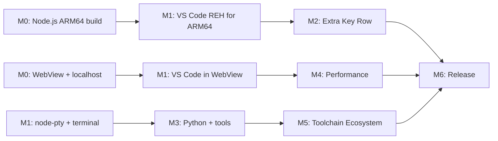

# VSCodroid — Development Milestones

## Overview

```
M0 (POC)       → Proof of Concept: WebView + Node.js on Android
M1 (Core)      → VS Code running in WebView with extension support
M2 (Mobile)    → Mobile UX: keyboard, touch, Android integration
M3 (DevEnv)    → All-in-One: Python, npm, bundled tools & extensions
M4 (Polish)    → Performance, SAF, GitHub OAuth, storage management
M5 (Toolchain) → On-demand languages, Language Picker, Play Asset Delivery
M6 (Release)   → Play Store release
```

---

## M0 — Proof of Concept

**Goal**: Validate the core architecture — can we run a Node.js process on Android and load VS Code Server in a WebView that connects to it via localhost?

**Deliverable**: Android app that launches VS Code REH (Remote Extension Host) server via bundled Node.js and renders the VS Code Workbench in a WebView.

### Entry Criteria:

- [x] PRD, SRS, Architecture, and Technical Spec approved as M0 baseline
- [x] ARM64 physical Android device (API 33+) available for testing
- [x] Android SDK/NDK toolchain installed on development machine

### Tasks:

1. **Setup Android project**
   - New Kotlin Android project (Gradle, minSdk 33, targetSdk 36)
   - MainActivity with WebView (`VSCodroidWebView` configuration)
   - SplashActivity for first-run extraction

2. **Cross-compile Node.js for ARM64 Android**
   - Setup NDK r27 toolchain
   - Apply Termux patches to Node.js source
   - Build with: --dest-cpu=arm64 --dest-os=android --partly-static --with-intl=small-icu
   - Strip binary, verify size
   - Bundle as libnode.so in jniLibs/arm64-v8a/

3. **Launch Node.js from Kotlin**
   - Find binary path via `applicationInfo.nativeLibraryDir` (`Environment.getNodePath`)
   - `ProcessBuilder` to launch Node.js with VS Code REH server script (`server/server.js`)
   - Set environment variables (HOME, PATH, LD_LIBRARY_PATH, NODE_PATH, etc.)
   - Poll localhost:PORT via HTTP health check until server responds (`ProcessManager.waitForReady`)

4. **Load WebView pointing to localhost**
   - Configure WebView settings (JS enabled, DOM storage, zoom disabled, etc.)
   - Load `http://localhost:PORT/` with VS Code Workbench UI
   - VS Code's internal WebSocket IPC handles bidirectional communication

5. **Foreground Service**
   - Foreground Service with `specialUse` type to keep Node.js alive (`NodeService`)
   - Process death detection via watchdog thread + exponential backoff auto-restart (up to 5 attempts)

### Success Criteria:

- [x] Node.js ARM64 binary runs on physical ARM64 Android device
- [x] VS Code REH server responds on localhost (health check via HTTP GET)
- [x] WebView renders VS Code Workbench from localhost
- [x] VS Code internal WebSocket IPC functions correctly (editor ↔ server)
- [x] Process survives app backgrounding (via Foreground Service with START_STICKY)

### Estimated Effort: 1-2 weeks

---

## M1 — VS Code Core

**Goal**: VS Code Workbench running in WebView with extension support via Open VSX.

**Deliverable**: Full VS Code UI with working editor, file explorer, extensions, and terminal.

### Entry Criteria:

- [x] All M0 success criteria passed
- [x] Node.js startup + localhost health check stable for 30 minutes on reference device
- [x] Cross-compilation environment validated (Node.js + native module toolchain)

### Tasks:

1. **Build VS Code REH server for ARM64**
   - Download pre-built VS Code Server (vscode-reh) for Linux ARM64
   - Apply VSCodroid branding patch (`patches/code-server/product.diff`)
   - Branding covers: nameShort, nameLong, applicationName, dataFolderName, Open VSX gallery, telemetry off

2. **Bundle VS Code server in APK**
   - Package `vscode-reh/` output into app assets directory
   - Extract to app-private storage on first run (`FirstRunSetup.extractAssetDir`)
   - Launch via bundled Node.js binary (`ProcessManager.startServer`)
   - Web client served by VS Code REH server (bundled in same assets)

3. **File system**
   - App-external workspace directory (`/storage/emulated/0/Android/data/<pkg>/files/projects`)
   - Welcome project created on first run (`FirstRunSetup.createWelcomeProject`)
   - File explorer works via VS Code

4. **Cross-compile node-pty for ARM64 Android**
   - Setup node-gyp cross-compilation with NDK (`scripts/build-node-pty.sh`)
   - Build `pty.node` for arm64 Android (ELF 64-bit LSB shared object, ARM aarch64)
   - Bundled inside `vscode-reh/node_modules/node-pty/build/Release/pty.node`
   - Verify PTY creation works on Android

5. **Terminal integration**
   - Bundle bash shell as `libbash.so` in `jniLibs/arm64-v8a/`
   - Configure terminal profile in VS Code settings (`terminal.integrated.profiles.linux`)
   - TERMINFO configured via environment variables
   - Symlinks created in `usr/bin/` via `FirstRunSetup.setupToolSymlinks`

6. **tmux bundling**
   - Cross-compile tmux from Termux packages
   - Bundle as `libtmux.so` in `jniLibs/arm64-v8a/`
   - Configure `.tmux.conf` (mouse on, xterm-256color, status off)
   - Available as standalone terminal multiplexer (manual usage)

7. **Git integration**
   - Bundle Git as `libgit.so` in `jniLibs/arm64-v8a/`
   - Configure `GIT_EXEC_PATH`, `GIT_TEMPLATE_DIR`, `GIT_SSL_CAPATH` environment variables
   - Setup git-core symlinks and exec path (`FirstRunSetup.setupGitCore`)
   - Configure `git.path` in VS Code settings for SCM panel integration

8. **Extension marketplace**
   - Open VSX gallery configured in `product.json` (`extensionsGallery.serviceUrl`)
   - Verify search/browse/install works
   - ripgrep bundled as `libripgrep.so` for VS Code's search functionality (`FirstRunSetup.setupRipgrepVscodeSymlink`)

### Success Criteria:

- [x] VS Code Workbench UI renders correctly in WebView
- [x] Monaco Editor works (typing, syntax highlighting, multi-cursor)
- [x] File explorer shows files, can create/edit/save
- [x] Terminal opens with working bash shell
- [x] tmux available as standalone terminal multiplexer
- [x] Git works in terminal (`git --version`, `git init`, `git commit`)
- [x] Git status works in VS Code SCM panel (`git.path` configured)
- [x] Can install extensions from Open VSX
- [x] Extensions activate and function (bundled: Material Icon Theme, ESLint, Prettier, Python, GitLens, Tailwind CSS)

### Estimated Effort: 3-4 weeks

---

## M2 — Mobile UX

**Goal**: Make VS Code actually usable on a touchscreen device.

**Deliverable**: Comfortable coding experience on phone/tablet.

### Entry Criteria:

- [x] All M1 success criteria passed
- [x] No open P0 defects in M1 scope
- [x] VS Code core session remains stable for 30 minutes (editing + terminal + extension)

### Tasks:

1. **Extra Key Row** (`ExtraKeyRow.kt`, `KeyPageConfig.kt`, `KeyPageAdapter.kt`)
   - Multi-page native Android view using `ViewPager2` with dot indicators
   - Page 1: Tab, Esc, Ctrl (toggle), Alt (toggle), Shift (toggle), `GestureTrackpad`, {}, (), ;, :, ", /
   - Page 2: additional symbols (|, `, &, \_, [], <>, =, !, #, @)
   - `GestureTrackpad`: 3-speed drag-to-navigate (Precise/Moderate/Fast gear based on cumulative distance)
   - Long-press popup for alternate keys (`showLongPressPopup`)
   - Key injection via `KeyInjector.injectKey()` dispatching JS `KeyboardEvent` to WebView
   - Modifier interceptor (`setupModifierInterceptor`) intercepts soft keyboard input when Ctrl/Alt active
   - Show/hide based on keyboard visibility (`WindowInsetsCompat`)

2. **Keyboard handling**
   - `windowSoftInputMode = adjustResize` (in `AndroidManifest.xml`)
   - WebView viewport resizes when keyboard appears
   - Cursor scrolls into view via VS Code's built-in behavior

3. **Touch optimization** (`VSCodroidWebView.kt`)
   - Disable WebView zoom (`setSupportZoom(false)`, `textZoom = 100`)
   - Long-press handled via WebView settings (`isLongClickable = false`)
   - Touch scroll behavior via WebView defaults

4. **Clipboard bridge** (`ClipboardBridge.kt`)
   - `ClipboardBridge` class wrapping Android `ClipboardManager`
   - Methods: `copyToClipboard()`, `readFromClipboard()`, `hasClipboardText()`
   - Registered via `addJavascriptInterface` in `MainActivity.initBridge()`

5. **Android back button** (`MainActivity.setupBackNavigation`)
   - `onBackPressedDispatcher` callback
   - Calls `window.AndroidBridge?.onBackPressed?.()` in WebView first
   - Falls back to `moveTaskToBack(true)` if JS doesn't handle it

6. **Screen orientation & split-screen**
   - Supports portrait, landscape, and split-screen (`configChanges` in manifest)
   - Configuration changes handled without recreating activity

7. **Accessibility baseline**
   - `contentDescription` set on every `ExtraKeyButton` with descriptive labels (e.g., "Control modifier", "Escape key")
   - `GestureTrackpad` has `contentDescription = "Arrow key trackpad. Drag to move cursor."`
   - Button min height enforced by ExtraKeyRow layout

8. **Android Intent: "Open with VSCodroid"** (`AndroidManifest.xml`)
   - Intent filter registered for broad code file types (text/\*, application/json, etc.)
   - File reception handled in `MainActivity.handleOpenFileIntent()`

9. **Crash recovery** (`VSCodroidWebViewClient.kt`, `MainActivity.kt`)
   - `onRenderProcessGone`: calls `recreateWebView()` — removes crashed WebView, creates new, re-setups, reloads VS Code
   - Node.js death: auto-restart via `NodeService` + foreground service (`ProcessManager`)
   - `onTrimMemory`: writes memory pressure file + notifies JS via `window.__vscodroid?.onLowMemory?.(level)`

### Success Criteria:

- [x] Can comfortably type code using soft keyboard + Extra Key Row (multi-page with GestureTrackpad)
- [x] Ctrl+S, Ctrl+P, Ctrl+Shift+P work via Extra Key Row modifier interceptor
- [x] Copy/paste works between VSCodroid and other apps (`ClipboardBridge`)
- [x] App works in portrait, landscape, split-screen
- [x] Accessibility: contentDescription on all Extra Key Row controls + GestureTrackpad
- [x] "Open with VSCodroid" works from file manager (intent filter registered)
- [x] App recovers from WebView crash (`recreateWebView`) and Node.js death (auto-restart)

### Estimated Effort: 2-3 weeks

---

## M3 — All-in-One Dev Environment

**Goal**: Bundle Python, npm, and essential tools for out-of-the-box development.

**Deliverable**: User can write and run Python/JS code out of the box with pre-bundled extensions.

### Entry Criteria:

- [x] All M2 success criteria passed
- [x] M2 features validated on at least 2 physical device models
- [x] No open P0/P1 regressions in keyboard, clipboard, and crash recovery flows

### Tasks:

1. **Bundle Python 3 for ARM64 Android** (`scripts/download-python.sh`)
   - Pre-compiled Python 3.12 from Termux APT repo
   - `libpython.so` in `jniLibs/arm64-v8a/` + stdlib in `assets/usr/lib/python3.12/`
   - pip included via `python-pip` Termux package (site-packages)
   - Symlinks: `python3` and `python` → `libpython.so` via `setupToolSymlinks()`

2. **Bundle make** (`scripts/download-termux-tools.sh`)
   - `libmake.so` in `jniLibs/arm64-v8a/`
   - Symlink: `make` → `libmake.so` via `setupToolSymlinks()`

3. **npm integration** (`FirstRunSetup.createNpmWrappers`)
   - npm/npx defined as bash functions in `.bashrc` (not script wrappers — Android noexec restriction)
   - Functions invoke Node.js with `npm-cli.js` entry point from `usr/lib/node_modules/npm/`
   - `.npmrc` created with `script-shell` pointing to `libbash.so`

4. **Pre-bundled extensions** (`FirstRunSetup.extractBundledExtensions`)
   - 6 marketplace extensions bundled offline in `assets/extensions/`:
     - Material Icon Theme, ESLint, Prettier, Python, GitLens, Tailwind CSS
   - 3 custom VSCodroid extensions:
     - `vscodroid.vscodroid-welcome-1.0.0` — welcome tab with quick actions
     - `vscodroid.vscodroid-saf-bridge-1.0.0` — SAF storage integration
     - `vscodroid.vscodroid-process-monitor-1.0.0` — phantom process monitoring
   - `extensions.json` manifest auto-generated on first run

5. **First-run experience** (`SplashActivity.kt`, `FirstRunSetup.kt`)
   - `SplashActivity` shows progress during first-run extraction
   - `FirstRunSetup.runSetup()` with percentage-based progress reporting
   - Steps: create dirs → extract vscode-reh → extract vscode-web → extract tools →
     setup git → setup symlinks → extract extensions → configure settings
   - Welcome project created (`createWelcomeProject`)
   - Welcome extension provides quick-start tab

### Success Criteria:

- [x] `python3` and `pip` work out of the box in terminal
- [x] `node` and `npm` work out of the box in terminal (npm via bash functions)
- [x] `git` works out of the box in terminal
- [x] `make` works out of the box in terminal
- [x] Pre-bundled extensions load without internet (9 extensions)
- [x] First-run extraction completes with progress UI (`SplashActivity`)
- [x] Welcome project and welcome extension provide onboarding experience

### Estimated Effort: 3-4 weeks

---

## M4 — Polish & Performance

**Goal**: Production-quality stability and performance.

**Deliverable**: App that doesn't crash, performs well, handles edge cases.

### Entry Criteria:

- [x] All M3 success criteria passed
- [x] No open P0 defects in M0-M3 scope

### Tasks:

1. **Error handling & logging** (`Logger.kt`, `CrashReporter.kt`)
   - `Logger` — structured logging with tag-based filtering
   - `CrashReporter` — crash reporting initialized in `Application.onCreate`
   - Low-storage Toast warnings in `MainActivity`
   - Process crash exit code diagnostics in `ProcessManager`

2. **Memory optimization** (`ProcessManager.kt`, `MainActivity.kt`)
   - V8 `--max-old-space-size=512` set in Node.js launch args
   - `onTrimMemory` handler: writes memory pressure file + notifies VS Code JS layer
   - WebView data directory isolated via `WebView.setDataDirectorySuffix("vscodroid")`

3. **Startup time optimization** (`VSCodroidApp.kt`, `SplashActivity.kt`)
   - WebView pre-warm in `Application.onCreate` — creates and destroys throwaway WebView to trigger Chromium library preload (~200-400ms savings)
   - `CrashReporter.init(this)` initialized in Application
   - Node.js server starts during `SplashActivity` extraction
   - Notification channel created early in Application

4. **Phantom process monitoring** (`process-monitor.js`, `vscodroid-process-monitor` extension)
   - `process-monitor.js` extracted to `server/` on first run — monitors child process count
   - `vscodroid.vscodroid-process-monitor` extension bundled — provides in-VS Code UI
   - Exit code 137 (SIGKILL) handling in `ProcessManager` — detects OOM/phantom kill
   - Extension Host and ptyHost run as `worker_threads.Worker()` (saves 2 phantom process slots)

5. **Storage management** (`StorageManager.kt`, `AndroidBridge.kt`)
   - `StorageManager.getStorageBreakdown()` — per-component usage tracking
   - `StorageManager.clearCaches()` — clear temporary files
   - `StorageManager.getAvailableStorage()` — check available space
   - `StorageManager.isStorageLow()` — low storage warning with Toast
   - Exposed to JS via `AndroidBridge` (`getStorageInfo`, `clearCaches`, `getAvailableStorage`)

6. **GitHub OAuth integration** (`AndroidBridge.kt`, `MainActivity.kt`)
   - `startGitHubAuth()` opens OAuth URL via Chrome Custom Tabs
   - Deep link callback: `vscodroid://oauth/github?code=XXX&state=YYY`
   - `handleOAuthCallback()` in `MainActivity` forwards to VS Code auth handler via JS
   - Push/pull to GitHub works from VS Code SCM panel after auth

7. **External storage access (SAF)** (`SafStorageManager.kt`, `SafSyncEngine.kt`, `vscodroid-saf-bridge` extension)
   - Full Storage Access Framework implementation
   - `SafStorageManager`: folder picker, persisted permissions, mirror directory management
   - `SafSyncEngine`: initial sync + ongoing `FileObserver` for bidirectional sync
   - `vscodroid.vscodroid-saf-bridge` extension: VS Code UI for SAF folder management
   - `AndroidBridge`: JS bridge methods (`openSafFolder`, `getRecentFolders`, `openRecentFolder`)

### Success Criteria:

- [x] CrashReporter and Logger initialized
- [x] V8 memory limited to 512MB via `--max-old-space-size`
- [x] WebView pre-warmed in Application.onCreate
- [x] Phantom process monitoring active (extension + process-monitor.js)
- [x] Storage breakdown, cache clearing, and low-storage warnings work
- [x] GitHub OAuth push/pull works via Chrome Custom Tabs
- [x] SAF: can open projects from external storage (folder picker + bidirectional sync)

### Estimated Effort: 3-4 weeks

---

## M5 — Toolchain Ecosystem

**Goal**: On-demand toolchain delivery so users can install additional languages beyond the bundled core.

**Deliverable**: Play Asset Delivery integration with Go, Ruby, and Java toolchains, plus a Language Picker UI.

### Entry Criteria:

- [x] All M4 success criteria passed

### Tasks:

1. **~~worker_thread Extension Host & ptyHost migration~~** _(completed during M4)_
   - [x] Extension Host patched to run as `worker_threads.Worker()` instead of `child_process.fork()`
   - [x] ptyHost patched to run as `worker_threads.Worker()` with graceful disconnect
   - [x] Extensions load correctly under worker_thread mode
   - [x] Reduces phantom process count by 2 (ExtHost + ptyHost invisible in `/proc`)

2. **~~On-demand toolchain download scripts~~** (`scripts/download-go.sh`, `download-ruby.sh`, `download-java.sh`)
   - [x] Go from Termux `golang` package (179 MB asset pack, CGO_ENABLED=0)
   - [x] Ruby from Termux `ruby` + libgmp + libyaml (34 MB asset pack)
   - [x] Java from Termux `openjdk-17` + libandroid-shmem + libandroid-spawn (146 MB asset pack)
   - [x] Each script: download .deb → extract → place in asset pack module → strip → write manifest

3. **~~Play Asset Delivery integration~~** (`ToolchainManager.kt`, `ToolchainRegistry.kt`)
   - [x] Gradle asset pack modules (`toolchain_go/`, `toolchain_ruby/`, `toolchain_java/`)
   - [x] `ToolchainManager`: fetch, progress tracking, copy to filesDir, chmod +x, symlinks, uninstall
   - [x] `ToolchainRegistry`: catalog of available toolchains with sizes
   - [x] `Environment.kt`: dynamic toolchain env vars merged into server process
   - [x] `AndroidBridge.kt`: JS bridge for install/uninstall/query from extensions
   - [x] `.bashrc` sources `toolchain-env.sh` for terminal PATH/env updates

4. **Language Picker UI** (`SplashActivity.kt`, `ToolchainActivity.kt`, `ToolchainPickerAdapter.kt`)
   - [x] First-run UI: "What do you code in?" with language checkboxes (`SplashActivity.showToolchainPicker()`, `layout_toolchain_picker.xml`)
   - [x] Settings > Toolchains page for adding/removing languages post-install (`ToolchainActivity` with MANAGER mode, `activity_toolchain.xml`)
   - [x] Download progress UI, error handling, retry (`SplashActivity.startDownloads()`, `layout_toolchain_progress.xml`, `Action.RETRY/CANCEL`)
   - [x] Size display per toolchain before download (`ToolchainPickerAdapter` shows `~${formatSize(info.estimatedSize)}`)

### Success Criteria:

- [x] Extension Host runs as worker_thread (phantom process count reduced)
- [x] ptyHost runs as worker_thread (additional phantom process saved)
- [x] On-demand toolchains delivered via Play Asset Delivery (Go, Ruby, Java)
- [x] ToolchainManager handles full lifecycle (install, uninstall, env vars, symlinks)
- [x] Language Picker UI works during first-run and from Settings (`SplashActivity` + `ToolchainActivity`)

### Estimated Effort: 3-4 weeks

---

## M6 — Release

**Goal**: Launch on Google Play Store.

**Deliverable**: Published app with proper branding, legal compliance, and documentation.

### Entry Criteria:

- [ ] All M5 success criteria passed
- [ ] Release candidate build completed with signed AAB
- [ ] Store listing, privacy policy, and compliance artifacts ready

### Tasks:

_Ordered by dependency: fix bugs → verify features → harden → brand → ship._

#### Phase 1 — Bug Fixes & Feature Completion

1. **Stability & auth fixes** _(discovered during device testing)_
   - [x] Extension OAuth callback relay: Chrome Custom Tabs → Android Intent → WebView (`vscodroid://callback`)
   - [x] Persist extension secrets across app restarts: patch `isEncryptionAvailable()` → `true` in workbench.js so `SecretStorageService` uses IndexedDB instead of in-memory Map
   - [x] White screen on app reopen: `isServerHealthy()` (synchronous HTTP) threw `NetworkOnMainThreadException` on main thread when reconnecting to already-running server; replaced with `isServerRunning()` (process liveness check, no I/O)

2. **SSH key management**
   - [x] Bundle OpenSSH client (`libssh.so`, `libssh-keygen.so`) with all deps (ldns, krb5, libdb, libresolv-wrapper)
   - [x] SSH config with absolute paths (Termux openssh resolves `~` to compiled-in prefix, not `$HOME`)
   - [x] `GIT_SSH_COMMAND` env var configured in `Environment.kt`
   - [x] Generate SSH key pair from within app (command palette + AndroidBridge)
   - [x] UI to copy public key (command palette → clipboard)
   - [x] SSH connectivity to GitHub verified (key auth handshake works; `Permission denied` = key not on account, expected)

3. **App upgrade handling**
   - [x] Detect app version change on launch (compare stored version vs current)
   - [x] Re-extract updated assets on upgrade (vscode-reh, usr/lib, extensions) without losing user data
   - [x] Migrate SSH config, .bashrc additions, settings.json across upgrades
   - [x] Handle stale symlinks after APK reinstall (nativeLibraryDir path changes)

#### Phase 2 — Hardening & Release Build

_Order: audit code → configure release build → test on devices → validate bundle size._

4. **Security review**
   - [x] Audit WebView security: CSP headers, JS bridge exposure, localhost-only binding
   - [x] Verify no secrets in APK (no API keys, tokens, or private keys bundled)
   - [x] Review all workbench.js patches for unintended side effects
   - [x] Confirm Android app sandbox isolation (no world-readable files)
   - [x] Validate `SecurityManager` URL allowlist (only localhost + known CDN patterns)
   - [x] Fix: restrict cleartext HTTP to localhost only (network_security_config.xml)
   - [x] Fix: use Uri.parse() for exact localhost host matching (prevents domain spoofing)
   - [x] Fix: owner-only execute permissions on extracted binaries

5. **Release build & signing**
   - [ ] Generate release signing keystore (store securely, NOT in repo)
   - [ ] Configure `signingConfigs.release` in build.gradle.kts
   - [ ] Enable R8/ProGuard minification for Kotlin code
   - [ ] Test release build on device (ProGuard can break reflection-based code)
   - [ ] Verify `useLegacyPackaging = true` preserved in release build

6. **Device testing** _(on release build)_
   - [ ] Device matrix: Pixel 7/8, Samsung S23/S24, budget phone (4GB RAM)
   - [ ] Android version matrix: 13, 14, 15, 16
   - [ ] Stress tests: large files (10k+ lines), large projects (1000+ files)
   - [ ] Extension tests: Python LSP, ESLint, GitLens, themes, icon packs
   - [ ] Lifecycle tests: background/foreground, split-screen, rotation, low memory
   - **worker_thread verification** _(validates M5 task 1)_:
     - [ ] Extension Host runs as worker_thread (`adb shell ps` shows no separate ExtHost process)
     - [ ] ptyHost runs as worker_thread (verify via process count)
     - [ ] Extensions activate correctly under worker_thread mode
   - **Toolchain compatibility verification** _(requires physical device)_:
     - [ ] `go version` → works after asset pack install
     - [ ] `ruby --version`, `irb`, `gem` → works after install
     - [ ] `java -version`, `javac -version` → works after install
     - [ ] Verify toolchains persist across app restarts
     - [ ] Verify uninstall cleans up correctly

7. **Android App Bundle & size audit**
   - [ ] Build release AAB (signed)
   - [ ] Measure base APK size (without toolchains) — target < 150 MB
   - [ ] Verify per-device delivery sizes via bundletool
   - [ ] Document per-toolchain on-demand sizes
   - [ ] Test asset pack download flow end-to-end on internal track

#### Phase 3 — Branding & Store Presence

8. **Branding**
   - [ ] Design VSCodroid icon/logo (original, not VS Code's)
   - [ ] Adaptive icon for Android 13+ (foreground + background layers)
   - [ ] App screenshots for Play Store (phone + tablet)
   - [ ] Feature graphic (1024x500)

9. **Legal compliance**
   - Disclaimer in app About screen
   - Privacy policy (required for Play Store)
   - MIT license notice for VS Code source
   - Trademark disclaimers

10. **Documentation**
    - README.md with project overview
    - CONTRIBUTING.md for contributors
    - User guide: first-run, keyboard shortcuts, extensions
    - Known limitations and FAQ

11. **CI/CD pipeline**
    - GitHub Actions: build debug APK on PR, release AAB on tag
    - Automated testing on Firebase Test Lab (physical ARM64 devices)
    - Release workflow: tag → build → sign → upload to Play Store
    - Build toolchain zips and upload as GitHub Release assets (sideload fallback)
    - Fallback download URL served from GitHub Releases for non-Play-Store installs

#### Phase 4 — Ship

12. **Play Store listing** _(requires Google Play Developer account)_
    - Title: "VSCodroid"
    - Short description + full description with feature list
    - Screenshots: phone + tablet (from task 8)
    - Category: Developer Tools
    - Content rating questionnaire
    - Prepare for binary execution policy review (explain .so trick, local-only execution)

13. **Launch**
    - Internal testing track → closed beta → open beta → production
    - Monitor crash reports (CrashReporter) and user feedback
    - Hotfix pipeline for critical bugs
    - Post-launch: respond to Play Store reviews

### Success Criteria:

- [x] Extension secrets persist across app restarts (OAuth tokens, API keys)
- [x] App recovers cleanly from close/reopen (no white screen)
- [x] SSH push/pull to GitHub works end-to-end (SSH stack verified, git uses bundled ssh via `GIT_SSH_COMMAND`)
- [ ] App upgrade preserves user data (settings, extensions, SSH keys, projects)
- [ ] Security review completed (no exposed secrets, sandbox intact)
- [ ] Tested on 4+ device models across Android 13-16
- [ ] Go/Ruby/Java verified working on physical device after asset pack install
- [ ] Release AAB signed and < 150 MB (base, without toolchains)
- [ ] App published on Play Store
- [ ] Passes Play Store review (no policy violations)
- [ ] No critical bugs in first 48 hours
- [ ] At least 500 beta testers before production launch (see Release Plan §1.2)

### Estimated Effort: 6-8 weeks

---

## Timeline Summary

| Milestone                       | Duration  | Cumulative  |
| ------------------------------- | --------- | ----------- |
| M0 — Proof of Concept           | 1-2 weeks | 1-2 weeks   |
| M1 — VS Code Core               | 3-4 weeks | 5-6 weeks   |
| M2 — Mobile UX                  | 2-3 weeks | 7-9 weeks   |
| M3 — All-in-One Dev Environment | 3-4 weeks | 10-13 weeks |
| M4 — Polish & Performance       | 3-4 weeks | 13-17 weeks |
| M5 — Toolchain Ecosystem        | 3-4 weeks | 16-21 weeks |
| M6 — Release                    | 6-8 weeks | 22-29 weeks |

**Total: ~5-7 months from start to Play Store release.**

## Critical Path



The hardest part is **M0 + M1** — getting Node.js and VS Code actually running on Android. Once that works, everything else is incremental.

---

## Post-Release Roadmap

Features planned for after Play Store launch, prioritized by user demand.

### Package Manager (`vscodroid pkg`)

- Lightweight CLI for installing additional tools from Termux repository (2000+ packages)
- `vscodroid pkg install <package>` — download, extract, configure PATH
- `vscodroid pkg list` / `vscodroid pkg remove <package>` / `vscodroid pkg search <query>`
- Curated installer UI inside VSCodroid (not just terminal-based)
- Targets: PHP, Perl, Lua, and other tools beyond bundled/on-demand toolchains

### Additional On-demand Toolchains

- **Rust** (rustc + cargo, ~100 MB) — high demand, self-contained
- **C/C++** (clang/LLVM from Termux, ~84 MB) — large, needs careful stripping
- Delivered via same Play Asset Delivery pipeline as Go/Ruby/Java

### Future Enhancements

- Toolchain version management (multiple Go/Ruby/Java versions)
- Automatic toolchain updates via Play Store asset pack updates
- Community-contributed toolchain recipes
