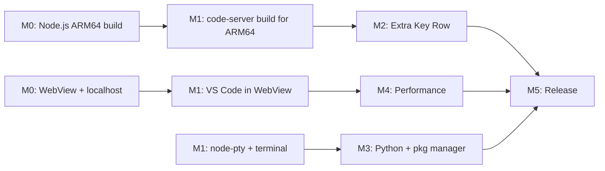

# VSCodroid — Development Milestones

## Overview

```
M0 (POC)     → Proof of Concept: WebView + Node.js on Android
M1 (Core)    → VS Code running in WebView with extension support
M2 (Mobile)  → Mobile UX: keyboard, touch, Android integration
M3 (DevEnv)  → All-in-One: Python, package manager, toolchains
M4 (Polish)  → Performance, stability, edge cases
M5 (Release) → Play Store release
```

---

## M0 — Proof of Concept

**Goal**: Validate the core architecture — can we run a Node.js process on Android and load a web app in WebView that connects to it?

**Deliverable**: Android app that shows "Hello from Node.js" in a WebView via localhost.

### Entry Criteria:
- [ ] PRD, SRS, Architecture, and Technical Spec approved as M0 baseline
- [ ] ARM64 physical Android device (API 33+) available for testing
- [ ] Android SDK/NDK toolchain installed on development machine

### Tasks:

1. **Setup Android project**
   - New Kotlin Android project (Gradle, minSdk 33, targetSdk 36)
   - Basic MainActivity with WebView

2. **Cross-compile Node.js for ARM64 Android**
   - Setup NDK r27 toolchain
   - Apply Termux patches to Node.js source
   - Build with: --dest-cpu=arm64 --dest-os=android --partly-static --with-intl=small-icu
   - Strip binary, verify size
   - Bundle as libnode.so in jniLibs/arm64-v8a/

3. **Launch Node.js from Kotlin**
   - Find binary path via applicationInfo.nativeLibraryDir
   - ProcessBuilder to launch Node.js with a simple HTTP server script
   - Set environment variables (HOME, PATH, LD_LIBRARY_PATH, etc.)
   - Poll localhost:PORT until server responds

4. **Load WebView pointing to localhost**
   - Configure WebView settings (JS enabled, DOM storage, etc.)
   - Load http://localhost:PORT/
   - Verify bidirectional communication (WebSocket)

5. **Foreground Service**
   - Basic Foreground Service (specialUse) to keep Node.js alive
   - Process death detection + auto-restart

### Success Criteria:
- [ ] Node.js ARM64 binary runs on physical ARM64 Android device
- [ ] Simple Express server responds on localhost
- [ ] WebView renders content from localhost
- [ ] WebSocket communication works
- [ ] Process survives app backgrounding (via Foreground Service)

### Estimated Effort: 1-2 weeks

---

## M1 — VS Code Core

**Goal**: VS Code Workbench running in WebView with extension support via Open VSX.

**Deliverable**: Full VS Code UI with working editor, file explorer, extensions, and terminal.

### Entry Criteria:
- [ ] All M0 success criteria passed
- [ ] Node.js startup + localhost health check stable for 30 minutes on reference device
- [ ] Cross-compilation environment validated (Node.js + native module toolchain)

### Tasks:

1. **Fork and build code-server**
   - Clone code-server repo
   - Understand patch system and build flow
   - Build vscode-web (web client) + vscode-reh (server) for Linux ARM64
   - Apply code-server patches: product, telemetry, update, marketplace, serve-web, webview

2. **Apply VSCodroid branding patches**
   - product.json: nameShort, nameLong, applicationName, dataFolderName
   - extensionsGallery: point to Open VSX
   - Disable Microsoft telemetry
   - Disable update checker

3. **Bundle VS Code server in APK**
   - Package vscode-reh output into app assets
   - Extract to app-private storage on first run
   - Launch via bundled Node.js binary

4. **Bundle VS Code web client**
   - Package vscode-web output into app assets
   - Serve via the VS Code server (localhost)

5. **Cross-compile node-pty for ARM64 Android**
   - Setup node-gyp cross-compilation with NDK
   - Build pty.node for arm64 Android
   - Bundle as libnode_pty.so
   - Verify PTY creation works on Android

6. **Terminal integration**
   - Bundle bash (or dash) shell
   - Verify terminal works in VS Code UI
   - Test: can run node, basic shell commands

7. **tmux bundling and terminal multiplexing**
   - Cross-compile tmux from Termux packages
   - Bundle as libtmux.so in jniLibs/arm64-v8a/
   - Configure TERMINFO, etc.
   - tmux integration: single process, multiple sessions
   - VS Code terminal tabs map to tmux sessions
   - Verify phantom process count stays low (critical for T01 risk mitigation)

8. **Git integration**
   - Cross-compile Git for ARM64 Android (from Termux recipes)
   - Bundle as libgit.so in jniLibs/arm64-v8a/
   - Configure GIT_EXEC_PATH environment variable
   - Verify: `git --version`, `git init`, `git status` in terminal

9. **Extension marketplace**
   - Verify Open VSX search/browse works
   - Install an extension (e.g., Material Icon Theme)
   - Verify extension activates and functions

10. **File system**
   - App-private workspace directory
   - Create/edit/save files via VS Code UI
   - File explorer works

### Success Criteria:
- [ ] VS Code Workbench UI renders correctly in WebView
- [ ] Monaco Editor works (typing, syntax highlighting, multi-cursor)
- [ ] Terminal opens with working bash shell
- [ ] tmux terminal multiplexing works (multiple terminal sessions via single process)
- [ ] Can install extensions from Open VSX
- [ ] Extensions activate and function (test: theme, icon pack, ESLint)
- [ ] File explorer shows files, can create/edit/save
- [ ] Git works in terminal (`git --version`, `git init`, `git commit`)
- [ ] Git status works in VS Code SCM panel

### Estimated Effort: 3-4 weeks

---

## M2 — Mobile UX

**Goal**: Make VS Code actually usable on a touchscreen device.

**Deliverable**: Comfortable coding experience on phone/tablet.

### Entry Criteria:
- [ ] All M1 success criteria passed
- [ ] No open P0 defects in M1 scope
- [ ] VS Code core session remains stable for 30 minutes (editing + terminal + extension)

### Tasks:

1. **Extra Key Row**
   - Native Android View positioned above soft keyboard
   - Keys: Tab, Esc, Ctrl (toggle), Alt (toggle), arrows (4), {}, (), ;, :, ", /
   - Inject key events into WebView via evaluateJavascript
   - Show/hide based on keyboard visibility (WindowInsetsCompat)

2. **Keyboard handling**
   - windowSoftInputMode = adjustResize
   - Handle viewport resize when keyboard appears
   - Ensure cursor scrolls into view
   - Fix position:fixed elements (command palette, suggest widget)

3. **Touch optimization**
   - Disable WebView zoom (setSupportZoom=false, textZoom=100)
   - Handle long-press conflicts (WebView selection vs Monaco selection)
   - Context menu: prefer Monaco's over WebView's default
   - Scroll behavior: tune for touch

4. **Clipboard bridge**
   - addJavascriptInterface bridge to Android ClipboardManager
   - Inject into VS Code's clipboard service
   - Test: copy/paste between VSCodroid and other apps

5. **Android back button**
   - Handle back button: close panels/dialogs first, then minimize app
   - Bridge via addJavascriptInterface or onBackPressedDispatcher

6. **Screen orientation & split-screen**
   - Support portrait and landscape
   - Handle configuration changes without losing state
   - Split-screen / foldable support

7. **Accessibility baseline (NFR-A11Y)**
   - Add TalkBack content descriptions for native controls (Extra Key Row, dialogs, first-run UI)
   - Ensure native touch targets meet 48dp × 48dp minimum
   - Verify native UI respects system font scaling

8. **Android Intent: "Open with VSCodroid"**
   - Register intent filter for common code file types
   - Receive file URI, copy to app-private workspace, open in editor
   - Note: limited to app-internal storage at M2; full external storage via SAF deferred to M4

9. **Crash recovery**
   - onRenderProcessGone: recreate WebView, reload
   - Node.js death: auto-restart, reconnect WebView
   - Low memory: handle onTrimMemory, notify VS Code

### Success Criteria:
- [ ] Can comfortably type code using soft keyboard + Extra Key Row
- [ ] Ctrl+S, Ctrl+P, Ctrl+Shift+P work via Extra Key Row
- [ ] Copy/paste works between VSCodroid and other apps
- [ ] Keystroke latency in editor < 50ms on reference device (NFR-PERF-03)
- [ ] App works in portrait, landscape, split-screen
- [ ] TalkBack works for native controls; touch targets meet 48dp minimum; native font scaling works
- [ ] "Open with VSCodroid" works from file manager
- [ ] App recovers gracefully from WebView crash or Node.js death

### Estimated Effort: 2-3 weeks

---

## M3 — All-in-One Dev Environment

**Goal**: Bundle Python, package manager, and on-demand toolchains.

**Deliverable**: User can write and run Python/JS code out of the box, install other languages in-app.

### Entry Criteria:
- [ ] All M2 success criteria passed
- [ ] M2 features validated on at least 2 physical device models
- [ ] No open P0/P1 regressions in keyboard, clipboard, and crash recovery flows

### Tasks:

1. **Cross-compile Python 3 for ARM64 Android**
   - Use Termux build recipes as base
   - Bundle as libpython.so + Python stdlib
   - Include pip
   - Test: python3 --version, pip install requests

2. **Bundle make**
   - Cross-compile make from Termux packages
   - Bundle as .so file

3. **Package manager (built-in)**
   - Implement lightweight package manager
   - Leverage Termux package repository (or host mirror)
   - Curated in-app UI: "Toolchain Manager"
   - Terminal command: vscodroid pkg install <package>
   - Install to /data/data/com.vscodroid/files/usr/

4. **Language Picker + on-demand asset packs**
   - First-run Language Picker UI: "What do you code in?" with language checkboxes
   - Integrate Play Store AssetPackManager for on-demand toolchain delivery
   - Download progress UI, error handling, retry
   - Auto-configure PATH for each installed toolchain
   - Settings > Toolchains page for adding/removing languages later
   - Verify toolchains work: go version, rustc --version, javac -version, gcc --version, ruby --version

5. **Pre-bundled extensions**
   - Bundle essential extensions in APK (offline-ready):
     - Python extension
     - ESLint
     - Prettier
     - Material Icon Theme
     - One Dark Pro (or similar theme)
     - GitLens (if available on Open VSX)

6. **First-run experience**
   - Extract binaries on first launch (progress screen)
   - Welcome tab with quick actions: "Open Folder", "Clone Repo", "New File"
   - Detect installed tools, show status

### Success Criteria:
- [ ] python3 and pip work out of the box in terminal
- [ ] node and npm work out of the box in terminal
- [ ] git works out of the box in terminal
- [ ] Language Picker UI works during first-run
- [ ] Can install Go/Rust/Java/C++/Ruby via Language Picker (on-demand asset packs)
- [ ] Installed toolchains work immediately after download
- [ ] Package manager (vscodroid pkg) works for other tools
- [ ] Pre-bundled extensions load without internet
- [ ] First-run core extraction completes in < 15 seconds (excludes Language Picker and toolchain downloads)

### Estimated Effort: 3-4 weeks

---

## M4 — Polish & Performance

**Goal**: Production-quality stability and performance.

**Deliverable**: App that doesn't crash, performs well, handles edge cases.

### Entry Criteria:
- [ ] All M3 success criteria passed
- [ ] Toolchain install/remove flow validated end-to-end (at least one language)
- [ ] No open P0 defects in M0-M3 scope

### Tasks:

1. **Phantom process optimization**
   - Implement Extension Host as worker_thread (patch VS Code) — migrating from child_process.fork() used in M1-M3
   - Verify terminal multiplexing with tmux (bundled since M1)
   - Lazy language server start + idle timeout
   - Test: total phantom processes under various scenarios
   - User guidance UI when phantom killing detected
   - Phantom process monitoring and warning UI

2. **Memory optimization**
   - V8 --max-old-space-size tuning
   - Lazy extension loading
   - onTrimMemory handling -> reduce memory pressure
   - Profile WebView heap usage
   - Test on 4GB RAM device

3. **Startup time optimization**
   - Pre-warm WebView in Application.onCreate
   - Start Node.js server early (before Activity visible)
   - HTTP caching for static assets (Cache-Control: immutable)
   - Measure and optimize: target < 5 seconds to editor ready

4. **Storage management**
   - Track storage usage per component
   - Allow user to clear caches, remove toolchains
   - Settings: choose storage location (internal/external)
   - Handle low storage gracefully

5. **GitHub OAuth integration**
   - OAuth flow via Chrome Custom Tabs
   - Push/pull to GitHub from VS Code SCM
   - SSH key management

6. **External storage access**
   - SAF (Storage Access Framework) bridge for files outside app directory
   - Or: MANAGE_EXTERNAL_STORAGE permission with Play Store justification
   - Test: open project from /sdcard/Projects/

7. **Extensive testing**
   - Test on: Pixel 7/8, Samsung S23/S24, budget phone (4GB RAM)
   - Test Android versions: 13, 14, 15, 16
   - Test: large files (10k+ lines), large projects (1000+ files)
   - Test: extensions (Python, ESLint, GitLens, themes, icon packs)
   - Test: background/foreground transitions, split-screen, rotation

8. **Error handling & logging**
   - Crash reporting (in-app, privacy-respecting)
   - User-facing error messages for common issues
   - Debug logging toggle in settings

### Success Criteria:
- [ ] Phantom processes: max 5 in typical use
- [ ] Startup time: < 5 seconds on mid-range device
- [ ] No crash in 2 hours of continuous use
- [ ] Works on 4GB RAM device without OOM
- [ ] GitHub push/pull works
- [ ] Can open projects from external storage
- [ ] Tested on 4 device models (see Testing Strategy §7)

### Estimated Effort: 3-4 weeks

---

## M5 — Release

**Goal**: Launch on Google Play Store.

**Deliverable**: Published app with proper branding, legal compliance, and documentation.

### Entry Criteria:
- [ ] All M4 success criteria passed
- [ ] Release candidate build completed with signed AAB
- [ ] Store listing, privacy policy, and compliance artifacts ready

### Tasks:

1. **Branding**
   - Design VSCodroid icon/logo (original, not VS Code's)
   - App screenshots for Play Store
   - Feature graphic

2. **Legal compliance**
   - Disclaimer in app About screen
   - Privacy policy (required for Play Store)
   - MIT license notice for VS Code source
   - Trademark disclaimers

3. **Play Store listing**
   - Title: "VSCodroid"
   - Description: feature list, compatibility notes
   - Screenshots: phone + tablet
   - Category: Developer Tools
   - Content rating questionnaire
   - Prepare for binary execution policy review

4. **Android App Bundle**
   - Build release AAB (signed)
   - Verify per-device delivery sizes
   - Test on Play Store internal track

5. **CI/CD pipeline**
   - GitHub Actions: build Node.js ARM64, build VS Code, build APK
   - Automated testing on Firebase Test Lab (physical ARM64 devices)
   - Release workflow: tag -> build -> upload to Play Store

6. **Documentation**
   - README.md with project overview
   - CONTRIBUTING.md for contributors
   - User guide: first-run, keyboard shortcuts, package manager
   - Known limitations

7. **Launch**
   - Internal testing track -> closed beta -> open beta -> production
   - Monitor crash reports and user feedback
   - Hotfix pipeline for critical bugs

### Success Criteria:
- [ ] App published on Play Store
- [ ] Passes Play Store review (no policy violations)
- [ ] Base AAB size < 200 MB (toolchains as on-demand asset packs)
- [ ] No critical bugs in first 48 hours
- [ ] At least 500 beta testers before production launch (see Release Plan §1.2)

### Estimated Effort: 6-8 weeks

---

## Timeline Summary

| Milestone | Duration | Cumulative |
|---|---|---|
| M0 — Proof of Concept | 1-2 weeks | 1-2 weeks |
| M1 — VS Code Core | 3-4 weeks | 5-6 weeks |
| M2 — Mobile UX | 2-3 weeks | 7-9 weeks |
| M3 — All-in-One Dev Environment | 3-4 weeks | 10-13 weeks |
| M4 — Polish & Performance | 3-4 weeks | 13-17 weeks |
| M5 — Release | 6-8 weeks | 19-25 weeks |

**Total: ~5-6 months from start to Play Store release.**

## Critical Path



The hardest part is **M0 + M1** — getting Node.js and VS Code actually running on Android. Once that works, everything else is incremental.
