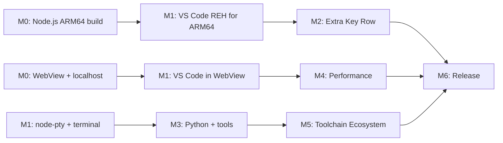

# VSCodroid — Development Milestones

## Overview

```
M0 (POC)       → Proof of Concept: WebView + Node.js on Android
M1 (Core)      → VS Code running in WebView with extension support
M2 (Mobile)    → Mobile UX: keyboard, touch, Android integration
M3 (DevEnv)    → All-in-One: Python, npm, bundled tools & extensions
M4 (Polish)    → Performance, SAF, GitHub OAuth, storage management
M5 (Toolchain) → Package manager, on-demand languages, worker_thread
M6 (Release)   → Play Store release
```

---

## M0 — Proof of Concept

**Goal**: Validate the core architecture — can we run a Node.js process on Android and load VS Code Server in a WebView that connects to it via localhost?

**Deliverable**: Android app that launches VS Code REH (Remote Extension Host) server via bundled Node.js and renders the VS Code Workbench in a WebView.

### Entry Criteria:
- [x] PRD, SRS, Architecture, and Technical Spec approved as M0 baseline
- [x] ARM64 physical Android device (API 33+) available for testing
- [x] Android SDK/NDK toolchain installed on development machine

### Tasks:

1. **Setup Android project**
   - New Kotlin Android project (Gradle, minSdk 33, targetSdk 36)
   - MainActivity with WebView (`VSCodroidWebView` configuration)
   - SplashActivity for first-run extraction

2. **Cross-compile Node.js for ARM64 Android**
   - Setup NDK r27 toolchain
   - Apply Termux patches to Node.js source
   - Build with: --dest-cpu=arm64 --dest-os=android --partly-static --with-intl=small-icu
   - Strip binary, verify size
   - Bundle as libnode.so in jniLibs/arm64-v8a/

3. **Launch Node.js from Kotlin**
   - Find binary path via `applicationInfo.nativeLibraryDir` (`Environment.getNodePath`)
   - `ProcessBuilder` to launch Node.js with VS Code REH server script (`server/server.js`)
   - Set environment variables (HOME, PATH, LD_LIBRARY_PATH, NODE_PATH, etc.)
   - Poll localhost:PORT via HTTP health check until server responds (`ProcessManager.waitForReady`)

4. **Load WebView pointing to localhost**
   - Configure WebView settings (JS enabled, DOM storage, zoom disabled, etc.)
   - Load `http://localhost:PORT/` with VS Code Workbench UI
   - VS Code's internal WebSocket IPC handles bidirectional communication

5. **Foreground Service**
   - Foreground Service with `specialUse` type to keep Node.js alive (`NodeService`)
   - Process death detection via watchdog thread + exponential backoff auto-restart (up to 5 attempts)

### Success Criteria:
- [x] Node.js ARM64 binary runs on physical ARM64 Android device
- [x] VS Code REH server responds on localhost (health check via HTTP GET)
- [x] WebView renders VS Code Workbench from localhost
- [x] VS Code internal WebSocket IPC functions correctly (editor ↔ server)
- [x] Process survives app backgrounding (via Foreground Service with START_STICKY)

### Estimated Effort: 1-2 weeks

---

## M1 — VS Code Core

**Goal**: VS Code Workbench running in WebView with extension support via Open VSX.

**Deliverable**: Full VS Code UI with working editor, file explorer, extensions, and terminal.

### Entry Criteria:
- [x] All M0 success criteria passed
- [x] Node.js startup + localhost health check stable for 30 minutes on reference device
- [x] Cross-compilation environment validated (Node.js + native module toolchain)

### Tasks:

1. **Build VS Code REH server for ARM64**
   - Download pre-built VS Code Server (vscode-reh) for Linux ARM64
   - Apply VSCodroid branding patch (`patches/code-server/product.diff`)
   - Branding covers: nameShort, nameLong, applicationName, dataFolderName, Open VSX gallery, telemetry off

2. **Bundle VS Code server in APK**
   - Package `vscode-reh/` output into app assets directory
   - Extract to app-private storage on first run (`FirstRunSetup.extractAssetDir`)
   - Launch via bundled Node.js binary (`ProcessManager.startServer`)
   - Web client served by VS Code REH server (bundled in same assets)

3. **File system**
   - App-external workspace directory (`/storage/emulated/0/Android/data/<pkg>/files/projects`)
   - Welcome project created on first run (`FirstRunSetup.createWelcomeProject`)
   - File explorer works via VS Code

4. **Cross-compile node-pty for ARM64 Android**
   - Setup node-gyp cross-compilation with NDK (`scripts/build-node-pty.sh`)
   - Build `pty.node` for arm64 Android (ELF 64-bit LSB shared object, ARM aarch64)
   - Bundled inside `vscode-reh/node_modules/node-pty/build/Release/pty.node`
   - Verify PTY creation works on Android

5. **Terminal integration**
   - Bundle bash shell as `libbash.so` in `jniLibs/arm64-v8a/`
   - Configure terminal profile in VS Code settings (`terminal.integrated.profiles.linux`)
   - TERMINFO configured via environment variables
   - Symlinks created in `usr/bin/` via `FirstRunSetup.setupToolSymlinks`

6. **tmux bundling**
   - Cross-compile tmux from Termux packages
   - Bundle as `libtmux.so` in `jniLibs/arm64-v8a/`
   - Configure `.tmux.conf` (mouse on, xterm-256color, status off)
   - Available as standalone terminal multiplexer (manual usage)

7. **Git integration**
   - Bundle Git as `libgit.so` in `jniLibs/arm64-v8a/`
   - Configure `GIT_EXEC_PATH`, `GIT_TEMPLATE_DIR`, `GIT_SSL_CAPATH` environment variables
   - Setup git-core symlinks and exec path (`FirstRunSetup.setupGitCore`)
   - Configure `git.path` in VS Code settings for SCM panel integration

8. **Extension marketplace**
   - Open VSX gallery configured in `product.json` (`extensionsGallery.serviceUrl`)
   - Verify search/browse/install works
   - ripgrep bundled as `libripgrep.so` for VS Code's search functionality (`FirstRunSetup.setupRipgrepVscodeSymlink`)

### Success Criteria:
- [x] VS Code Workbench UI renders correctly in WebView
- [x] Monaco Editor works (typing, syntax highlighting, multi-cursor)
- [x] File explorer shows files, can create/edit/save
- [x] Terminal opens with working bash shell
- [x] tmux available as standalone terminal multiplexer
- [x] Git works in terminal (`git --version`, `git init`, `git commit`)
- [x] Git status works in VS Code SCM panel (`git.path` configured)
- [x] Can install extensions from Open VSX
- [x] Extensions activate and function (bundled: Material Icon Theme, ESLint, Prettier, Python, GitLens, Tailwind CSS)

### Estimated Effort: 3-4 weeks

---

## M2 — Mobile UX

**Goal**: Make VS Code actually usable on a touchscreen device.

**Deliverable**: Comfortable coding experience on phone/tablet.

### Entry Criteria:
- [x] All M1 success criteria passed
- [x] No open P0 defects in M1 scope
- [x] VS Code core session remains stable for 30 minutes (editing + terminal + extension)

### Tasks:

1. **Extra Key Row** (`ExtraKeyRow.kt`, `KeyPageConfig.kt`, `KeyPageAdapter.kt`)
   - Multi-page native Android view using `ViewPager2` with dot indicators
   - Page 1: Tab, Esc, Ctrl (toggle), Alt (toggle), Shift (toggle), `GestureTrackpad`, {}, (), ;, :, ", /
   - Page 2: additional symbols (|, `, &, _, [], <>, =, !, #, @)
   - `GestureTrackpad`: 3-speed drag-to-navigate (Precise/Moderate/Fast gear based on cumulative distance)
   - Long-press popup for alternate keys (`showLongPressPopup`)
   - Key injection via `KeyInjector.injectKey()` dispatching JS `KeyboardEvent` to WebView
   - Modifier interceptor (`setupModifierInterceptor`) intercepts soft keyboard input when Ctrl/Alt active
   - Show/hide based on keyboard visibility (`WindowInsetsCompat`)

2. **Keyboard handling**
   - `windowSoftInputMode = adjustResize` (in `AndroidManifest.xml`)
   - WebView viewport resizes when keyboard appears
   - Cursor scrolls into view via VS Code's built-in behavior

3. **Touch optimization** (`VSCodroidWebView.kt`)
   - Disable WebView zoom (`setSupportZoom(false)`, `textZoom = 100`)
   - Long-press handled via WebView settings (`isLongClickable = false`)
   - Touch scroll behavior via WebView defaults

4. **Clipboard bridge** (`ClipboardBridge.kt`)
   - `ClipboardBridge` class wrapping Android `ClipboardManager`
   - Methods: `copyToClipboard()`, `readFromClipboard()`, `hasClipboardText()`
   - Registered via `addJavascriptInterface` in `MainActivity.initBridge()`

5. **Android back button** (`MainActivity.setupBackNavigation`)
   - `onBackPressedDispatcher` callback
   - Calls `window.AndroidBridge?.onBackPressed?.()` in WebView first
   - Falls back to `moveTaskToBack(true)` if JS doesn't handle it

6. **Screen orientation & split-screen**
   - Supports portrait, landscape, and split-screen (`configChanges` in manifest)
   - Configuration changes handled without recreating activity

7. **Accessibility baseline**
   - `contentDescription` set on every `ExtraKeyButton` with descriptive labels (e.g., "Control modifier", "Escape key")
   - `GestureTrackpad` has `contentDescription = "Arrow key trackpad. Drag to move cursor."`
   - Button min height enforced by ExtraKeyRow layout

8. **Android Intent: "Open with VSCodroid"** (`AndroidManifest.xml`)
   - Intent filter registered for broad code file types (text/*, application/json, etc.)
   - File reception handled in `MainActivity.handleOpenFileIntent()`

9. **Crash recovery** (`VSCodroidWebViewClient.kt`, `MainActivity.kt`)
   - `onRenderProcessGone`: calls `recreateWebView()` — removes crashed WebView, creates new, re-setups, reloads VS Code
   - Node.js death: auto-restart via `NodeService` + foreground service (`ProcessManager`)
   - `onTrimMemory`: writes memory pressure file + notifies JS via `window.__vscodroid?.onLowMemory?.(level)`

### Success Criteria:
- [x] Can comfortably type code using soft keyboard + Extra Key Row (multi-page with GestureTrackpad)
- [x] Ctrl+S, Ctrl+P, Ctrl+Shift+P work via Extra Key Row modifier interceptor
- [x] Copy/paste works between VSCodroid and other apps (`ClipboardBridge`)
- [x] App works in portrait, landscape, split-screen
- [x] Accessibility: contentDescription on all Extra Key Row controls + GestureTrackpad
- [x] "Open with VSCodroid" works from file manager (intent filter registered)
- [x] App recovers from WebView crash (`recreateWebView`) and Node.js death (auto-restart)

### Estimated Effort: 2-3 weeks

---

## M3 — All-in-One Dev Environment

**Goal**: Bundle Python, npm, and essential tools for out-of-the-box development.

**Deliverable**: User can write and run Python/JS code out of the box with pre-bundled extensions.

### Entry Criteria:
- [x] All M2 success criteria passed
- [x] M2 features validated on at least 2 physical device models
- [x] No open P0/P1 regressions in keyboard, clipboard, and crash recovery flows

### Tasks:

1. **Bundle Python 3 for ARM64 Android** (`scripts/download-python.sh`)
   - Pre-compiled Python 3.12 from Termux APT repo
   - `libpython.so` in `jniLibs/arm64-v8a/` + stdlib in `assets/usr/lib/python3.12/`
   - pip included via `python-pip` Termux package (site-packages)
   - Symlinks: `python3` and `python` → `libpython.so` via `setupToolSymlinks()`

2. **Bundle make** (`scripts/download-termux-tools.sh`)
   - `libmake.so` in `jniLibs/arm64-v8a/`
   - Symlink: `make` → `libmake.so` via `setupToolSymlinks()`

3. **npm integration** (`FirstRunSetup.createNpmWrappers`)
   - npm/npx defined as bash functions in `.bashrc` (not script wrappers — Android noexec restriction)
   - Functions invoke Node.js with `npm-cli.js` entry point from `usr/lib/node_modules/npm/`
   - `.npmrc` created with `script-shell` pointing to `libbash.so`

4. **Pre-bundled extensions** (`FirstRunSetup.extractBundledExtensions`)
   - 6 marketplace extensions bundled offline in `assets/extensions/`:
     - Material Icon Theme, ESLint, Prettier, Python, GitLens, Tailwind CSS
   - 3 custom VSCodroid extensions:
     - `vscodroid.vscodroid-welcome-1.0.0` — welcome tab with quick actions
     - `vscodroid.vscodroid-saf-bridge-1.0.0` — SAF storage integration
     - `vscodroid.vscodroid-process-monitor-1.0.0` — phantom process monitoring
   - `extensions.json` manifest auto-generated on first run

5. **First-run experience** (`SplashActivity.kt`, `FirstRunSetup.kt`)
   - `SplashActivity` shows progress during first-run extraction
   - `FirstRunSetup.runSetup()` with percentage-based progress reporting
   - Steps: create dirs → extract vscode-reh → extract vscode-web → extract tools →
     setup git → setup symlinks → extract extensions → configure settings
   - Welcome project created (`createWelcomeProject`)
   - Welcome extension provides quick-start tab

### Success Criteria:
- [x] `python3` and `pip` work out of the box in terminal
- [x] `node` and `npm` work out of the box in terminal (npm via bash functions)
- [x] `git` works out of the box in terminal
- [x] `make` works out of the box in terminal
- [x] Pre-bundled extensions load without internet (9 extensions)
- [x] First-run extraction completes with progress UI (`SplashActivity`)
- [x] Welcome project and welcome extension provide onboarding experience

### Estimated Effort: 3-4 weeks

---

## M4 — Polish & Performance

**Goal**: Production-quality stability and performance.

**Deliverable**: App that doesn't crash, performs well, handles edge cases.

### Entry Criteria:
- [x] All M3 success criteria passed
- [x] No open P0 defects in M0-M3 scope

### Tasks:

1. **Error handling & logging** (`Logger.kt`, `CrashReporter.kt`)
   - `Logger` — structured logging with tag-based filtering
   - `CrashReporter` — crash reporting initialized in `Application.onCreate`
   - Low-storage Toast warnings in `MainActivity`
   - Process crash exit code diagnostics in `ProcessManager`

2. **Memory optimization** (`ProcessManager.kt`, `MainActivity.kt`)
   - V8 `--max-old-space-size=512` set in Node.js launch args
   - `onTrimMemory` handler: writes memory pressure file + notifies VS Code JS layer
   - WebView data directory isolated via `WebView.setDataDirectorySuffix("vscodroid")`

3. **Startup time optimization** (`VSCodroidApp.kt`, `SplashActivity.kt`)
   - WebView pre-warm in `Application.onCreate` — creates and destroys throwaway WebView to trigger Chromium library preload (~200-400ms savings)
   - `CrashReporter.init(this)` initialized in Application
   - Node.js server starts during `SplashActivity` extraction
   - Notification channel created early in Application

4. **Phantom process monitoring** (`process-monitor.js`, `vscodroid-process-monitor` extension)
   - `process-monitor.js` extracted to `server/` on first run — monitors child process count
   - `vscodroid.vscodroid-process-monitor` extension bundled — provides in-VS Code UI
   - Exit code 137 (SIGKILL) handling in `ProcessManager` — detects OOM/phantom kill
   - Note: Extension Host still runs as `child_process.fork()` (worker_thread migration deferred to M5)

5. **Storage management** (`StorageManager.kt`, `AndroidBridge.kt`)
   - `StorageManager.getStorageBreakdown()` — per-component usage tracking
   - `StorageManager.clearCaches()` — clear temporary files
   - `StorageManager.getAvailableStorage()` — check available space
   - `StorageManager.isStorageLow()` — low storage warning with Toast
   - Exposed to JS via `AndroidBridge` (`getStorageInfo`, `clearCaches`, `getAvailableStorage`)

6. **GitHub OAuth integration** (`AndroidBridge.kt`, `MainActivity.kt`)
   - `startGitHubAuth()` opens OAuth URL via Chrome Custom Tabs
   - Deep link callback: `vscodroid://oauth/github?code=XXX&state=YYY`
   - `handleOAuthCallback()` in `MainActivity` forwards to VS Code auth handler via JS
   - Push/pull to GitHub works from VS Code SCM panel after auth

7. **External storage access (SAF)** (`SafStorageManager.kt`, `SafSyncEngine.kt`, `vscodroid-saf-bridge` extension)
   - Full Storage Access Framework implementation
   - `SafStorageManager`: folder picker, persisted permissions, mirror directory management
   - `SafSyncEngine`: initial sync + ongoing `FileObserver` for bidirectional sync
   - `vscodroid.vscodroid-saf-bridge` extension: VS Code UI for SAF folder management
   - `AndroidBridge`: JS bridge methods (`openSafFolder`, `getRecentFolders`, `openRecentFolder`)

### Success Criteria:
- [x] CrashReporter and Logger initialized
- [x] V8 memory limited to 512MB via `--max-old-space-size`
- [x] WebView pre-warmed in Application.onCreate
- [x] Phantom process monitoring active (extension + process-monitor.js)
- [x] Storage breakdown, cache clearing, and low-storage warnings work
- [x] GitHub OAuth push/pull works via Chrome Custom Tabs
- [x] SAF: can open projects from external storage (folder picker + bidirectional sync)

### Estimated Effort: 3-4 weeks

---

## M5 — Toolchain Ecosystem

**Goal**: Extensible toolchain delivery so users can install additional languages and tools.

**Deliverable**: In-app package manager and on-demand toolchain downloads.

### Entry Criteria:
- [ ] All M4 success criteria passed
- [ ] APK size audit completed (current vs projected with additional toolchains)
- [ ] Termux package compatibility verified for target toolchains

### Tasks:

1. **worker_thread Extension Host migration**
   - Patch VS Code to run Extension Host as `worker_thread` instead of `child_process.fork()`
   - Reduces phantom process count by 1 per window (critical for Android 12+ phantom process limit of 32)
   - Verify extensions still load correctly after migration
   - Test: language servers, debuggers, and linters under worker_thread mode

2. **Package manager (`vscodroid pkg`)**
   - Implement lightweight package manager CLI
   - Leverage Termux package repository (or host mirror)
   - Terminal command: `vscodroid pkg install <package>`
   - Package install to `usr/` directory structure
   - Package listing, removal, update support

3. **Play Store AssetPackManager integration**
   - Integrate Play Asset Delivery for on-demand toolchain downloads
   - Each toolchain as a separate asset pack (keeps base APK small)
   - Handle download states: pending, downloading, completed, failed
   - Verify per-device delivery sizes stay within Play Store limits

4. **On-demand toolchains**
   - Go (cross-compiled for ARM64 Android)
   - Rust (rustc + cargo)
   - Java (OpenJDK + javac)
   - C/C++ (clang/gcc from NDK or Termux)
   - Ruby
   - Verify each: `go version`, `rustc --version`, `javac -version`, `gcc --version`, `ruby --version`

5. **Language Picker UI**
   - First-run UI: "What do you code in?" with language checkboxes
   - Settings > Toolchains page for adding/removing languages post-install
   - Download progress UI, error handling, retry
   - Auto-configure PATH for each installed toolchain

### Success Criteria:
- [ ] Extension Host runs as worker_thread (phantom process count reduced)
- [ ] `vscodroid pkg install <package>` works for at least 10 packages
- [ ] On-demand toolchains download via Play Asset Delivery
- [ ] Go/Rust/Java/C++/Ruby compile and run correctly after install
- [ ] Base APK stays < 150 MB (toolchains delivered on-demand)
- [ ] Installed toolchains persist across app updates
- [ ] Language Picker UI works during first-run and from Settings

### Estimated Effort: 4-6 weeks

---

## M6 — Release

**Goal**: Launch on Google Play Store.

**Deliverable**: Published app with proper branding, legal compliance, and documentation.

### Entry Criteria:
- [ ] All M5 success criteria passed
- [ ] Release candidate build completed with signed AAB
- [ ] Store listing, privacy policy, and compliance artifacts ready

### Tasks:

1. **SSH key management**
   - Generate SSH key pair from within app
   - Store keys securely in app-private storage
   - UI to copy public key (for adding to GitHub/GitLab)
   - Configure git to use SSH key for push/pull

2. **Extensive testing**
   - Device matrix: Pixel 7/8, Samsung S23/S24, budget phone (4GB RAM)
   - Android version matrix: 13, 14, 15, 16
   - Stress tests: large files (10k+ lines), large projects (1000+ files)
   - Extension tests: Python LSP, ESLint, GitLens, themes, icon packs
   - Lifecycle tests: background/foreground, split-screen, rotation, low memory

3. **CI/CD pipeline**
   - GitHub Actions: build Node.js ARM64, build VS Code, build APK
   - Automated testing on Firebase Test Lab (physical ARM64 devices)
   - Release workflow: tag -> build -> upload to Play Store

4. **Branding**
   - Design VSCodroid icon/logo (original, not VS Code's)
   - App screenshots for Play Store
   - Feature graphic

5. **Legal compliance**
   - Disclaimer in app About screen
   - Privacy policy (required for Play Store)
   - MIT license notice for VS Code source
   - Trademark disclaimers

6. **Documentation**
   - README.md with project overview
   - CONTRIBUTING.md for contributors
   - User guide: first-run, keyboard shortcuts, package manager
   - Known limitations

7. **Play Store listing**
   - Title: "VSCodroid"
   - Description: feature list, compatibility notes
   - Screenshots: phone + tablet
   - Category: Developer Tools
   - Content rating questionnaire
   - Prepare for binary execution policy review

8. **Android App Bundle**
   - Build release AAB (signed)
   - Verify per-device delivery sizes
   - Test on Play Store internal track

9. **Launch**
   - Internal testing track -> closed beta -> open beta -> production
   - Monitor crash reports and user feedback
   - Hotfix pipeline for critical bugs

### Success Criteria:
- [ ] SSH push/pull to GitHub works
- [ ] Tested on 4+ device models across Android 13-16
- [ ] App published on Play Store
- [ ] Passes Play Store review (no policy violations)
- [ ] Base AAB size < 150 MB (toolchains as on-demand asset packs via M5)
- [ ] No critical bugs in first 48 hours
- [ ] At least 500 beta testers before production launch (see Release Plan §1.2)

### Estimated Effort: 6-8 weeks

---

## Timeline Summary

| Milestone | Duration | Cumulative |
|---|---|---|
| M0 — Proof of Concept | 1-2 weeks | 1-2 weeks |
| M1 — VS Code Core | 3-4 weeks | 5-6 weeks |
| M2 — Mobile UX | 2-3 weeks | 7-9 weeks |
| M3 — All-in-One Dev Environment | 3-4 weeks | 10-13 weeks |
| M4 — Polish & Performance | 3-4 weeks | 13-17 weeks |
| M5 — Toolchain Ecosystem | 4-6 weeks | 17-23 weeks |
| M6 — Release | 6-8 weeks | 23-31 weeks |

**Total: ~6-8 months from start to Play Store release.**

## Critical Path



The hardest part is **M0 + M1** — getting Node.js and VS Code actually running on Android. Once that works, everything else is incremental.
