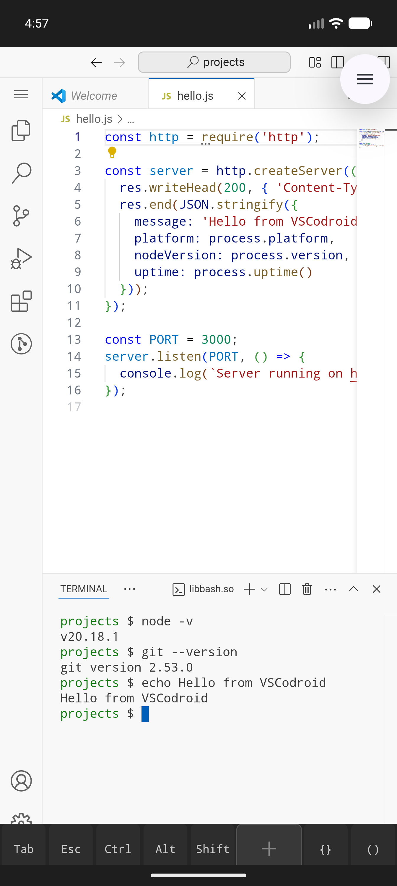
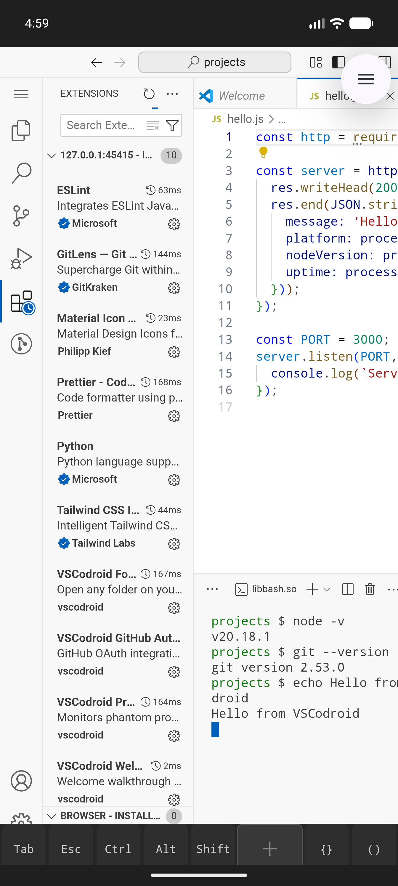
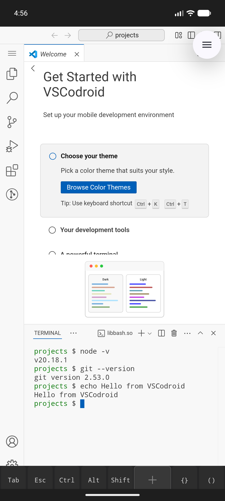

<p align="center">
  
</p>

<h1 align="center">VSCodroid</h1>

<p align="center">
  <strong>VS Code, natively on Android.</strong><br>
  A full-featured IDE on your phone — not a toy editor, not a cloud IDE.<br>
  Download. Open. Code.
</p>

<p align="center">
  <a href="https://github.com/rmyndharis/VSCodroid/actions/workflows/build.yml"></a>
  <a href="https://github.com/rmyndharis/VSCodroid/releases"></a>
  <a href="LICENSE"></a>
  <a href="https://github.com/rmyndharis/VSCodroid/stargazers"></a>
  <a href="https://github.com/rmyndharis/VSCodroid/issues"></a>
</p>

<p align="center">
  <a href="#what-it-is">What It Is</a> &middot;
  <a href="#features">Features</a> &middot;
  <a href="#screenshots">Screenshots</a> &middot;
  <a href="#requirements">Requirements</a> &middot;
  <a href="#installation">Installation</a> &middot;
  <a href="#quick-start">Quick Start</a> &middot;
  <a href="#bundled-tools">Bundled Tools</a> &middot;
  <a href="#known-limitations">Known Limitations</a> &middot;
  <a href="#contributing">Contributing</a> &middot;
  <a href="#legal">Legal</a> &middot;
  <a href="#license">License</a>
</p>

---

## What It Is

VSCodroid is **VS Code (Code - OSS) running natively on Android**. A local Node.js server runs the VS Code Server (vscode-reh) on your device, while the VS Code Web Client renders inside an Android WebView. Everything happens on `localhost` -- no cloud, no remote server, no internet required after install.

**What it IS:**
- The real VS Code Workbench: Monaco Editor, Command Palette, Settings, Keybindings, SCM, Search
- A full terminal with real PTY support (vim, tmux, readline, job control all work)
- An extension-compatible IDE using [Open VSX](https://open-vsx.org) marketplace
- A complete dev environment: Node.js, Python 3, Git, npm, SSH, Bash -- all bundled

**What it is NOT:**
- Not a new editor "inspired by" VS Code -- this is the actual VS Code codebase (MIT-licensed Code - OSS)
- Not a cloud IDE -- runs 100% locally on your device
- Not a Termux wrapper -- standalone Android app with native UI
- Not affiliated with Microsoft

## Features

- **Real VS Code** -- Monaco Editor, Workbench UI, Command Palette, keybindings, themes, settings sync
- **Extension Support** -- Install themes, linters, language packs, formatters from [Open VSX](https://open-vsx.org)
- **Integrated Terminal** -- Bash with real PTY (vim, tmux, colors, readline all work natively)
- **Batteries Included** -- Node.js 20, Python 3.12, Git 2.53, npm 10.8, SSH, tmux, make, ripgrep
- **Offline-First** -- Code without internet. Extensions need internet to install, everything else works offline
- **Mobile-Optimized** -- Multi-page Extra Key Row (Ctrl, Alt, Tab, Esc, arrows, symbols), gesture trackpad for cursor navigation
- **On-demand Toolchains** -- Go, Ruby, Java available via Play Asset Delivery (select during first launch or add later)
- **SSH Key Management** -- Generate ed25519 keys and copy public keys from the Command Palette
- **GitHub Integration** -- OAuth via Chrome Custom Tabs, push/pull from SCM panel
- **Dev Server Preview** -- Open localhost URLs in your device browser for web app testing
- **Crash Recovery** -- Auto-restart on Node.js process death, WebView crash recovery
- **Phantom Process Optimization** -- Extension Host and ptyHost run as worker_threads (not child processes)

## Screenshots

<p align="center">
  
  &nbsp;&nbsp;
  
  &nbsp;&nbsp;
  
</p>

<p align="center">
  <em>Left:</em> Code editor with syntax highlighting and integrated terminal &nbsp;|&nbsp;
  <em>Center:</em> Extensions marketplace (Open VSX) &nbsp;|&nbsp;
  <em>Right:</em> Terminal with Node.js, Git, and bundled tools
</p>

## Requirements

| Requirement  | Minimum                                  |
| ------------ | ---------------------------------------- |
| Android      | 13 (API 33)                              |
| Architecture | arm64-v8a (64-bit ARM only, no 32-bit)   |
| WebView      | Chrome 105+ (ships with Android 13)      |
| RAM          | 4 GB recommended                         |
| Storage      | 500 MB free (core), 1 GB with toolchains |

## Installation

### Play Store

<!-- TODO: Replace with actual Play Store link -->
*Coming soon.* The app will be available on Google Play Store.

### Sideload from GitHub Releases

1. Go to [Releases](https://github.com/rmyndharis/VSCodroid/releases).
2. Download the APK for your device (arm64 only).
3. Enable "Install from unknown sources" if prompted.
4. Install and open the app.

### Build from Source

See [CONTRIBUTING.md](CONTRIBUTING.md) for full build instructions.

```bash
git clone https://github.com/rmyndharis/VSCodroid.git
cd VSCodroid/android && ./gradlew assembleDebug
```

## Quick Start

### First Launch

1. Open VSCodroid. The splash screen extracts core binaries (~5-10 seconds, one-time).
2. **Language Picker** appears: select Go, Ruby, Java, or skip. Selected toolchains download automatically.
3. VS Code loads. The Welcome tab shows quick-start actions.
4. Start coding. Editor, terminal, and all bundled tools are ready.

### Using the Terminal

Open the terminal via the menu or ``Ctrl+` `` (use the Extra Key Row for Ctrl). You have a full Bash shell with:

```bash
node --version    # Node.js 20.18.1
python3 --version # Python 3.12.12
git --version     # Git 2.53.0
npm --version     # npm 10.8.2
ssh -V            # OpenSSH client
```

### Installing Extensions

1. Open the Extensions sidebar (Ctrl+Shift+X via Extra Key Row).
2. Search for extensions. VSCodroid uses [Open VSX](https://open-vsx.org), not the Microsoft Marketplace.
3. Install and use as normal. Themes, linters, formatters, language extensions all work.

Pre-bundled extensions: Material Icon Theme, ESLint, Prettier, Python, GitLens, Tailwind CSS.

### Extra Key Row

The Extra Key Row appears above the soft keyboard and provides keys missing from mobile keyboards:

- **Page 1:** Tab, Esc, Ctrl (toggle), Alt (toggle), Shift (toggle), Gesture Trackpad, `{}`, `()`, `;`, `:`, `"`, `/`
- **Page 2:** `|`, `` ` ``, `&`, `_`, `[]`, `<>`, `=`, `!`, `#`, `@`

The **Gesture Trackpad** lets you drag to move the cursor -- speed increases with drag distance (3-speed gearing).

### SSH Keys

Generate and use SSH keys directly from VSCodroid:

1. Command Palette (Ctrl+Shift+P) > "VSCodroid: Generate SSH Key"
2. Command Palette > "VSCodroid: Copy SSH Public Key" to copy to clipboard
3. Add the public key to GitHub/GitLab
4. Git push/pull over SSH works automatically (`GIT_SSH_COMMAND` is pre-configured)

## Bundled Tools

### Core (included in APK, always available)

| Tool      | Version  | Notes                                   |
| --------- | -------- | --------------------------------------- |
| Node.js   | 20.18.1  | Cross-compiled ARM64, V8 JIT enabled    |
| npm       | 10.8.2   | Bash function wrapper (Android noexec)  |
| Python 3  | 3.12.12  | From Termux, includes pip               |
| Git       | 2.53.0   | Full git with SCM panel integration     |
| Bash      | 5.3.9    | Interactive shell with real PTY         |
| OpenSSH   | -        | ssh + ssh-keygen (ed25519)              |
| tmux      | 3.6a     | Standalone multiplexer for advanced use |
| make      | 4.4.1    | Build tool                              |
| ripgrep   | -        | Powers VS Code Search                   |

### On-demand Toolchains (via Play Asset Delivery)

| Toolchain | Estimated Size | Notes                                   |
| --------- | -------------- | --------------------------------------- |
| Go        | ~163 MB        | CGO_ENABLED=0, self-contained           |
| Ruby      | ~29 MB         | Includes gem, irb                       |
| Java      | ~146 MB        | OpenJDK 17, includes javac              |

Select during first launch or add later via Settings > Toolchains.

### Pre-bundled Extensions

| Extension           | Purpose                     |
| ------------------- | --------------------------- |
| Material Icon Theme | File/folder icons           |
| ESLint              | JavaScript/TypeScript linter|
| Prettier            | Code formatter              |
| Python              | Python language support     |
| GitLens             | Git blame/history           |
| Tailwind CSS        | Tailwind IntelliSense       |

## Size Estimates

| Metric                             | Size                   |
| ---------------------------------- | ---------------------- |
| Play Store download (core)         | ~133 MB                |
| + Each toolchain (on-demand)       | 29-163 MB per language |
| Installed storage (core)           | ~300-400 MB            |
| Installed storage (all toolchains) | ~600-800 MB            |
| RAM usage (typical session)        | ~400-700 MB            |

## Known Limitations

- **ARM64 only** -- no support for 32-bit ARM or x86 Android devices.
- **Android 13+ only** -- older Android versions are not supported.
- **Native npm packages fail** -- packages requiring C/C++ compilation (better-sqlite3, bcrypt, sharp) cannot build on-device. Use WASM/pure-JS alternatives (sql.js, bcryptjs).
- **Microsoft Marketplace unavailable** -- uses Open VSX. Some Microsoft-exclusive extensions (e.g., C# Dev Kit, Pylance) are not available.
- **Memory constrained** -- V8 heap limited to 512 MB. Very large projects may hit memory limits.
- **Phantom process limits** -- Android 12+ enforces a system-wide 32-process limit. VSCodroid optimizes for this (worker_threads for ExtHost/ptyHost), but opening many terminals or language servers may hit the limit.
- **No `node-gyp` on device** -- no C/C++ compiler bundled in core. Native Node.js addons cannot be compiled.
- **`os.cpus().length` returns 0** -- cosmetic issue on Android, non-blocking.

## Architecture

VSCodroid runs a local VS Code Server (vscode-reh) via bundled Node.js (ARM64). The VS Code Web Client renders in an Android WebView, communicating with the server over localhost HTTP + WebSocket.

```
Android App (Kotlin)
  |
  +-- WebView --> VS Code Web Client (vscode-web)
  |                    |
  |              localhost:PORT (HTTP + WebSocket)
  |                    |
  +-- Node.js --> VS Code Server (vscode-reh)
  |                 +-- Extension Host (worker_thread)
  |                 +-- ptyHost (worker_thread)
  |                 +-- Terminal (node-pty, real PTY)
  |                 +-- File System / Search (ripgrep)
  |
  +-- Extra Key Row (native Android View)
  +-- Foreground Service (keeps Node.js alive)
  +-- Android Bridge (clipboard, file picker, OAuth)
```

See [Architecture Documentation](docs/03-ARCHITECTURE.md) for full details.

## Documentation

| Document                                                                     | Description                                       |
| ---------------------------------------------------------------------------- | ------------------------------------------------- |
| [Product Requirements](docs/01-PRD.md)                                       | Vision, goals, and product scope                  |
| [Software Requirements](docs/02-SRS.md)                                      | Functional and non-functional requirements        |
| [Architecture](docs/03-ARCHITECTURE.md)                                      | System design and component architecture          |
| [Technical Spec](docs/04-TECHNICAL_SPEC.md)                                  | Implementation details and technical decisions    |
| [API Spec](docs/05-API_SPEC.md)                                              | Internal API and bridge interfaces                |
| [Security](docs/06-SECURITY.md)                                              | Security model and threat analysis                |
| [Testing Strategy](docs/07-TESTING_STRATEGY.md)                              | Test plan and quality assurance                   |
| [Risk Matrix](docs/08-RISK_MATRIX.md)                                        | Known risks and mitigation strategies             |
| [Development Guide](docs/09-DEVELOPMENT_GUIDE.md)                            | How to set up and build the project               |
| [Release Plan](docs/10-RELEASE_PLAN.md)                                      | Release strategy, CI/CD, Play Store               |
| [User Guide](docs/USER_GUIDE.md)                                             | Keyboard, terminal, extensions, SSH usage         |
| [Milestones](MILESTONES.md)                                                  | Development milestones M0-M6                      |
| [Glossary](docs/11-GLOSSARY.md)                                              | Terms and definitions                             |
| [Implementation Plan](docs/12-IMPLEMENTATION_PLAN.md)                        | Week-by-week task breakdown                       |
| [Third-Party Attribution](NOTICE.md)                                         | Licenses for all bundled software                 |
| [Privacy Policy](https://rmyndharis.github.io/VSCodroid/privacy-policy.html) | Data collection and privacy practices             |

## Contributing

Contributions are welcome -- code, documentation, testing, bug reports, UX feedback. See the full [Contributing Guide](CONTRIBUTING.md) for development setup, build instructions, and PR process.

```bash
git clone https://github.com/rmyndharis/VSCodroid.git
cd VSCodroid
# See CONTRIBUTING.md for detailed setup
```

Quick links:
- [Report a Bug](https://github.com/rmyndharis/VSCodroid/issues/new?template=bug_report.md)
- [Request a Feature](https://github.com/rmyndharis/VSCodroid/issues/new?template=feature_request.md)
- [Discussions](https://github.com/rmyndharis/VSCodroid/discussions)

## Security

If you discover a security vulnerability, please **do not** open a public issue. See our [Security Policy](SECURITY.md) for responsible disclosure instructions.

## Legal

VSCodroid is built from the MIT-licensed [Code - OSS](https://github.com/microsoft/vscode) source code. It is **not affiliated with or endorsed by Microsoft Corporation**.

- "Visual Studio Code" and "VS Code" are trademarks of Microsoft Corporation.
- Uses [Open VSX](https://open-vsx.org) extension registry, not Microsoft Marketplace.
- All Microsoft telemetry, branding, and update services are removed.
- See [LICENSE](LICENSE) for the full license text.
- See [NOTICE.md](NOTICE.md) for third-party attribution.
- See [Privacy Policy](https://rmyndharis.github.io/VSCodroid/privacy-policy.html) for data practices.

## License

This project is licensed under the **MIT License**. See the [LICENSE](LICENSE) file for details.

---

<p align="center">
  <a href="https://github.com/rmyndharis/VSCodroid/discussions">Discussions</a> &middot;
  <a href="https://github.com/rmyndharis/VSCodroid/issues">Issues</a> &middot;
  <a href="https://github.com/rmyndharis/VSCodroid/releases">Releases</a>
</p>

<p align="center">
  Made for mobile developers everywhere.
</p>
