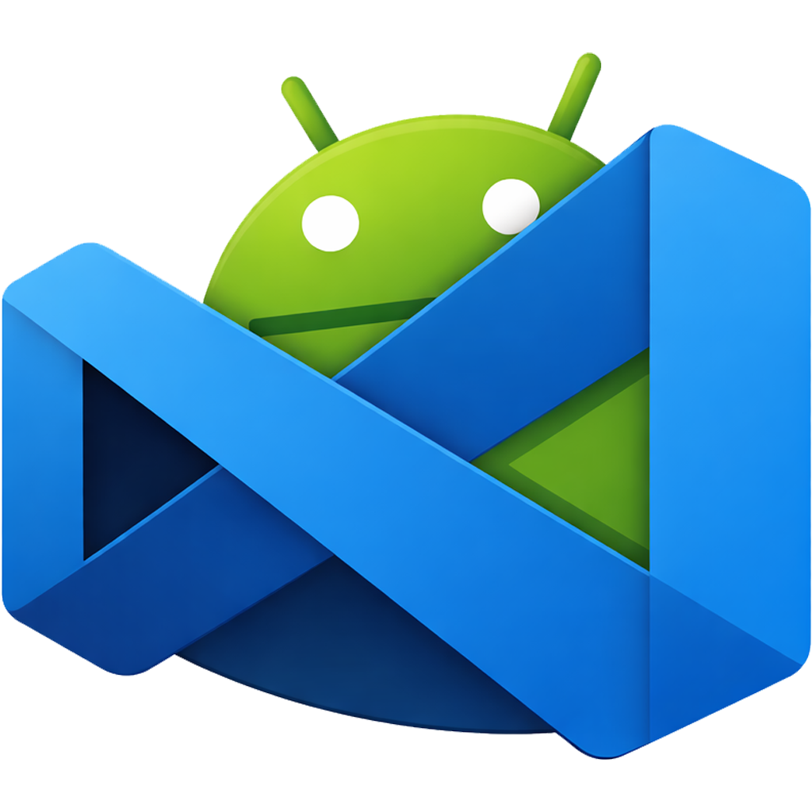
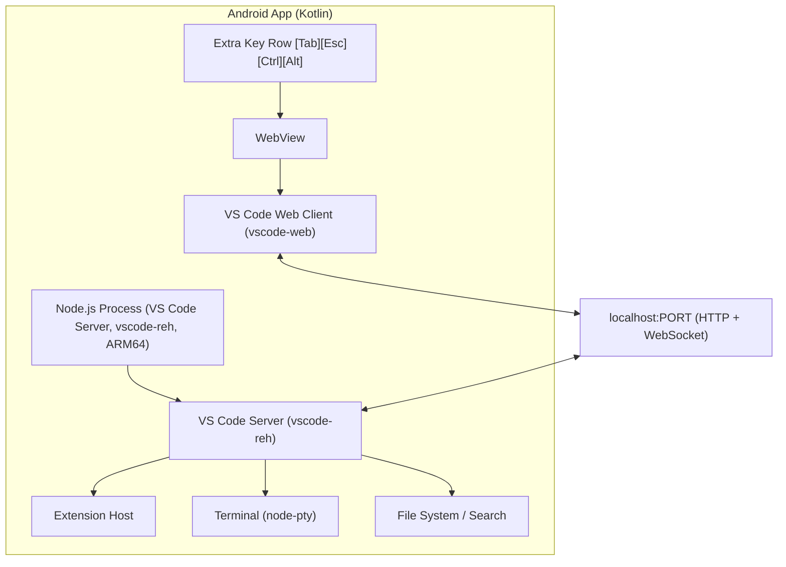

<p align="center">
  
</p>

<h1 align="center">VSCodroid</h1>

<p align="center">
  <strong>VS Code, natively on Android.</strong><br>
  A full-featured IDE on your phone — not a toy editor, not a cloud IDE.<br>
  Download. Open. Code.
</p>

<p align="center">
  <a href="https://github.com/rmyndharis/VSCodroid/actions/workflows/ci.yml"></a>
  <a href="https://github.com/rmyndharis/VSCodroid/releases"></a>
  <a href="LICENSE"></a>
  <a href="https://github.com/rmyndharis/VSCodroid/stargazers"></a>
  <a href="https://github.com/rmyndharis/VSCodroid/issues"></a>
</p>

<p align="center">
  <a href="#-manifesto">Manifesto</a> •
  <a href="#-who-this-is-for">Who This Is For</a> •
  <a href="#-why-now-quantitative-signals">Why Now</a> •
  <a href="#-principles">Principles</a> •
  <a href="#-our-promise">Promise</a> •
  <a href="#-features">Features</a> •
  <a href="#-architecture">Architecture</a> •
  <a href="#-getting-started">Getting Started</a> •
  <a href="#-building-from-source">Build</a> •
  <a href="#-contributing">Contributing</a> •
  <a href="#-license">License</a>
</p>

---

> _What if the next great developer is holding a phone, not a laptop?_
> _What if a career in software could start without buying expensive hardware?_
> _What if all you needed was curiosity, effort, and the device already in your pocket?_

## ✊ Manifesto

What if a software career could begin from the device already in your hand?

Around the world, people are ready to learn and build.
Too many are told to wait:
wait for a laptop,
wait for better internet,
wait for better circumstances.

VSCodroid is a refusal of that waiting.
VSCodroid exists for people with talent, discipline, and ideas — but without access to expensive hardware.

We believe access to software creation should depend on effort and curiosity, not on purchasing power.
So this project brings a real development environment to Android:
real editor, real terminal, real tooling, real output.

No watered-down coding toy.
No mandatory cloud lock-in.
No "come back later when you can afford more."

If you are **ready to learn**, you should be able to **start today**.

## 👥 Who This Is For

- Learners who only have access to a smartphone.
- Developers who want a portable fallback dev environment.
- Remote contributors who need quick fixes while away from a laptop.
- Communities and educators who want lower barriers to coding access.

## 🌍 Why Now?

| Signal                    | Latest data                                                                                                                                          | Why this matters for VSCodroid                                                           |
| ------------------------- | ---------------------------------------------------------------------------------------------------------------------------------------------------- | ---------------------------------------------------------------------------------------- |
| Phone-first world         | In 2024, global smartphone shipments reached **1.24 billion**, while PC shipments were **262.7 million** (about **4.7x** more smartphones than PCs). | Many people will have a phone before they ever own a laptop.                             |
| Access is still unequal   | In 2025, **6 billion** people are online, but only **23%** of people in low-income countries use the Internet.                                       | Access to coding tools is still uneven, so lower-barrier tooling matters.                |
| Mobile is the gateway     | In 2025, **82%** of people aged 10+ own a mobile phone globally (but only **53%** in low-income economies).                                          | The most available computing device is already in people's pockets.                      |
| Cost blocks participation | In 2025, fixed broadband in low-income countries can cost **more than one quarter of average income**.                                               | Local/offline-capable workflows are not a luxury; they are necessary.                    |
| Familiar tooling wins     | In Stack Overflow Developer Survey 2025, **75.9%** of respondents reported using Visual Studio Code.                                                 | Bringing the real VS Code experience to Android reduces learning and switching friction. |

### Data Sources

1. [IDC: Worldwide Smartphone Shipments Grew 6.4% in 2024](https://www.businesswire.com/news/home/20250113500219/en/Worldwide-Smartphone-Shipments-Grew-6.4-in-2024-Despite-Macro-Challenges-according-to-IDC)
2. [IDC: The PC Market Closed out 2024 with Slight Growth](https://www.businesswire.com/news/home/20250108905115/en/The-PC-Market-Closed-out-2024-with-Slight-Growth-and-Mixed-Views-on-What-2025-Will-Bring-according-to-IDC)
3. [ITU Facts and Figures 2025: Internet use](https://www.itu.int/itu-d/reports/statistics/2025/10/15/ff25-internet-use/)
4. [ITU Facts and Figures 2025: Mobile phone ownership](https://www.itu.int/itu-d/reports/statistics/2025/10/15/ff25-mobile-phone-ownership/)
5. [ITU Facts and Figures 2025: Affordability of ICT services](https://www.itu.int/itu-d/reports/statistics/2025/10/15/ff25-affordability-of-ict-services/)
6. [Stack Overflow Developer Survey 2025: Technology (Dev IDEs)](https://survey.stackoverflow.co/2025/technology/)

## 🧭 Principles

- **Human potential first** — talent exists everywhere, even where hardware access does not.
- **Real tools, real dignity** — people deserve production-grade workflows, not watered-down substitutes.
- **Offline-first by design** — learning and working should remain possible when internet is weak or expensive.
- **Local by default** — your environment runs on your own device, on `localhost`.
- **Pathway to opportunity** — the goal is not just writing code, but opening doors to real projects and jobs.

## 🤝 Our Promise

- We will keep VSCodroid practical for low-resource conditions, not just high-end setups.
- We will prioritize reliability and usefulness over hype.
- We will build in public and listen to learners, contributors, and first-time developers.
- We will measure success by how many people can start and keep building, not installs alone.

## ✨ Features

- **Real VS Code** — Monaco Editor, Workbench UI, Command Palette, and all the features you know.
- **Extension Support** — Install themes, linters, language packs, and more from [Open VSX](https://open-vsx.org).
- **Integrated Terminal** — Full bash terminal with real PTY support (vim, tmux, readline all work).
- **Batteries Included** — Node.js, Python 3, Git, npm, SSH, and essential tools bundled out of the box.
- **Offline-First** — Code without an internet connection. Everything runs locally on your device.
- **Mobile-Optimized** — Extra Key Row (Ctrl, Alt, Tab, Esc, arrows), touch-friendly UI, clipboard bridge.
- **SSH Key Management** — Generate ed25519 keys and copy public keys from the command palette.
- **Language Picker** — Select your languages, Go/Ruby/Java auto-install via Play Store.
- **Dev Server Preview** — Open localhost URLs in your device's browser for web app testing.

## 🏗️ Architecture

VSCodroid runs a local VS Code Server instance on your Android device. The VS Code Web Client renders inside a WebView, and the VS Code Server (Node.js) runs as a native ARM64 process, all on `localhost`.



> For full architecture details, see [Architecture Documentation](docs/03-ARCHITECTURE.md).

## 📱 Requirements

| Requirement  | Minimum                            |
| ------------ | ---------------------------------- |
| Android      | 13 (API 33)                        |
| Architecture | arm64-v8a                          |
| WebView      | Chrome 105+                        |
| RAM          | 4 GB recommended                   |
| Storage      | ~500 MB minimum (core + workspace) |

## 🚀 Getting Started

### Install from Release

1. Download from [Releases](https://github.com/rmyndharis/VSCodroid/releases) (Play Store coming soon).
2. Install on your Android device.
3. Open the app. Core binaries extract automatically (~5-10 seconds).
4. Pick your languages (Go, Rust, Java, etc.). They install automatically.
5. Start coding. Editor, terminal, and tools are ready.

### What's Included

| Tier                         | What                                                        | How                                                      |
| ---------------------------- | ----------------------------------------------------------- | -------------------------------------------------------- |
| **Core (Base APK)**          | Node.js, npm, Python 3, Git, Bash, SSH, tmux, make, ripgrep | Available immediately                                    |
| **Toolchains (Asset Packs)** | Go, Ruby, Java                                              | Select in Language Picker, auto-installed via Play Store |

## 🔨 Building from Source

### Prerequisites

- **Android Studio** latest stable version with Android API 36 support.
- **Android NDK** r27+.
- **Node.js** 20 LTS (for building VS Code).
- **Yarn** 1.x Classic (for VS Code build).
- **Python** 3.x (for node-gyp).
- **Git**.

### Build Steps

```bash
# Clone the repository
git clone https://github.com/rmyndharis/VSCodroid.git
cd VSCodroid

# Build the Android app
cd android && ./gradlew assembleDebug

# Install on connected device
adb install android/app/build/outputs/apk/debug/app-debug.apk
```

> [!WARNING]
> **Cross-compilation required.** Building from source involves cross-compiling Node.js and
> native modules for ARM64 Android. The steps above will build the Android shell, but the
> full development setup (including server binaries) requires additional steps.
> See the complete [Development Guide](docs/09-DEVELOPMENT_GUIDE.md) for detailed instructions.

## 📦 Size Estimates

| Metric                             | Size                   |
| ---------------------------------- | ---------------------- |
| Play Store download (core)         | ~150-200 MB            |
| + Each toolchain (on-demand)       | 20-100 MB per language |
| Installed storage (core)           | ~300-400 MB            |
| Installed storage (all toolchains) | ~600-800 MB            |
| RAM usage (typical)                | ~400-700 MB            |

## 🤝 Contributing

We welcome contributions in code, docs, testing, UX feedback, and bug reports. If you care about widening access to software development, this is your project too.

```bash
# Get started
git clone https://github.com/rmyndharis/VSCodroid.git
cd VSCodroid

# Read the contributing guide for setup details
# See CONTRIBUTING.md
```

Please read our [Contributing Guide](CONTRIBUTING.md) before submitting a Pull Request.

Quick links:

- 🐛 [Report a Bug](https://github.com/rmyndharis/VSCodroid/issues/new?template=bug_report.md)
- 💡 [Request a Feature](https://github.com/rmyndharis/VSCodroid/issues/new?template=feature_request.md)
- 📖 [Documentation](docs/)

## 📚 Documentation

| Document                                                                     | Description                                                |
| ---------------------------------------------------------------------------- | ---------------------------------------------------------- |
| [Product Requirements](docs/01-PRD.md)                                       | Vision, goals, and product scope                           |
| [Software Requirements](docs/02-SRS.md)                                      | Detailed functional & non-functional requirements          |
| [Architecture](docs/03-ARCHITECTURE.md)                                      | System design and component architecture                   |
| [Technical Spec](docs/04-TECHNICAL_SPEC.md)                                  | Implementation details and technical decisions             |
| [API Spec](docs/05-API_SPEC.md)                                              | Internal API and bridge interfaces                         |
| [Security](docs/06-SECURITY.md)                                              | Security model and threat analysis                         |
| [Testing Strategy](docs/07-TESTING_STRATEGY.md)                              | Test plan and quality assurance                            |
| [Risk Matrix](docs/08-RISK_MATRIX.md)                                        | Known risks and mitigation strategies                      |
| [Development Guide](docs/09-DEVELOPMENT_GUIDE.md)                            | How to set up and build the project                        |
| [Release Plan](docs/10-RELEASE_PLAN.md)                                      | Release strategy, CI/CD, Play Store                        |
| [User Guide](docs/USER_GUIDE.md)                                             | How to use VSCodroid (keyboard, terminal, extensions, SSH) |
| [Milestones](MILESTONES.md)                                                  | Development milestones M0–M6                               |
| [Glossary](docs/11-GLOSSARY.md)                                              | Terms and definitions                                      |
| [Implementation Plan](docs/12-IMPLEMENTATION_PLAN.md)                        | Week-by-week task breakdown with dependencies              |
| [Third-Party Attribution](NOTICE.md)                                         | Licenses for all bundled software                          |
| [Privacy Policy](https://rmyndharis.github.io/VSCodroid/privacy-policy.html) | Data collection and privacy practices                      |

## 🔒 Security

If you discover a security vulnerability, please **do not** open a public issue. Instead, see our [Security Policy](SECURITY.md) for responsible disclosure instructions.

## ⚖️ Legal

VSCodroid is built from the MIT-licensed [Code - OSS](https://github.com/microsoft/vscode) source code. It is **not affiliated with or endorsed by Microsoft Corporation**.

- "Visual Studio Code" and "VS Code" are trademarks of Microsoft.
- Uses [Open VSX](https://open-vsx.org) extension registry, not Microsoft Marketplace.
- See [LICENSE](LICENSE) for full license text.
- See [NOTICE.md](NOTICE.md) for third-party attribution.
- See [Privacy Policy](https://rmyndharis.github.io/VSCodroid/privacy-policy.html) for data practices.

## 📄 License

This project is licensed under the **MIT License**. See the [LICENSE](LICENSE) file for details.

---

<p align="center">
  <a href="https://github.com/rmyndharis/VSCodroid/discussions">💬 Discussions</a> •
  <a href="https://github.com/rmyndharis/VSCodroid/issues">🐛 Issues</a> •
  <a href="https://github.com/rmyndharis/VSCodroid/releases">📦 Releases</a>
</p>

<p align="center">
  Made with ❤️ for mobile developers everywhere by Yudhi Armyndharis & VSCodroid Community
</p>
