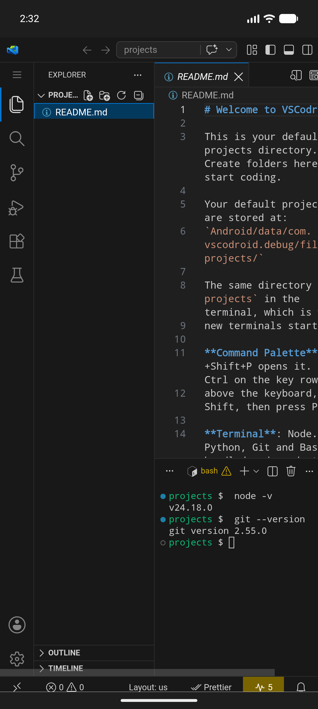
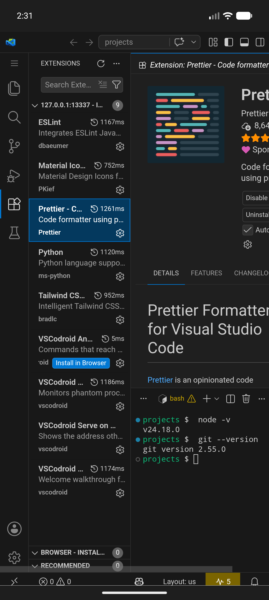
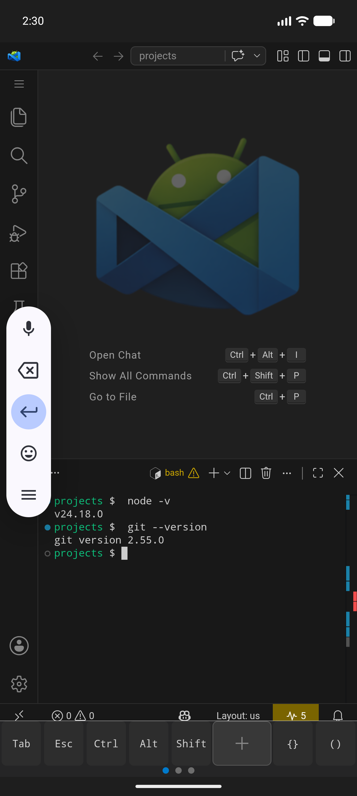
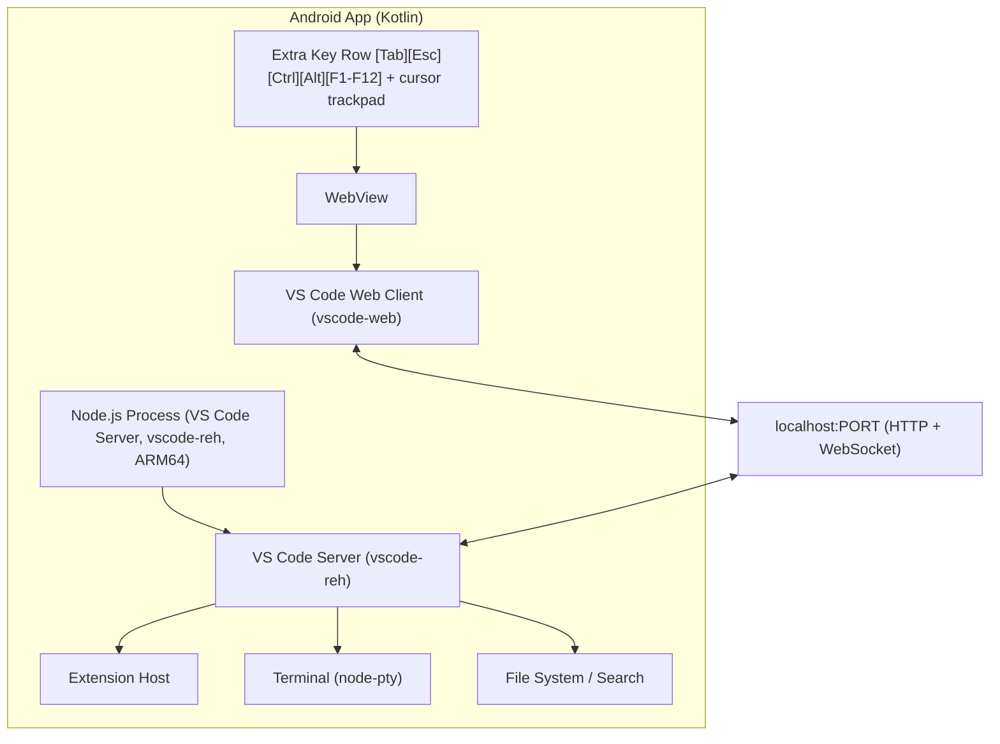

<p align="center">
  
</p>

<h1 align="center">VSCodroid</h1>

<p align="center">
  <strong>VS Code, natively on Android.</strong><br>
  A full-featured IDE on your phone — not a toy editor, not a cloud IDE.<br>
  Download. Open. Code.
</p>

<p align="center">
  <a href="https://github.com/rmyndharis/VSCodroid/actions/workflows/build.yml"></a>
  <a href="https://github.com/rmyndharis/VSCodroid/releases"></a>
  <a href="LICENSE"></a>
  <a href="https://github.com/rmyndharis/VSCodroid/stargazers"></a>
  <a href="https://github.com/rmyndharis/VSCodroid/issues"></a>
</p>

<p align="center">
  <a href="#-manifesto">Manifesto</a> •
  <a href="#-who-this-is-for">Who This Is For</a> •
  <a href="#-why-now-quantitative-signals">Why Now</a> •
  <a href="#-principles">Principles</a> •
  <a href="#-our-promise">Promise</a> •
  <a href="#-features">Features</a> •
  <a href="#-architecture">Architecture</a> •
  <a href="#-getting-started">Getting Started</a> •
  <a href="#-building-from-source">Build</a> •
  <a href="#-contributing">Contributing</a> •
  <a href="#-license">License</a>
</p>

---
<p align="center">
  <a href="https://play.google.com/store/apps/details?id=com.vscodroid">
    
  </a>
</p>

> [!TIP]
>
> ### 🚀 Now Available on Google Play!
>
> VSCodroid is publicly available on Google Play. Download it now and start coding on your Android device.
>
> 🔗 **[Get VSCodroid on Google Play](https://play.google.com/store/apps/details?id=com.vscodroid)**


> _What if the next great developer is holding a phone, not a laptop?_
> _What if a career in software could start without buying expensive hardware?_
> _What if all you needed was curiosity, effort, and the device already in your pocket?_

## ✊ Manifesto

What if a software career could begin from the device already in your hand?

Around the world, people are ready to learn and build.
Too many are told to wait:
wait for a laptop,
wait for better internet,
wait for better circumstances.

VSCodroid is a refusal of that waiting.
VSCodroid exists for people with talent, discipline, and ideas — but without access to expensive hardware.

We believe access to software creation should depend on effort and curiosity, not on purchasing power.
So this project brings a real development environment to Android:
real editor, real terminal, real tooling, real output.

No watered-down coding toy.
No mandatory cloud lock-in.
No "come back later when you can afford more."

If you are **ready to learn**, you should be able to **start today**.

## 👥 Who This Is For

- Learners who only have access to a smartphone.
- Developers who want a portable fallback dev environment.
- Remote contributors who need quick fixes while away from a laptop.
- Communities and educators who want lower barriers to coding access.

## 🌍 Why Now?

| Signal                    | Latest data                                                                                                                                          | Why this matters for VSCodroid                                                           |
| ------------------------- | ---------------------------------------------------------------------------------------------------------------------------------------------------- | ---------------------------------------------------------------------------------------- |
| Phone-first world         | In 2024, global smartphone shipments reached **1.24 billion**, while PC shipments were **262.7 million** (about **4.7x** more smartphones than PCs). | Many people will have a phone before they ever own a laptop.                             |
| Access is still unequal   | In 2025, **6 billion** people are online, but only **23%** of people in low-income countries use the Internet.                                       | Access to coding tools is still uneven, so lower-barrier tooling matters.                |
| Mobile is the gateway     | In 2025, **82%** of people aged 10+ own a mobile phone globally (but only **53%** in low-income economies).                                          | The most available computing device is already in people's pockets.                      |
| Cost blocks participation | In 2025, fixed broadband in low-income countries can cost **more than one quarter of average income**.                                               | Local/offline-capable workflows are not a luxury; they are necessary.                    |
| Familiar tooling wins     | In Stack Overflow Developer Survey 2025, **75.9%** of respondents reported using Visual Studio Code.                                                 | Bringing the real VS Code experience to Android reduces learning and switching friction. |

### Data Sources

1. [IDC: Worldwide Smartphone Shipments Grew 6.4% in 2024](https://www.businesswire.com/news/home/20250113500219/en/Worldwide-Smartphone-Shipments-Grew-6.4-in-2024-Despite-Macro-Challenges-according-to-IDC)
2. [IDC: The PC Market Closed out 2024 with Slight Growth](https://www.businesswire.com/news/home/20250108905115/en/The-PC-Market-Closed-out-2024-with-Slight-Growth-and-Mixed-Views-on-What-2025-Will-Bring-according-to-IDC)
3. [ITU Facts and Figures 2025: Internet use](https://www.itu.int/itu-d/reports/statistics/2025/10/15/ff25-internet-use/)
4. [ITU Facts and Figures 2025: Mobile phone ownership](https://www.itu.int/itu-d/reports/statistics/2025/10/15/ff25-mobile-phone-ownership/)
5. [ITU Facts and Figures 2025: Affordability of ICT services](https://www.itu.int/itu-d/reports/statistics/2025/10/15/ff25-affordability-of-ict-services/)
6. [Stack Overflow Developer Survey 2025: Technology (Dev IDEs)](https://survey.stackoverflow.co/2025/technology/)

## 🧭 Principles

- **Human potential first** — talent exists everywhere, even where hardware access does not.
- **Real tools, real dignity** — people deserve production-grade workflows, not watered-down substitutes.
- **Offline-first by design** — learning and working should remain possible when internet is weak or expensive.
- **Local by default** — your environment runs on your own device, on `localhost`.
- **Pathway to opportunity** — the goal is not just writing code, but opening doors to real projects and jobs.

## 🤝 Our Promise

- We will keep VSCodroid practical for low-resource conditions, not just high-end setups.
- We will prioritize reliability and usefulness over hype.
- We will build in public and listen to learners, contributors, and first-time developers.
- We will measure success by how many people can start and keep building, not installs alone.

## ✨ Features

- **Real VS Code** — Monaco Editor, Workbench UI, Command Palette, and all the features you know.
- **Extension Support**: Install themes, linters, language support, and more from [Open VSX](https://open-vsx.org). The editor's own interface is English only.
- **Integrated Terminal** — Full bash terminal with real PTY support (vim, tmux, readline all work).
- **Batteries Included** — Node.js, Python 3, Git, npm, SSH, and essential tools bundled out of the box.
- **Offline-First** — Code without an internet connection. Everything runs locally on your device.
- **Mobile-Optimized** — Extra Key Row (Ctrl, Alt, Tab, Esc, F1-F12, symbols, cursor trackpad), touch-friendly UI, clipboard bridge.
- **SSH Out of the Box** — Bundled OpenSSH client and `ssh-keygen`, preconfigured with sane defaults (ed25519, keepalive, `accept-new`).
- **Language Picker** — Select your languages; Go/Ruby/Java install on demand — via Play Asset Delivery on Play installs, or direct download on sideloaded installs.
- **Dev Server Preview** — Preview a running dev server in an editor tab beside your code, or hand it to the device's browser.

## 📸 Screenshots

<p align="center">
  
  &nbsp;&nbsp;
  
  &nbsp;&nbsp;
  
</p>

<p align="center">
  <em>Code editor with syntax highlighting</em> · <em>Extensions marketplace (Open VSX)</em> · <em>Terminal with Node.js, Git, and bundled tools</em>
</p>

## 🏗️ Architecture

VSCodroid runs a local VS Code Server instance on your Android device. The VS Code Web Client renders inside a WebView, and the VS Code Server (Node.js) runs as a native ARM64 process, all on `localhost`.


```mermaid
flowchart TD
  subgraph APP["Android App (Kotlin)"]
    WV["WebView"]
    WEB["VS Code Web Client (vscode-web)"]
    KEY["Extra Key Row [Tab][Esc][Ctrl][Alt][F1-F12] + cursor trackpad"]
    NODE["Node.js Process (VS Code Server, vscode-reh, ARM64)"]
    REH["VS Code Server (vscode-reh)"]
    EXT["Extension Host"]
    TERM["Terminal (node-pty)"]
    FS["File System / Search"]
    WV --> WEB
    NODE --> REH
    REH --> EXT
    REH --> TERM
    REH --> FS
    KEY --> WV
  end
  WEB <--> LOCAL["localhost:PORT (HTTP + WebSocket)"]
  LOCAL <--> REH
```

> For full architecture details, see [Architecture Design Document (historical — the 2026-02-10 design, not the code)](docs/03-ARCHITECTURE.md).

## 📱 Requirements

| Requirement  | Minimum                            |
| ------------ | ---------------------------------- |
| Android      | 13 (API 33)                        |
| Architecture | arm64-v8a                          |
| WebView      | Chrome 105+                        |
| RAM          | 4 GB recommended                   |
| Storage      | ~875 MB free to install            |

## 🚀 Getting Started

### Install from Google Play

1. **Install** from [Google Play](https://play.google.com/store/apps/details?id=com.vscodroid).
2. Open the app. Core binaries extract automatically the first time, behind a progress bar.
3. Pick your languages (Go, Ruby, Java). They install automatically.
4. Start coding. Editor, terminal, and tools are ready.

> You can also download APKs directly from [GitHub Releases](https://github.com/rmyndharis/VSCodroid/releases).

### What's Included

| Tier                         | What                                                        | How                                                      |
| ---------------------------- | ----------------------------------------------------------- | -------------------------------------------------------- |
| **Core (Base APK)**          | Node.js, npm, Python 3, Git, Bash, SSH, tmux, make, ripgrep | Available immediately                                    |
| **Toolchains (Asset Packs)** | Go, Ruby, Java                                              | Select in Language Picker — Play Asset Delivery, or direct download on sideloaded installs |

## 🔨 Building from Source

### Prerequisites

- **Android Studio** latest stable version with Android API 36 support.
- **Android NDK** r27+ (for cross-compiling the native addons).
- **Python** 3.x (used by the download and verification scripts).
- **Git**.

You do **not** build VS Code locally: the server tree is built once per VS Code version by a
separate workflow and fetched as a verified tarball by `scripts/fetch-vscode-oss.sh`.

### Build Steps

```bash
# Clone the repository
git clone https://github.com/rmyndharis/VSCodroid.git
cd VSCodroid

# Build the Android app
cd android && ./gradlew assembleDebug

# Install on connected device
adb install android/app/build/outputs/apk/debug/app-debug.apk
```

> [!WARNING]
> **The steps above build the Android shell only.** A runnable app also needs the server tree,
> the Node runtime and the bundled tools, which the `scripts/download-*.sh` scripts fetch.
> Only the two native addons are cross-compiled, by `scripts/build-native-addons.sh`, and that
> needs the Android NDK. See [CONTRIBUTING.md](CONTRIBUTING.md) for the order to run them in.

## 📦 Size Estimates

| Metric                                 | Size                 |
| -------------------------------------- | -------------------- |
| Play Store download (core)             | ~135 MB              |
| + Each toolchain (on-demand)           | 9-53 MB per language |
| Free space required to install         | ~875 MB              |
| Extracted to internal storage (core)   | ~810 MB              |
| Extracted, plus all three toolchains   | ~1.15 GB             |
| RAM usage (typical)                    | ~400-700 MB          |

The install figure is larger than what the app ends up occupying because extraction
needs room to work: it is the asset tree plus 64 MB of headroom, and it is the number
the app itself quotes when it refuses to start for lack of space. Freeing only what the
extracted size suggests is what leaves setup failing partway.

These move with every VS Code bump. Re-measure rather than trusting them:

```bash
# what the app will extract, and therefore what the storage gate demands
find android/app/src/main/assets -type f -exec stat -f %z {} + | awk '{s+=$1} END {printf "%.0f MB assets, gate demands %.0f MB\n", s/1048576, s/1048576+64}'
```

## 🤝 Contributing

We welcome contributions in code, docs, testing, UX feedback, and bug reports. If you care about widening access to software development, this is your project too.

```bash
# Get started
git clone https://github.com/rmyndharis/VSCodroid.git
cd VSCodroid

# Read the contributing guide for setup details
# See CONTRIBUTING.md
```

Please read our [Contributing Guide](CONTRIBUTING.md) before submitting a Pull Request.

Quick links:

- 🐛 [Report a Bug](https://github.com/rmyndharis/VSCodroid/issues/new?template=bug_report.md)
- 💡 [Request a Feature](https://github.com/rmyndharis/VSCodroid/issues/new?template=feature_request.md)
- 📖 [Documentation](docs/)

## 📚 Documentation

| Document                                                                     | Description                                                |
| ---------------------------------------------------------------------------- | ---------------------------------------------------------- |
| [Product Requirements](docs/01-PRD.md)                                       | Vision, goals, and product scope                           |
| [Software Requirements](docs/02-SRS.md)                                      | Detailed functional & non-functional requirements          |
| [Architecture (historical)](docs/03-ARCHITECTURE.md)                         | System design and component architecture                   |
| [Technical Spec](docs/04-TECHNICAL_SPEC.md)                                  | Implementation details and technical decisions             |
| [API Spec](docs/05-API_SPEC.md)                                              | Internal API and bridge interfaces                         |
| [Security](docs/06-SECURITY.md)                                              | Security model and threat analysis                         |
| [Testing Strategy](docs/07-TESTING_STRATEGY.md)                              | Test plan and quality assurance                            |
| [Risk Matrix](docs/08-RISK_MATRIX.md)                                        | Known risks and mitigation strategies                      |
| [Development Guide](docs/09-DEVELOPMENT_GUIDE.md)                            | How to set up and build the project                        |
| [Release Plan](docs/10-RELEASE_PLAN.md)                                      | Release strategy, CI/CD, Play Store                        |
| [User Guide](docs/USER_GUIDE.md)                                             | How to use VSCodroid (keyboard, terminal, extensions, SSH) |
| [Milestones](MILESTONES.md)                                                  | Development milestones M0–M6                               |
| [Glossary](docs/11-GLOSSARY.md)                                              | Terms and definitions                                      |
| [Implementation Plan](docs/12-IMPLEMENTATION_PLAN.md)                        | Week-by-week task breakdown with dependencies              |
| [Third-Party Attribution](NOTICE.md)                                         | Licenses for all bundled software                          |
| [Privacy Policy](https://rmyndharis.github.io/VSCodroid/privacy-policy.html) | Data collection and privacy practices                      |

## 🔒 Security

If you discover a security vulnerability, please **do not** open a public issue. Instead, see our [Security Policy](SECURITY.md) for responsible disclosure instructions.

## ⚖️ Legal

VSCodroid is **not affiliated with or endorsed by Microsoft Corporation**.

The bundled editor server is built from the MIT-licensed [Code - OSS](https://github.com/microsoft/vscode) source, with this project's Android patches and branding applied before the build. Its licence and third-party notices ship inside the tree, at `android/app/src/main/assets/vscode-reh/LICENSE.txt` and `ThirdPartyNotices.txt`. Earlier releases bundled Microsoft's pre-built Visual Studio Code Server distribution instead, which is covered by Microsoft's own proprietary terms rather than MIT.

- "Visual Studio Code" and "VS Code" are trademarks of Microsoft.
- Uses [Open VSX](https://open-vsx.org) extension registry, not Microsoft Marketplace.
- See [NOTICE.md](NOTICE.md) for third-party attribution.
- See [Privacy Policy](https://rmyndharis.github.io/VSCodroid/privacy-policy.html) for data practices.

## 📄 License

VSCodroid's **own** source — the Android app, the build scripts, and the bundled configuration — is licensed under the **MIT License**. See [LICENSE](LICENSE).

That licence does not extend to the third-party components VSCodroid downloads or bundles; each carries its own terms, listed in [NOTICE.md](NOTICE.md).

---

<p align="center">
  <a href="https://github.com/rmyndharis/VSCodroid/discussions">💬 Discussions</a> •
  <a href="https://github.com/rmyndharis/VSCodroid/issues">🐛 Issues</a> •
  <a href="https://github.com/rmyndharis/VSCodroid/releases">📦 Releases</a>
</p>

<p align="center">
  Made with ❤️ for mobile developers everywhere by Yudhi Armyndharis & VSCodroid Community
</p>
