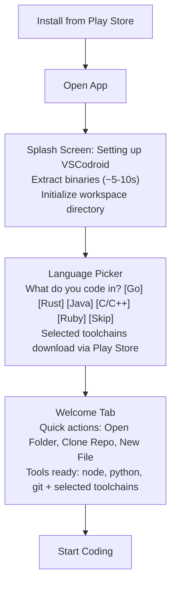
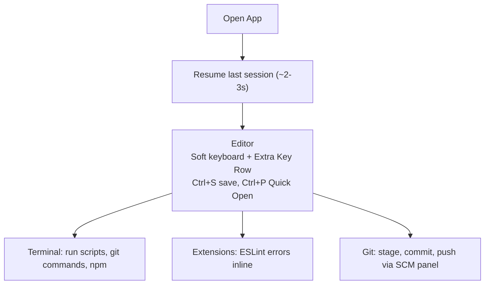
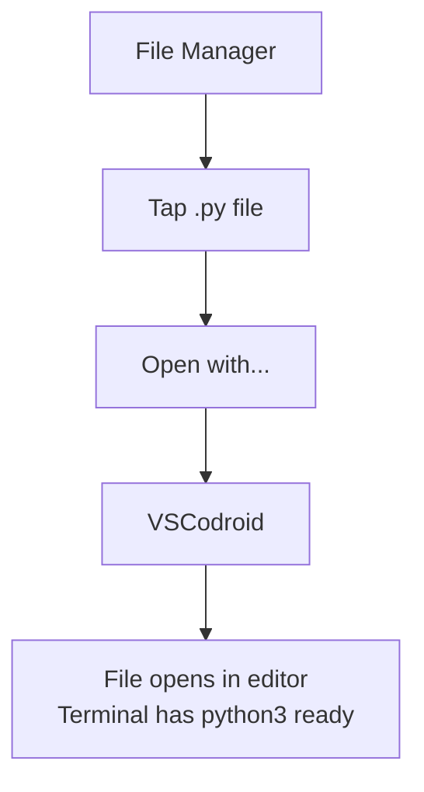

# Product Requirements Document (PRD)

**Project**: VSCodroid
**Version**: 1.0-draft
**Date**: 2026-02-10

---

## 1. Executive Summary

VSCodroid is Visual Studio Code ported to Android. It provides a full-featured IDE experience on mobile devices by running the actual VS Code codebase (code-server fork) with a native Android shell. Unlike simplified mobile code editors, VSCodroid runs real VS Code with real extension support, a real terminal, and real Node.js — delivering desktop-grade development power in your pocket.

## 2. Problem Statement

### The Gap

Developers increasingly work across multiple devices, yet Android — the world's most popular mobile OS — has no viable VS Code option. Current alternatives fall into two categories:

1. **Cloud IDEs** (GitHub Codespaces, Gitpod): Require internet, incur costs, add latency
2. **Mobile code editors** (Acode, Spck, CodeFA): Limited features, no extension support, no terminal, no Node.js

### Why Now?

- **Hardware maturity**: Modern Android phones have 8-16GB RAM, fast ARM64 CPUs
- **WebView maturity**: Android WebView (Chromium-based) supports all VS Code UI requirements
- **Proven precedents**: Termux proves native binaries work on Android; code-server proves VS Code works in browsers
- **Android 16**: Latest Android versions continue to support local binary execution via .so bundling

### Impact

- Eliminate the "wrong device" friction for quick coding tasks
- Enable coding in contexts where laptops are impractical (commute, travel, tablet use)
- Serve the growing Android-first developer communities in emerging markets

## 3. Vision

> **Install once. Open. Code.** Full VS Code on Android — no cloud, no setup, no compromises.

## 4. Goals & Non-Goals

### Goals

| ID | Goal | Success Metric |
|----|------|----------------|
| G1 | VS Code runs on Android with full UI fidelity | Workbench renders correctly, Monaco editor works |
| G2 | Extensions work from Open VSX marketplace | Can install, activate, and use extensions |
| G3 | Integrated terminal with Node.js and Python | Terminal opens, `node --version` and `python3 --version` work |
| G4 | Comfortable mobile coding experience | Extra Key Row for Ctrl/Alt/Esc, touch-optimized |
| G5 | Zero-setup experience | Download app → open → code. No Termux, no external deps |
| G6 | Offline-first | Full functionality without internet (except marketplace/git remote) |
| G7 | Play Store distribution | Published app, passes review, base AAB < 200MB |

### Non-Goals

| ID | Non-Goal | Rationale |
|----|----------|-----------|
| NG1 | iOS support | Different OS, different constraints. Future consideration |
| NG2 | Cloud/remote IDE | Defeats the purpose. This runs 100% locally |
| NG3 | Custom editor/extension system | Use VS Code's Monaco + Extension Host as-is |
| NG4 | Termux wrapper | Standalone app with proper Android UX |
| NG5 | x86/x86_64 support | ARM64 only. Covers 99%+ of Android devices |
| NG6 | Android TV / Wear OS | Not useful for coding |

## 5. User Personas

### Primary: The Mobile Developer

> **Alex**, 28, full-stack developer. Commutes 1.5 hours daily by train. Owns a Galaxy S24 and a laptop. Wants to review PRs, fix quick bugs, and prototype ideas during commute without opening a laptop.

- **Needs**: Full editor, terminal, git, extensions (ESLint, Prettier)
- **Pain point**: Current mobile editors can't run linters or use familiar VS Code keybindings
- **Success**: Can open a project, edit files, run tests, commit and push — all from phone

### Secondary: The Student Developer

> **Rina**, 20, CS student. Primary device is a mid-range Android phone. Can't always access the university computer lab. Learns Python and web development.

- **Needs**: Python interpreter, Node.js, syntax highlighting, file management
- **Pain point**: No affordable way to code on-the-go without a laptop
- **Success**: Can complete programming assignments on phone, run Python scripts, test web pages

### Secondary: The Tablet Developer

> **Budi**, 35, freelance developer. Uses a Samsung Galaxy Tab S9 with keyboard case as primary work device when traveling. Needs a real IDE, not a toy editor.

- **Needs**: Full VS Code experience, split-screen, keyboard shortcuts, extensions
- **Pain point**: Existing Android IDEs are too limited for professional work
- **Success**: Can work a full productive session with VS Code on tablet

## 6. Feature Scope

### P0 — Must Have (M0-M1)

| Feature | Description |
|---------|-------------|
| VS Code Workbench | Full VS Code UI running in WebView |
| Monaco Editor | Text editing with syntax highlighting, multi-cursor, IntelliSense |
| File Explorer | Create, rename, delete, move files and folders |
| Integrated Terminal | Bash terminal with Node.js available |
| Extension Marketplace | Install extensions from Open VSX |
| Extension Execution | Extensions activate and function correctly |
| Node.js Runtime | Bundled Node.js ARM64 binary |
| Git Integration | VS Code SCM panel, git commands in terminal |

### P1 — Should Have (M2-M3)

| Feature | Description | Milestone |
|---------|-------------|-----------|
| Extra Key Row | Tab, Esc, Ctrl, Alt, arrows, brackets above soft keyboard | M2 |
| Clipboard Bridge | Copy/paste between VSCodroid and other Android apps | M2 |
| Keyboard Handling | Proper viewport resize, cursor scroll-into-view | M2 |
| Touch Optimization | Long-press, context menu, scroll behavior | M2 |
| Android Back Button | Close panels/dialogs first, then minimize | M2 |
| Screen Orientation | Portrait, landscape, split-screen support | M2 |
| Crash Recovery | WebView crash recovery, Node.js auto-restart | M2 |
| "Open with VSCodroid" | Android Intent for common code file types (app-internal storage; full external storage via SAF in M4) | M2 |
| Bundled Python | Python 3 + pip, ready to use | M3 |
| Terminal Multiplexing | tmux for multi-session terminals and phantom process optimization | M1 |

### P2 — Nice to Have (M3-M4)

| Feature | Description | Milestone |
|---------|-------------|-----------|
| On-demand Toolchains | Go, Rust, Java, C/C++, Ruby via Play Store Language Picker | M3 |
| Language Picker | First-run UI for selecting which toolchains to install | M3 |
| Package Manager | `vscodroid pkg install <package>` | M3 |
| Pre-bundled Extensions | Themes, icon packs, language basics offline | M3 |
| First-Run Experience | Welcome screen, quick actions | M3 |
| GitHub OAuth | Push/pull to GitHub from SCM panel | M4 |

### P3 — Future (M4-M5)

| Feature | Description |
|---------|-------------|
| External Storage | Open projects from /sdcard/ |
| Storage Management | Clear caches, manage toolchains |
| Performance Tuning | Startup < 5s, memory optimization |

## 7. User Flows

### Flow 1: First Launch

### Flow 2: Daily Use

### Flow 3: Open External File

## 8. Competitive Analysis

| Feature | VSCodroid | Termux + code-server | Acode | Spck Editor |
|---------|-----------|---------------------|-------|-------------|
| VS Code UI | Yes | Yes (manual setup) | No | No |
| Extensions | Yes (Open VSX) | Yes (manual) | Plugins only | No |
| Node.js | Bundled | Manual install | No | No |
| Python | Bundled | Manual install | No | No |
| Terminal | Built-in | Yes | Partial | No |
| Touch UX | Optimized | Not optimized | Good | Good |
| Setup time | 0 (install & go) | 30+ min | 0 | 0 |
| Offline | Yes | Yes | Yes | Yes |
| Git | Full (SCM + CLI) | CLI only | Basic | Basic |
| Play Store | Yes | Yes | Yes | Yes |

**Key differentiator**: VSCodroid = VS Code power + zero-setup + mobile UX. The only option that combines all three.

## 9. Success Metrics

| Metric | Target | Timeframe | Measurement Source |
|--------|--------|-----------|-------------------|
| Play Store rating | ≥ 4.0 stars | 3 months post-launch | Play Console |
| Crash-free rate | ≥ 95% | Ongoing | Play Console (Android Vitals) |
| Daily active users | 1,000+ | 6 months post-launch | Play Console |
| Extension install success rate | ≥ 90% | Ongoing | On-device only (no data transmitted) |
| Cold start time | < 5 seconds | Mid-range device | Manual testing / CI benchmark |
| Session duration (median) | > 10 minutes | Ongoing | Beta feedback surveys |

> **Note**: VSCodroid has a strict no-telemetry policy. Metrics sourced from Play Console are provided by Google, not by app telemetry. On-device metrics are stored locally for debugging only and never transmitted. User behavior metrics (session duration) are estimated via beta feedback and Play Console engagement data.

## 10. Constraints

| Constraint | Impact |
|------------|--------|
| ARM64 only | No x86 Android devices (< 1% market) |
| Android 13+ (API 33) | No support for Android 12 and below |
| .so bundling requirement | All binaries must be packaged as .so in APK |
| Open VSX only | Some Microsoft-exclusive extensions unavailable |
| Phantom process limit (32) | Must keep processes under control |
| AAB base ~150-200MB + on-demand packs | Core download fast; toolchains downloaded per user selection |

## 11. Open Questions

| # | Question | Impact | Status |
|---|----------|--------|--------|
| 1 | Exact code-server version to fork from? | Build timeline | **Resolved**: Fork code-server, track latest stable (see Architecture ADR-001) |
| 2 | Node.js LTS version to target? | Binary size, compatibility | **Resolved**: Node.js LTS v20.x (see Technical Spec §1.2) |
| 3 | Python version (3.11 vs 3.12)? | Size, package compat | **Resolved**: CPython 3.11+ (see Technical Spec §1.3) |
| 4 | Monetization strategy? (Free, freemium, paid?) | Revenue, feature gating | **Resolved**: Free and Open Source (MIT license) |
| 5 | Support x86_64 emulators for development? | Dev workflow | **Resolved**: No — ARM64 binaries don't run on x86 emulators. Physical device required (see Dev Guide §1.1) |

## 12. Timeline

See [MILESTONES.md](../MILESTONES.md) for detailed breakdown.

| Phase | Duration | Deliverable |
|-------|----------|-------------|
| M0 — POC | 1-2 weeks | Node.js + WebView working on Android |
| M1 — Core | 3-4 weeks | VS Code running with extensions |
| M2 — Mobile UX | 2-3 weeks | Touch-optimized, Extra Key Row |
| M3 — Dev Env | 3-4 weeks | Python, package manager, toolchains |
| M4 — Polish | 3-4 weeks | Performance, stability, testing |
| M5 — Release | 6-8 weeks | Play Store launch |
| **Total** | **~5-6 months** | |
