# Architecture Design Document (ADD)

**Project**: VSCodroid
**Version**: 1.0-draft
**Date**: 2026-02-10
**Standard Reference**: IEEE 1016 (adapted), C4 Model

---

## 1. Architecture Overview

VSCodroid follows a **local client-server architecture** where both the client (VS Code Web UI) and server (VS Code Server + Node.js) run on the same Android device, communicating over localhost.

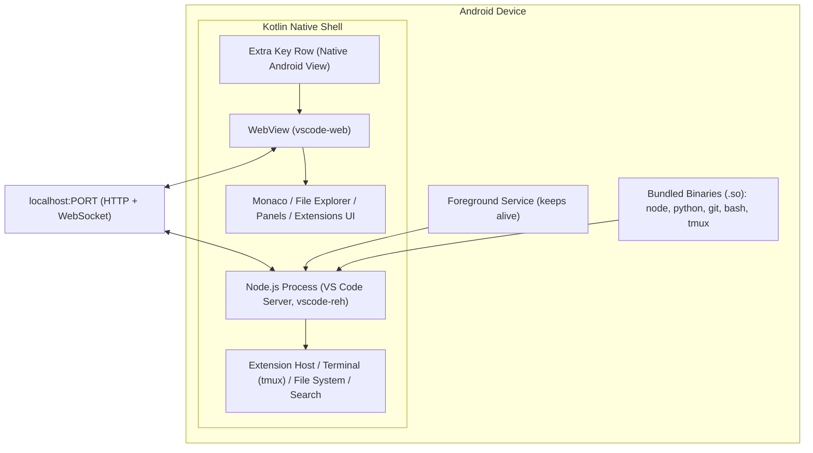

---

## 2. Architecture Principles

| Principle | Rationale |
|-----------|-----------|
| **Minimal modification to VS Code** | Less maintenance burden, easier to rebase on upstream updates |
| **Process isolation** | WebView renderer and Node.js are separate processes; one crashing doesn't kill the other |
| **Localhost-only communication** | No network exposure, no authentication needed, simplifies security |
| **Native shell for Android integration** | Kotlin handles platform-specific concerns (keyboard, clipboard, lifecycle) |
| **Lazy resource loading** | Language servers, extensions, toolchains loaded on-demand to minimize resource usage |
| **Graceful degradation** | App remains functional even if some components fail (e.g., extension marketplace offline) |

---

## 3. C4 Model

### 3.1 Level 1 — System Context

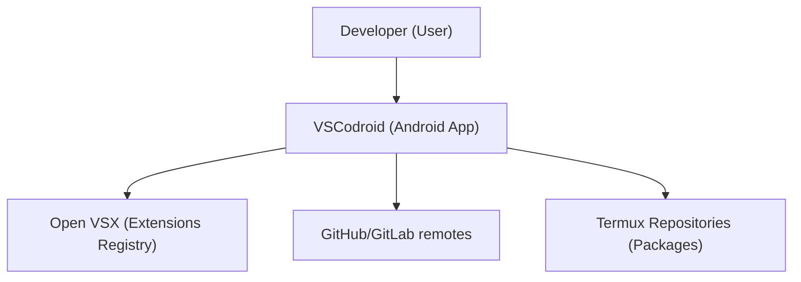

**External Systems:**
- **Open VSX**: Extension search, download, update (HTTPS)
- **GitHub/GitLab**: Remote git operations (HTTPS/SSH)
- **Termux Package Repository**: Additional tool downloads (sideload version only; Play Store version uses on-demand asset packs)

### 3.2 Level 2 — Container Diagram

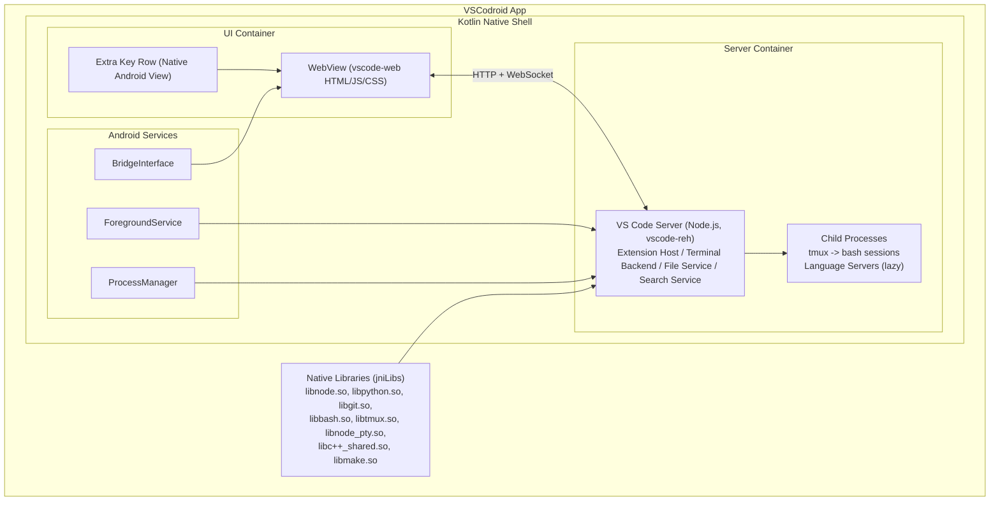

### 3.3 Level 3 — Component Diagram (Server Container)

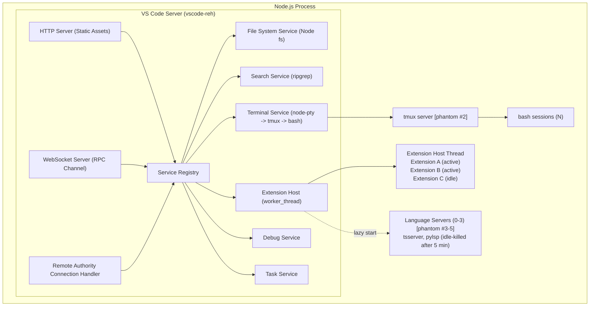

---

## 4. Key Architecture Decisions (ADRs)

### ADR-001: Fork code-server, not VS Code directly

**Status**: Accepted

**Context**: We need VS Code running as a web server on Android. VS Code itself doesn't include a web-serving layer.

**Decision**: Fork code-server which already patches VS Code to serve via HTTP/WebSocket.

**Rationale**:
- code-server maintains ~15-20 patches for web serving, marketplace, branding
- Saves 3-4 weeks of development
- Active upstream maintenance
- Well-documented patch system

**Trade-off**: Dependency on code-server's patch compatibility with VS Code updates.

---

### ADR-002: Termux-style Node.js binary, not nodejs-mobile

**Status**: Accepted

**Context**: Need Node.js on Android. Options: (a) nodejs-mobile (in-process), (b) Termux-style separate binary.

**Decision**: Use Termux-style separate ARM64 binary.

**Rationale**:
- nodejs-mobile lacks child_process.fork(), node-pty, worker_threads
- VS Code Extension Host requires child_process.fork() or worker_threads
- node-pty required for terminal (PTY allocation)
- Termux has proven this approach works for years

**Consequence**: Binary must be bundled as .so for Android W^X compliance. Adds ~50MB to APK.

---

### ADR-003: Open VSX instead of Microsoft Marketplace

**Status**: Accepted (legal requirement)

**Context**: VS Code extensions need a marketplace. Microsoft Marketplace ToS prohibits third-party access.

**Decision**: Use Open VSX (open-vsx.org).

**Rationale**:
- Microsoft Marketplace ToS Section 4: "only for use within Visual Studio products and services"
- Open VSX is open-source, Eclipse Foundation backed
- Most popular extensions available (some Microsoft-exclusive ones missing)
- Simple integration: just change product.json extensionsGallery URLs
- VSCodium uses the same approach since 2019

**Consequence**: Some Microsoft-exclusive extensions (e.g., Remote SSH, Live Share) won't be available.

---

### ADR-004: Extension Host as worker_thread

**Status**: Accepted

**Context**: VS Code Extension Host normally runs as a child process via child_process.fork(). Each child process counts toward Android's 32-process phantom limit.

**Decision**: Patch Extension Host to run as a worker_thread inside the main Node.js process. Phased rollout: child_process.fork() in M1-M3, migrate to worker_thread in M4.

**Rationale**:
- worker_thread = same process = not a phantom process
- Saves 1 phantom process slot (significant given 32 system limit)
- worker_threads have access to most Node.js APIs
- code-server already explored this direction

**Trade-off**: Extension Host crash could bring down the main server process. Mitigation: watchdog that restarts server if Extension Host thread crashes.

**Implementation note**: Patch details (target files, fork→worker mapping, restart semantics, validation tests) are specified in [Technical Spec §6.3 Extension Host worker_thread Migration](./04-TECHNICAL_SPEC.md#63-extension-host-worker_thread-migration).

---

### ADR-005: tmux for terminal multiplexing

**Status**: Accepted

**Context**: VS Code supports multiple terminal tabs. Each terminal would normally be a separate process (phantom).

**Decision**: Use tmux as a single process managing all terminal sessions.

**Rationale**:
- 1 tmux process + N sessions = only 1 phantom process
- Without tmux: N terminals = N bash processes = N phantoms
- tmux also provides session persistence (survive server restart)
- Proven technology, small binary (~500KB)

**Trade-off**: Added complexity in terminal management. Must map VS Code terminal tabs to tmux sessions.

---

### ADR-006: .so bundling for Android binary execution

**Status**: Accepted (platform requirement)

**Context**: Android 10+ enforces W^X (write-xor-execute). Cannot download and execute arbitrary binaries.

**Decision**: Bundle all executables as .so files in jniLibs/arm64-v8a/ directory.

**Rationale**:
- Android Package Manager extracts .so files with execute permission
- Only officially supported way to bundle executables since Android 10
- Termux, UserLAnd, and other apps use this approach
- Requires: Gradle `packagingOptions { jniLibs { useLegacyPackaging = true } }`

**Consequence**: All core binaries (Node.js, Python, Git, bash, tmux) bundled as .so files in the base APK. Additional toolchains (Go, Rust, Java, C/C++, Ruby) delivered as on-demand asset packs via Play Store — user selects desired languages during first-run Language Picker, Play Store downloads automatically. For sideloading (GitHub Releases APK), all toolchains are bundled directly.

---

### ADR-007: Standard Android WebView, not embedded Chromium

**Status**: Accepted

**Context**: Need a browser engine to render VS Code UI. Options: (a) System WebView, (b) Embedded Chromium (via Chrome Custom Tabs or bundled).

**Decision**: Use standard Android WebView.

**Rationale**:
- System WebView updates automatically via Play Store
- No additional binary size (Chromium adds 100MB+)
- WebView on Android is Chromium-based, supports all VS Code needs
- Minimum WebView 105+ covers all required APIs on Android 13+ baseline

**Trade-off**: Dependent on user's WebView version. Mitigation: runtime version check, graceful error if too old.

---

### ADR-008: Foreground Service with specialUse type

**Status**: Accepted

**Context**: Node.js server must keep running when app is backgrounded. Android aggressively kills background processes.

**Decision**: Use Foreground Service with `specialUse` type (Android 14+ requirement).

**Rationale**:
- Foreground Service prevents process killing
- `specialUse` type is correct for our use case (local dev server)
- Must provide justification to Play Store review: "Runs local development server for code editor"
- Shows persistent notification (expected for dev tool)

**Trade-off**: Notification always visible when server running. Acceptable for developer tool.

---

### ADR-009: Install-time Asset Packs for toolchains

**Status**: Accepted

**Context**: VSCodroid bundles multiple language toolchains (Go, Rust, Java, C/C++, Ruby). Bundling all in the base APK would make it very large. Options: (a) On-demand download from CDN, (b) Play Store install-time asset packs, (c) Play Store on-demand asset packs.

**Decision**: Use Play Store on-demand asset packs for toolchain delivery, with a Language Picker UI during first-run.

**Rationale**:
- On-demand packs keep base APK small (~150-200MB) for fast initial install
- User selects needed languages during first-run — only downloads what they need
- Play Store handles download/install automatically (no manual steps for user)
- Play Store optimizes delivery per device (only arm64 assets delivered)
- No custom CDN infrastructure needed for toolchain hosting
- All binaries delivered via Play Store, simplifying policy compliance
- Additional languages can be added later via Settings > Toolchains
- For sideloading (GitHub Releases), all toolchains bundled directly in APK

**Trade-off**: Requires internet for toolchain download after initial install. Core functionality (Node.js, Python, Git) works fully offline.

---

## 5. Communication Patterns

### 5.1 WebView ↔ VS Code Server

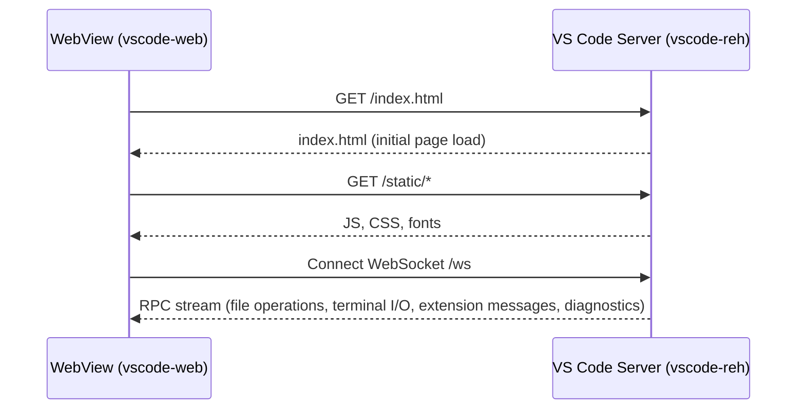

**Protocol**: VS Code's built-in `IExtHostRpcProtocol` over WebSocket. Binary frames for efficiency.

### 5.2 Kotlin ↔ WebView

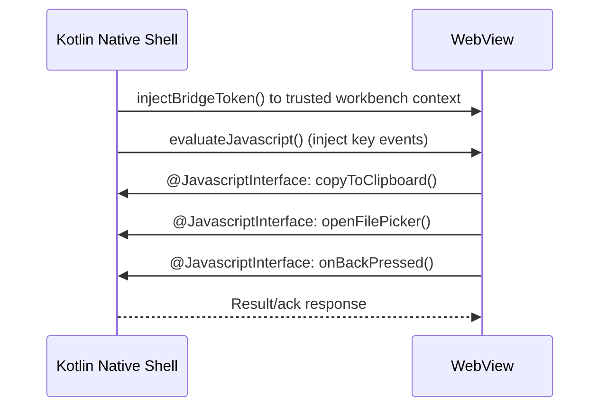

### 5.3 Kotlin ↔ Node.js

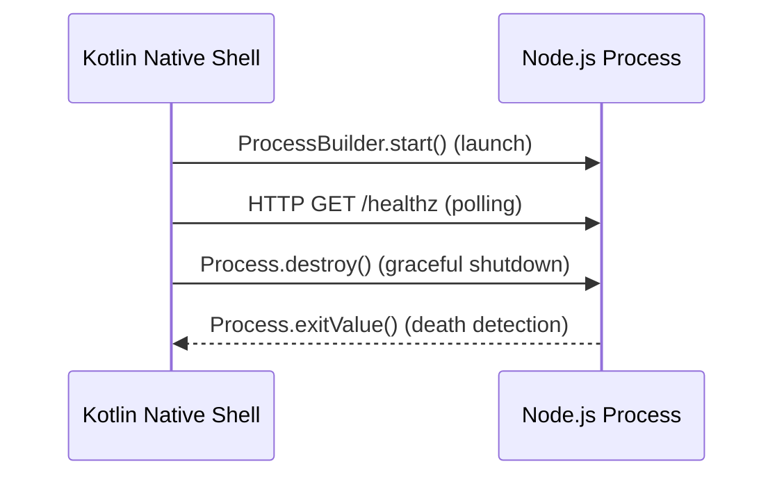

---

## 6. Data Flow

### 6.1 User Types Code → File Saved

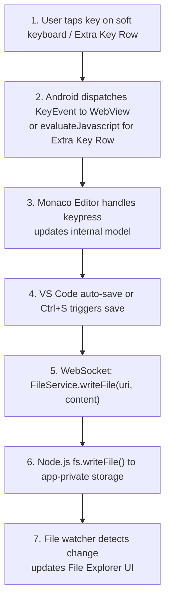

### 6.2 Extension Installation

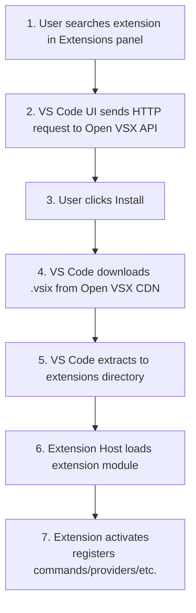

### 6.3 Terminal Command Execution

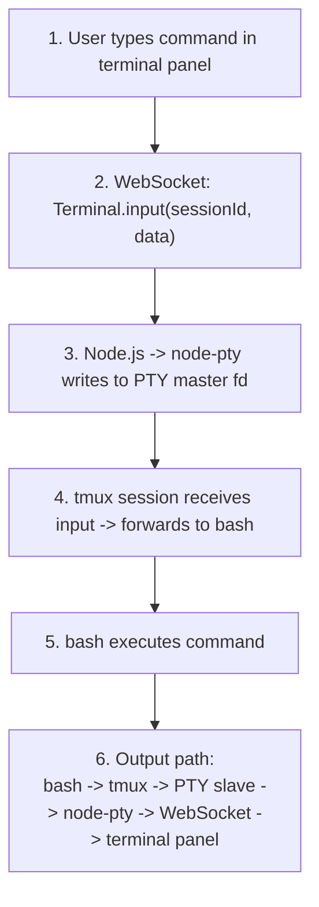

---

## 7. Deployment Architecture

### 7.1 APK/AAB Structure

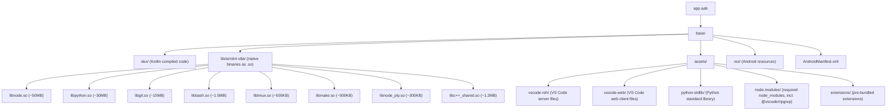

`ripgrep` delivery model: bundled inside VS Code server dependencies (`node_modules/@vscode/ripgrep`), extracted together with `vscode-reh`. It is not shipped as a separate `lib*.so` binary.

### 7.2 Runtime File Layout

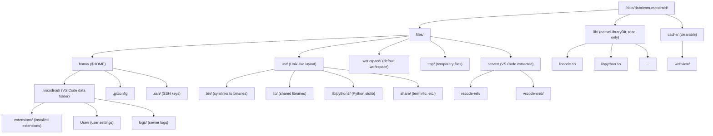

---

## 8. Cross-Cutting Concerns

### 8.1 Error Handling Strategy

| Layer | Strategy |
|-------|----------|
| Kotlin shell | Try-catch with user-facing error dialogs. Crash reporting. |
| WebView | onRenderProcessGone → recreate WebView, reload server URL |
| Node.js server | Process death → Kotlin detects via pid monitor → auto-restart |
| Extension Host | worker_thread crash → restart thread, reload extensions |
| Terminal | tmux session persistence → survive server restart |
| File operations | Node.js fs errors → propagate to VS Code UI as notifications |

### 8.2 Logging

| Component | Log Destination | Level |
|-----------|----------------|-------|
| Kotlin | Android Logcat (tag: VSCodroid) | INFO (release), DEBUG (debug) |
| Node.js server | File: ~/.vscodroid/logs/server.log | INFO |
| Extension Host | File: ~/.vscodroid/logs/exthost.log | WARN |
| WebView | Chrome DevTools (debug builds only) | ALL |

### 8.3 Configuration

| Config | Location | Format |
|--------|----------|--------|
| VS Code settings | ~/.vscodroid/User/settings.json | JSON |
| product.json | Built into vscode-web and vscode-reh assets | JSON |
| Environment variables | Set by Kotlin ProcessBuilder | Shell |
| App preferences | Android SharedPreferences | XML |

---

## 9. Technology Stack

| Layer | Technology | Version |
|-------|-----------|---------|
| Android app | Kotlin | 2.0+ |
| Build system | Gradle (Kotlin DSL) | 8.x |
| UI framework | Android View + WebView | API 33-36 |
| Node.js | Node.js LTS | 20.x (pinned at M0 start) |
| VS Code | Code-OSS (via code-server fork) | 1.96.x (pinned at M0 start) |
| Extension Host | VS Code Extension Host (child_process.fork initially, worker_thread in M4) | Same as VS Code |
| Terminal | node-pty + tmux + bash | Latest |
| Package manager | Custom (Termux repo compatible) | v1.0 |
| SCM | Git | 2.40+ |
| Python | Python 3 | 3.11+ |
| C++ stdlib | libc++ from NDK | r27 |
