# Architecture Design Document (ADD)

**Project**: VSCodroid
**Version**: 1.0-draft
**Date**: 2026-02-10
**Standard Reference**: IEEE 1016 (adapted), C4 Model

> **The code is the only authority; this document describes it.**
> The ADRs in §4 record the decisions the build actually implements. The server that ships is
> vanilla Code - OSS, built from the MIT `microsoft/vscode` source by `scripts/build-vscode-oss.sh`
> with the unified diffs in `patches/` applied before the build; app builds fetch the result with
> `scripts/fetch-vscode-oss.sh`. Where this document and the code disagree, the code wins: read
> those scripts and the sources under `android/app/src/main/kotlin/com/vscodroid/`, and verify
> against them.

---

## 1. Architecture Overview

VSCodroid follows a **local client-server architecture** where both the client (VS Code Web UI) and server (VS Code Server + Node.js) run on the same Android device, communicating over localhost.

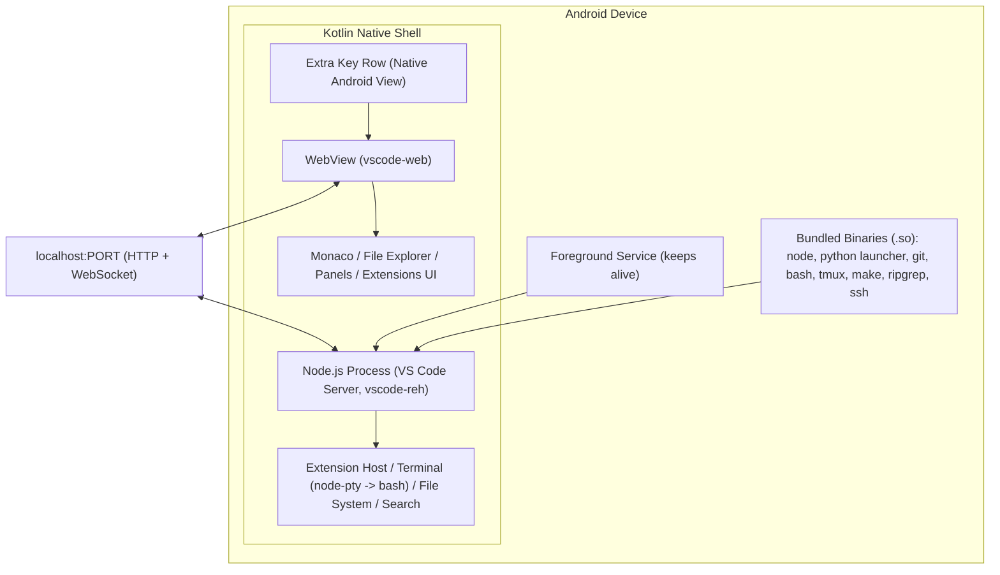
```mermaid
flowchart TD
  subgraph DEVICE["Android Device"]
    subgraph SHELL["Kotlin Native Shell"]
      WV["WebView (vscode-web)"]
      UI["Monaco / File Explorer / Panels / Extensions UI"]
      NODE["Node.js Process (VS Code Server, vscode-reh)"]
      SRV["Extension Host / Terminal (node-pty -> bash) / File System / Search"]
      EXTRA["Extra Key Row (Native Android View)"]
      WV --> UI
      NODE --> SRV
      EXTRA --> WV
    end
    FG["Foreground Service (keeps alive)"]
    BIN["Bundled Binaries (.so): node, python launcher, git, bash, tmux, make, ripgrep, ssh"]
  end

  WV <--> LOCAL["localhost:PORT (HTTP + WebSocket)"]
  LOCAL <--> NODE
  FG --> NODE
  BIN --> NODE
```

---

## 2. Architecture Principles

| Principle | Rationale |
|-----------|-----------|
| **Minimal modification to VS Code** | Less maintenance burden, easier to rebase on upstream updates |
| **Process isolation** | WebView renderer and Node.js are separate processes; one crashing doesn't kill the other |
| **Localhost-only communication** | No network exposure; the server still requires a connection token, because loopback is not isolated per app on Android |
| **Native shell for Android integration** | Kotlin handles platform-specific concerns (keyboard, clipboard, lifecycle) |
| **Lazy resource loading** | Language servers, extensions, toolchains loaded on-demand to minimize resource usage |
| **Graceful degradation** | App remains functional even if some components fail (e.g., extension marketplace offline) |

---

## 3. C4 Model

### 3.1 Level 1 — System Context

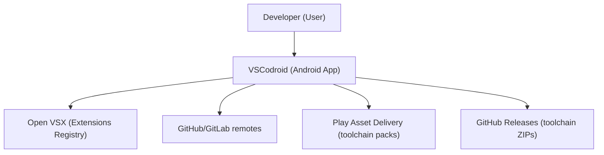
```mermaid
flowchart TD
  USER["Developer (User)"] --> APP["VSCodroid (Android App)"]
  APP --> OVSX["Open VSX (Extensions Registry)"]
  APP --> GIT["GitHub/GitLab remotes"]
  APP --> PAD["Play Asset Delivery (toolchain packs)"]
  APP --> REL["GitHub Releases (toolchain ZIPs)"]
```

**External Systems:**
- **Open VSX**: Extension search, download, update (HTTPS)
- **GitHub/GitLab**: Remote git operations (HTTPS/SSH)
- **Play Asset Delivery**: Ruby and Java 17 packs, for installs whose `installingPackageName` is `com.android.vending`
- **GitHub Releases**: the same two toolchains as ZIPs under `releases/latest`, for every other install source

Termux's package repository is a build-time source, not a runtime one: `scripts/download-node.sh`,
`download-python.sh` and `download-termux-tools.sh` fetch the runtime and the tools from it while the
APK is being built, and nothing in the app contacts it on device.

### 3.2 Level 2 — Container Diagram

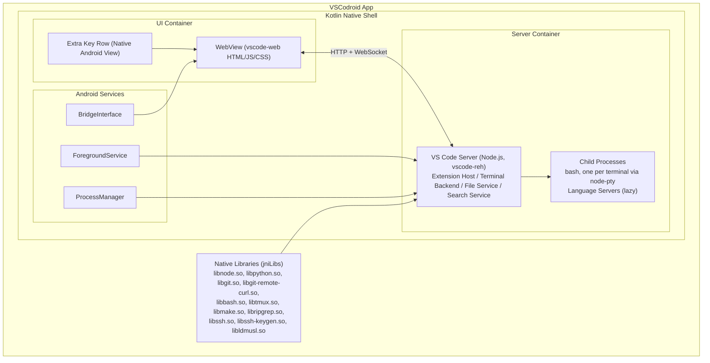
```mermaid
flowchart TD
  subgraph APP["VSCodroid App"]
    subgraph SHELL["Kotlin Native Shell"]
      subgraph UI["UI Container"]
        WEBVIEW["WebView (vscode-web HTML/JS/CSS)"]
        EXTRAROW["Extra Key Row (Native Android View)"]
      end

      subgraph SERVER["Server Container"]
        VSS["VS Code Server (Node.js, vscode-reh)<br/>Extension Host / Terminal Backend / File Service / Search Service"]
        CHILD["Child Processes<br/>bash, one per terminal via node-pty<br/>Language Servers (lazy)"]
      end

      subgraph SERVICES["Android Services"]
        FGSVC["ForegroundService"]
        PM["ProcessManager"]
        BRIDGE["BridgeInterface"]
      end
    end

    LIBS["Native Libraries (jniLibs)<br/>libnode.so, libpython.so, libgit.so, libgit-remote-curl.so,<br/>libbash.so, libtmux.so, libmake.so, libripgrep.so,<br/>libssh.so, libssh-keygen.so, libldmusl.so"]
  end

  EXTRAROW --> WEBVIEW
  WEBVIEW <-->|"HTTP + WebSocket"| VSS
  VSS --> CHILD
  FGSVC --> VSS
  PM --> VSS
  BRIDGE --> WEBVIEW
  LIBS --> VSS
```

### 3.3 Level 3 — Component Diagram (Server Container)

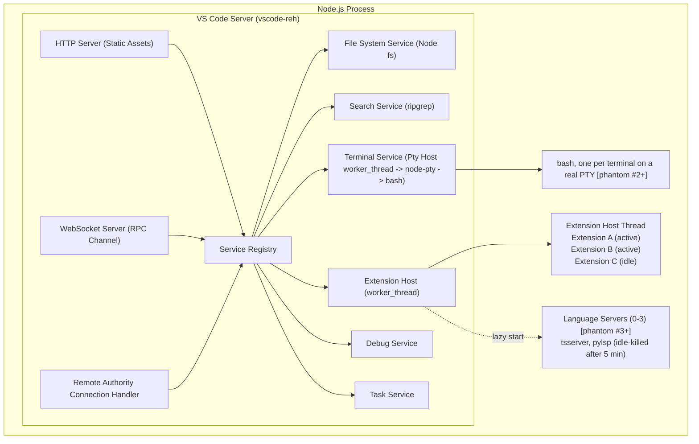
```mermaid
flowchart TD
  subgraph NODEPROC["Node.js Process"]
    subgraph VSS["VS Code Server (vscode-reh)"]
      HTTP["HTTP Server (Static Assets)"]
      WS["WebSocket Server (RPC Channel)"]
      RA["Remote Authority Connection Handler"]
      REG["Service Registry"]
      FS["File System Service (Node fs)"]
      SEARCH["Search Service (ripgrep)"]
      TERM["Terminal Service (Pty Host worker_thread -> node-pty -> bash)"]
      EXTHOST["Extension Host (worker_thread)"]
      DEBUG["Debug Service"]
      TASK["Task Service"]
      HTTP --> REG
      WS --> REG
      RA --> REG
      REG --> FS
      REG --> SEARCH
      REG --> TERM
      REG --> EXTHOST
      REG --> DEBUG
      REG --> TASK
    end

    EXTHOST --> THREAD["Extension Host Thread<br/>Extension A (active)<br/>Extension B (active)<br/>Extension C (idle)"]
    TERM --> BASH["bash, one per terminal on a real PTY [phantom #2+]"]
    EXTHOST -. lazy start .-> LS["Language Servers (0-3) [phantom #3+]<br/>tsserver, pylsp (idle-killed after 5 min)"]
  end
```

---

## 4. Key Architecture Decisions (ADRs)

### ADR-001: Build Code - OSS from the MIT source

**Status**: Accepted (legal requirement)

**Context**: We need VS Code running as a web server on Android. The MIT `microsoft/vscode` source carries that web-serving layer itself, as the `vscode-reh-web-linux-<arch>` build target. The pre-built server on Microsoft's update CDN is a different artifact under Microsoft's own licence terms, which do not permit modifying it and redistributing it inside an APK.

**Decision**: Build Code - OSS from the MIT source. `scripts/build-vscode-oss.sh` clones `github.com/microsoft/vscode` and checks out the commit in `VSCODE_COMMIT`, not the tag in `VSCODE_VERSION`: a tag can be moved, and a clone by tag would follow it without a word. `VSCODE_VERSION` records which tag that commit belonged to when it was pinned. The script then applies the numbered unified diffs in `patches/` with `git apply` and the product config in `branding/`, then runs `npm run gulp core-ci`, `npm run gulp compile-copilot-extension-build`, and the `vscode-reh-web-linux-<arch>-min-ci` packaging task. The tarball is published once per VS Code version as a `server-<version>` release, and every app build fetches it with `scripts/fetch-vscode-oss.sh`.

**Rationale**:
- The MIT source is the artifact we are free to modify and redistribute inside an APK
- Serving over HTTP and WebSocket is already what the reh-web target does, so nothing has to be added for it
- Patches are real unified diffs against readable source, and `git apply` fails loudly when one stops applying
- `scripts/check-patch-fingerprints.py` matches each patch against `patches/fingerprints.txt` in the packaged bundle, so a patch that applies but never reaches the output is caught; `fetch-vscode-oss.sh` runs the same check on what it downloads
- `scripts/verify-server-tree.py` refuses any tree carrying `node_modules/vsda`, which only Microsoft's own build has

**Trade-off**: A full build takes around half an hour on an arm64 runner (`.github/workflows/build-vscode-oss.yml`, dispatched by hand), and the patch set has to be rebased on every version bump. The runner architecture is not a preference: native modules are built for the build host, so an x86-64 tree builds green and then fails at exec on the device.

---

### ADR-002: Termux-style Node.js binary, not nodejs-mobile

**Status**: Accepted

**Context**: Need Node.js on Android. Options: (a) nodejs-mobile (in-process), (b) Termux-style separate binary.

**Decision**: Use Termux-style separate ARM64 binary.

**Rationale**:
- nodejs-mobile lacks child_process.fork(), node-pty, worker_threads
- VS Code Extension Host requires child_process.fork() or worker_threads
- node-pty required for terminal (PTY allocation)
- Termux has proven this approach works for years

**Consequence**: Binary must be bundled as .so for Android W^X compliance. Adds ~50MB to APK.

---

### ADR-003: Open VSX instead of Microsoft Marketplace

**Status**: Accepted (legal requirement)

**Context**: VS Code extensions need a marketplace. Microsoft Marketplace ToS prohibits third-party access.

**Decision**: Use Open VSX (open-vsx.org).

**Rationale**:
- Microsoft Marketplace ToS Section 4: "only for use within Visual Studio products and services"
- Open VSX is open-source, Eclipse Foundation backed
- Most popular extensions available (some Microsoft-exclusive ones missing)
- Simple integration: just change product.json extensionsGallery URLs
- VSCodium uses the same approach since 2019

**Consequence**: Some Microsoft-exclusive extensions (e.g., Remote SSH, Live Share) won't be available.

---

### ADR-004: Extension Host as worker_thread

**Status**: Accepted

**Context**: VS Code Extension Host normally runs as a child process via child_process.fork(). Each child process counts toward Android's 32-process phantom limit.

**Decision**: Patch Extension Host to run as a worker_thread inside the main Node.js process (`patches/0004-exthost-as-worker-thread.patch`). The Pty Host is taken off the same budget the same way (`patches/0003-ptyhost-as-worker-thread.patch`).

**Rationale**:
- worker_thread = same process = not a phantom process
- The two patches together save two permanent phantom slots, out of a system-wide 32
- worker_threads have access to most Node.js APIs, and `bootstrap-fork` installs `process.send` over `parentPort`, so the hosted module still sees the IPC channel it was written against
- The same file serves both shapes: in a real fork `isMainThread` is true and none of the bridge runs

**Trade-off**: An Extension Host crash can take the server process with it, and a worker cannot be handed a socket over IPC, so `_canSendSocket` is forced off and the host connects back over a named pipe that the server bridges. Reconnecting after a WebView recreation needs a fresh connection rather than a resumed one. Mitigation: the watchdog in `ProcessManager` restarts the server, and readiness is re-probed before the WebView is navigated.

**Implementation note**: `patches/0004` is the change itself, and what it does to the socket and the reconnection path is described in [Technical Spec §6.1 The Patch Set](./04-TECHNICAL_SPEC.md#61-the-patch-set) alongside `patches/0003`, which does the same for the Pty Host.

---

### ADR-005: bash directly through node-pty for terminals

**Status**: Accepted

**Context**: VS Code supports multiple terminal tabs, and every terminal process counts toward Android's 32-process phantom limit. The limit has to be respected without changing what a terminal is.

**Decision**: Each VS Code terminal spawns bash directly through node-pty on a real PTY (`/dev/pts/*`). `FirstRunSetup` writes a single `bash` profile into the default settings, with `terminal.integrated.defaultProfile.linux` set to `bash` and its `path` taken from `Environment.getTerminalShellPath`. The phantom budget is held down instead by hosting the Extension Host and the Pty Host as worker threads (patches `0003` and `0004`), which are threads rather than processes and so cost nothing against it. tmux stays bundled as a standalone tool a user can run from a terminal; nothing in the terminal path goes through it.

**Rationale**:
- A real PTY is what job control, `isatty`, resize signals and shell integration all need; anything layered in front of bash is another thing that can break them
- The two worker-thread patches remove two guaranteed phantoms, which is the same saving a multiplexer was meant to buy, without touching the terminal path
- Terminals are opened a few at a time in practice, and idle language servers are reclaimed by `process-monitor.js`, so bash processes are not what pushes the count toward the limit
- VS Code's terminal profiles map cleanly onto one shell per tab, so nothing has to translate tab lifecycle into session lifecycle

**Trade-off**: N terminals are N bash processes, so a user who opens many tabs spends phantom slots on them. tmux is available to anyone who wants session persistence, as an explicit choice rather than a layer under every tab.

---

### ADR-006: .so bundling for Android binary execution

**Status**: Accepted (platform requirement)

**Context**: Android 10+ enforces W^X (write-xor-execute). Cannot download and execute arbitrary binaries.

**Decision**: Bundle all executables as .so files in jniLibs/arm64-v8a/ directory.

**Rationale**:
- Android Package Manager extracts .so files with execute permission
- Only officially supported way to bundle executables since Android 10
- Termux, UserLAnd, and other apps use this approach
- Requires: Gradle `packagingOptions { jniLibs { useLegacyPackaging = true } }`

**Consequence**: All core binaries (Node.js, Python, Git, bash, tmux, make, ripgrep, ssh) bundled as .so files in the base APK. The two on-demand toolchains, Ruby and Java 17, are delivered as asset packs via Play Store; the user picks them in the first-run toolchain picker (`SplashActivity.showToolchainPicker()`, shown once) and Play Store downloads them automatically. Toolchains are never inside the APK on any channel: `ToolchainManager.install()` picks a delivery path at runtime, and both paths converge on `installFromDirectory()`, which copies the payload into `filesDir/usr`, chmods the binaries its manifest names, and creates its symlinks, so installed toolchains survive app updates.

---

### ADR-007: Standard Android WebView, not embedded Chromium

**Status**: Accepted

**Context**: Need a browser engine to render VS Code UI. Options: (a) System WebView, (b) Embedded Chromium (via Chrome Custom Tabs or bundled).

**Decision**: Use standard Android WebView.

**Rationale**:
- System WebView updates automatically via Play Store
- No additional binary size (Chromium adds 100MB+)
- WebView on Android is Chromium-based, supports all VS Code needs
- Minimum WebView 105+ covers all required APIs on Android 13+ baseline

**Trade-off**: Dependent on user's WebView version. Mitigation: runtime version check, graceful error if too old.

---

### ADR-008: Foreground Service with specialUse type

**Status**: Accepted

**Context**: Node.js server must keep running when app is backgrounded. Android aggressively kills background processes.

**Decision**: Use Foreground Service with `specialUse` type (Android 14+ requirement).

**Rationale**:
- Foreground Service prevents process killing
- `specialUse` type is correct for our use case (local dev server)
- Must provide justification to Play Store review: "Runs local development server for code editor"
- Shows persistent notification (expected for dev tool)

**Trade-off**: Notification always visible when server running. Acceptable for developer tool.

---

### ADR-009: On-demand Asset Packs for toolchains

**Status**: Accepted

**Context**: VSCodroid offers language toolchains beyond the bundled core: Ruby and Java 17. Putting them in the base APK would make it very large, and most users want at most one of them. Options: (a) On-demand download from CDN, (b) Play Store install-time asset packs, (c) Play Store on-demand asset packs.

**Decision**: Use Play Store on-demand asset packs for toolchain delivery, with a toolchain picker UI during first-run.

**Rationale**:
- On-demand packs keep base APK small (~150-200MB) for fast initial install
- User selects needed languages during first-run, so only what they ask for is downloaded
- `android/toolchain_ruby/build.gradle.kts` and `android/toolchain_java/build.gradle.kts` each declare `dynamicDelivery { deliveryType.set("on-demand") }`, and `ToolchainRegistry.available` is the single list the picker and the manage screen read
- Play Store handles download/install automatically (no manual steps for user)
- Play Store optimizes delivery per device (only arm64 assets delivered)
- No custom CDN infrastructure needed for toolchain hosting
- All binaries delivered via Play Store, simplifying policy compliance
- Additional languages can be added later by long-pressing the launcher icon and choosing **Manage
  toolchains**. There is no Settings entry: `ToolchainActivity` is not exported and the launcher
  shortcut `SplashActivity.publishToolchainShortcut()` pushes is the only route to it
- Sideloads are served by the same registry rather than by the APK: `ToolchainManager.shouldUseHttpFallback()` reads `getInstallSourceInfo().installingPackageName`, and anything other than `com.android.vending` sends `install()` into `downloadViaHttp()`, which fetches the `releases/latest` ZIP that `ToolchainRegistry` records as each entry's `downloadUrl`. `ToolchainManager.pinLatest` resolves that URL before the transfer: this build's own `releases/download/v<versionName>/` asset when the release publishes it, otherwise the tag `releases/latest` currently redirects to, and the unpinned `latest` URL if neither can be resolved. Pinning is what keeps a ZIP and the `toolchains.sha256` it is checked against from coming out of two different releases

**Trade-off**: Requires internet for toolchain download after initial install. Core functionality (Node.js, Python, Git) works fully offline.

---

## 5. Communication Patterns

### 5.1 WebView ↔ VS Code Server

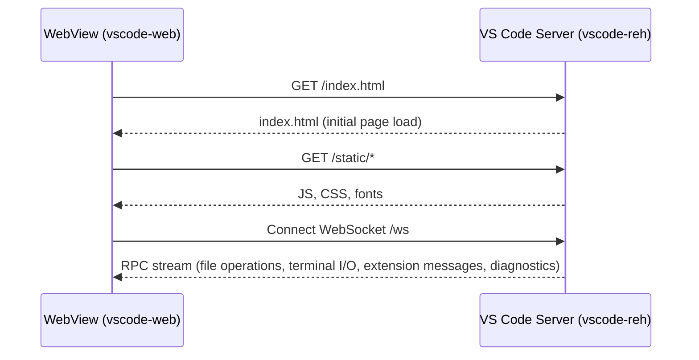
```mermaid
sequenceDiagram
  participant W as WebView (vscode-web)
  participant S as VS Code Server (vscode-reh)
  W->>S: GET /index.html
  S-->>W: index.html (initial page load)
  W->>S: GET /static/*
  S-->>W: JS, CSS, fonts
  W->>S: Connect WebSocket /ws
  S-->>W: RPC stream (file operations, terminal I/O, extension messages, diagnostics)
```

**Protocol**: VS Code's built-in `IExtHostRpcProtocol` over WebSocket. Binary frames for efficiency.

### 5.2 Kotlin ↔ WebView

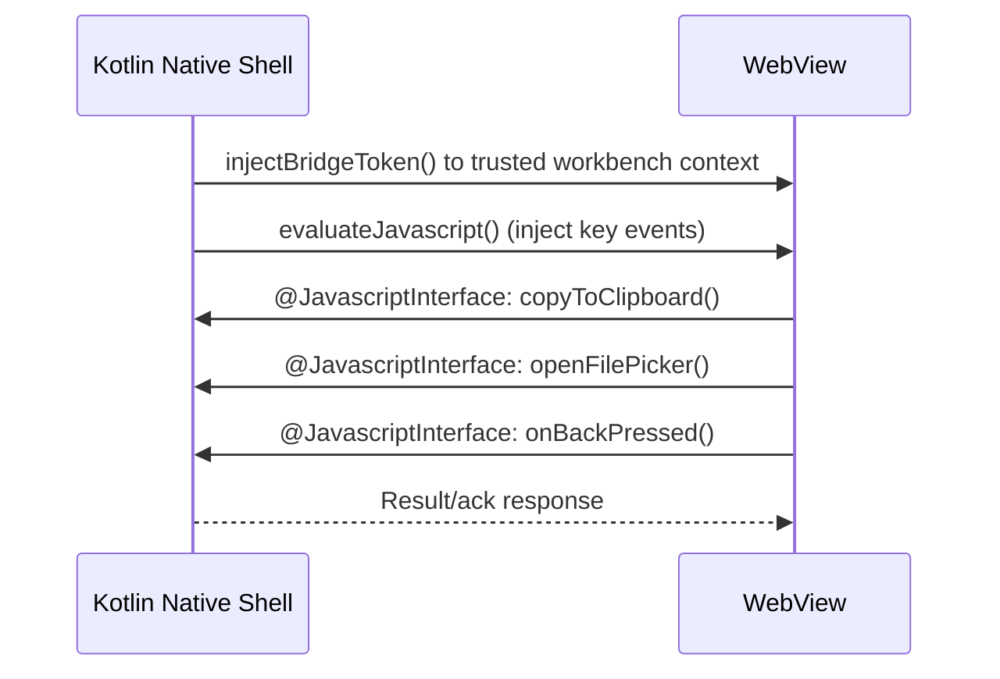
```mermaid
sequenceDiagram
  participant K as Kotlin Native Shell
  participant W as WebView
  K->>W: injectBridgeToken() to trusted workbench context
  K->>W: evaluateJavascript() (inject key events)
  W->>K: @JavascriptInterface: copyToClipboard()
  W->>K: @JavascriptInterface: openFilePicker()
  W->>K: @JavascriptInterface: onBackPressed()
  K-->>W: Result/ack response
```

### 5.3 Kotlin ↔ Node.js

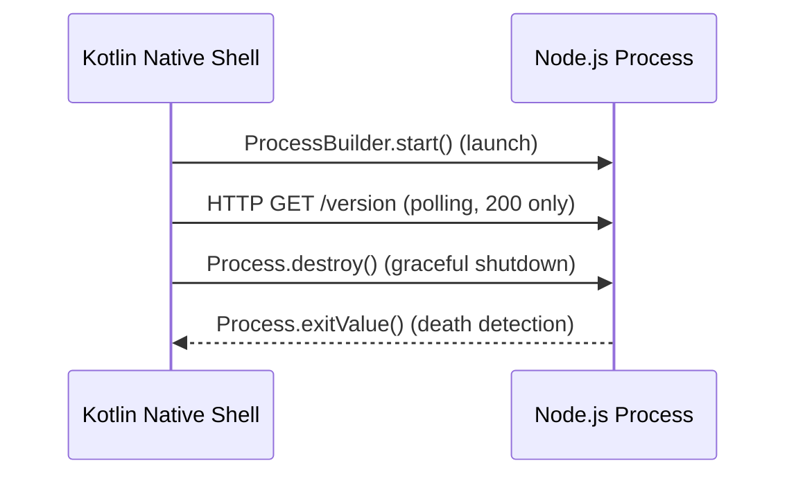
```mermaid
sequenceDiagram
  participant K as Kotlin Native Shell
  participant N as Node.js Process
  K->>N: ProcessBuilder.start() (launch)
  K->>N: HTTP GET /version (polling, 200 only)
  K->>N: Process.destroy() (graceful shutdown)
  N-->>K: Process.exitValue() (death detection)
```

---

## 6. Data Flow

### 6.1 User Types Code → File Saved

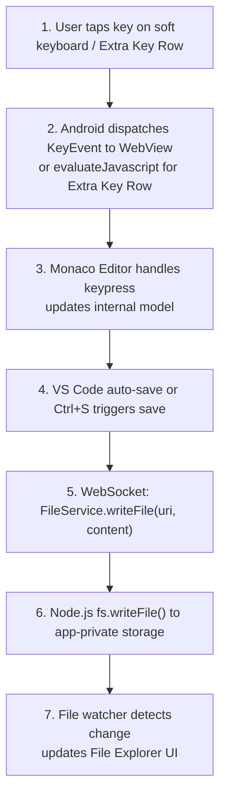
```mermaid
flowchart TD
  A["1. User taps key on soft keyboard / Extra Key Row"] --> B["2. Android dispatches KeyEvent to WebView<br/>or evaluateJavascript for Extra Key Row"]
  B --> C["3. Monaco Editor handles keypress<br/>updates internal model"]
  C --> D["4. VS Code auto-save or Ctrl+S triggers save"]
  D --> E["5. WebSocket: FileService.writeFile(uri, content)"]
  E --> F["6. Node.js fs.writeFile() to app-private storage"]
  F --> G["7. File watcher detects change<br/>updates File Explorer UI"]
```

### 6.2 Extension Installation

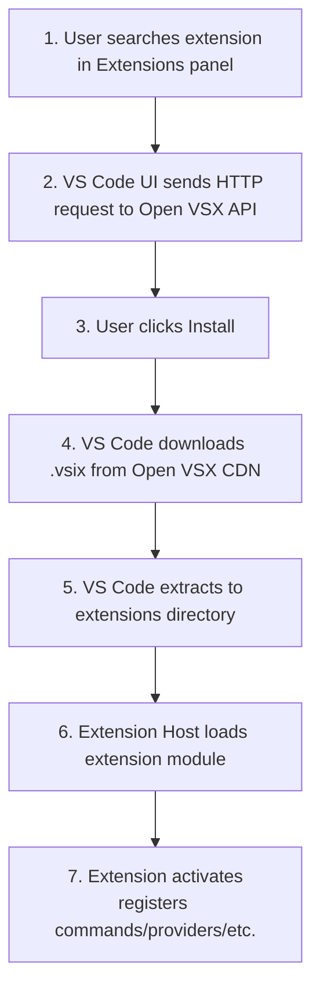
```mermaid
flowchart TD
  A["1. User searches extension in Extensions panel"] --> B["2. VS Code UI sends HTTP request to Open VSX API"]
  B --> C["3. User clicks Install"]
  C --> D["4. VS Code downloads .vsix from Open VSX CDN"]
  D --> E["5. VS Code extracts to extensions directory"]
  E --> F["6. Extension Host loads extension module"]
  F --> G["7. Extension activates<br/>registers commands/providers/etc."]
```

### 6.3 Terminal Command Execution

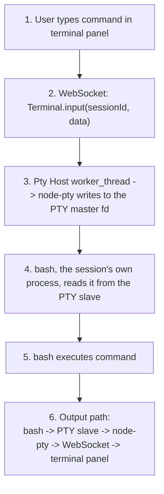
```mermaid
flowchart TD
  A["1. User types command in terminal panel"] --> B["2. WebSocket: Terminal.input(sessionId, data)"]
  B --> C["3. Pty Host worker_thread -> node-pty writes to the PTY master fd"]
  C --> D["4. bash, the session's own process, reads it from the PTY slave"]
  D --> E["5. bash executes command"]
  E --> F["6. Output path:<br/>bash -> PTY slave -> node-pty -> WebSocket -> terminal panel"]
```

---

## 7. Deployment Architecture

### 7.1 APK/AAB Structure

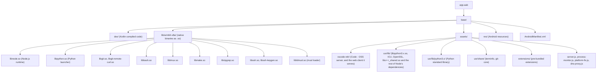
```mermaid
flowchart TD
  A["app.aab"] --> B["base/"]
  B --> C["dex/ (Kotlin compiled code)"]
  B --> D["lib/arm64-v8a/ (native binaries as .so)"]
  D --> D1["libnode.so (Node.js runtime)"]
  D --> D2["libpython.so (Python launcher)"]
  D --> D3["libgit.so, libgit-remote-curl.so"]
  D --> D4["libbash.so"]
  D --> D5["libtmux.so"]
  D --> D6["libmake.so"]
  D --> D7["libripgrep.so"]
  D --> D8["libssh.so, libssh-keygen.so"]
  D --> D9["libldmusl.so (musl loader)"]
  B --> E["assets/"]
  E --> E1["vscode-reh/ (Code - OSS server, and the web client it serves)"]
  E --> E2["usr/lib/ (libpython3.x.so, ICU, OpenSSL, libc++_shared.so and the rest of Node's dependencies)"]
  E --> E3["usr/lib/python3.x/ (Python standard library)"]
  E --> E4["usr/share/ (terminfo, git-core)"]
  E --> E5["extensions/ (pre-bundled extensions)"]
  E --> E6["server.js, process-monitor.js, platform-fix.js, dns-proxy.js"]
  B --> F["res/ (Android resources)"]
  B --> G["AndroidManifest.xml"]
```

Sizes move with every rebuild, so read them rather than a document:
`ls -la android/app/src/main/jniLibs/arm64-v8a/` and `ls -la android/app/src/main/assets/usr/lib/`.

Native Node addons (`pty.node`, `watcher.node`, `vscode-sqlite3`) ship inside
`assets/vscode-reh/node_modules`, not as `lib*.so` in `jniLibs`: SELinux refuses `execve` under the
app data directory but still allows `dlopen`, so an addon loaded from `filesDir` works.

`ripgrep` is bundled as `libripgrep.so` in `jniLibs`. The Search service looks for it under
`node_modules/@vscode/ripgrep/bin/rg`, so `FirstRunSetup.setupRipgrepVscodeSymlink()` creates that
link (and the `@vscode/ripgrep-universal` one) pointing at the `.so`, on every launch, because a
reinstall moves `nativeLibraryDir` and dangles it.

### 7.2 Runtime File Layout

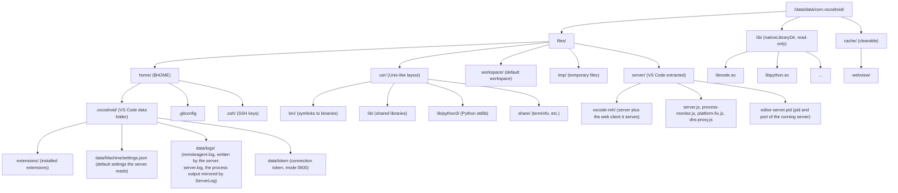
```mermaid
flowchart TD
  A["/data/data/com.vscodroid/"] --> B["files/"]
  B --> B1["home/ ($HOME)"]
  B1 --> B1a[".vscodroid/ (VS Code data folder)"]
  B1a --> B1a1["extensions/ (installed extensions)"]
  B1a --> B1a2["data/Machine/settings.json (default settings the server reads)"]
  B1a --> B1a3["data/logs/ (remoteagent.log, written by the server;<br/>server.log, the process output mirrored by ServerLog)"]
  B1a --> B1a4["data/token (connection token, mode 0600)"]
  B1 --> B1b[".gitconfig"]
  B1 --> B1c[".ssh/ (SSH keys)"]
  B --> B2["usr/ (Unix-like layout)"]
  B2 --> B2a["bin/ (symlinks to binaries)"]
  B2 --> B2b["lib/ (shared libraries)"]
  B2 --> B2c["lib/python3/ (Python stdlib)"]
  B2 --> B2d["share/ (terminfo, etc.)"]
  B --> B3["workspace/ (default workspace)"]
  B --> B4["tmp/ (temporary files)"]
  B --> B5["server/ (VS Code extracted)"]
  B5 --> B5a["vscode-reh/ (server plus the web client it serves)"]
  B5 --> B5b["server.js, process-monitor.js, platform-fix.js, dns-proxy.js"]
  B5 --> B5c["editor-server.pid (pid and port of the running server)"]
  A --> C["lib/ (nativeLibraryDir, read-only)"]
  C --> C1["libnode.so"]
  C --> C2["libpython.so"]
  C --> C3["..."]
  A --> D["cache/ (clearable)"]
  D --> D1["webview/"]
```

---

## 8. Cross-Cutting Concerns

### 8.1 Error Handling Strategy

| Layer | Strategy |
|-------|----------|
| Kotlin shell | Try-catch with user-facing error dialogs. Crash reporting. |
| WebView | onRenderProcessGone → recreate WebView, reload server URL |
| Node.js server | Process death → Kotlin detects via pid monitor → auto-restart |
| Extension Host | worker_thread crash → restart thread, reload extensions |
| Terminal | bash exit or PTY failure → the tab reports it; one session per bash, so a failed one leaves the others running |
| File operations | Node.js fs errors → propagate to VS Code UI as notifications |

### 8.2 Logging

Everything the Kotlin side logs ends up in Logcat, and every tag is `VSCodroid.<class>`:
`Logger` prepends that prefix to the per-class tag it is handed, so nothing is ever logged
under the bare `VSCodroid`. Filter on a full tag, for example
`adb logcat -s VSCodroid.ProcessManager`.

| Component | Log Destination | Level |
|-----------|----------------|-------|
| Kotlin | Logcat, tag `VSCodroid.<class>` (`VSCodroid.MainActivity`, `VSCodroid.ProcessManager`, and so on) | INFO (release), DEBUG (debug) |
| Node.js server | stdout with stderr merged into it, read by `ProcessManager.startOutputReader`, which both re-logs each line as `[node] ...` under `VSCodroid.ProcessManager` and appends it to `server.log` through `ServerLog` | the Logcat copy is DEBUG, so debug builds only; the `server.log` copy is written in every build |
| Extension Host | worker_thread inside the server process (patch `0004`); `ExtensionHostConnection` pipes the worker's stdout and stderr into the server's log service, which writes them to `remoteagent.log` and prints them on the server console, from where the row above carries them into Logcat | INFO into `remoteagent.log` in every build; the Logcat copy is DEBUG, arriving as `[node]` lines |
| WebView | `VSCodroidWebChromeClient.onConsoleMessage` mirrors every console message into Logcat under `VSCodroid.WebChromeClient`; Chrome DevTools additionally attaches on debug builds | ERROR and WARNING in every build, everything else DEBUG |

`server.log` is written, `exthost.log` is not. `ProcessManager` holds a `ServerLog` over
`Environment.getLogsDir` (`filesDir/home/.vscodroid/data/logs`) and appends every line
`startOutputReader` receives to it, in every build rather than only in a debug one: the
Logcat copy above is `Logger.d` and therefore nowhere in a release build, which is why the
same line is also kept on disk. The token is replaced on the way in, and the file is
rotated to its last lines once it outgrows a byte cap, so it cannot grow without bound.
`CrashReporter.generateBugReport` appends the last 200 lines of it to every report.

That directory holds more than this app writes: `ProcessManager.startServer` points the
server's `--logsPath` at it, and the server's own log service writes `remoteagent.log`
there, Extension Host output included. Nothing writes `exthost.log` under any name.

### 8.3 Configuration

| Config | Location | Format |
|--------|----------|--------|
| VS Code settings | ~/.vscodroid/data/Machine/settings.json (the server rewrites `--user-data-dir` to `<server-data-dir>/data`, and only remote-machine scopes are read from it) | JSON |
| product.json | `vscode-reh/product.json`, rewritten by `server.js` on every start from its `productOverrides` | JSON |
| Environment variables | Set by Kotlin ProcessBuilder | Shell |
| App preferences | Android SharedPreferences | XML |

---

## 9. Technology Stack

| Layer | Technology | Version |
|-------|-----------|---------|
| Android app | Kotlin, compiled to JVM target 17 | The version AGP 9.3.1 brings (`agp` in `android/gradle/libs.versions.toml`) |
| Build system | Gradle (Kotlin DSL), pinned by the wrapper | 9.5.1 (`android/gradle/wrapper/gradle-wrapper.properties`) |
| UI framework | Android View + WebView | API 33-36 |
| Node.js | Node.js from Termux's `nodejs-lts` package, installed as `libnode.so` by `scripts/download-node.sh` | 24.18.0, the version `remote/.npmrc` `target` names at the pinned VS Code tag |
| VS Code | Code - OSS, built from MIT source with the diffs in `patches/` | 1.133.0 (pinned in the `VSCODE_VERSION` file at the repo root) |
| Extension Host | VS Code Extension Host as a worker_thread (patch `0004`); the Pty Host likewise (patch `0003`) | Same as VS Code |
| Terminal | node-pty spawning bash on a real PTY (tmux bundled as a standalone tool) | Latest |
| Toolchain delivery | Play Asset Delivery packs, or `releases/latest` ZIPs for non-Play installs | Ruby, Java 17 |
| SCM | Git from Termux, as `libgit.so` and `libgit-remote-curl.so` plus `usr/lib/git-core` | Whatever the Termux index names at build time |
| Python | Python 3 from Termux, fetched by `scripts/download-python.sh` | Whatever the Termux index names at build time; read it from `assets/usr/lib/libpython*.so` |
| C++ stdlib | `libc++_shared.so` from Termux's `libc++` package, in `assets/usr/lib` | Whatever `scripts/download-termux-tools.sh` resolves |
