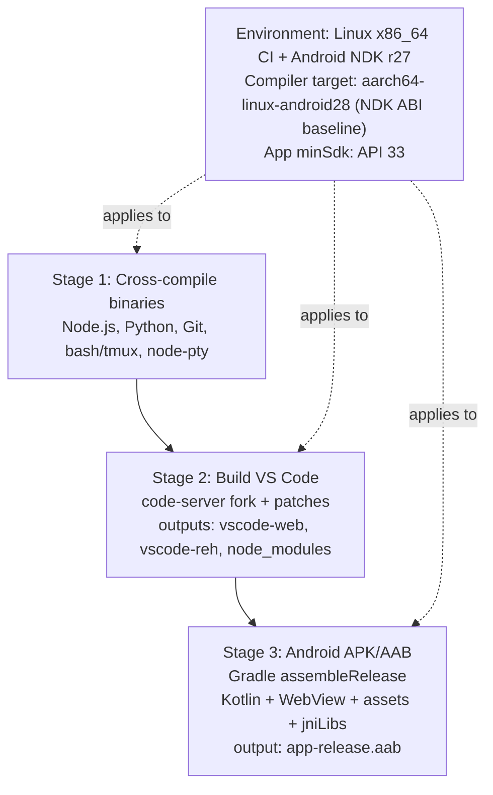
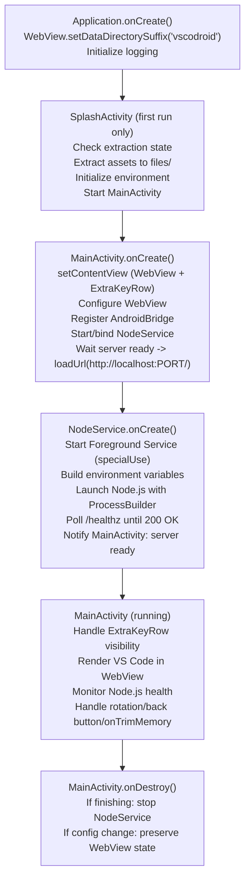
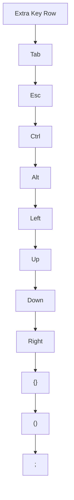
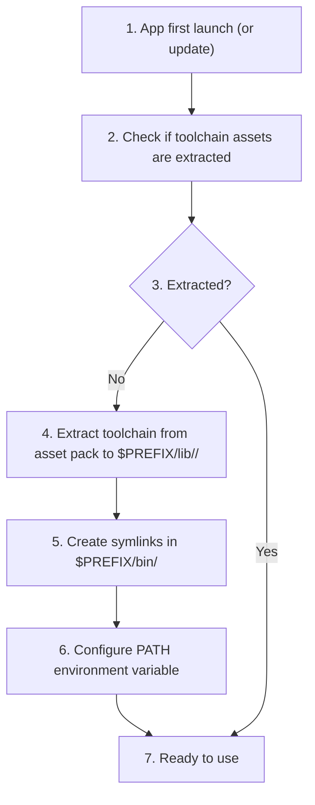

# Technical Specification

**Project**: VSCodroid
**Version**: 1.0-draft
**Date**: 2026-02-10

---

## 1. Build System

### 1.1 Overall Build Pipeline



### 1.2 Node.js Cross-Compilation

**Source**: Node.js LTS (e.g., v20.x), patched with Termux patches

**Toolchain**:

```
NDK_PATH=$ANDROID_NDK_HOME/toolchains/llvm/prebuilt/linux-x86_64
CC=$NDK_PATH/bin/aarch64-linux-android28-clang
CXX=$NDK_PATH/bin/aarch64-linux-android28-clang++
AR=$NDK_PATH/bin/llvm-ar
RANLIB=$NDK_PATH/bin/llvm-ranlib
```

**Configure flags**:

```bash
./configure \
  --dest-cpu=arm64 \
  --dest-os=android \
  --cross-compiling \
  --partly-static \
  --with-intl=small-icu \
  --openssl-no-asm \
  --without-inspector \
  --without-node-snapshot \
  --shared-zlib \
  --prefix=/data/data/com.vscodroid/files/usr
```

**Post-build**:

```bash
# Strip debug symbols
aarch64-linux-android-strip --strip-unneeded out/Release/node

# Rename for .so trick
cp out/Release/node app/src/main/jniLibs/arm64-v8a/libnode.so

# Verify
file libnode.so  # ELF 64-bit LSB pie executable, ARM aarch64
```

**16KB page alignment** (Android 16):

```bash
# Add to configure/build flags
LDFLAGS="-Wl,-z,max-page-size=16384"
```

### 1.3 Python Cross-Compilation

**Source**: CPython 3.11+, Termux build recipes as reference

**Key considerations**:

- Cross-compile with android-ndk toolchain
- Bundle python3 binary + lib/python3.11/ stdlib
- Include pip via ensurepip
- Strip .pyc files for size reduction
- Bundle as libpython.so (binary) + assets/python-stdlib/ (stdlib)

### 1.4 node-pty Cross-Compilation

**Source**: node-pty npm package

**Build**:

```bash
# node-gyp cross-compile
node-gyp rebuild \
  --target=20.0.0 \
  --arch=arm64 \
  --nodedir=/path/to/node-source \
  CC=$NDK_CC CXX=$NDK_CXX

# Output: build/Release/pty.node
cp build/Release/pty.node app/src/main/jniLibs/arm64-v8a/libnode_pty.so
```

### 1.5 code-server Build (VS Code)

**Process**:

```bash
# 1. Clone code-server fork
git clone https://github.com/rmyndharis/code-server.git
cd code-server

# 2. Apply code-server patches to VS Code
./ci/dev/patch-vscode.sh

# 3. Apply VSCodroid-specific patches
for patch in patches/vscodroid/*.diff; do
  git -C lib/vscode apply "$patch"
done

# 4. Build web client
cd lib/vscode
yarn gulp vscode-web-min

# 5. Build remote extension host (server)
yarn gulp vscode-reh-min

# 6. Output directories
# lib/vscode/out-vscode-web/     → assets/vscode-web/
# lib/vscode/out-vscode-reh/     → assets/vscode-reh/
# lib/vscode/node_modules/@vscode/ripgrep/bin/rg  → bundled inside vscode-reh assets
```

**Note on ripgrep delivery**: VS Code search requires ripgrep for file search. The build script (`download-vscode-server.sh`) extracts the ARM64 `rg` binary from `@vscode/ripgrep` in `node_modules` (or downloads it from [microsoft/ripgrep-prebuilt](https://github.com/microsoft/ripgrep-prebuilt)) and bundles it as `libripgrep.so` in `jniLibs/arm64-v8a/`. A symlink `rg → libripgrep.so` is created at first run.

### 1.6 Git Cross-Compilation

**Source**: Git 2.40+ (Termux recipes as baseline)

**Toolchain**:

```bash
CC=$NDK_PATH/bin/aarch64-linux-android28-clang
AR=$NDK_PATH/bin/llvm-ar
RANLIB=$NDK_PATH/bin/llvm-ranlib
```

**Configure/build**:

```bash
make configure
./configure \
  --host=aarch64-linux-android \
  --prefix=/data/data/com.vscodroid/files/usr \
  ac_cv_fread_reads_directories=no \
  ac_cv_snprintf_returns_bogus=no

make -j$(nproc) NO_GETTEXT=YesPlease NO_TCLTK=YesPlease
make install
```

**Output artifacts**:

- `libgit.so` (main git executable via `.so` trick)
- `usr/lib/git-core/*` helper binaries

### 1.7 Bash Cross-Compilation

**Source**: bash 5.x (Termux-compatible patches)

**Configure/build**:

```bash
./configure \
  --host=aarch64-linux-android \
  --prefix=/data/data/com.vscodroid/files/usr \
  --without-bash-malloc

make -j$(nproc)
make install
```

**Output artifacts**:

- `libbash.so`
- `usr/share/bash/*` runtime files

### 1.8 tmux Cross-Compilation

**Source**: tmux 3.x

**Dependencies**:

- `libevent` (cross-compiled)
- `ncurses`/terminfo data

**Configure/build**:

```bash
./configure \
  --host=aarch64-linux-android \
  --prefix=/data/data/com.vscodroid/files/usr \
  CFLAGS="-I$PREFIX/include" \
  LDFLAGS="-L$PREFIX/lib"

make -j$(nproc)
make install
```

**Output artifacts**:

- `libtmux.so`
- `usr/share/terminfo/*`

### 1.9 make Cross-Compilation

**Source**: GNU make 4.x

**Configure/build**:

```bash
./configure \
  --host=aarch64-linux-android \
  --prefix=/data/data/com.vscodroid/files/usr

make -j$(nproc)
make install
```

**Output artifacts**:

- `libmake.so`

### 1.10 Gradle Build Configuration

```kotlin
// app/build.gradle.kts
android {
    namespace = "com.vscodroid"
    compileSdk = 36

    defaultConfig {
        applicationId = "com.vscodroid"
        minSdk = 33
        targetSdk = 36
        versionCode = 1
        versionName = "1.0.0"

        ndk {
            abiFilters += "arm64-v8a"
        }
    }

    packaging {
        jniLibs {
            useLegacyPackaging = true  // CRITICAL: preserves .so in APK
        }
    }

    buildTypes {
        release {
            isMinifyEnabled = true
            isShrinkResources = true
            proguardFiles(
                getDefaultProguardFile("proguard-android-optimize.txt"),
                "proguard-rules.pro"
            )
        }
    }
}
```

---

## 2. Android Application Architecture

### 2.1 Component Structure

```mermaid
flowchart TD
  ROOT["com.vscodroid/"] --> APP["app/"]
  APP --> A1["VSCodroidApp.kt (Application class)"]
  APP --> A2["MainActivity.kt (Main activity with WebView)"]
  APP --> A3["SplashActivity.kt (First-run setup)"]
  APP --> SVC["service/"]
  SVC --> SVC1["NodeService.kt (Foreground Service for Node.js)"]
  SVC --> SVC2["ProcessManager.kt (Node.js process lifecycle)"]
  APP --> WEB["webview/"]
  WEB --> WEB1["VSCodroidWebView.kt (WebView configuration)"]
  WEB --> WEB2["WebViewClient.kt (URL loading, error handling)"]
  WEB --> WEB3["WebChromeClient.kt (Console, file picker, permissions)"]
  APP --> BR["bridge/"]
  BR --> BR1["AndroidBridge.kt (@JavascriptInterface methods)"]
  BR --> BR2["ClipboardBridge.kt (Clipboard read/write)"]
  BR --> BR3["IntentBridge.kt (Open URLs, file picker results)"]
  APP --> KEY["keyboard/"]
  KEY --> KEY1["ExtraKeyRow.kt (Custom View for extra keys)"]
  KEY --> KEY2["ExtraKeyButton.kt (Individual key button)"]
  KEY --> KEY3["KeyInjector.kt (evaluateJavascript key injection)"]
  APP --> SETUP["setup/"]
  SETUP --> SET1["FirstRunSetup.kt (Binary extraction, initialization)"]
  SETUP --> SET2["ToolchainManager.kt (On-demand toolchain install)"]
  SETUP --> SET3["PackageManager.kt (vscodroid pkg operations)"]
  APP --> UTIL["util/"]
  UTIL --> U1["Environment.kt (PATH, HOME, env setup)"]
  UTIL --> U2["PortFinder.kt (find available localhost port)"]
  UTIL --> U3["Logger.kt (logging utilities)"]

  ROOT --> RES["res/"]
  RES --> LAYOUT["layout/"]
  LAYOUT --> L1["activity_main.xml (WebView + ExtraKeyRow)"]
  LAYOUT --> L2["activity_splash.xml (First-run progress)"]
  RES --> VALUES["values/"]
  VALUES --> V1["strings.xml"]
  RES --> DRAW["drawable/"]
  DRAW --> D1["ic_launcher.xml (VSCodroid icon)"]

  ROOT --> ASSET["assets/"]
  ASSET --> AS1["vscode-reh/ (VS Code server)"]
  ASSET --> AS2["vscode-web/ (VS Code web client)"]
  ASSET --> AS3["python-stdlib/ (Python standard library)"]
  ASSET --> AS4["extensions/ (Pre-bundled extensions)"]
  ASSET --> AS5["server.js (Server bootstrap script)"]
```



### 2.2 Activity Lifecycle



### 2.3 Environment Variables

```kotlin
val env = mapOf(
    "HOME"              to "${filesDir}/home",
    "TMPDIR"            to "${cacheDir}/tmp",
    "PATH"              to "${nativeLibDir}:${filesDir}/usr/bin:/system/bin",
    "LD_LIBRARY_PATH"   to "${nativeLibDir}:${filesDir}/usr/lib",
    "NODE_PATH"         to "${filesDir}/server/vscode-reh/node_modules",
    "SHELL"             to "${nativeLibDir}/libbash.so",
    "TERM"              to "xterm-256color",
    "TERMINFO"          to "${filesDir}/usr/share/terminfo",
    "LANG"              to "en_US.UTF-8",
    "COLORTERM"         to "truecolor",
    "EDITOR"            to "vi",
    "PREFIX"            to "${filesDir}/usr",
    "PYTHON_HOME"       to "${filesDir}/usr/lib/python3.11",
    "GIT_EXEC_PATH"     to "${filesDir}/usr/lib/git-core",
    "VSCODROID_VERSION" to BuildConfig.VERSION_NAME,
)
```

---

## 3. Server Bootstrap

### 3.1 Server Entry Script (server.js)

The bootstrap script that Node.js executes:

```
server.js responsibilities:
1. Parse command-line arguments (port, host, extensions-dir, etc.)
2. Set up VS Code product.json overrides
3. Launch vscode-reh server entry point
4. Configure Extension Host as worker_thread
5. Set up tmux integration for terminal service
6. Listen on localhost:PORT
7. Serve vscode-web static files
8. Handle WebSocket connections for RPC
9. Expose /healthz endpoint for Kotlin polling
```

### 3.2 Server Launch Command

```bash
$NATIVE_LIB_DIR/libnode.so \
  --max-old-space-size=512 \
  $FILES_DIR/server/server.js \
  --host=127.0.0.1 \
  --port=$PORT \
  --without-connection-token \
  --extensions-dir=$HOME/.vscodroid/extensions \
  --user-data-dir=$HOME/.vscodroid \
  --server-data-dir=$HOME/.vscodroid \
  --accept-server-license-terms
```

---

## 4. WebView Configuration

### 4.1 Settings

```kotlin
webView.settings.apply {
    javaScriptEnabled = true
    domStorageEnabled = true
    databaseEnabled = true
    allowFileAccess = true
    allowContentAccess = true
    setSupportZoom(false)           // Prevent accidental zoom
    builtInZoomControls = false
    textZoom = 100                  // Prevent system text scaling
    mixedContentMode = MIXED_CONTENT_ALWAYS_ALLOW  // localhost
    mediaPlaybackRequiresUserGesture = false
    cacheMode = LOAD_DEFAULT
    userAgentString = "${settings.userAgentString} VSCodroid/${BuildConfig.VERSION_NAME}"
}

// Soft input mode
window.setSoftInputMode(WindowManager.LayoutParams.SOFT_INPUT_ADJUST_RESIZE)
```

### 4.2 Crash Recovery

```kotlin
override fun onRenderProcessGone(
    view: WebView,
    detail: RenderProcessGoneDetail
): Boolean {
    // Log crash
    Log.e(TAG, "WebView renderer crashed: reason=${detail.rendererPriorityAtExit()}")

    // Destroy and recreate WebView
    webViewContainer.removeView(webView)
    webView.destroy()

    webView = createAndConfigureWebView()
    webViewContainer.addView(webView)

    // Reload VS Code UI (server should still be running)
    webView.loadUrl("http://localhost:$port/")

    return true  // We handled it
}
```

---

## 5. Extra Key Row

### 5.1 Layout



### 5.2 Key Injection

Keys are injected into the WebView via JavaScript evaluation:

```kotlin
fun injectKey(key: String, ctrl: Boolean, alt: Boolean, shift: Boolean) {
    val js = """
        (function() {
            var event = new KeyboardEvent('keydown', {
                key: '$key',
                code: '${keyToCode(key)}',
                keyCode: ${keyToKeyCode(key)},
                ctrlKey: $ctrl,
                altKey: $alt,
                shiftKey: $shift,
                bubbles: true,
                cancelable: true
            });
            document.activeElement.dispatchEvent(event);
        })();
    """.trimIndent()
    webView.evaluateJavascript(js, null)
}
```

### 5.3 Visibility Control

```kotlin
// Detect keyboard using WindowInsetsCompat
ViewCompat.setOnApplyWindowInsetsListener(rootView) { _, insets ->
    val imeVisible = insets.isVisible(WindowInsetsCompat.Type.ime())
    extraKeyRow.visibility = if (imeVisible) View.VISIBLE else View.GONE
    insets
}
```

---

## 6. Patch System

### 6.1 Patch Categories

```mermaid
flowchart TD
  P["patches/"] --> CS["code-server/ (inherited patches)"]
  CS --> CS1["product.diff (branding, marketplace URLs)"]
  CS --> CS2["disable-telemetry.diff (disable Microsoft telemetry)"]
  CS --> CS3["disable-update-check.diff (disable update checker)"]
  CS --> CS4["marketplace.diff (Open VSX integration)"]
  CS --> CS5["serve-web.diff (HTTP serving layer)"]
  CS --> CS6["webview.diff (extension webviews in web)"]
  CS --> CS7["browser-command.diff (open URLs externally)"]
  CS --> CS8["github-auth.diff (OAuth flow)"]
  CS --> CS9["local-storage.diff (state persistence)"]

  P --> VC["vscodroid/ (inline patches in download-vscode-server.sh)"]
  VC --> VC1["Extension Host → worker_thread (inline Python, 3 patches)"]
  VC --> VC2["ptyHost → worker_thread (inline Python, 2 patches)"]
  VC --> VC3["IPC bridge module injection (inline sed)"]
  VC --> VC4["Future: touch-ui, keyboard-aware, android-fs, etc."]
```



### 6.2 Patch Application

```bash
#!/bin/bash
# apply-patches.sh

VSCODE_DIR="lib/vscode"

# Apply code-server patches first
for patch in patches/code-server/*.diff; do
    echo "Applying: $patch"
    git -C "$VSCODE_DIR" apply --check "$patch" || {
        echo "FAILED: $patch"
        exit 1
    }
    git -C "$VSCODE_DIR" apply "$patch"
done

# Apply VSCodroid-specific patches (inline in download-vscode-server.sh)
# These are applied as Python string replacements during the server build.
# Patches include:
#   - Extension Host: child_process.fork() → worker_threads.Worker()
#   - ptyHost: child_process.fork() → worker_threads.Worker()
#   - IPC bridge: process.send/on("message") compatibility for worker_threads
#
# See: scripts/download-vscode-server.sh lines 198-337
# Note: patches/vscodroid/ directory is reserved for future .diff-based patches.

echo "All patches applied successfully"
```

### 6.3 Extension Host worker_thread Migration

This patch is implemented in M4 (M1-M3 still use `child_process.fork()`).

**Primary VS Code files to patch** (paths may shift by upstream version):

- `src/vs/workbench/api/node/extensionHostProcess.ts`
- `src/vs/server/node/remoteExtensionHostAgentServer.ts`
- `src/vs/workbench/services/extensions/common/extensionHostEnv.ts`
- `src/vs/platform/extensions/common/extensionHostStarter.ts` (or equivalent starter module in fork)

**Fork → Worker mapping**:

| Existing behavior                           | worker_thread replacement                                 |
| ------------------------------------------- | --------------------------------------------------------- |
| `child_process.fork(module, args, options)` | `new Worker(module, { argv, env, execArgv, workerData })` |
| `child.send(message)`                       | `worker.postMessage(message)`                             |
| `child.on('message', ...)`                  | `worker.on('message', ...)`                               |
| `child.on('exit', code)`                    | `worker.on('exit', code)`                                 |
| `child.kill()`                              | `worker.terminate()`                                      |
| stdio pipes                                 | worker message channel + explicit log forwarding          |

**Crash isolation and supervision**:

1. Worker runs inside main Node.js process, so crash handling must be explicit.
2. Supervisor restarts Extension Host worker with exponential backoff.
3. If restart budget exceeded (e.g., 3 crashes in 60s), server enters degraded mode and prompts user to disable problematic extensions.
4. Main server process is only restarted if worker recovery fails repeatedly.

**Compatibility constraints**:

- Extensions that depend on process-level isolation or unsupported native binaries may fail.
- Existing extension allowlist/denylist policy must be applied before worker activation.
- Migration must preserve VS Code RPC protocol semantics (message framing and ordering).

**Validation checklist (M4 gate)**:

- Extension activation/deactivation parity test vs M3 baseline.
- Fault injection: throw uncaught error in worker; verify supervisor restart.
- Long-run stability: 2-hour session with extensions + terminal + SCM.
- Phantom process count reduction verified (at least -1 vs M3 baseline).

---

## 7. Toolchain Asset Pack System

### 7.1 Toolchain Configuration

```json
{
  "toolchains": {
    "go": {
      "name": "Go",
      "version": "1.22",
      "size_mb": 60,
      "asset_pack": "toolchain_go",
      "env": {
        "GOROOT": "$PREFIX/lib/go",
        "GOPATH": "$HOME/go"
      },
      "path_add": "$GOROOT/bin",
      "file_associations": [".go", "go.mod", "go.sum"],
      "recommended_extensions": ["golang.Go"]
    }
  }
}
```

### 7.2 Asset Pack Extraction Flow



### 7.3 Gradle Asset Pack Configuration

```kotlin
// settings.gradle.kts
assetPacks += listOf(
    ":toolchain_go",
    ":toolchain_rust",
    ":toolchain_java",
    ":toolchain_clang",
    ":toolchain_ruby"
)
```

Each asset pack module:

```kotlin
// toolchain_go/build.gradle.kts
plugins {
    id("com.android.asset-pack")
}
assetPack {
    packName.set("toolchain_go")
    dynamicDelivery {
        deliveryType.set("on-demand")
    }
}
```

**Asset pack contents**: Pre-compiled ARM64 binaries + standard libraries for each toolchain. Extracted to `$PREFIX/lib/<toolchain>/` on first run.

**Sideloading (APK)**: When distributing via GitHub Releases (not Play Store), all toolchain assets are included directly in the APK's `assets/` directory. The app detects whether it was installed via Play Store or sideloaded and uses the appropriate asset source.

### 7.4 Language Picker Integration

```kotlin
// First-run Language Picker (SplashActivity or dedicated LanguagePickerActivity)
class LanguagePickerActivity : AppCompatActivity() {

    private val toolchains = listOf("go", "rust", "java", "clang", "ruby")

    fun onUserConfirmed(selected: List<String>) {
        val packs = selected.map { "toolchain_$it" }
        val request = AssetPackManager.fetch(packs)
        // Show progress UI
        // On complete: extract, configure PATH, launch MainActivity
    }
}
```

**Flow**:

1. First launch → check if Language Picker has been shown before
2. Show Language Picker with checkboxes for each toolchain
3. User selects languages, taps "Install"
4. Call `AssetPackManager.fetch()` for selected packs
5. Show download progress bar per pack
6. On completion, extract each pack to `$PREFIX/lib/<toolchain>/`
7. Configure PATH and environment variables
8. Proceed to Welcome Tab

**Later installs**: Settings > Toolchains page allows adding/removing languages using the same `AssetPackManager` API.

---

## 8. Package Manager

### 8.1 CLI Interface

```bash
# Search packages
vscodroid pkg search <query>

# Install package
vscodroid pkg install <package>

# List installed
vscodroid pkg list

# Remove package
vscodroid pkg remove <package>

# Update all
vscodroid pkg update
```

### 8.2 Package Format

Compatible with Termux package repository format (deb packages, ARM64):

```
Repository: https://packages.vscodroid.dev/arm64/
Index: Packages.gz (standard dpkg format)
```

> **Note**: The `vscodroid pkg` command with Termux repository access is only available in the sideloaded version (GitHub releases). The Play Store version delivers all binaries exclusively through Play Store asset packs to comply with Google Play policy.

---

## 9. Version Strategy

### 9.1 Version Scheme

```
VSCodroid version: X.Y.Z
  X = Major (breaking changes, new architecture)
  Y = Minor (new features, VS Code upstream update)
  Z = Patch (bug fixes, security patches)

Mapping to VS Code version:
  VSCodroid 1.0.0 → based on VS Code 1.96.x
  VSCodroid 1.1.0 → based on VS Code 1.97.x
  etc.
```

### 9.2 Update Cadence

- VS Code releases monthly → VSCodroid targets monthly upstream sync
- Patch releases as needed for critical bugs
- Toolchain updates delivered via Play Store (new asset pack versions via on-demand delivery)

---

## 10. Android Backup Configuration

```xml
<!-- AndroidManifest.xml -->
<application
    android:allowBackup="true"
    android:fullBackupContent="@xml/backup_rules">
```

**Backup rules** (`res/xml/backup_rules.xml`):

```xml
<?xml version="1.0" encoding="utf-8"?>
<full-backup-content>
    <!-- Include user settings -->
    <include domain="file" path="home/.vscodroid/User" />
    <!-- Exclude sensitive data -->
    <exclude domain="file" path="home/.ssh" />
    <exclude domain="file" path="home/.gitconfig" />
    <exclude domain="file" path="home/.vscodroid/logs" />
    <!-- Exclude large/regenerable data -->
    <exclude domain="file" path="server" />
    <exclude domain="file" path="usr" />
    <exclude domain="file" path="workspace" />
    <exclude domain="external" path="." />
    <exclude domain="database" path="." />
</full-backup-content>
```

**Rationale**: Allow backup of user VS Code settings (themes, keybindings, preferences) but exclude SSH keys, git credentials, extracted binaries, and workspace files (too large, user-managed).
