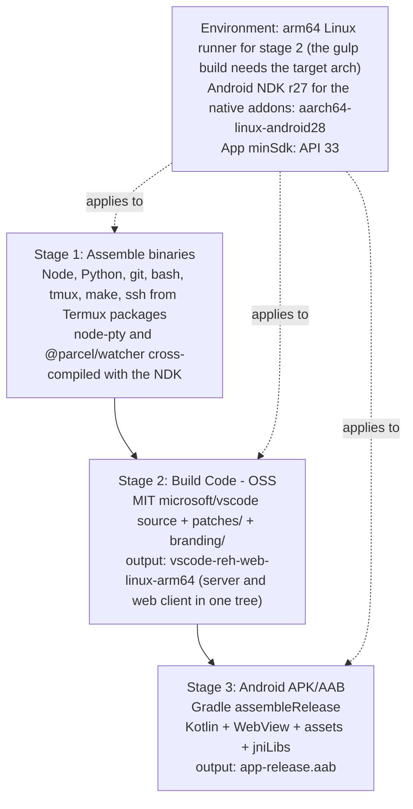
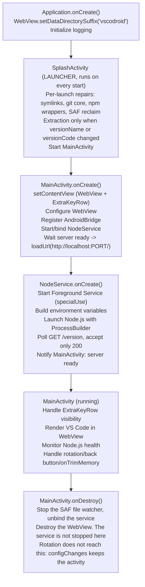
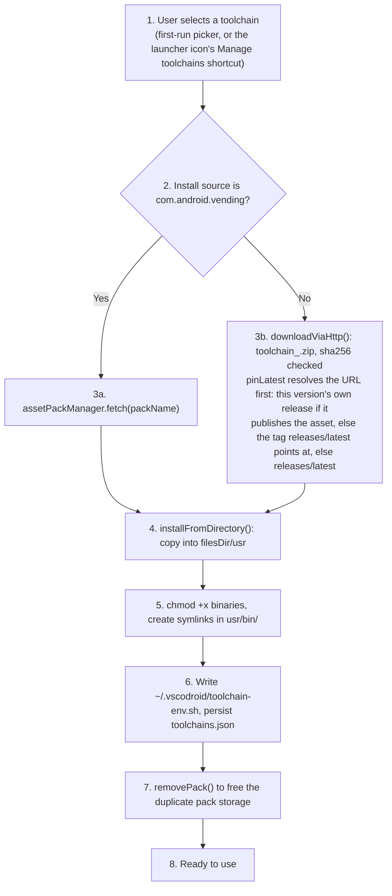

# Technical Specification

**Project**: VSCodroid
**Version**: 1.0-draft
**Date**: 2026-02-10

> **The code is the only authority.** The server is built from the MIT Code - OSS source by
> `.github/workflows/build-vscode-oss.yml`, which applies the unified diffs in `patches/` and the
> branding in `branding/` before the gulp build; app builds fetch the published result with
> `scripts/fetch-vscode-oss.sh`. Where this document summarises a mechanism, the mechanism itself
> lives in `scripts/build-vscode-oss.sh`, `patches/`, and the Kotlin under
> `android/app/src/main/kotlin/com/vscodroid/`. `CONTRIBUTING.md` is the prose kept current
> alongside it.

---

## 1. Build System

### 1.1 Overall Build Pipeline


```mermaid
flowchart TD
  S1["Stage 1: Assemble binaries<br/>Node, Python, git, bash, tmux, make, ssh from Termux packages<br/>node-pty and @parcel/watcher cross-compiled with the NDK"] --> S2["Stage 2: Build Code - OSS<br/>MIT microsoft/vscode source + patches/ + branding/<br/>output: vscode-reh-web-linux-arm64 (server and web client in one tree)"]
  S2 --> S3["Stage 3: Android APK/AAB<br/>Gradle assembleRelease<br/>Kotlin + WebView + assets + jniLibs<br/>output: app-release.aab"]
  ENV["Environment: arm64 Linux runner for stage 2 (the gulp build needs the target arch)<br/>Android NDK r27 for the native addons: aarch64-linux-android28<br/>App minSdk: API 33"] -. applies to .-> S1
  ENV -. applies to .-> S2
  ENV -. applies to .-> S3
```

### 1.2 Node.js Runtime

**Source**: Termux's `nodejs-lts` package. Nothing here compiles Node.

The version is not a preference. `remote/.npmrc` `target` at the pinned VS Code tag names the Node
the server ships and the one its native modules are built against, so the package has to be that
line; bumping either means checking the other.

**`scripts/download-node.sh`**:

```bash
# 1. Fetch and verify the Termux package index (scripts/verify-termux-index.sh):
#    a pinned key signs InRelease, which carries the digest of the package index,
#    which carries the digest of each .deb.
# 2. Download nodejs-lts and extract bin/node.
# 3. Install it as jniLibs/arm64-v8a/libnode.so (the .so trick), mode 0755.
# 4. patch-default-shell.py repoints the built-in default shell, which Termux
#    compiles as /data/data/com.termux/files/usr/bin/sh, at /system/bin/sh.
# 5. verify-android-elf.py checks 16 KB LOAD alignment and refuses any DT_NEEDED
#    that neither Bionic provides nor this app bundles.
```

**Not statically linked**: it needs `libcares`, `libicu*`, `libc++_shared`, `libsqlite3`,
`libcrypto`, `libssl` and `libz`. `scripts/download-termux-tools.sh` places those in
`assets/usr/lib`, and `Environment.kt` puts that directory on `LD_LIBRARY_PATH`. `libicudata` is
32 MB on its own and is not optional; the other ICU libraries do nothing without it.

**16KB page alignment** (Android 16): Termux's build is already aligned, and
`verify-android-elf.py` checks it on everything a download script places: all of
`jniLibs/arm64-v8a` (swept as a directory by the `verifyBundledBinaries` Gradle task),
`assets/usr/lib`, the Python stdlib including `lib-dynload`, and the toolchain packs.
It does **not** reach the server tree's own `.node` addons. Those are covered for
architecture by `verify-server-tree.py` and for `DT_NEEDED` by
`gen-glibc-forwarders.py --scan`, which the `verifyNativeAddons` Gradle task runs over
`assets/vscode-reh` and `assets/extensions`; neither reads `p_align`. Every addon in the
tree is 16 KB-aligned today, so this is a gap in what is checked rather than in what
ships. `CONTRIBUTING.md` lists the callers, and it is the honest list.

### 1.3 Python Runtime

**Source**: Termux's `python` and `python-pip` packages, installed by `scripts/download-python.sh`.

**Key points**:

- The version is read from the Termux index at build time and never hardcoded: the script derives
  `PYTHON_MAJOR_MINOR` from the package it resolved and writes every path from it.
- The interpreter is installed as `jniLibs/arm64-v8a/libpython.so`.
- Stdlib and pip land in `assets/usr/lib/python<major>.<minor>/`, and an older stdlib directory
  is removed rather than left beside the new one.
- Its own dependencies (`libffi`, `libbz2`, `liblzma`, `libsqlite`, `libcrypt`, `gdbm`, `zstd`,
  `libandroid-posix-semaphore`) go to `assets/usr/lib/`.
- `patch-python-platform.py` and `patch-default-shell.py` correct what the stdlib assumes about
  the platform and about where a shell lives.

### 1.4 Native Node Addons

`scripts/build-native-addons.sh` is where cross-compilation actually happens. It builds the addons
the server cannot run without, against Bionic, with the NDK:

```bash
# node-pty        -> node_modules/node-pty/build/Release/pty.node
# @parcel/watcher -> node_modules/@parcel/watcher/build/Release/watcher.node
# @vscode/sqlite3 -> node_modules/@vscode/sqlite3/build/Release/vscode-sqlite3.node
#
# Linked with -Wl,-z,max-page-size=16384 -Wl,-z,common-page-size=16384
# OUTPUT_ROOT defaults to android/app/src/main/assets/vscode-reh
```

All three land inside the packaged `vscode-reh` tree, **not** in `jniLibs/`; `@vscode/spdlog` is replaced by a JavaScript implementation rather than recompiled. That works because SELinux
denies `execve` under the app's data directory but not `dlopen`, so an addon is loadable from
`filesDir` even though a binary there cannot be executed. Each addon's version is checked against
the `package.json` the server was built with, since an addon compiled for a different Node ABI
loads and then fails at the first call.

### 1.5 Code - OSS Build (server and web client)

The server is built from the MIT `microsoft/vscode` source, once per VS Code version, by
`scripts/build-vscode-oss.sh`. `.github/workflows/build-vscode-oss.yml` runs it on an arm64 runner
and publishes the result as a `server-<version>` release; every app build then fetches that
artifact with `scripts/fetch-vscode-oss.sh` instead of building it again.

```bash
# 1. Fetch the pinned source. VSCODE_VERSION holds the tag and VSCODE_COMMIT the
#    commit it resolved to when it was pinned. The build refuses a tree whose
#    package.json version disagrees with the pin, because the pin is what makes
#    the patches apply.

# 2. Apply the Android adaptations, as unified diffs against readable source.
for patch in patches/*.patch; do
    git -C "$SRC" apply --verbose "$patch"
done

# 3. Branding: restore this stage's own targets, then overlay
#    branding/product.json onto the source product.json and replace the
#    artwork at seven destinations: the titlebar mark and six letterpress
#    files, two of them under src/vs/sessions/contrib/chat/browser/media/,
#    which nothing in the packaged tree renders today and which are replaced
#    anyway because they are upstream's mark and they travel in the APK.
#    callback.html is deliberately outside the restore list: patch 0006 and
#    the callback-page stage both own that file, and checking it out here
#    would undo the intent:// relay and put the stripped logo back.

# 4. Build.
npm run gulp core-ci
npm run gulp compile-copilot-extension-build
npm run gulp "vscode-reh-web-linux-arm64-min-ci"

# 5. Check and pack.
python3 scripts/verify-server-tree.py       vscode-reh-web-linux-arm64
python3 scripts/check-patch-fingerprints.py vscode-reh-web-linux-arm64 patches
tar czf vscode-reh-web-linux-arm64-$VSCODE_VERSION.tar.gz vscode-reh-web-linux-arm64
```

The `reh-web` target carries both halves, so one tree is the server and the web client it serves;
`scripts/package-assets.sh` copies it to `assets/vscode-reh/` and there is no separate `vscode-web`
to copy. `verify-server-tree.py` rejects any tree whose `LICENSE.txt` is not the MIT one, or that
carries `node_modules/vsda`, which only Microsoft's own build has. It also asserts what the
branding is supposed to have removed: `callback.html` carrying neither a Microsoft product name
nor an embedded image, and `out/nls.messages.js` carrying none of eight shipped phrases that
name VS Code. Those nine are skipped, not failed, on a tree with no `vscodroid-patches.json`,
which is reported as a tree predating the patches rather than as nine regressions.

**Note on ripgrep delivery**: VS Code search requires ripgrep. `scripts/fetch-vscode-oss.sh` takes
the ARM64 `rg` out of `node_modules/@vscode/ripgrep-universal/bin/linux-arm64/` in the fetched tree,
runs `verify-android-elf.py` over it, and installs it as `libripgrep.so` in `jniLibs/arm64-v8a/`. It
cannot stay where it was: nothing under `filesDir` is executable. `FirstRunSetup` symlinks the path
VS Code looks for back at the `.so` on every launch.

### 1.6 Git

**Source**: Termux's `git` package, with `libcurl`, `openssl`, `pcre2`, `zlib`, `libssh2` and the
rest of its dependency set, fetched by `scripts/download-termux-tools.sh`.

**Output artifacts**:

- `libgit.so` and `libgit-remote-curl.so` in `jniLibs/arm64-v8a/`
- `usr/lib/git-core/*` helper binaries, reached through `GIT_EXEC_PATH`; the ones that must be
  executable become symlinks to `libgit.so` at first run
- `usr/share/git-core/templates`, reached through `GIT_TEMPLATE_DIR`

Shebangs and built-in shell paths are rewritten to `/system/bin/sh`, because the path Termux
compiles in sits inside another application's data directory that this app can neither read nor
create.

### 1.7 Bash

**Source**: Termux's `bash` package, with `readline` and `ncurses`.

**Output artifacts**:

- `libbash.so` in `jniLibs/arm64-v8a/`
- `usr/bin/bash`, a symlink to it that `FirstRunSetup.setupToolSymlinks()` rebuilds on every launch,
  because a reinstall moves `nativeLibraryDir` and dangles every absolute link

The terminal profile names the symlink, never the `.so`: VS Code decides whether it can inject
shell integration by switching on the executable's basename, and `libbash.so` matches no case.

### 1.8 tmux

**Source**: Termux's `tmux` package, with `libevent` and the `ncurses` terminfo data.

**Output artifacts**:

- `libtmux.so` in `jniLibs/arm64-v8a/`
- `usr/share/terminfo/*`, reached through `TERMINFO`

tmux is a standalone tool for whoever wants it. VS Code's terminals do not go through it: the
default profile is bash, and each terminal spawns bash directly through node-pty on a real PTY.
`TMUX_TMPDIR` has to be set, because the Termux build otherwise hunts for its socket inside Termux's
own prefix and every session dies with "no suitable socket path".

### 1.9 make

**Source**: Termux's `make` package.

**Output artifacts**:

- `libmake.so` in `jniLibs/arm64-v8a/`

### 1.10 Gradle Build Configuration

```kotlin
// app/build.gradle.kts
android {
    namespace = "com.vscodroid"
    compileSdk = 37             // compile-time only; what the platform applies is targetSdk

    defaultConfig {
        applicationId = "com.vscodroid"
        minSdk = 33
        targetSdk = 36
        versionCode = 13            // moves every release; read build.gradle.kts, never this block
        versionName = "1.2.0"      // both are persisted by markSetupComplete() and either one
                                   // changing re-runs the whole of first-run extraction

        ndk {
            abiFilters += "arm64-v8a"
        }
    }

    packaging {
        jniLibs {
            useLegacyPackaging = true  // CRITICAL: preserves .so in APK
        }
    }

    buildTypes {
        release {
            isMinifyEnabled = true
            isShrinkResources = true
            proguardFiles(
                getDefaultProguardFile("proguard-android-optimize.txt"),
                "proguard-rules.pro"
            )
        }
    }
}
```

---

## 2. Android Application Architecture

### 2.1 Component Structure


```mermaid
flowchart TD
  ROOT["com.vscodroid/"] --> APP["app/"]
  APP --> A1["VSCodroidApp.kt (Application class)"]
  APP --> A2["MainActivity.kt (Main activity with WebView)"]
  APP --> A3["SplashActivity.kt (First-run setup)"]
  APP --> A4["ToolchainActivity.kt (Toolchain picker and manage screen)"]
  APP --> SVC["service/"]
  SVC --> SVC1["NodeService.kt (Foreground Service for Node.js)"]
  SVC --> SVC2["ProcessManager.kt (Node.js process lifecycle)"]
  APP --> WEB["webview/"]
  WEB --> WEB1["VSCodroidWebView.kt (WebView configuration)"]
  WEB --> WEB2["VSCodroidWebViewClient.kt (request interception, URL loading, errors)"]
  WEB --> WEB3["VSCodroidWebChromeClient.kt (console, file picker, permissions)"]
  WEB --> WEB4["DownloadCoordinator.kt, DownloadNaming.kt (downloads out of the WebView)"]
  APP --> BR["bridge/"]
  BR --> BR1["AndroidBridge.kt (@JavascriptInterface methods)"]
  BR --> BR2["ClipboardBridge.kt (Clipboard read/write)"]
  BR --> BR3["SecurityManager.kt (session token for bridge calls)"]
  APP --> KEY["keyboard/"]
  KEY --> KEY1["ExtraKeyRow.kt (Custom View for extra keys)"]
  KEY --> KEY2["ExtraKeyButton.kt (Individual key button)"]
  KEY --> KEY3["KeyInjector.kt (real key presses for characters, JS KeyboardEvents for chords)"]
  KEY --> KEY4["TextEntry.kt (isTextEntry: which of the two routes a press takes)"]
  APP --> SETUP["setup/"]
  SETUP --> SET1["FirstRunSetup.kt (Binary extraction, initialization)"]
  SETUP --> SET2["ToolchainManager.kt (On-demand toolchain install)"]
  SETUP --> SET3["ToolchainRegistry.kt (what the picker offers)"]
  SETUP --> SET4["ToolchainCardState.kt, ToolchainPickerAdapter.kt (picker UI state)"]
  APP --> STORE["storage/"]
  STORE --> ST1["SafStorageManager.kt (SAF folder grants and mirrors)"]
  STORE --> ST2["SafSyncEngine.kt (reconcile mirror with content URI)"]
  APP --> UTIL["util/"]
  UTIL --> U1["Environment.kt (PATH, HOME, env setup)"]
  UTIL --> U2["PortFinder.kt (find available localhost port)"]
  UTIL --> U3["Logger.kt (logging utilities, redaction)"]
  UTIL --> U4["CrashReporter.kt, Notices.kt, StorageManager.kt, ViewInsets.kt, WebViewVersion.kt"]

  ROOT --> RES["res/"]
  RES --> LAYOUT["layout/"]
  LAYOUT --> L1["activity_main.xml (WebView + ExtraKeyRow)"]
  LAYOUT --> L2["activity_splash.xml (First-run progress)"]
  LAYOUT --> L3["activity_toolchain.xml, item_toolchain_card.xml, layout_toolchain_picker.xml, layout_toolchain_progress.xml"]
  RES --> VALUES["values/"]
  VALUES --> V1["strings.xml"]
  RES --> DRAW["drawable/"]
  DRAW --> D1["ic_launcher.xml (VSCodroid icon)"]

  ROOT --> ASSET["assets/"]
  ASSET --> AS1["vscode-reh/ (Code - OSS server, and the web client it serves)"]
  ASSET --> AS2["usr/ (Termux binaries, shared libs, terminfo, git-core)"]
  ASSET --> AS3["usr/lib/python3.x/ (Python standard library and pip)"]
  ASSET --> AS4["extensions/ (Pre-bundled extensions)"]
  ASSET --> AS5["server.js (Server bootstrap script)"]
```

### 2.2 Activity Lifecycle


```mermaid
flowchart TD
  A["Application.onCreate()<br/>WebView.setDataDirectorySuffix('vscodroid')<br/>Initialize logging"] --> B["SplashActivity (LAUNCHER, runs on every start)<br/>Per-launch repairs: symlinks, git core, npm wrappers, SAF reclaim<br/>Extraction only when versionName or versionCode changed<br/>Start MainActivity"]
  B --> C["MainActivity.onCreate()<br/>setContentView (WebView + ExtraKeyRow)<br/>Configure WebView<br/>Register AndroidBridge<br/>Start/bind NodeService<br/>Wait server ready -> loadUrl(http://localhost:PORT/)"]
  C --> D["NodeService.onCreate()<br/>Start Foreground Service (specialUse)<br/>Build environment variables<br/>Launch Node.js with ProcessBuilder<br/>Poll GET /version, accept only 200<br/>Notify MainActivity: server ready"]
  D --> E["MainActivity (running)<br/>Handle ExtraKeyRow visibility<br/>Render VS Code in WebView<br/>Monitor Node.js health<br/>Handle rotation/back button/onTrimMemory"]
  E --> F["MainActivity.onDestroy()<br/>Stop the SAF file watcher, unbind the service<br/>Destroy the WebView. The service is not stopped here<br/>Rotation does not reach this: configChanges keeps the activity"]
```

### 2.3 Environment Variables

```kotlin
// Illustrative shape only. Environment.buildProcessEnvironment sets 28 keys plus whatever
// getToolchainEnvironment() contributes; the list below names all 28 but abbreviates the values.
val env = mapOf(
    "HOME"                    to "${filesDir}/home",
    "TMPDIR"                  to "${cacheDir}/tmp",
    "TMUX_TMPDIR"             to "${cacheDir}/tmp",   // Termux tmux hunts inside Termux's prefix otherwise
    "PATH"                    to "${nativeLibDir}:${filesDir}/usr/libexec/tcbin:${filesDir}/usr/bin:<toolchains>:/system/bin",
    "LD_LIBRARY_PATH"         to "${nativeLibDir}:${filesDir}/usr/lib",
    "NODE_PATH"               to "${filesDir}/server/vscode-reh/node_modules",
    "NODE_OPTIONS"            to "--require=${filesDir}/server/platform-fix.js",
    "SHELL"                   to "${filesDir}/usr/bin/bash",
    "BASH_ENV"                to "${filesDir}/home/.vscodroid/bash-env.sh",  // see below
    "VSCODROID_EXEC_TABLE"    to "${filesDir}/home/.vscodroid/toolchain-exec.tsv",  // see below
    "TERM"                    to "xterm-256color",
    "TERMINFO"                to "${filesDir}/usr/share/terminfo",
    "LANG"                    to "en_US.UTF-8",
    "PREFIX"                  to "${filesDir}/usr",
    "PYTHONHOME"              to "${filesDir}/usr",
    "PYTHONDONTWRITEBYTECODE" to "1",
    "GIT_EXEC_PATH"           to "${filesDir}/usr/lib/git-core",
    "GIT_TEMPLATE_DIR"        to "${filesDir}/usr/share/git-core/templates",
    "GIT_SSH_COMMAND"         to "${nativeLibDir}/libssh.so -F ${filesDir}/home/.ssh/config",
    "GIT_SSL_CAPATH"          to "<system trust store>",
    "GIT_SSL_CAINFO"          to "${filesDir}/usr/etc/tls/cert.pem",   // curl needs the bundle, not the dir
    "SSL_CERT_DIR"            to "<system trust store>",
    "NPM_CONFIG_PREFIX"       to "${filesDir}/usr",
    "NPM_CONFIG_CACHE"        to "${cacheDir}/npm-cache",
    "PROJECTS_DIR"            to "<projects dir>",
    "USE_BUILTIN_RIPGREP"     to "0",                 // falsy sends the Claude CLI to rg on PATH
    "VSCODROID_PORT"          to port.toString(),
    "VSCODROID_VERSION"       to BuildConfig.VERSION_NAME,
)
```

**`COLORTERM` and `EDITOR` are not set**, and neither are `VISUAL`, `GIT_EDITOR` or `PAGER`. This
block listed the first two until 2026-08-20 and they have never been in the map. No editor binary
is bundled either, so `git commit` with no `-m` has nothing to open.

**`BASH_ENV` is the load-bearing entry.** `npm`, `npx`, `claude` and every toolchain binary are bash
*functions*, not files, because SELinux refuses `execve` under `filesDir`. Those functions live in
`.bashrc`, which only an interactive bash reads, so `BASH_ENV` names a second file carrying the same
definitions for `bash -c`, `bash script.sh` and `bash -lc`. What it does not reach is a bare
`execve` (`child_process.spawn("ruby", ...)` with no shell) and `sh -c`, since Android's `sh` is mksh
and has never heard of the variable. `child_process.exec()` and make's default recipe shell are both
`/bin/sh`. See `FirstRunSetup.createBashEnvFile`, whose KDoc states the boundary in full.

**`VSCODROID_EXEC_TABLE` answers exactly the cases `BASH_ENV` cannot.** It names a tab-separated
table mapping a toolchain command to the absolute path of the binary or script that implements it,
plus one row per manifest environment variable (`\t<variable>\t<value>`, an empty command field)
that the trampoline applies with `setenv` for any variable the caller does not already have, so a
toolchain installed while the server runs reaches tasks and `make` without a restart. Both are
written by `ToolchainManager.regenerateExecTableLocked` beside the env file. The reader is
`libexec-trampoline.so`, a small C program in `nativeLibraryDir` that
`scripts/build-exec-trampoline.sh` compiles: `usr/libexec/tcbin` holds one symlink per command
pointing at it, that directory sits ahead of `usr/bin` on `PATH`, and the trampoline hands the
payload to `/system/bin/linker64` the same way the bash functions do. So a bare `execve`, an mksh
`sh -c`, a `make` recipe and a `"type": "process"` task all reach a toolchain command now. What it
still does not reach is an absolute-path invocation such as `$JAVA_HOME/bin/java`, a toolchain
forking its own helper by absolute path (the JDK's `lib/jspawnhelper`), and direct execution of a
shebang script under `filesDir`, whose own inode is refused before its interpreter is consulted.

---

## 3. Server Bootstrap

### 3.1 Server Entry Script (server.js)

The bootstrap script that Node.js executes:

```
server.js responsibilities:
1. Parse command-line arguments (port, host, extensions-dir, etc.)
2. Set up VS Code product.json overrides
3. Preload dns-proxy.js into the editor server it forks
4. Launch vscode-reh server entry point
5. Configure Extension Host as worker_thread
6. Spawn a shell per terminal through node-pty, on a real PTY
7. Listen on localhost:PORT
8. Serve vscode-web static files
9. Handle WebSocket connections for RPC
```

Step 3 is a `--require=<path>` on the child's `execArgv`, not a listener in this
process, and the difference is load-bearing. This bootstrap is SIGKILLed as a
matter of routine while the child survives holding the port, which is the case
`ProcessManager` adopts on the next launch; a proxy bound here died with it and
left that survivor pointing at a closed port for its whole session, with no way
to change the environment of a running process. The module is `require`d here
first so that a file that cannot parse costs musl clients their DNS rather than
costing the app its editor server, and it is passed as one token, because
`process-monitor.js` names a process by its first non-option argument.

Readiness is `GET /version`, and only a `200` counts. There is no `/healthz`:
what used to serve one was a fallback server in `assets/server.js` that bound the
port when `vscode-reh/out/server-main.js` was missing and answered 200 to every
path, so a broken install passed the readiness probe and showed the user a page
of build instructions. A missing entry point is now logged and exits 1. `/` is
not usable as a probe either, because it answers `403` once the server requires a
connection token.

### 3.2 Server Launch Command

```bash
$NATIVE_LIB_DIR/libnode.so \
  --max-old-space-size=$HEAP_MB \
  $FILES_DIR/server/server.js \
  --host=127.0.0.1 \
  --port=$PORT \
  --extensions-dir=$HOME/.vscodroid/extensions \
  --user-data-dir=$HOME/.vscodroid \
  --server-data-dir=$HOME/.vscodroid \
  --logsPath=$HOME/.vscodroid/data/logs \
  --log=info
```

`$HEAP_MB` is not a constant: `ProcessManager.heapCeilingForDevice` derives it from the
device's total RAM, and it caps each V8 isolate at that number rather than capping the sum
of them. `$HOME` is `$FILES_DIR/home`. These are `server.js`'s arguments, not the editor
server's; `05-API_SPEC.md` §3.3 has the four keys it forwards and the flags it adds itself.

---

## 4. WebView Configuration

### 4.1 Settings

```kotlin
webView.settings.apply {
    javaScriptEnabled = true
    domStorageEnabled = true
    databaseEnabled = true
    allowFileAccess = false         // the WebView has no business reading files directly
    allowContentAccess = false      // page content cannot spend the app's SAF grants
    setSupportZoom(false)           // Prevent accidental zoom
    builtInZoomControls = false
    displayZoomControls = false
    textZoom = 100                  // pinned, so the system font scale does NOT reach the editor
    mixedContentMode = MIXED_CONTENT_ALWAYS_ALLOW  // LAN dev servers on plain http
    mediaPlaybackRequiresUserGesture = true         // the platform default, restored
    cacheMode = LOAD_DEFAULT
    javaScriptCanOpenWindowsAutomatically = true
    setSupportMultipleWindows(false)
}
```

Two of those are reversals of what this block used to show, and each has a cost worth
stating. `allowContentAccess = false` closes the one route by which page content could spend the
app's persisted SAF grants; nothing loses anything, because SAF reaches the page as a POSIX
path under `filesDir/saf-mirrors` and no `content://` URI is ever loaded. Restoring
`mediaPlaybackRequiresUserGesture` means no frame the editor renders can start audio or
video without a tap, and the flag is all or nothing, so a user who turns
`mediaPreview.video.autoPlay` on gets nothing.

Read `VSCodroidWebView.configure` for the live set. Three notes on what is **not** here:

- **No `userAgentString`.** Nothing in the app assigns one; the WebView reports Chromium's default.
- **No `setSoftInputMode` call.** The resize behaviour comes from
  `android:windowSoftInputMode="adjustResize"` on the activity in `AndroidManifest.xml`.
- **`textZoom = 100` is a pin, not a default.** It is why changing the system font size has no
  effect on editor text, which is a live accessibility gap rather than a setting anyone tuned.

### 4.2 Crash Recovery

```kotlin
override fun onRenderProcessGone(
    view: WebView,
    detail: RenderProcessGoneDetail
): Boolean {
    // Log crash
    Log.e(TAG, "WebView renderer crashed: reason=${detail.rendererPriorityAtExit()}")

    // Destroy and recreate WebView
    webViewContainer.removeView(webView)
    webView.destroy()

    webView = createAndConfigureWebView()
    webViewContainer.addView(webView)

    // Reload VS Code UI (server should still be running), unless the crashes
    // have become a loop (see below)
    webView.loadUrl("http://localhost:$port/")

    return true  // We handled it
}
```

**The reload half is bounded; the rebuild half is not.** `crashLoopReached` keeps the crash
times in a window (`CRASH_LOOP_WINDOW_MS`, 60 s) and allows `CRASH_LOOP_CRASHES`, 3, inside
it. A fourth still rebuilds the view, because the crashed one is documented as unusable and
a resume path calls `reload()` on whatever the field holds, but it does not load the editor
again: it shows a page saying the editor kept closing, whose only control
(`vscodroid://reload-editor`) loads it and clears the record, so a deliberate attempt gets
the whole budget back. The control is not the server retry the give-up page carries: the
server here is healthy, so a second `startForegroundService` would answer `ALREADY_SERVING`
and leave the page up for ever. Both counting and the record live on the Activity, since
`recreateWebView` replaces the WebView and its client on every cycle, and a counter held
there would be reset by the very event it counts.

---

## 5. Extra Key Row

### 5.1 Layout

Swipeable pages of at most eight items. Eight is a ceiling rather than a preference: the row
divides itself exactly between its children, so sixteen on a 360dp portrait row leaves about
18.5dp a key, well under the 48dp minimum touch target. Source of truth is
`KeyPageConfig.kt`.

**How many pages there are depends on the width of the phone.** `KeyPages.defaults` below is
the layout for a row 411dp wide and up, where page 1's 8.5 shares (the trackpad claims one
and a half) come to 48.4dp. `KeyPages.forSmallestWidthDp` repacks the same items, in the same
order, whenever a page's share would put a key under `MIN_TOUCH_TARGET_DP`: five pages at
411dp, six at 360dp, seven at 320dp. The argument is `smallestScreenWidthDp`, so rotating
does not repack, but a drop into a narrow split-screen pane does, through
`ExtraKeyRow.onConfigurationChanged`.

| Page | Contents at 411dp and wider |
|------|----------|
| 1 | Tab, Esc, Ctrl, Alt, Shift, the gesture trackpad, `{}`, `()` |
| 2 | `;` `:` `"` `/` `\|` `` ` `` `&` `_` |
| 3 | `[` `]` `<` `>` `=` `!` `#` `@` |
| 4 | F1 to F8 |
| 5 | F9 to F12, Home, End, PageUp, PageDown |

On a 360dp phone page 1 ends at `{}` and `()` opens page 2; on a 320dp phone page 1 is the
five modifiers and the trackpad, with both bracket keys on page 2. The indicator under the
row is where a user reads the real count, and it speaks the same thing: "Key page 1 of 5",
with the latched modifier appended while one is held.

Ctrl, Alt and Shift latch rather than repeat. The bracket and parenthesis keys insert only the
opening character, because Monaco closes the pair and places the caret inside. Several keys carry
long-press alternates, which `KeyPageConfig.kt` lists beside them; `)` is on the `()` key's
list because no other route on the row reaches it, since `shiftedForm` leaves `(` unchanged
and `)` sits on a digit key no page carries.

There are **no discrete arrow buttons anywhere on the row.** The gesture trackpad replaced them and
emits arrow keys as the finger moves (`TrackpadGesture.accumulate`). A drag is the only route for a
finger, and it was the only route of any kind until the pad gained four accessibility actions, one
per direction (`ARROW_ACTIONS`, registered in `GestureTrackpad`'s initialiser). Those are what an
assistive input that cannot drag uses; each sends one arrow and then ends the drag, so a latched
modifier clears exactly as it does on an ordinary key.

### 5.2 Key Injection

`KeyInjector.injectKey` has two routes, and `isTextEntry` (`TextEntry.kt`) chooses
between them. No snippet is reproduced here: this section carried one for a long time,
it drifted from the signature, the event pair and the quoting all at once, and a stale
copy of the code is worse than a pointer to it. `KeyInjector.kt` is the source of truth.

**Characters are typed.** A single ASCII character in `0x20..0x7E` pressed with no Ctrl,
Alt or Meta goes through `typeCharacter`, which asks `KeyCharacterMap.VIRTUAL_KEYBOARD`
for the presses that produce it and dispatches them at the WebView as real Android
`KeyEvent`s. The map supplies Shift itself where the character needs it, so no table of
shifted forms is written by hand. This route exists because a `KeyboardEvent` constructed
in the page is untrusted: listeners run, no default action is performed, and the
character is never inserted. That is what made `{`, `;` and `"` do nothing at all.

**Everything else is announced.** A key that names a command rather than a character
(`Tab`, `Escape`, `F7`, `PageDown`), and any key held with Ctrl, Alt or Meta, is sent as
a `keydown`/`keyup` pair built by `evaluateJavascript` at `document.activeElement`, since
that is what the workbench resolves its key bindings from. Values going into that script
are escaped by `KeyMapping.jsQuote`.

A latched Shift is resolved before the split, by `KeyMapping.shiftedForm`, because it
changes which character is typed rather than whether it is typed. If `typeCharacter`
cannot produce a press on the layout in force it returns false and the announce route
runs instead; that preserves the keystroke but still inserts nothing, and it logs a
warning rather than a debug line so the case is visible in a release build.

### 5.3 Visibility Control

```kotlin
// Detect keyboard using WindowInsetsCompat
ViewCompat.setOnApplyWindowInsetsListener(rootView) { _, insets ->
    val imeVisible = insets.isVisible(WindowInsetsCompat.Type.ime())
    extraKeyRow.visibility = if (imeVisible) View.VISIBLE else View.GONE
    insets
}
```

---

## 6. Patch System

### 6.1 The Patch Set

The Android adaptations are unified diffs against readable Code - OSS source, numbered so that the
order they apply in is fixed. They live in `patches/`, one file each:


```mermaid
flowchart TD
  P["patches/"] --> P1["0001 platform: treat Android as Linux"]
  P --> P2["0002 user data path: accept Android"]
  P --> P3["0003 Pty Host as a worker_thread"]
  P --> P4["0004 Extension Host as a worker_thread"]
  P --> P5["0005 webview: disable the service worker, relax its CSP"]
  P --> P6["0006 OAuth callback relayed into the app over intent://"]
  P --> P7["0007 persist secrets across a restart"]
  P --> P8["0008 activity bar overflow sized from live height"]
  P --> P9["0009 marketplace: request the alpine target on Android"]
  P --> P10["0010 .moduleignore: keep the Copilot SDK entry"]
  P --> P11["0011 brand the web walkthrough"]
  P --> P12["0012 serve /callback before the connection-token check"]
  P --> P13["0013 shorten the reconnection grace when a client is connected"]
  P --> P14["0014 menus: dismiss a submenu only on a real scroll"]
  P --> P15["0015 menubar: stay open when only the keyboard resized"]
  P --> P16["0016 sidebar: sash travel on narrow viewports"]
  P --> P17["0017 menus: ignore a pan that started in a submenu"]
```

Five of these are load-bearing in ways their titles understate:

- **0001 and 0002 are the platform pair.** Node on Android reports `process.platform === "android"`
  and VS Code only ever compares against `"linux"`, so `isLinux`, `isWindows` and `isMacintosh` are
  false at once and every Linux-shaped decision falls to an untested default. 0002 exists separately
  because `doGetUserDataPath` switches on `process.platform` directly, where the default arm throws
  `Platform not supported` and kills the Pty Host during construction.
- **0003 and 0004 take the two long-lived forks off Android's phantom-process budget.** Threads are
  not processes. `bootstrap-fork` installs `process.send` over `parentPort` on the worker side, so
  the module inside still sees the IPC channel it was written against. The Extension Host needs more
  than the Pty Host does, because it is handed the client's socket over IPC and a worker has no
  channel that can carry a handle; it takes the route upstream already uses on Windows, where the
  host connects back over a pipe and the server bridges the two sockets itself.
  0004 carries a second half for that reason, in `extensionHostProcess.ts` beside the server-side
  `extensionHostConnection.ts`: upstream ends the host's pipe socket when the client's socket
  closes and the host treats that as a shutdown, so on this path every dropped WebSocket killed
  every extension while the workbench still looked healthy, which one to five minutes in the
  background is enough to produce. The pipe server now keeps listening, the host redials it and
  redoes the handshake (`beginAcceptReconnection` / `endAcceptReconnection` / `sendResume`), and
  the accepted socket is paused while no client is attached so nothing is written to nobody.
- **0009 depends on 0001.** The marketplace target selector tests `isLinux` before it tests Android,
  so without 0001 the CLI-bearing extensions are served the glibc build, which cannot start in an
  app process: glibc's `__tls_init_tp` calls `set_robust_list` and `rseq`, Android's app seccomp
  filter rejects both, and the process dies with SIGSYS before `main()`. The coupling is read out
  of the packaged bundle rather than inferred from the patch text: in `out/server-main.js` the
  selector is `if(!qe)return!1;if(N1)return ...`, and the aliases resolve to
  `qe = platform==="linux"||platform==="android"` and `N1 = platform==="android"`, so the android
  branch is unreachable unless 0001 widens the first. What has not been done is building a tree
  without 0001 to watch the CLI die; the row for 0001 in `patches/fingerprints.txt` now fingerprints
  that widening specifically, so narrowing it fails the check instead.

### 6.2 Patch Application

```bash
# scripts/build-vscode-oss.sh, "Patches" step

PATCHES="${PATCHES:-$REPO_ROOT/patches}"

# Applied to a clean tree every time, so a rerun cannot fail on an already
# applied hunk or accumulate half-states. reset comes first: a patch that adds a
# file leaves it staged, where neither checkout nor clean will touch it, and the
# next run dies with "already exists in working directory".
git -C "$SRC" reset -q
git -C "$SRC" checkout -- src/ build/
git -C "$SRC" clean -fdq src/ build/

for patch in "$PATCHES"/*.patch; do
    git -C "$SRC" apply --verbose "$patch"
    echo "  applied $(basename "$patch")"
done
```

`build/` is reset alongside `src/` because patches reach the build tooling too. `git apply` exits
non-zero the moment context has shifted and `set -e` turns that into a failed build, which is the
property the whole arrangement exists for. A missing `patches/` directory is fatal as well, unless
`ALLOW_UNADAPTED=1` says an unadapted tree is wanted on purpose: without them there is no Android
platform detection, no worker_thread hosts and no Open VSX target platform, and the result is not
this product. The branding overlay in `branding/product.json` is applied in the following step,
still before gulp runs.

### 6.3 Proving a Patch Reached the Package

Applying a patch to the source proves nothing about the package: the file may not be in the
target's graph, or the build may inline an older copy. Every patch therefore leaves a fingerprint
that survives minification, and `scripts/check-patch-fingerprints.py` searches the packaged tree for
it against the table in `patches/fingerprints.txt`.

A row answers "did this patch reach the bundle", and by itself it cannot answer "which version
of it did": editing a patch that already has a row leaves the row matching. That half is
covered by a manifest rather than by a pattern. `build-vscode-oss.sh` writes
`vscodroid-patches.json` into the tree it produces, recording the sha256 of each patch's diff,
and the checker recomputes those hashes from `patches/` and compares before it prints a single
row. A tarball built from different patch text is refused wherever that check runs, which
includes the fetch and the Gradle packaging gate. Only the diff is hashed, from the first
`diff --git` or `---`/`+++` pair down, so a patch's prose header can be rewritten for free;
a comment inside the added code cannot, and costs a server rebuild. `verify-server-tree.py`
short-circuits on a tree carrying no manifest at all and reports it as stale.

| Rule | Consequence |
| ---- | ----------- |
| The checker walks `patches/`, not the table | A patch added without a row fails, rather than producing a run of "ok" lines |
| A patch may carry more than one row | 0003 has two, one per bundle: the worker itself lands in `out/server-main.js`, the `process.send` bridge in `out/bootstrap-fork.js`, and a file missing from the target's graph is exactly what a fingerprint is for |
| A row may declare that no fingerprint is possible, and say how the patch is proven instead | 0007 and 0010 are the two: 0007's added half minifies to `!0`, and 0010 edits `build/.moduleignore`, so its proof is the kept file, which `verify-server-tree.py` requires |
| Matching tolerates quote style and whitespace | `case"android"` and `case "android"` both count, so a new esbuild version cannot fail a row describing a correct tree |
| The pattern must appear in what the patch itself adds | A pattern lifted from surrounding code cannot be evidence that the patch arrived |

Example rows, one per shape:

```
0004 extHost worker|out/server-main.js|worker_thread Extension Host
0011 walkthrough brand|out/nls.messages.js|Get Started with VSCodroid
0010 moduleignore keep|-|edits build/.moduleignore, so its proof is the file surviving into the tree
```

Both sides run the check: `build-vscode-oss.sh` over what it built, and `fetch-vscode-oss.sh` over
what it downloaded. The second caller is the one that matters, because a server tarball predating a
patch carries the same name, the same version, and a digest that verifies. A digest proves a tarball
is intact, not that it is the right tarball.

## 7. Toolchain Asset Pack System

### 7.1 Toolchain Configuration

Toolchains are declared in Kotlin, in `ToolchainRegistry.available`, and both the first-run picker
and the manage screen are built from that list. Two are shipped, Ruby and Java 17:

```kotlin
ToolchainInfo(
    packName = "toolchain_ruby",
    displayName = "Ruby",
    shortLabel = "Ruby",
    descriptionRes = R.string.toolchain_ruby_description,   // "Ruby with irb, gem, bundler"
    estimatedSize = 36_000_000,   // unpacked, what the free-space gate uses; 35.7 MB measured
    downloadSize = 9_900_000,     // the ZIP, what the picker quotes to the user
    downloadUrl = "https://github.com/rmyndharis/VSCodroid/releases/latest/download/toolchain_ruby.zip",
)
```

The second entry is `toolchain_java`, OpenJDK 17 with `javac`, `jar` and `jshell`.

The shipped set is interpreters and a JVM, and that is a constraint rather than a preference. A
toolchain whose compiler forks its own assembler and linker cannot work here at all: Android refuses
`execve` on anything under the app's data directory, so those forks are refused however the driver
command is reached, and a toolchain that installs, runs, and cannot compile is worse than one that
is absent.

### 7.2 Asset Pack Extraction Flow


```mermaid
flowchart TD
  A["1. User selects a toolchain<br/>(first-run picker, or the launcher icon's Manage toolchains shortcut)"] --> B{"2. Install source is com.android.vending?"}
  B -- "Yes" --> C["3a. assetPackManager.fetch(packName)"]
  B -- "No" --> D["3b. downloadViaHttp(): toolchain_<name>.zip, sha256 checked<br/>pinLatest resolves the URL first: this version's own release if it<br/>publishes the asset, else the tag releases/latest points at, else releases/latest"]
  C --> E["4. installFromDirectory(): copy into filesDir/usr"]
  D --> E
  E --> F["5. chmod +x binaries, create symlinks in usr/bin/"]
  F --> G["6. Write ~/.vscodroid/toolchain-env.sh, persist toolchains.json"]
  G --> H["7. removePack() to free the duplicate pack storage"]
  H --> I["8. Ready to use"]
```

Because the payload lands in `filesDir`, an installed toolchain survives an app update.

### 7.3 Gradle Asset Pack Configuration

```kotlin
// settings.gradle.kts
include(":toolchain_ruby")
include(":toolchain_java")

// app/build.gradle.kts
assetPacks += listOf(":toolchain_ruby", ":toolchain_java")
```

Each asset pack module:

```kotlin
// toolchain_ruby/build.gradle.kts
plugins {
    id("com.android.asset-pack")
}
assetPack {
    packName.set("toolchain_ruby")
    dynamicDelivery {
        deliveryType.set("on-demand")
    }
}
```

**Asset pack contents**: pre-compiled ARM64 binaries and standard libraries for one toolchain,
copied into `filesDir/usr` at install time. On-demand packs draw on a separate 30 GB Play budget and
count against neither the base module cap nor the app size shown on the store listing.

**Delivery is not Play-only, and no build bundles a toolchain in the APK.**
`ToolchainManager.shouldUseHttpFallback()` reads `getInstallSourceInfo().installingPackageName` at
runtime: `com.android.vending` takes the Play Asset Delivery path, and every other installer
(sideload, debug build, `adb install`) downloads `toolchain_<name>.zip` from this project's GitHub
Releases over HTTPS and checks it against the published sha256 manifest. Both paths converge on
`installFromDirectory()`. One consequence is worth stating plainly: the ZIPs attached to a release
are a production delivery channel, so a release that omits them breaks toolchain installation for
every non-Play user.

### 7.4 Language Picker Integration

The picker is shown once, gated by `toolchain_picker_shown`, and it offers exactly what
`ToolchainRegistry.available` lists:

```kotlin
val toolchains = ToolchainRegistry.available   // toolchain_ruby, toolchain_java

fun onUserConfirmed(selected: List<ToolchainInfo>) {
    // Queue them; downloads run one at a time, driven by COMPLETED/FAILED
    // callbacks, and a failure skips to the next rather than aborting the queue.
}
```

**Flow**:

1. First launch, after asset extraction, check whether the picker has been shown before
2. Show the picker with a card per registry entry, quoting each `downloadSize`
3. User selects languages and confirms
4. Fetch each pack in turn, Play Asset Delivery or HTTPS depending on install source
5. Show download progress per pack
6. On completion, install into `filesDir/usr` and write `toolchain-env.sh`
7. `.bashrc` sources that file, so the toolchain is on `PATH` in every new shell
8. Proceed to the workbench

**Later installs**: the Toolchains screen adds and removes languages through the same
`ToolchainManager` entry points.

---

## 8. Package Manager

Not built. No `vscodroid pkg` command exists in the app or on the device, and nothing under
`android/app/src/main` or `scripts/` implements one. It sits on the post-release roadmap in
`MILESTONES.md`, and what follows is the design it would start from rather than a description of
anything shipping. Additional packages are the user's own business through the terminal today.

### 8.1 CLI Interface

```bash
# Search packages
vscodroid pkg search <query>

# Install package
vscodroid pkg install <package>

# List installed
vscodroid pkg list

# Remove package
vscodroid pkg remove <package>

# Update all
vscodroid pkg update
```

### 8.2 Package Format

The design reuses the Termux package repository rather than hosting one: `arm64` deb packages and
a standard dpkg `Packages` index, which is already what `scripts/lib/termux-packages.sh` resolves
and what `scripts/verify-termux-index.sh` anchors to Termux's signing key. No VSCodroid package
host exists.

> **Constraint that shapes it**: on a Play install every binary has to arrive through Play, so a
> command that downloads executables from a third-party repository could not run there. Any
> implementation would be limited to installs that did not come from Play, which is the same split
> `ToolchainManager.shouldUseHttpFallback()` already makes for toolchains.

---

## 9. Version Strategy

### 9.1 Version Scheme

```
VSCodroid version: X.Y.Z
  X = Major (breaking changes, new architecture)
  Y = Minor (new features, VS Code upstream update)
  Z = Patch (bug fixes, security patches)

Mapping to VS Code version:
  The pin lives in VSCODE_VERSION, and the commit it resolved to in VSCODE_COMMIT.
  Both are read by build-vscode-oss.sh and by fetch-vscode-oss.sh, which refuse a
  tree or a tarball that disagrees with them.

  VSCodroid 1.2.0 -> VS Code 1.133.0
```

### 9.2 Update Cadence

- VS Code releases monthly → VSCodroid targets monthly upstream sync
- Patch releases as needed for critical bugs
- Toolchain updates ride the release: the asset packs in the AAB and the ZIPs attached to the
  GitHub Release must be built from the same download, or the two delivery channels ship
  different toolchain versions for one app version

---

## 10. Android Backup Configuration

```xml
<!-- AndroidManifest.xml -->
<application
    android:allowBackup="true"
    android:fullBackupContent="@xml/backup_rules"
    android:dataExtractionRules="@xml/data_extraction_rules">
```

Two files, because the platform reads two. `android:fullBackupContent` is consulted
up to Android 11 (API 30) and `android:dataExtractionRules` from Android 12 (API 31)
onwards. `minSdk` is 33, so **every supported device reads
`data_extraction_rules.xml` and ignores `backup_rules.xml`**. The older file is kept
deliberately rather than deleted: it is the floor that stops a future `minSdk`
reduction from silently turning on unrestricted full backup. Keep the two in step:
the header comment in each file carries the full reasoning.

**Live rules** (`res/xml/data_extraction_rules.xml`):

```xml
<?xml version="1.0" encoding="utf-8"?>
<data-extraction-rules>
    <cloud-backup>
        <include domain="file" path="home/.vscodroid/data/Machine" />
    </cloud-backup>
    <device-transfer>
        <include domain="file" path="home/.vscodroid/data/Machine" />
    </device-transfer>
</data-extraction-rules>
```

`backup_rules.xml` holds the same single `<include>` in `<full-backup-content>` form.

**Rationale**: this is an **allowlist with no exclusions**, and the absence of
`<exclude>` is the design rather than an omission. Under `<include>` semantics
anything not named is already out, so exclusions would only restate paths that were
never in scope, which is what lint reported, once per line.

Fail-closed is the point. The app's private storage holds a passphrase-less SSH key
(`Environment.getSshDir`) and the server's connection token
(`Environment.getConnectionTokenPath`), and the token sits inside `data/`, one
directory away from the settings that *are* backed up. A denylist protects exactly
the secrets someone remembered to list; naming only what may leave keeps the next
credential file out by default.

What is included is `data/Machine`, where the workbench reads its settings from on
this side, which is not the `User/` path it looks like it should be; see
`Environment.getMachineSettingsPath`. Restoring it is worth doing because
`FirstRunSetup.createDefaultSettings()` writes only when the file is absent, so a
restored copy survives the new device's first run.

Notably excluded by omission, and least obvious: `sharedpref`.
`FirstRunSetup.isFirstRun()` answers from `setup_version` and `setup_version_code`
in those preferences, so
restoring them onto a device with an empty `filesDir` would make the app conclude
setup had already run, skip extraction entirely, and start a server that is not
there.
