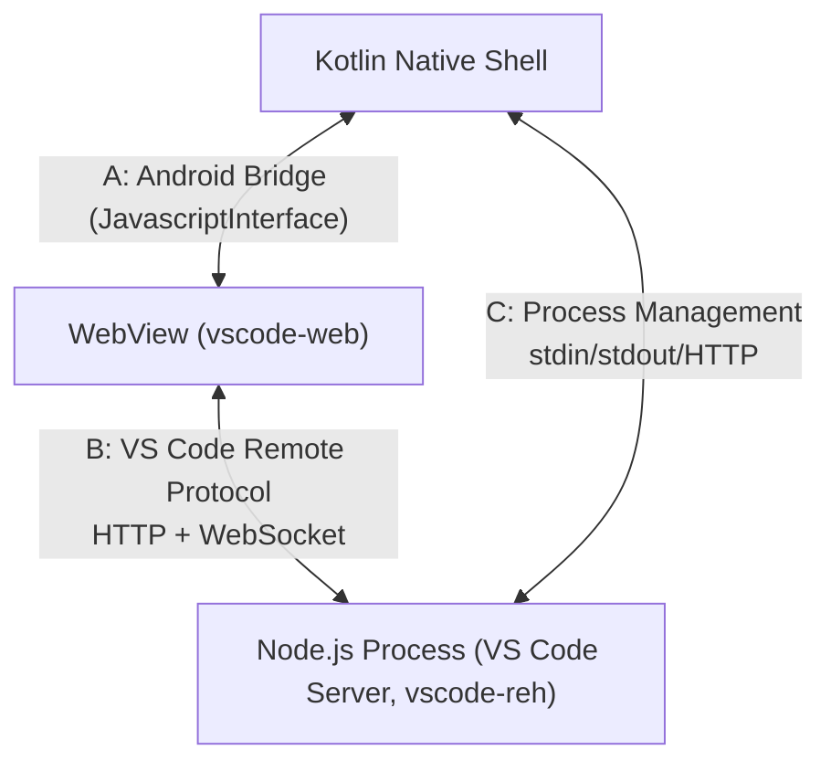
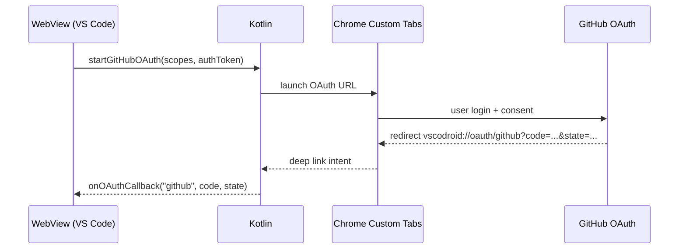
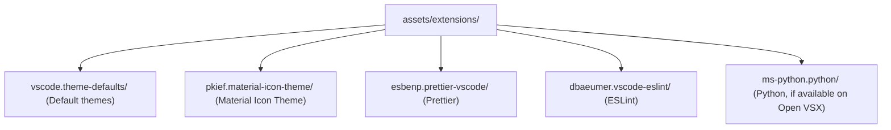

# API & Interface Specification

**Project**: VSCodroid
**Version**: 1.0-draft
**Date**: 2026-02-10

---

## 1. Internal APIs Overview

VSCodroid has three interface boundaries:



---

## 2. (A) Android Bridge API

### 2.1 Bridge Registration

```kotlin
// In MainActivity
webView.addJavascriptInterface(AndroidBridge(this), "AndroidBridge")
```

### 2.2 Bridge Security Model

Bridge exposure is restricted with a capability-token model plus origin checks:

1. **Trusted origin only**: bridge calls are processed only when top-level URL is `http://127.0.0.1:<port>/...` (or `http://localhost:<port>/...`).
2. **Per-session token**: Kotlin generates a random token at server start and injects it only into trusted workbench context.
3. **Sensitive method gating**: clipboard read, external URL open, storage permission, file/folder picker, and device info require valid token.
4. **Scheme allowlist**: `openExternalUrl()` allows `https://` and `mailto:` only; blocks `javascript:`, `file:`, `intent:`, and custom schemes.
5. **Deny by default**: calls from extension webviews (`vscode-webview://`), iframes, or unknown origins are rejected and logged.

### 2.3 Kotlin → JavaScript Methods

These methods are called from Kotlin via `evaluateJavascript()`:

#### Key Injection

```typescript
// Injected function: dispatch keyboard event to VS Code
interface KeyEvent {
  key: string;       // "Tab", "Escape", "ArrowLeft", etc.
  code: string;      // "Tab", "Escape", "ArrowLeft", etc.
  keyCode: number;   // Legacy keyCode
  ctrlKey: boolean;
  altKey: boolean;
  shiftKey: boolean;
  metaKey: boolean;
}

// Usage from Kotlin:
// webView.evaluateJavascript("window.__vscodroid.injectKey(${keyJson})", null)
```

#### Server Status Notification

```typescript
// Notify VS Code UI about server events
window.__vscodroid.onServerReady();           // Server is up
window.__vscodroid.onServerRestarting();       // Server restarting
window.__vscodroid.onLowMemory(level: number); // Android memory warning
window.__vscodroid.onOAuthCallback(provider: string, code: string, state: string); // OAuth deep-link callback
window.__vscodroid.onOAuthError(provider: string, error: string); // OAuth failure/cancel
```

### 2.4 JavaScript → Kotlin Methods

Exposed via `@JavascriptInterface`:

#### Clipboard

```kotlin
@JavascriptInterface
fun copyToClipboard(text: String): Boolean
// Copies text to Android system clipboard
// Returns: true if successful

@JavascriptInterface
fun readFromClipboard(authToken: String): String?
// Reads text from Android system clipboard
// Returns: clipboard text or null

@JavascriptInterface
fun hasClipboardText(): Boolean
// Checks if clipboard has text content
```

#### Navigation

```kotlin
@JavascriptInterface
fun openExternalUrl(url: String, authToken: String)
// Opens URL in system browser via Intent
// Used by: VS Code "Open in Browser" actions

@JavascriptInterface
fun onBackPressed(): Boolean
// Called from VS Code when back button override is needed
// Returns: true if VS Code handled back navigation (closed a panel/dialog)
//          false if app should handle back (minimize/exit)

@JavascriptInterface
fun minimizeApp()
// Moves app to background (moveTaskToBack)

@JavascriptInterface
fun startGitHubOAuth(scopes: String, authToken: String): Boolean
// Opens GitHub OAuth URL in Chrome Custom Tabs
// Callback URI: vscodroid://oauth/github
// Result delivered via window.__vscodroid.onOAuthCallback(...)
```

#### File System

```kotlin
@JavascriptInterface
fun openFilePicker(mimeTypes: String, authToken: String): String?
// Opens Android file picker (SAF)
// mimeTypes: comma-separated MIME types (e.g., "text/*,application/*")
// Returns: content:// URI string or null if cancelled
// Async: result delivered via callback

@JavascriptInterface
fun openFolderPicker(authToken: String): String?
// Opens Android folder picker (SAF)
// Returns: tree URI string or null

@JavascriptInterface
fun requestStoragePermission(authToken: String): Boolean
// Request MANAGE_EXTERNAL_STORAGE (with user explanation dialog)
// Returns: true if already granted
```

#### Device Info

```kotlin
@JavascriptInterface
fun getDeviceInfo(authToken: String): String
// Returns JSON string:
// {
//   "model": "Pixel 8",
//   "android": 16,
//   "api": 36,
//   "ram_mb": 8192,
//   "storage_free_mb": 25600,
//   "webview_version": "131.0.6778.39",
//   "vscodroid_version": "1.0.0",
//   "screen_width": 1080,
//   "screen_height": 2400,
//   "orientation": "portrait"
// }

@JavascriptInterface
fun getThemeMode(): String
// Returns: "light" or "dark" (follows Android system theme)
```

### 2.5 OAuth Callback Flow (Chrome Custom Tabs)



MainActivity handles the deep link intent and forwards parsed values to WebView via `evaluateJavascript()`.

#### Logging

```kotlin
@JavascriptInterface
fun logToNative(level: String, tag: String, message: String)
// Sends log from WebView to Android Logcat
// level: "debug", "info", "warn", "error"
```

---

## 3. (B) VS Code Remote Protocol

This is VS Code's built-in protocol. VSCodroid uses it as-is (no modifications needed).

### 3.1 HTTP Endpoints (Served by VS Code Server)

| Endpoint | Method | Description |
|----------|--------|-------------|
| `/` | GET | Serve vscode-web index.html |
| `/static/**` | GET | Serve static assets (JS, CSS, fonts, images) |
| `/healthz` | GET | Health check (returns 200 when server ready) |
| `/vscode-remote-resource` | GET | Serve workspace files to web client |

### 3.2 WebSocket Connection

| Endpoint | Description |
|----------|-------------|
| `ws://localhost:PORT/ws` | Main RPC channel between web client and server |

**Protocol**: VS Code's `IExtHostRpcProtocol` — binary-framed messages with JSON-RPC semantics.

**Message types** (handled by VS Code internally):
- File system operations (read, write, stat, readdir, watch)
- Extension Host RPC (activate, deactivate, API calls)
- Terminal I/O (create session, write, resize, kill)
- Search operations (text search, file search)
- Debug Adapter Protocol messages
- SCM/Git operations
- Configuration sync

### 3.3 Server Launch Arguments

```
--host=127.0.0.1              # Localhost only
--port=PORT                   # Dynamic port
--without-connection-token    # No auth needed (localhost)
--extensions-dir=PATH         # Custom extensions location
--user-data-dir=PATH          # User settings location
--server-data-dir=PATH        # Server data location
--accept-server-license-terms # Required flag
--log=info                    # Log level
```

---

## 4. (C) Process Management API

### 4.1 Node.js Process Lifecycle

```kotlin
interface ProcessManager {

    // Launch Node.js server process
    fun startServer(
        nodePath: String,           // Path to libnode.so
        serverScript: String,       // Path to server.js
        port: Int,                  // Localhost port
        environment: Map<String, String>,
        maxOldSpaceSize: Int = 512  // V8 heap limit in MB
    ): Process

    // Check if server is ready
    suspend fun waitForReady(
        port: Int,
        timeoutMs: Long = 30_000,
        pollIntervalMs: Long = 200
    ): Boolean

    // Health check
    fun isServerHealthy(port: Int): Boolean

    // Graceful shutdown
    fun stopServer(process: Process, timeoutMs: Long = 5_000)

    // Force kill
    fun killServer(process: Process)

    // Get server PID
    fun getServerPid(process: Process): Long?
}
```

### 4.2 Health Check

```
GET http://localhost:PORT/healthz

Response 200: Server is ready
Response timeout/error: Server not ready or crashed
```

**Polling strategy**:
```
Initial:   poll every 200ms for up to 30 seconds
Running:   poll every 5 seconds (background watchdog)
After crash: poll every 200ms for up to 10 seconds (restart detection)
```

### 4.3 Process Death Handling

```kotlin
// Monitor process via thread
thread(name = "node-watchdog") {
    val exitCode = process.waitFor()  // Blocks until process exits
    when {
        exitCode == 0     -> log("Server shut down gracefully")
        exitCode == 137   -> log("Server killed (OOM or phantom limit)")
        else              -> log("Server crashed: exit=$exitCode")
    }
    // Auto-restart unless app is finishing
    if (!isFinishing) {
        restartServer()
    }
}
```

---

## 5. Extension Integration API

### 5.1 Open VSX Gallery API (used by VS Code UI)

VS Code's built-in extension marketplace UI uses these endpoints (configured in product.json):

```
Base URL: https://open-vsx.org/vscode

GET /gallery/extensionquery
  Query extensions by search term, category, etc.
  Body: VS Code Gallery API format (JSON)

GET /item?itemName={publisher}.{name}
  Get extension detail page URL

GET /unpkg/{publisher}/{name}/{version}/{path}
  Get extension resource (icon, README, VSIX)
```

### 5.2 Extension Lifecycle

```
Install:
  1. Download .vsix from Open VSX
  2. Extract to ~/.vscodroid/extensions/{publisher}.{name}-{version}/
  3. Read package.json for activation events
  4. Register with Extension Host

Activate:
  1. Activation event fires (e.g., onLanguage:python, *)
  2. Extension Host loads extension main module
  3. activate() function called
  4. Extension registers commands, providers, etc.

Deactivate:
  1. deactivate() function called
  2. Disposables cleaned up
```

### 5.3 Pre-bundled Extensions

Shipped in assets/extensions/ and extracted to ~/.vscodroid/extensions/ on first run:



---

## 6. Toolchain Manager API

### 6.1 Internal API

```typescript
interface ToolchainManager {
    // List available toolchains
    listAvailable(): Promise<Toolchain[]>;

    // List installed toolchains
    listInstalled(): Promise<Toolchain[]>;

    // Request toolchain asset pack from Play Store and configure
    install(id: string, onProgress: (percent: number) => void): Promise<void>;

    // Remove installed toolchain (free storage)
    uninstall(id: string): Promise<void>;

    // Check if toolchain asset pack is downloaded
    isInstalled(id: string): boolean;

    // Check if toolchain needed for file type
    suggestForFile(filename: string): Toolchain | null;
}

interface Toolchain {
    id: string;            // "go", "rust", "java"
    name: string;          // "Go"
    version: string;       // "1.22"
    sizeMb: number;        // 60
    installed: boolean;    // Whether asset pack is downloaded and extracted
    installPath?: string;  // e.g., "$PREFIX/lib/go"
    fileAssociations: string[];  // [".go", "go.mod"]
    recommendedExtensions: string[];  // ["golang.Go"]
}
```

### 6.2 Package Manager CLI API

```bash
vscodroid pkg <command> [args]

Commands:
  search <query>    Search packages (queries Termux repo index)
  install <pkg>     Download and install package
  remove <pkg>      Remove installed package
  list              List installed packages
  list-available    List all available packages
  update            Update all packages
  info <pkg>        Show package details

Exit codes:
  0 = success
  1 = package not found
  2 = download failed
  3 = installation failed
  4 = insufficient storage
```

> **Note**: Package installation from Termux repositories is only available in the sideloaded version. Play Store version uses on-demand asset packs exclusively.

---

## 7. Error Codes

### 7.1 Server Errors

| Code | Name | Description |
|------|------|-------------|
| E001 | SERVER_START_FAILED | Node.js failed to start |
| E002 | SERVER_TIMEOUT | Server didn't become ready within timeout |
| E003 | SERVER_CRASH | Server process exited unexpectedly |
| E004 | SERVER_OOM | Server killed due to out-of-memory |
| E005 | PORT_IN_USE | Localhost port already in use |

### 7.2 WebView Errors

| Code | Name | Description |
|------|------|-------------|
| E101 | WEBVIEW_CRASH | WebView renderer process crashed |
| E102 | WEBVIEW_TOO_OLD | WebView version below minimum (Chrome 105) |
| E103 | WEBVIEW_LOAD_FAILED | Failed to load VS Code UI from localhost |

### 7.3 Binary Errors

| Code | Name | Description |
|------|------|-------------|
| E201 | EXTRACT_FAILED | Failed to extract assets on first run |
| E202 | BINARY_NOT_FOUND | Expected binary missing from nativeLibraryDir |
| E203 | BINARY_NOT_EXECUTABLE | Binary lacks execute permission |
| E204 | STORAGE_FULL | Insufficient storage for extraction |

### 7.4 Toolchain Errors

| Code | Name | Description |
|------|------|-------------|
| E301 | DOWNLOAD_FAILED | Toolchain asset pack download failed (network error) |
| E302 | EXTRACT_FAILED | Toolchain asset pack extraction failed |
| E303 | STORAGE_FULL | Insufficient storage for toolchain |
| E304 | ASSET_NOT_FOUND | Toolchain not available in Play Store asset packs |
| E305 | CONFIG_FAILED | Failed to configure PATH/env for toolchain |
