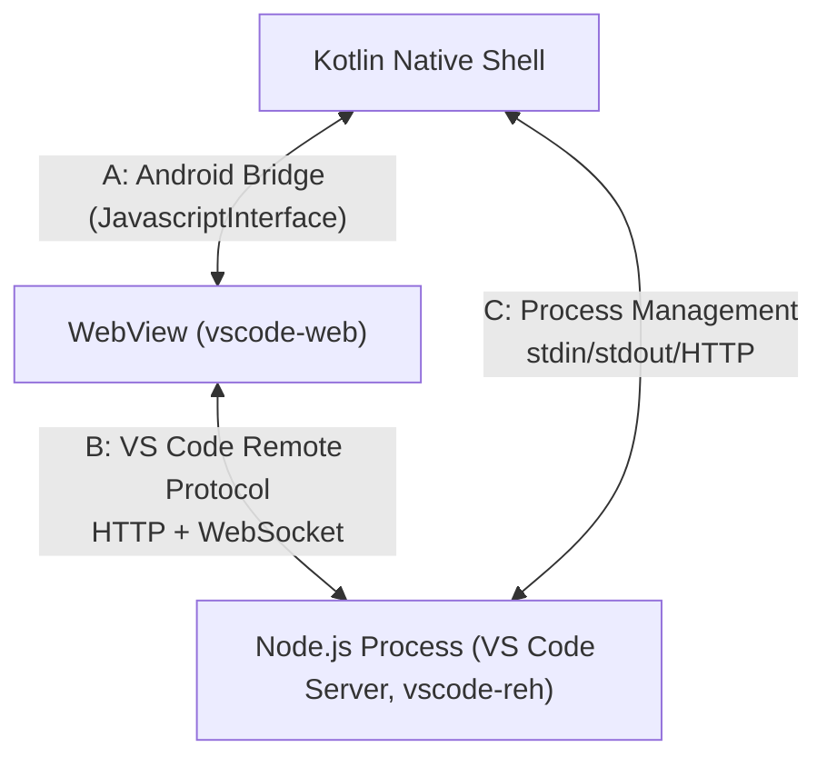
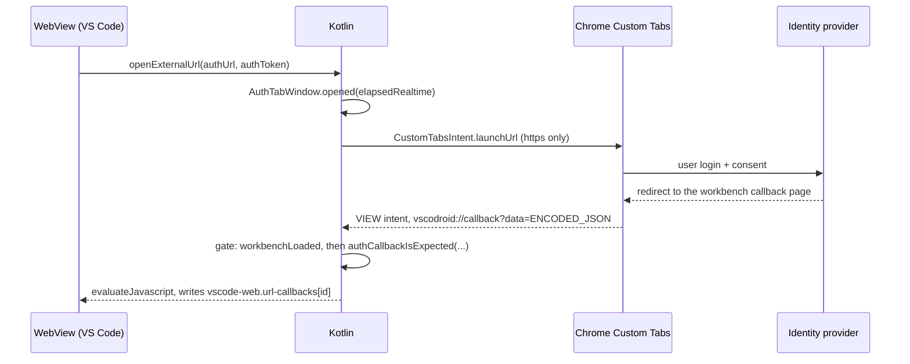
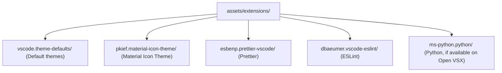

# API & Interface Specification

**Project**: VSCodroid
**Version**: 1.0-draft
**Date**: 2026-02-10

---

## 1. Internal APIs Overview

VSCodroid has three interface boundaries:


```mermaid
flowchart TD
  K["Kotlin Native Shell"] <--> |"A: Android Bridge (JavascriptInterface)"| W["WebView (vscode-web)"]
  W <--> |"B: VS Code Remote Protocol<br/>HTTP + WebSocket"| N["Node.js Process (VS Code Server, vscode-reh)"]
  K <--> |"C: Process Management<br/>stdin/stdout/HTTP"| N
```

---

## 2. (A) Android Bridge API

### 2.1 Bridge Registration

```kotlin
// In MainActivity
webView.addJavascriptInterface(AndroidBridge(this), "AndroidBridge")
```

### 2.2 Bridge Security Model

Bridge exposure is controlled by a per-session capability token. That is the whole
mechanism -- there is no origin-based control, and there cannot be one on this transport:
`@JavascriptInterface` does not carry the caller's origin, so a bridge method has nothing to
compare.

1. **Per-session token**: `SecurityManager` generates 32 random bytes at construction
   (`SecurityManager.kt:51-55`). `MainActivity.injectBridgeToken()` writes it to
   `window.__vscodroid.authToken` after the page loads (`MainActivity.kt:564-569`).
2. **Every method, not a chosen subset**: all 28 `@JavascriptInterface` methods take the
   token and validate it before doing anything, returning without acting on refusal
   (§2.4 records the one method whose refusal value is not an empty one).
   `BridgeTokenUniformityTest` enumerates them by reflection and fails the build
   if one is added without the check, and a second test asserts a refused call touches
   nothing -- so the rule holds for the class, not for a list that was correct when it was
   written. Note what that test checks: it calls each method with a token that will be
   refused and verifies the method *consulted* `validateToken`. It deliberately does not
   check the signature, because a `String` first parameter proves nothing about whether the
   method reads it.
   **The token is not always the first parameter.** Four methods take it last --
   `openExternalUrl(url, authToken)`, `installToolchain(name, authToken)`,
   `removeToolchain(name, authToken)` and `cancelToolchainInstall(name, authToken)`.
   Read the signature before calling; the position is not a convention you can rely on.
3. **Scheme allowlist**: `openExternalUrl()` accepts `https://`, `mailto:`, and `http://`
   to `localhost` or `127.0.0.1` (the last for dev-server preview). Everything else is
   refused and logged, including unparseable URLs (`SecurityManager.kt:21-49`).

### 2.3 Kotlin → JavaScript Methods

These methods are called from Kotlin via `evaluateJavascript()`:

#### Key Injection

```typescript
// Injected function: dispatch keyboard event to VS Code
interface KeyEvent {
  key: string; // "Tab", "Escape", "ArrowLeft", etc.
  code: string; // "Tab", "Escape", "ArrowLeft", etc.
  keyCode: number; // Legacy keyCode
  ctrlKey: boolean;
  altKey: boolean;
  shiftKey: boolean;
  metaKey: boolean;
}

// Usage from Kotlin:
// webView.evaluateJavascript("window.__vscodroid.injectKey(${keyJson})", null)
```

#### Memory Pressure Notification

```typescript
// Fired from MainActivity.onTrimMemory
window.__vscodroid.onLowMemory(level: number); // Android trim-memory level
```

This is the only hook Kotlin calls on the page, and the page supplies its own
consumer — `MainActivity` installs one, rather than the workbench providing it.

There is no `onServerReady`, `onServerRestarting`, `onOAuthCallback` or
`onOAuthError` on this object. Server readiness is a Kotlin-side callback on
`NodeService`; the page learns about it by being navigated, not by being called.
The OAuth pair described a flow this app does not implement — see §2.5.

### 2.4 JavaScript → Kotlin Methods

Exposed via `@JavascriptInterface`:

Every method takes the session token and validates it before doing anything; a call
with a token that does not match is refused before the method acts. Twenty-seven of
the twenty-eight then return an empty value — `false`, `null`, `""`, `"{}"`, `"[]"`,
`0`, or nothing. **`generateSshKey` is the exception**: it returns
`{"success":false,"error":"unauthorized"}`, a truthy string, so a caller testing
`if (!result)` reads a refusal as success. Test its `success` field. Read the token from
`window.__vscodroid.authToken`, which MainActivity sets once the bridge is installed.
`BridgeTokenUniformityTest` enumerates the methods by reflection and fails if one is
added without the check, so this holds for the class rather than for the list below.

**Registered is not the same as reachable, and the difference decides what an extension
can do.** All 28 methods below live on the `AndroidBridge` object injected into the
workbench page, so anything running in that page's own realm can call them directly. An
extension cannot: it runs in the web extension host, which does not see objects added by
`addJavascriptInterface`. Extensions reach the bridge over the BroadcastChannel relay
that `MainActivity.injectBridgeRelay` opens, and that relay dispatches a hand-written
list of **12** command names — grep `d.cmd ===` in `MainActivity.kt` for the current set:

> `clearCaches`, `generateBugReport`, `generateSshKey`, `getRecentFolders`,
> `getSshPublicKey`, `getStorageBreakdown`, `listSshKeys`, `openExternalUrl`,
> `openFolderPicker`, `openRecentFolder`, `openToolchainSettings`, `showAboutDialog`

A method absent from that list is unreachable from any extension however correctly it is
registered — which is the whole of why the toolchain management calls have no callers.
Adding a method to `AndroidBridge` does not publish it; the relay branch is a second,
separate edit, and nothing fails if you forget it.

#### Clipboard

```kotlin
@JavascriptInterface
fun copyToClipboard(authToken: String, text: String): Boolean
// Copies text to Android system clipboard
// Returns: true if successful

@JavascriptInterface
fun readFromClipboard(authToken: String): String?
// Reads text from Android system clipboard
// Returns: clipboard text or null

@JavascriptInterface
fun hasClipboardText(authToken: String): Boolean
// Checks if clipboard has text content
```

#### Navigation

```kotlin
@JavascriptInterface
fun openExternalUrl(url: String, authToken: String)
// Opens URL in system browser via Intent
// Used by: VS Code "Open in Browser" actions

@JavascriptInterface
fun onBackPressed(authToken: String): Boolean
// Called from VS Code when back button override is needed
// Returns: true if VS Code handled back navigation (closed a panel/dialog)
//          false if app should handle back (minimize/exit)

@JavascriptInterface
fun minimizeApp(authToken: String)
// Moves app to background (moveTaskToBack)
```

There is no `startGitHubOAuth`. Sign-in is started by the extension that wants it,
which hands its authorisation URL to `openExternalUrl` like any other link; the
Custom Tab and the return trip are described in §2.5.

#### File System

```kotlin
@JavascriptInterface
fun openFolderPicker(authToken: String)
// Opens the Android SAF folder picker.
// Returns NOTHING. The picked folder does not come back through this call:
// MainActivity receives the activity result, syncs the folder to its mirror
// and reloads the workbench on the new path.
```

There is no `openFilePicker` and no `requestStoragePermission`. Individual files are
not opened through a picker at all — a `content://` URI has no POSIX path and the
server only ever sees POSIX paths. And there is no `MANAGE_EXTERNAL_STORAGE` in the
manifest to request: external storage is reached through SAF, one user-granted folder
at a time.

#### Storage Management

```kotlin
@JavascriptInterface
fun getRecentFolders(authToken: String): String
// JSON array of previously granted SAF folders. "[]" if refused, and also
// "[]" when no SAF manager is wired up -- the two are indistinguishable here.
// Format: [{"uri": "content://...", "name": "MyProject", "lastOpened": 1700000000}]
// The key is "name", not "displayName", though it is built from the
// provider's display name.

@JavascriptInterface
fun openRecentFolder(authToken: String, uriString: String)
// Re-opens a previously granted SAF folder by URI.
// Returns NOTHING -- it hands the URI to MainActivity and returns. A URI whose
// grant has lapsed fails later, in the sync, not here. There is no return value
// to test for validity.

@JavascriptInterface
fun getStorageBreakdown(authToken: String): String
// Returns JSON with per-component disk usage in bytes:
// {"vscode_server": N, "extensions": N, "user_data": N, "logs": N,
//  "tools": N, "saf_mirrors": N, "cache": N, "total": N}

@JavascriptInterface
fun clearCaches(authToken: String): Long
// Clears npm-cache, tmp dir, crash logs, VS Code logs
// Returns: number of bytes freed

@JavascriptInterface
fun getAvailableStorage(authToken: String): Long
// Returns: available disk space in bytes
```

#### Device Info

```kotlin
@JavascriptInterface
fun getDeviceInfo(authToken: String): String
// Returns JSON string. These nine keys and no others -- there is no ram_mb,
// no storage_free_mb and no webview_version, though this block listed all
// three with plausible values for a long time. For free space call
// getAvailableStorage().
// {
//   "model": "Pixel 8",
//   "android": 36,
//   "api": 36,
//   "manufacturer": "Google",
//   "vscodroid_version": "1.0.0",
//   "screen_width": 1080,
//   "screen_height": 2400,
//   "screen_density": 2.625,
//   "orientation": "portrait"
// }
// `android` and `api` are the SAME value -- both are Build.VERSION.SDK_INT.
// This block used to show 16 and 36, which reads as a release number beside an
// API level; there is no release number here. `orientation` is the string
// "landscape" or "portrait".

@JavascriptInterface
fun getThemeMode(authToken: String): String
// Returns: "light" or "dark" (follows Android system theme)
```

### 2.5 Extension Auth Callback Relay (Chrome Custom Tabs)

Kotlin knows nothing about OAuth here. It relays one opaque blob between two
browser contexts, because the workbench's own callback mechanism assumes both ends
share a `localStorage`, and on Android they do not: `callback.html` opens in Chrome
while the workbench runs in the WebView.


```mermaid
sequenceDiagram
  participant W as WebView (VS Code)
  participant K as Kotlin
  participant C as Chrome Custom Tabs
  participant P as Identity provider
  W->>K: openExternalUrl(authUrl, authToken)
  K->>K: AuthTabWindow.opened(elapsedRealtime)
  K->>C: CustomTabsIntent.launchUrl (https only)
  C->>P: user login + consent
  P-->>C: redirect to the workbench callback page
  C-->>K: VIEW intent, vscodroid://callback?data=ENCODED_JSON
  K->>K: gate: workbenchLoaded, then authCallbackIsExpected(...)
  K-->>W: evaluateJavascript, writes vscode-web.url-callbacks[id]
```

The scheme is `vscodroid://callback`, not `vscodroid://oauth/<provider>`, and the
payload is a single `data` parameter carrying the workbench's own JSON — no
provider, code or state is parsed on the Kotlin side.

**Two gates, and both refuse rather than relay.** The VIEW filter is exported and
`BROWSABLE`, so any app or web page on the device can fire this intent:

| Gate | Where | What it rejects |
|---|---|---|
| `isExtensionCallback(scheme, host)` | `MainActivity.kt` | Anything that is not exactly scheme `vscodroid` **and** host `callback` |
| `workbenchLoaded` | `MainActivity.receiveCallbackIntent` | A callback arriving with no workbench page to receive it. Shows a "sign in again" toast rather than injecting — deliberately ahead of the timing gate, because a process killed while the browser had the foreground has no record of opening a tab |
| `authCallbackIsExpected(openedAt, now, AUTH_TAB_WINDOW_MILLIS)` | `MainActivity.kt` | A callback arriving outside the window since this app last handed an https URL to a browser. `AUTH_TAB_WINDOW_MILLIS` is 10 minutes (`AndroidBridge.kt`) |

The timing gate tests whether *this app* went looking for a sign-in, which is the
only thing separating a genuine return from an invented one — the legitimate sender
is a browser, so there is no caller identity to check, and the callback id is a
counter the workbench hands out from one rather than a secret. `AuthTabWindow`
records any https hand-off, not only a sign-in, because `openExternalUrl` cannot
tell an authorisation page from a documentation link.

A rejected callback is logged **without** the URI and raises no toast: it is the
payload of a sign-in this app did not start, and a message there would be one an
outside caller could raise at will.

Relaying is also the end of the recovery, not a repair. The workbench keeps the ids
it is waiting for in an in-memory `Set` that is never persisted, so a relayed value
is consumable only by the page instance that began the sign-in.

#### Logging

```kotlin
@JavascriptInterface
fun logToNative(authToken: String, level: String, tag: String, message: String)
// Sends log from WebView to Android Logcat
// level: "debug", "info", "warn", "error"
```

#### Crash Reporting

```kotlin
@JavascriptInterface
fun getLastCrash(authToken: String): String?
// Returns the most recent crash log text, or null if no crashes recorded
// Privacy: crash logs are stored locally only, never transmitted

@JavascriptInterface
fun generateBugReport(authToken: String): String
// Generates a comprehensive bug report containing:
// - Device info (model, Android version, app version)
// - Memory usage
// - Recent crash logs (up to 3)
// - Last 200 lines of Node.js server output

@JavascriptInterface
fun clearCrashLogs(authToken: String)
// Clears all stored crash logs
```

#### SSH Key Management

```kotlin
@JavascriptInterface
fun generateSshKey(authToken: String, comment: String): String
// Generates an ed25519 keypair at ~/.ssh/id_ed25519 using the bundled
// ssh-keygen. The second argument is the key's COMMENT, not a key type --
// the algorithm is not selectable, and a value like "rsa" would simply be
// written into the comment field.
// Empty passphrase, deliberately: the key is protected by the app sandbox,
// which is the right trade against typing one on a phone keyboard.
// Never overwrites an existing key; if one is there, returns it unchanged.
// Returns a JSON OBJECT string, not a bare key:
//   {"success": true,  "publicKey": "ssh-ed25519 AAAA..."}                  <- newly generated
//   {"success": true,  "publicKey": "ssh-ed25519 AAAA...", "existed": true} <- already there
//   {"success": false, "error": "..."}
// `existed` appears ONLY on the reuse path -- absent, not false, on a fresh
// generation. It is the only way to tell "a key was made for you, upload it"
// from "you already had one": publicKey looks identical either way.

@JavascriptInterface
fun getSshPublicKey(authToken: String): String
// Reads ~/.ssh/id_ed25519.pub. Returns "" if there is no such file --
// empty string is also what a refused token returns, so it is not evidence
// that the key is missing.

@JavascriptInterface
fun listSshKeys(authToken: String): String
// Every *.pub in ~/.ssh/, as a JSON array. Returns "[]" if the directory
// does not exist. A key whose file cannot be read is skipped, not reported.
// Each entry: { name, type, comment }
//   name    — filename without the .pub suffix
//   type    — first field of the public key line, e.g. "ssh-ed25519"
//   comment — third field, "" when absent
// NOT a fingerprint: nothing here computes one. The KDoc on this method
// said "fingerprint" while the code wrote "comment".
```

#### Toolchain Control

`ToolchainRegistry.available` is the source for what these can name. It lists Go, Ruby
and Java 17 today.

```kotlin
@JavascriptInterface
fun getAvailableToolchains(authToken: String): String
// Every registry entry, installed or not, as a JSON array. "[]" if refused.
// Each entry: { packName, displayName, description, estimatedSize, installed }
// packName carries the "toolchain_" prefix; `installed` is computed against
// the short name with that prefix stripped.

@JavascriptInterface
fun getInstalledToolchains(authToken: String): String
// JSON array of installed SHORT names, e.g. ["go","ruby"]. "[]" if refused.

@JavascriptInterface
fun installToolchain(name: String, authToken: String)   // note: token LAST
// Starts an async download + install. Accepts a pack name or a short name.
// Returns immediately and reports nothing; progress arrives through the
// manager's own state callbacks, not through a return value.

@JavascriptInterface
fun removeToolchain(name: String, authToken: String)    // note: token LAST
// Deletes the toolchain's files, symlinks and env entries.

@JavascriptInterface
fun cancelToolchainInstall(name: String, authToken: String)  // note: token LAST
// Cancels an in-progress download. Takes the pack NAME -- this was documented
// for a long time as taking only a token, which would not compile.

@JavascriptInterface
fun openToolchainSettings(authToken: String)
// Starts ToolchainActivity. Reachable over the relay as `openToolchainSettings`,
// and NO BUNDLED EXTENSION SENDS IT -- the route users actually take to that
// screen is the launcher shortcut. See SplashActivity's publishToolchainShortcut.
```

#### About

```kotlin
@JavascriptInterface
fun showAboutDialog(authToken: String)
// Shows the native About dialog with version info, licenses, and links
```

---

## 3. (B) VS Code Remote Protocol

This is VS Code's built-in protocol. VSCodroid uses it as-is (no modifications needed).

### 3.1 HTTP Endpoints (Served by VS Code Server)

| Endpoint                  | Method | Description                                  |
| ------------------------- | ------ | -------------------------------------------- |
| `/`                       | GET    | Serve vscode-web index.html                  |
| `/static/**`              | GET    | Serve static assets (JS, CSS, fonts, images) |
| `/healthz`                | GET    | Health check (returns 200 when server ready) |
| `/vscode-remote-resource` | GET    | Serve workspace files to web client          |

### 3.2 WebSocket Connection

| Endpoint                 | Description                                    |
| ------------------------ | ---------------------------------------------- |
| `ws://localhost:PORT/ws` | Main RPC channel between web client and server |

**Protocol**: VS Code's `IExtHostRpcProtocol` — binary-framed messages with JSON-RPC semantics.

**Message types** (handled by VS Code internally):

- File system operations (read, write, stat, readdir, watch)
- Extension Host RPC (activate, deactivate, API calls)
- Terminal I/O (create session, write, resize, kill)
- Search operations (text search, file search)
- Debug Adapter Protocol messages
- SCM/Git operations
- Configuration sync

### 3.3 Server Launch Arguments

```
--host=127.0.0.1              # Localhost only
--port=PORT                   # Dynamic port
--extensions-dir=PATH         # Custom extensions location
--user-data-dir=PATH          # User settings location
--server-data-dir=PATH        # Server data location
--logsPath=PATH               # Log directory
--log=info                    # Log level
```

---

## 4. (C) Process Management API

### 4.1 Node.js Process Lifecycle

```kotlin
interface ProcessManager {

    // Launch Node.js server process
    fun startServer(
        nodePath: String,           // Path to libnode.so
        serverScript: String,       // Path to server.js
        port: Int,                  // Localhost port
        environment: Map<String, String>,
        maxOldSpaceSize: Int = 512  // V8 heap limit in MB
    ): Process

    // Check if server is ready
    suspend fun waitForReady(
        port: Int,
        timeoutMs: Long = 30_000,
        pollIntervalMs: Long = 200
    ): Boolean

    // Health check
    fun isServerHealthy(port: Int): Boolean

    // Graceful shutdown
    fun stopServer(process: Process, timeoutMs: Long = 5_000)

    // Force kill
    fun killServer(process: Process)

    // Get server PID
    fun getServerPid(process: Process): Long?
}
```

### 4.2 Health Check

```
GET http://localhost:PORT/healthz

Response 200: Server is ready
Response timeout/error: Server not ready or crashed
```

**Polling strategy**:

```
Initial:   poll every 200ms for up to 30 seconds
Running:   poll every 5 seconds (background watchdog)
After crash: poll every 200ms for up to 10 seconds (restart detection)
```

### 4.3 Process Death Handling

```kotlin
// Monitor process via thread
thread(name = "node-watchdog") {
    val exitCode = process.waitFor()  // Blocks until process exits
    when {
        exitCode == 0     -> log("Server shut down gracefully")
        exitCode == 137   -> log("Server killed (OOM or phantom limit)")
        else              -> log("Server crashed: exit=$exitCode")
    }
    // Auto-restart unless app is finishing
    if (!isFinishing) {
        restartServer()
    }
}
```

---

## 5. Extension Integration API

### 5.1 Open VSX Gallery API (used by VS Code UI)

VS Code's built-in extension marketplace UI uses these endpoints (configured in product.json):

```
Base URL: https://open-vsx.org/vscode

GET /gallery/extensionquery
  Query extensions by search term, category, etc.
  Body: VS Code Gallery API format (JSON)

GET /item?itemName={publisher}.{name}
  Get extension detail page URL

GET /unpkg/{publisher}/{name}/{version}/{path}
  Get extension resource (icon, README, VSIX)
```

### 5.2 Extension Lifecycle

```
Install:
  1. Download .vsix from Open VSX
  2. Extract to ~/.vscodroid/extensions/{publisher}.{name}-{version}/
  3. Read package.json for activation events
  4. Register with Extension Host

Activate:
  1. Activation event fires (e.g., onLanguage:python, *)
  2. Extension Host loads extension main module
  3. activate() function called
  4. Extension registers commands, providers, etc.

Deactivate:
  1. deactivate() function called
  2. Disposables cleaned up
```

### 5.3 Pre-bundled Extensions

Shipped in assets/extensions/ and extracted to ~/.vscodroid/extensions/ on first run:


```mermaid
flowchart TD
  ROOT["assets/extensions/"] --> E1["vscode.theme-defaults/ (Default themes)"]
  ROOT --> E2["pkief.material-icon-theme/ (Material Icon Theme)"]
  ROOT --> E3["esbenp.prettier-vscode/ (Prettier)"]
  ROOT --> E4["dbaeumer.vscode-eslint/ (ESLint)"]
  ROOT --> E5["ms-python.python/ (Python, if available on Open VSX)"]
```

---

## 6. Toolchain Manager API

### 6.1 Internal API

```typescript
interface ToolchainManager {
  // List available toolchains
  listAvailable(): Promise<Toolchain[]>;

  // List installed toolchains
  listInstalled(): Promise<Toolchain[]>;

  // Request toolchain asset pack from Play Store and configure
  install(id: string, onProgress: (percent: number) => void): Promise<void>;

  // Remove installed toolchain (free storage)
  uninstall(id: string): Promise<void>;

  // Check if toolchain asset pack is downloaded
  isInstalled(id: string): boolean;

  // Check if toolchain needed for file type
  suggestForFile(filename: string): Toolchain | null;
}

interface Toolchain {
  id: string; // "go", "rust", "java"
  name: string; // "Go"
  version: string; // "1.22"
  sizeMb: number; // 60
  installed: boolean; // Whether asset pack is downloaded and extracted
  installPath?: string; // e.g., "$PREFIX/lib/go"
  fileAssociations: string[]; // [".go", "go.mod"]
  recommendedExtensions: string[]; // ["golang.Go"]
}
```

### 6.2 Package Manager CLI API

```bash
vscodroid pkg <command> [args]

Commands:
  search <query>    Search packages (queries Termux repo index)
  install <pkg>     Download and install package
  remove <pkg>      Remove installed package
  list              List installed packages
  list-available    List all available packages
  update            Update all packages
  info <pkg>        Show package details

Exit codes:
  0 = success
  1 = package not found
  2 = download failed
  3 = installation failed
  4 = insufficient storage
```

> **Note**: Package installation from Termux repositories is only available in the sideloaded version. Play Store version uses on-demand asset packs exclusively.

---

## 7. Error Codes

### 7.1 Server Errors

| Code | Name                | Description                               |
| ---- | ------------------- | ----------------------------------------- |
| E001 | SERVER_START_FAILED | Node.js failed to start                   |
| E002 | SERVER_TIMEOUT      | Server didn't become ready within timeout |
| E003 | SERVER_CRASH        | Server process exited unexpectedly        |
| E004 | SERVER_OOM          | Server killed due to out-of-memory        |
| E005 | PORT_IN_USE         | Localhost port already in use             |

### 7.2 WebView Errors

| Code | Name                | Description                                |
| ---- | ------------------- | ------------------------------------------ |
| E101 | WEBVIEW_CRASH       | WebView renderer process crashed           |
| E102 | WEBVIEW_TOO_OLD     | WebView version below minimum (Chrome 105) |
| E103 | WEBVIEW_LOAD_FAILED | Failed to load VS Code UI from localhost   |

### 7.3 Binary Errors

| Code | Name                  | Description                                   |
| ---- | --------------------- | --------------------------------------------- |
| E201 | EXTRACT_FAILED        | Failed to extract assets on first run         |
| E202 | BINARY_NOT_FOUND      | Expected binary missing from nativeLibraryDir |
| E203 | BINARY_NOT_EXECUTABLE | Binary lacks execute permission               |
| E204 | STORAGE_FULL          | Insufficient storage for extraction           |

### 7.4 Toolchain Errors

| Code | Name            | Description                                          |
| ---- | --------------- | ---------------------------------------------------- |
| E301 | DOWNLOAD_FAILED | Toolchain asset pack download failed (network error) |
| E302 | EXTRACT_FAILED  | Toolchain asset pack extraction failed               |
| E303 | STORAGE_FULL    | Insufficient storage for toolchain                   |
| E304 | ASSET_NOT_FOUND | Toolchain not available in Play Store asset packs    |
| E305 | CONFIG_FAILED   | Failed to configure PATH/env for toolchain           |
