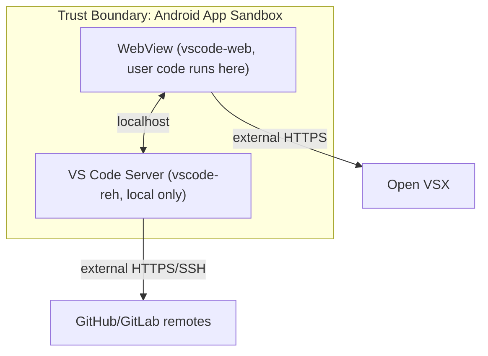

# Security Design Document

**Project**: VSCodroid
**Version**: 1.0-draft
**Date**: 2026-02-10

---

## 1. Security Principles

| Principle | Description |
|-----------|-------------|
| **Least privilege** | Request only necessary Android permissions |
| **Defense in depth** | Multiple layers of protection |
| **Secure by default** | No telemetry, localhost-only server, no external network exposure |
| **Transparency** | Open source, no hidden data collection |

---

## 2. Threat Model

### 2.1 System Boundaries

### 2.2 Threat Actors

| Actor | Capability | Motivation |
|-------|-----------|------------|
| Malicious extension | Code execution in Extension Host | Data theft, crypto mining |
| Network attacker | Traffic interception on same network | Credential theft |
| Other Android apps | Inter-process communication | Data access |
| Physical access | Device access | Data theft |

### 2.3 Threat Matrix (STRIDE)

| Threat | Category | Impact | Likelihood | Mitigation |
|--------|----------|--------|------------|------------|
| Other app connects to localhost server | **Spoofing** | Medium | Low | localhost-only binding, no connection token needed |
| Malicious extension impersonates trusted extension | **Spoofing** | Medium | Low | Open VSX publisher verification, user review |
| Malicious extension steals files | **Tampering** | High | Medium | Extension sandbox (Extension Host only), user awareness |
| Man-in-middle on Open VSX downloads | **Tampering** | High | Low | HTTPS only, certificate pinning (future) |
| No audit trail for file changes by extensions | **Repudiation** | Low | Medium | VS Code timeline/git history, extension activity logging (future) |
| User denies executing destructive terminal command | **Repudiation** | Low | Low | Terminal session history persisted via tmux |
| Extension phones home with user data | **Information Disclosure** | High | Medium | No internet by default for ext host (post-v1.0 hardening, tracked in backlog) |
| SSH key theft via backup | **Information Disclosure** | High | Low | Backup rules exclude ~/.ssh/ (M1); Android Keystore migration (post-v1.0 hardening) |
| Crash-loop DoS on Node.js server | **Denial of Service** | Low | Medium | Auto-restart with exponential backoff, max restart count |
| Malicious extension consuming all memory/CPU | **Denial of Service** | Medium | Low | Extension Host resource limits, idle-kill for LS |
| WebView XSS via malicious file content | **Elevation of Privilege** | Medium | Low | VS Code CSP, WebView sandboxing |
| Extension/webview script abuses AndroidBridge methods | **Elevation of Privilege** | High | Medium | Bridge origin allowlist + per-session capability token + sensitive method gating |
| Extension escapes sandbox to access system files | **Elevation of Privilege** | High | Low | Android app sandbox, Extension Host isolation (fork in M1-M3, worker_thread in M4) |

---

## 3. Security Controls

### 3.1 Network Security

| Control | Implementation |
|---------|---------------|
| Localhost-only server | Node.js binds to `127.0.0.1` exclusively |
| No connection token | Not needed — only local process can connect to localhost |
| HTTPS for external requests | Open VSX, GitHub — all HTTPS |
| No telemetry | Microsoft telemetry stripped via patch. Zero data sent to external analytics |
| No auto-update phone home | Update check disabled. Updates via Play Store only |

### 3.2 Application Security

| Control | Implementation |
|---------|---------------|
| Android App Sandbox | Standard Android process isolation |
| App-private storage | Files in /data/data/com.vscodroid/ — inaccessible to other apps |
| WebView process isolation | WebView renderer runs in separate process |
| AndroidBridge access control | Only top-level localhost workbench can call sensitive bridge methods (origin check + session token) |
| Code signing | APK/AAB signed with release key |
| No dynamic code loading (Play Store) | Core binaries bundled as .so in APK; toolchains as on-demand asset packs via Play Store. No runtime binary download in Play Store version. Sideload version (GitHub releases) includes optional package manager for advanced users |
| Foreground Service notification | User always sees when server is running |

### 3.3 Extension Security

| Control | Implementation |
|---------|---------------|
| Extension Host isolation | Runs via child_process.fork() in M1-M3, migrated to worker_thread in M4 for phantom process optimization |
| VS Code Extension API sandbox | Extensions can only access vscode.* APIs |
| AndroidBridge capability model | Sensitive bridge APIs require valid per-session token and trusted origin |
| File system scoping | Extensions see workspace folder by default |
| Open VSX moderation | Open VSX has publisher verification and abuse reporting |
| User consent | User explicitly installs each extension |

### 3.4 Data Protection

| Data | Protection |
|------|-----------|
| User source code | App-private storage, not backed up by default |
| VS Code settings | App-private storage |
| Git credentials | Git credential store in app-private home dir |
| SSH keys | File permissions 600, app-private storage |
| OAuth tokens | SharedPreferences (M4 initial); migrate to Android Keystore (post-v1.0, tracked as security hardening task) |
| Clipboard data | Transient, follows Android clipboard lifecycle |

### 3.5 Toolchain Delivery Security

| Control | Implementation |
|---------|---------------|
| Play Store delivery | Toolchains delivered as on-demand asset packs via Play Store |
| Code signing | Asset packs signed with same key as base APK (Play Store enforced) |
| User-initiated only | Toolchains only downloaded when user selects them in Language Picker |
| App-private storage | Toolchains extracted to /data/data/com.vscodroid/ — inaccessible to other apps |
| Sideload integrity | GitHub Releases APKs include SHA256 checksums for verification |

### 3.6 Backup Security

| Data | Backup Behavior |
|------|----------------|
| VS Code settings (themes, keybindings) | Included in Android auto-backup |
| SSH keys (~/.ssh/) | Excluded from backup |
| Git credentials (~/.gitconfig) | Excluded from backup |
| User workspace files | Excluded from backup (too large, user-managed) |
| Installed extensions | Excluded (re-downloadable) |
| Server logs | Excluded |

---

## 4. Android Permissions

### 4.1 Required Permissions

| Permission | Reason | When Requested |
|-----------|--------|----------------|
| `INTERNET` | Open VSX, GitHub, toolchain downloads | Install time |
| `FOREGROUND_SERVICE` | Keep Node.js alive in background | Install time |
| `FOREGROUND_SERVICE_SPECIAL_USE` | Dev server foreground service type | Install time |
| `POST_NOTIFICATIONS` | Foreground Service notification (API 33+) | Runtime |
| `WAKE_LOCK` | Prevent sleep during long operations (optional) | Runtime |

### 4.2 Optional Permissions

| Permission | Reason | When Requested |
|-----------|--------|----------------|
| `MANAGE_EXTERNAL_STORAGE` | Access projects outside app directory | Runtime, with explanation |
| `REQUEST_INSTALL_PACKAGES` | N/A — not needed | Never |

### 4.3 Permissions NOT Requested

| Permission | Why Not |
|-----------|---------|
| `CAMERA` | Not needed for code editor |
| `MICROPHONE` | Not needed |
| `LOCATION` | Not needed |
| `CONTACTS` | Not needed |
| `PHONE` | Not needed |
| `READ_EXTERNAL_STORAGE` | Using SAF instead where needed |

---

## 5. Sensitive Data Handling

### 5.1 Data Classification

| Classification | Examples | Handling |
|---------------|----------|----------|
| **User Code** | Source files in workspace | App-private storage. Never uploaded anywhere. |
| **Credentials** | Git passwords, SSH keys, OAuth tokens | App-private storage. Not included in backups. |
| **Settings** | VS Code settings, preferences | App-private storage. May be synced via Settings Sync if user enables. |
| **Cache** | WebView cache, extension cache | Clearable. No sensitive data. |
| **Telemetry** | None | No telemetry collected or transmitted. |

### 5.2 Data at Rest

- All data stored in Android app-private directory (`/data/data/com.vscodroid/`)
- Protected by Android's Linux-based file permissions
- Encrypted at rest by Android full-disk encryption (enabled by default on modern devices)

### 5.3 Data in Transit

| Flow | Protocol | Notes |
|------|----------|-------|
| WebView ↔ Server | HTTP (localhost) | No encryption needed — same device, loopback only |
| App ↔ Open VSX | HTTPS | TLS 1.2+ |
| App ↔ GitHub | HTTPS or SSH | TLS 1.2+ or SSH |
| App ↔ Play Store (Asset Delivery) | HTTPS | Managed by Play Store |

---

## 6. Incident Response

### 6.1 Vulnerability Disclosure

- Security issues: report via email (security@vscodroid.dev) or GitHub Security Advisory (private)
- Response time: acknowledge within 48 hours, fix within 7 days for critical
- Disclosure: coordinated disclosure after fix is available

### 6.2 Malicious Extension Response

If a malicious extension is reported:
1. Verify the report
2. Report to Open VSX for removal
3. Add to local blocklist in next app update (if needed)
4. Notify affected users via in-app message (if possible)

---

## 7. Security Testing Checklist

| Test | Method | Frequency |
|------|--------|-----------|
| Server only binds to localhost | `netstat` / port scan from another device | Every release |
| No telemetry network requests | Network traffic capture (Charles/mitmproxy) | Every release |
| Extension Host isolation | Install test extension that attempts privilege escalation | Every release |
| WebView CSP headers | Chrome DevTools Network tab | Every release |
| APK signature verification | `apksigner verify` | Every release |
| Dependency vulnerability scan | `npm audit`, `safety check` (Python) | Weekly |
| Binary integrity | SHA256 checksums of bundled .so files | Every build |
| Storage permission scope | Attempt to read/write outside app directory | Every release |
| AndroidBridge origin/token enforcement | Attempt bridge calls from untrusted frame/origin, verify rejected | Every release |
| Backup exclusion verification | Validate backup payload excludes `~/.ssh`, `.gitconfig`, workspace | Every release |
