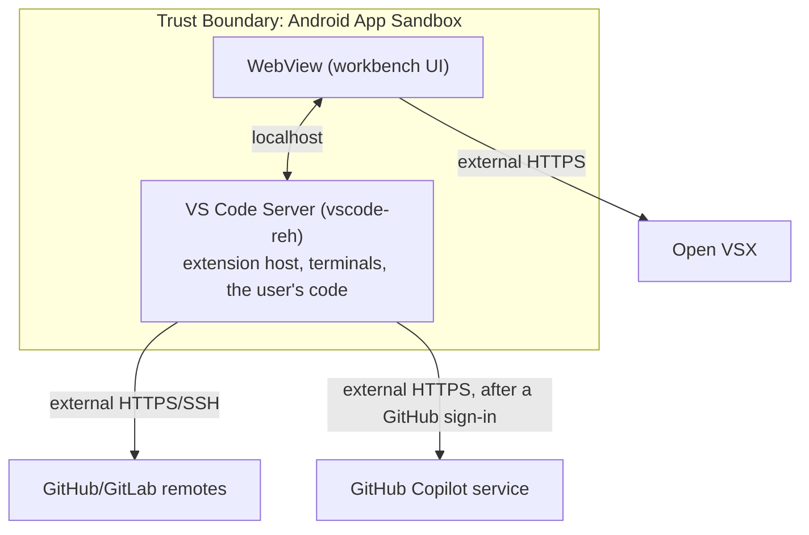

# Security Design Document

**Project**: VSCodroid
**Version**: 1.0-draft
**Date**: 2026-02-10

---

## 1. Security Principles

| Principle             | Description                                                       |
| --------------------- | ----------------------------------------------------------------- |
| **Least privilege**   | Request only necessary Android permissions                        |
| **Defense in depth**  | Multiple layers of protection                                     |
| **Secure by default** | No telemetry, localhost-only server, no external network exposure |
| **Transparency**      | Open source, no hidden data collection                            |

---

## 2. Threat Model

### 2.1 System Boundaries

```mermaid
flowchart TD
  subgraph SANDBOX["Trust Boundary: Android App Sandbox"]
    W["WebView (workbench UI)"] <--> |"localhost"| N["VS Code Server (vscode-reh)<br/>extension host, terminals, the user's code"]
  end
  W --> |"external HTTPS"| O["Open VSX"]
  N --> |"external HTTPS/SSH"| G["GitHub/GitLab remotes"]
  N --> |"external HTTPS, after a GitHub sign-in"| C["GitHub Copilot service"]
```

The last edge is drawn because this document did not name it until 2026-08-23, and a threat model
that omits the one shipped component which sends the user's source somewhere is not a threat model.
`extensions/copilot` in the server tree is GitHub Copilot Chat (`GitHub.copilot-chat` 0.61.0,
290 MB), the packaged `product.json` names it in `defaultChatAgent`, and its `package.json` declares
only `main`, so it runs in the Node extension host and its requests leave from the server side.
Section 5.1 carries the consequence for the data classification.

### 2.2 Threat Actors

| Actor               | Capability                           | Motivation                |
| ------------------- | ------------------------------------ | ------------------------- |
| Malicious extension | Code execution in Extension Host     | Data theft, crypto mining |
| Network attacker    | Traffic interception on same network | Credential theft          |
| Other Android apps  | Inter-process communication          | Data access               |
| Physical access     | Device access                        | Data theft                |

### 2.3 Threat Matrix (STRIDE)

| Threat                                                | Category                   | Impact | Likelihood | Mitigation                                                                          |
| ----------------------------------------------------- | -------------------------- | ------ | ---------- | ----------------------------------------------------------------------------------- |
| Other app connects to localhost server                | **Spoofing**               | Medium | Low        | localhost-only binding, plus a connection token required on all but three routes           |
| Malicious extension impersonates trusted extension    | **Spoofing**               | Medium | Low        | Open VSX namespace ownership and the user's own reading of the listing. **Signatures are not checked**: see the extension provenance row in 3.3 |
| Malicious extension steals files                      | **Tampering**              | High   | Medium     | **Not mitigated.** The extension host is a fault boundary, not a security one: an extension reaches app-private storage and the network exactly as the app does. What bounds it is the Android app sandbox and the SAF grants the user gave |
| Man-in-middle on Open VSX downloads                   | **Tampering**              | High   | Low        | HTTPS only, certificate pinning (future)                                            |
| No audit trail for file changes by extensions         | **Repudiation**            | Low    | Medium     | VS Code timeline/git history, extension activity logging (future)                   |
| User denies executing destructive terminal command    | **Repudiation**            | Low    | Low        | Accepted, no audit trail. Each terminal spawns bash directly on a PTY through node-pty, and the only record is bash's own history file in app-private storage, which the user can edit or clear |
| Extension phones home with user data                  | **Information Disclosure** | High   | Medium     | **Not mitigated.** The extension host is a Node process with the app's own network access, and nothing in this app filters what it reaches. "No internet by default for the extension host" was listed here as a planned control until 2026-08-23; nothing was built and the shipped configuration goes the other way, see the row below |
| Bundled chat provider sends the user's source to GitHub | **Information Disclosure** | High   | Medium     | **By design, and disclosed rather than blocked.** GitHub Copilot Chat ships in the server tree and `product.json` makes it the editor's chat provider. It has no account and no chat until the user signs in to GitHub, but it is not dormant until then: its manifest lists `onStartupFinished`, so it activates on every start, and its model backend runs signed out, which is why the idle baseline in `process-monitor.js` counts it. Whether that backend sends anything before sign-in has not been established here. From sign-in on, a prompt and the context the extension attaches (the open file, and other parts of the project) go to GitHub. It can be disabled from the Extensions view but not uninstalled, because it is a built-in. `docs/PRIVACY_POLICY.md` states this in the terms a user reads |
| SSH key theft via backup                              | **Information Disclosure** | High   | Low        | Backup rules exclude ~/.ssh/ (M1); Android Keystore migration (post-v1.0 hardening) |
| Crash-loop DoS on Node.js server                      | **Denial of Service**      | Low    | Medium     | Auto-restart with exponential backoff, max restart count                            |
| Malicious extension consuming all memory/CPU          | **Denial of Service**      | Medium | Low        | **Nothing caps total memory.** The V8 old-space ceiling the server is started with (`ProcessManager.heapCeilingForDevice`) caps each isolate at that number rather than capping their sum, so the extension host worker gets its own allowance of it rather than drawing on the server's, and a language server the extension host forks sets its own ceiling outside this control (tsserver builds one from `tsserver.maxMemory`, upstream default 3072). What the ceiling buys is that no single isolate grows without bound. `process-monitor.js` sheds idle language servers under critical memory pressure or at 24 processes. Neither bounds CPU, and a busy loop in the extension host is not reachable from here |
| WebView XSS via malicious file content                | **Elevation of Privilege** | Medium | Low        | VS Code CSP, WebView sandboxing                                                     |
| Extension/webview script abuses AndroidBridge methods | **Elevation of Privilege** | High   | Medium     | Per-session capability token on every bridge method, pinned by a reflection test    |
| Extension reads files outside the app                 | **Elevation of Privilege** | High   | Low        | Android app sandbox, and SAF grants for anything outside it. The worker_thread the extension host runs in is not part of this: it exists so the host does not spend a phantom process slot |
| Config file in an opened folder runs on open          | **Elevation of Privilege** | Medium | Medium     | **Not mitigated. There is no Workspace Trust prompt, ever.** `assets/server.js` starts the server with `--disable-workspace-trust`, the server parses that once at spawn, and one server here serves every folder the app opens, so the flag cannot follow a folder. A folder opened through the SAF picker is therefore as trusted as the user's own projects directory, and the bundled `dbaeumer.vscode-eslint` loads and executes its `eslint.config.js`. The flag also buys activation: eslint and `ms-python.python` both declare `untrustedWorkspaces.supported: false`, so without it neither runs at all |

---

## 3. Security Controls

### 3.1 Network Security

| Control                     | Implementation                                                               |
| --------------------------- | ---------------------------------------------------------------------------- |
| Localhost-only server       | Node.js binds to `127.0.0.1` exclusively                                     |
| Connection token            | Required on every route except `/version`, `/delay-shutdown` and `/callback`. Generated by the server, kept in app-private storage, owner-readable only |
| HTTPS for external requests | Open VSX, GitHub, and the GitHub Copilot endpoints the bundled chat extension uses: all HTTPS |
| No telemetry                | `branding/product.json` sets `enableTelemetry: false` and `telemetryOptIn: false` into the Code - OSS build, `server.js` writes both again at every start, and the default settings pin `telemetry.telemetryLevel: "off"`. The packaged `product.json` carries no telemetry endpoint |
| Bundled extension telemetry | Not the same claim as the row above, and worth stating separately. `extensions/copilot/dist/extension.js` carries its own senders (`copilot-telemetry.githubusercontent.com`, two Application Insights hosts). They are gated on the editor's own switch, which this build pins off: the extension reads `vscode.env.isTelemetryEnabled` and the `TelemetryLogger` the editor derives from `telemetry.telemetryLevel`. That gate is a setting, not a removal: what the extension sends is decided by the editor's telemetry level at the time, and the row above is what pins it |
| No auto-update phone home   | No update URL in `product.json` and `update.mode: "none"` in the default settings. New versions arrive from the Play Store or a GitHub Release APK |

### 3.2 Application Security

| Control                              | Implementation                                                                                                                                                                                                                     |
| ------------------------------------ | ---------------------------------------------------------------------------------------------------------------------------------------------------------------------------------------------------------------------------------- |
| Android App Sandbox                  | Standard Android process isolation                                                                                                                                                                                                 |
| App-private storage                  | Files in /data/data/com.vscodroid/, inaccessible to other apps. The projects tree is the one thing not there, see 5.2                                                                                                              |
| WebView process isolation            | WebView renderer runs in separate process                                                                                                                                                                                          |
| AndroidBridge access control         | Every bridge method requires the per-session token and refuses without it; a reflection test fails the build if one is added that does not. There is no origin check -- `@JavascriptInterface` does not carry the caller's origin |
| Code signing                         | APK/AAB signed with release key                                                                                                                                                                                                    |
| No dynamic code loading (Play Store) | Core binaries bundled as .so in APK; toolchains as on-demand asset packs via Play Store. No runtime binary download in Play Store version. Sideload installs download toolchain ZIPs from GitHub Releases; `vscodroid pkg` is planned, not shipped |
| Foreground Service notification      | User always sees when server is running                                                                                                                                                                                            |

### 3.3 Extension Security

| Control                        | Implementation                                                                                           |
| ------------------------------ | -------------------------------------------------------------------------------------------------------- |
| Extension Host isolation       | Runs as a worker_thread inside the server process, applied by `patches/0004-exthost-as-worker-thread.patch`, so it does not spend one of Android's 32 phantom process slots |
| Extension reach                | **No sandbox.** The extension host is Node, so an extension can `require('fs')` and reach whatever the app can. The `vscode.*` API is a convenience, not a boundary |
| AndroidBridge capability model | All bridge APIs require the valid per-session token; no origin component, and section 3.7 says who shares that origin |
| Extension provenance           | **A VSIX is trusted on the HTTPS connection to Open VSX and nothing else.** `FirstRunSetup` writes `extensions.verifySignature: false` into the machine defaults, and it has to: signature checking loads `@vscode/vsce-sign`, which no Code - OSS build ships and which is absent from `vscode-reh/node_modules`, so with the setting left at its default every gallery install fails with `SignatureVerificationInternal` (`out/server-main.js`, `downloadExtension`). There is no revocation feed either: `server.js` sets `extensionsGallery.controlUrl` to the empty string, and `getExtensionsControlManifest` then answers an empty malicious-and-deprecated list without asking anyone |
| Extension updates              | Unattended. `extensions.autoCheckUpdates` (default true) and `extensions.autoUpdate` (default `"on"`) are APPLICATION-scoped, so the machine settings file this app writes cannot change them; the workbench asks Open VSX at startup and every 12 hours and installs what it finds, with no publisher verification behind it. The user can turn both off in the editor's own settings |
| File system scoping            | Extensions see workspace folder by default                                                               |
| Open VSX moderation            | Open VSX has namespace ownership and abuse reporting                                                     |
| User consent                   | User explicitly installs each extension. The exception is `GitHub.copilot-chat`, which ships in the server tree and is present from first launch |

### 3.4 Data Protection

| Data             | Protection                                                                                                  |
| ---------------- | ----------------------------------------------------------------------------------------------------------- |
| User source code | Two locations, see 5.2. Not backed up. Sent nowhere by the app itself; the bundled chat provider is the exception and section 5.1 names it |
| VS Code settings | App-private storage                                                                                         |
| Git credentials  | Git credential store in app-private home dir                                                                |
| SSH keys         | File permissions 600, app-private storage                                                                   |
| OAuth tokens     | Held by the workbench's own secret storage, which `patches/0007-persist-secrets.patch` keeps across a restart. They sit in the WebView's IndexedDB as plaintext; the boundary around them is the Android app sandbox, not encryption |
| Clipboard data   | Transient, follows Android clipboard lifecycle                                                              |

### 3.5 Toolchain Delivery Security

There are two delivery paths, chosen at runtime, and they have different integrity stories.
`ToolchainManager` reads `getInstallSourceInfo().installingPackageName`: an install that came
from `com.android.vending` uses Play Asset Delivery, and every other install (sideload, debug
build, `adb install`) downloads the same toolchains over HTTPS from this project's GitHub
Releases. Only the first is covered by Play's signing.

| Control             | Implementation                                                                 |
| ------------------- | ------------------------------------------------------------------------------ |
| Play delivery       | Toolchains delivered as on-demand asset packs: Ruby and Java 17, those two     |
| Code signing        | Asset packs signed with same key as base APK (Play Store enforced)             |
| HTTPS delivery      | For non-Play installs, each ZIP is checked against the sha256 the release publishes in `toolchains.sha256` beside it, before anything is extracted. A ZIP the manifest does not name is refused rather than installed unverified |
| User-initiated only | Toolchains only downloaded when user selects them in Language Picker           |
| App-private storage | Toolchains extracted to /data/data/com.vscodroid/, inaccessible to other apps  |
| Sideload integrity  | GitHub Releases APKs include SHA256 checksums for verification                 |

### 3.6 Backup Security

| Data                                   | Backup Behavior                                |
| -------------------------------------- | ---------------------------------------------- |
| Machine-scoped defaults (`home/.vscodroid/data/Machine`) | Included. It is the only path the allowlist names |
| Themes, keybindings and workbench state the user chose | **Excluded.** They live in the WebView's IndexedDB, which no rule includes, so they do not survive a restore |
| SSH keys (~/.ssh/)                     | Excluded from backup                           |
| Git credentials (~/.gitconfig)         | Excluded from backup                           |
| User workspace files                   | Excluded from backup (too large, user-managed) |
| Installed extensions                   | Excluded (re-downloadable)                     |
| Server logs                            | Excluded                                       |

### 3.7 Origins Inside the WebView

One WebView renders documents from three different origin shapes, and most of what follows is
enforced in `VSCodroidWebViewClient.shouldInterceptRequest` because nothing else is in a position
to: patch 0005 disables the service worker upstream uses to scope each webview to its own
`localResourceRoots`, so the interception is the only place a resource request is judged.

| Origin                                  | What it is                                                                 |
| --------------------------------------- | -------------------------------------------------------------------------- |
| `http://127.0.0.1:<port>`               | The workbench, the only document served by our own server                  |
| `https://<uuid>.vscode-cdn.net`         | Extension webview documents, answered locally by the interception           |
| `https://<scheme>+.vscode-resource.vscode-cdn.net` | Subresources of those documents, read off the filesystem         |

- **Resources are answered to the origin that asked, never with `*`.** The response carries
  `Access-Control-Allow-Origin: <the requesting origin>` and `Vary: Origin`. A request with no
  `Origin` gets no such header: those are the no-cors subresource loads (``, `<link>`,
  `<script src>`), whose bodies are opaque to the page whatever the response says.
- **The resource authority is not trusted to read another resource.** `isOurOrigin` accepts the
  workbench and a webview document and excludes anything under `*.vscode-resource.vscode-cdn.net`.
  Without that, an `.html` file under a published root (a checked-out repository, routinely) could
  be loaded as a document from that authority and then `fetch` every other published file.
  **Residual, and deliberate:** a navigation carries no `Origin` at all, so such a document can
  still frame another path on the identical origin and read it back. Closing that needs a test for
  what the request is for, and the only candidate header has not been measured on this WebView.
- **A `*.vscode-cdn.net` request naming a foreign `parentOrigin` is refused.** The webview host page
  takes its parent's origin from its own query string, so a page that can compose a URL could
  otherwise host its script at an origin ending `.vscode-cdn.net`. Asset requests carry no
  `parentOrigin` and pass untouched.
- **The web extension host is same-origin with the workbench.** `product.json` carries no
  `webEndpointUrlTemplate`, and without one the workbench starts that host in a same-origin iframe
  and says so in the console. The consequence is the `BroadcastChannel` relay that lets a web
  extension reach `AndroidBridge`: the channel is scoped by origin, so every installed web extension
  shares it, and the per-session token is no barrier there because it is read from
  `window.__vscodroid` on that same origin. `MainActivity.injectBridgeRelay` carries the per-command
  reasoning for what that makes acceptable, and which commands were narrowed because of it.

---

## 4. Android Permissions

### 4.1 Required Permissions

| Permission                       | Reason                                          | When Requested |
| -------------------------------- | ----------------------------------------------- | -------------- |
| `INTERNET`                       | Open VSX, GitHub, toolchain downloads           | Install time   |
| `FOREGROUND_SERVICE`             | Keep Node.js alive in background                | Install time   |
| `FOREGROUND_SERVICE_SPECIAL_USE` | Dev server foreground service type              | Install time   |
| `POST_NOTIFICATIONS`             | Foreground Service notification (API 33+)       | Runtime        |

Those four are what **this app's own** `AndroidManifest.xml` declares. The **installed** app holds
more, because the manifest merger adds permissions from libraries, and a Play Store listing shows
the merged set rather than ours:

| Merged in                                        | By                                                                         |
| ------------------------------------------------ | -------------------------------------------------------------------------- |
| `FOREGROUND_SERVICE_DATA_SYNC`                    | `com.google.android.play:asset-delivery`, which backs toolchain downloads   |
| `<applicationId>.DYNAMIC_RECEIVER_NOT_EXPORTED_PERMISSION` | AndroidX, for its own runtime-registered receivers                 |

Neither table is the authority. `android/app/build/outputs/logs/manifest-merger-release-report.txt`
is, and reading it is the step that catches a library adding a permission nobody asked for.

### 4.2 Permissions this app does not hold

Nothing below is declared. The first two were listed in this document as though they were held,
until 2026-08-20; the rest have never been in scope.

| Permission                                              | Why not                                                                                                                                                                                                                                                          |
| ------------------------------------------------------- | ------------------------------------------------------------------------------------------------------------------------------------------------------------------------------------------------------------------------------------------------------------- |
| `MANAGE_EXTERNAL_STORAGE`                               | It would pull in a Play declaration process the app has no need of. Folders outside app storage are reached through SAF, which is a per-folder user grant rather than a permission, and which has the sync engine that makes write-back work                       |
| `WAKE_LOCK`                                             | A consequence worth knowing: a foreground service keeps the process alive but does not keep the CPU awake, so a long build or test run in the terminal can stall when the screen goes off. Holding a wake lock is a product decision nobody has made yet           |
| `READ_EXTERNAL_STORAGE`                                 | SAF is used instead, which grants one folder at a time rather than the whole of shared storage                                                                                                                                                                    |
| `REQUEST_INSTALL_PACKAGES`                              | Not needed. The app installs no APKs; toolchains land in `filesDir` as plain files                                                                                                                                                                                |
| `CAMERA`, `MICROPHONE`, `LOCATION`, `CONTACTS`, `PHONE` | Not needed by a code editor                                                                                                                                                                                                                                      |

---

## 5. Sensitive Data Handling

### 5.1 Data Classification

| Classification  | Examples                              | Handling                                                              |
| --------------- | ------------------------------------- | --------------------------------------------------------------------- |
| **User Code**   | Source files in workspace             | App-scoped storage, see 5.2. The app uploads none of it. **One shipped component does**: GitHub Copilot Chat, once the user has signed in to GitHub and used it, sends the prompt and the source it attaches as context. Nothing else in this build sends a workspace file anywhere, and a git push is the user's own instruction |
| **Credentials** | Git passwords, SSH keys, OAuth tokens | App-private internal storage. Not included in backups.                |
| **Settings**    | VS Code settings, preferences         | App-private internal storage. No sync store is configured in `product.json`, so Settings Sync has nowhere to send them. |
| **Cache**       | WebView cache, extension cache        | Clearable. No sensitive data.                                         |
| **Telemetry**   | None from VSCodroid or the editor build | Nothing is collected or transmitted by this app. The bundled chat extension carries senders of its own, gated on the editor's telemetry level; see 3.1 |

### 5.2 Data at Rest

Two locations, and the difference matters to a user rather than only to a reader of this document.

| Tree                                                                | Where                                                                        |
| ------------------------------------------------------------------- | ---------------------------------------------------------------------------- |
| Settings, secrets, the server tree, bundled runtimes, installed toolchains, and the mirrors of folders opened through SAF | App-private internal storage, `/data/data/com.vscodroid/`. No other app can read it |
| The default workspace, `projects/`                                  | App-specific **external** storage, `getExternalFilesDir(null)/projects` (`Environment.getProjectsDir`), which falls back to internal storage only when there is no external volume |

Android 11 closed `Android/data` to other apps and to the system Files app, and `minSdk` here is 33,
so the second row is not shared storage in the pre-Android-11 sense. What survives is MTP over USB
and a few OEM file managers, which is enough that a user can lose the projects tree from outside the
app, and enough that "app-private" is the wrong word for it. Clear Data wipes it either way.

- Both trees are protected by Android's Linux-based file permissions
- Encrypted at rest by Android full-disk encryption (enabled by default on modern devices)

### 5.3 Data in Transit

| Flow                              | Protocol         | Notes                                             |
| --------------------------------- | ---------------- | ------------------------------------------------- |
| WebView ↔ Server                  | HTTP (localhost) | No encryption needed: same device, loopback only  |
| App ↔ Open VSX                    | HTTPS            | TLS 1.2+                                          |
| App ↔ GitHub                      | HTTPS or SSH     | TLS 1.2+ or SSH                                   |
| Extension host ↔ GitHub Copilot   | HTTPS            | Prompts and attached source, after a GitHub sign-in |
| App ↔ Play Store (Asset Delivery) | HTTPS            | Managed by Play Store                             |

---

## 6. Incident Response

### 6.1 Vulnerability Disclosure

- Reporting channels, response times and disclosure policy: [`SECURITY.md`](../SECURITY.md) holds the single copy, so a reporter who reads both documents is not given two answers

### 6.2 Malicious Extension Response

If a malicious extension is reported:

1. Verify the report
2. Report to Open VSX for removal
3. Add to local blocklist in next app update (if needed)
4. Notify affected users via in-app message (if possible)

---

## 7. Security Testing Checklist

| Test                                   | Method                                                             | Frequency     |
| -------------------------------------- | ------------------------------------------------------------------ | ------------- |
| Server only binds to localhost         | `netstat` / port scan from another device                          | Every release |
| No telemetry network requests          | Network traffic capture (Charles/mitmproxy)                        | Every release |
| Extension Host isolation               | Install test extension that attempts privilege escalation          | Every release |
| WebView CSP headers                    | Chrome DevTools Network tab                                        | Every release |
| APK signature verification             | `apksigner verify`                                                 | Every release |
| Dependency vulnerability scan          | `npm audit`, `safety check` (Python)                               | Weekly        |
| Binary provenance                      | Checked where a binary enters the tree, not where it ships, and by three different anchors. Termux and Alpine packages resolve through their own signature chains (`scripts/verify-termux-index.sh`). The Node tarball, its headers and the fetched VSIXes are pinned to a sha256 written in the fetching script, as are the `node-pty`, `@parcel/watcher` and `@vscode/sqlite3` sources `scripts/build-native-addons.sh` compiles, each with `node-addon-api` pinned to an exact version. The Code - OSS server tarball is checked against the digest its GitHub Release carries, which `fetch-vscode-oss.sh` refuses to proceed without; that anchors it to the release rather than to this repository. The Gradle distribution is the one link with no digest at either end: `gradle-wrapper.properties` names a `distributionUrl` and no `distributionSha256Sum` | Every download |
| Bundled ELF integrity                  | `scripts/verify-android-elf.py` checks 16 KB page alignment and refuses any `DT_NEEDED` that Bionic does not provide and this app does not bundle. Each download script runs it on what it fetches; at packaging the Gradle sweep covers every binary in `jniLibs/arm64-v8a` and prints how many it checked, and the ~53 libraries under `assets/usr/lib` are read only as resolution sources there, having been checked when they were downloaded | Download, and packaging for `jniLibs` |
| Storage permission scope               | Attempt to read/write outside app directory                        | Every release |
| AndroidBridge token enforcement        | Call bridge methods with a wrong or absent token, verify rejected  | Every release |
| Backup exclusion verification          | Validate backup payload excludes `~/.ssh`, `.gitconfig`, workspace | Every release |
