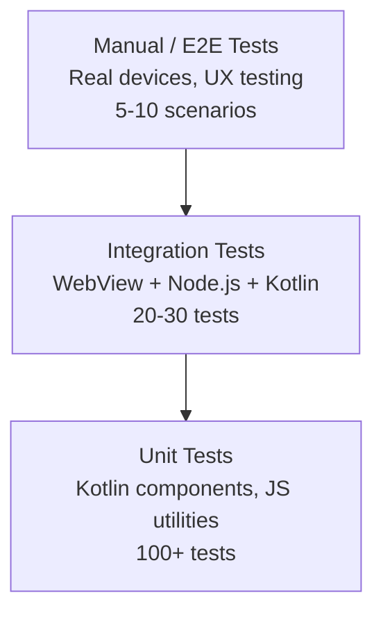
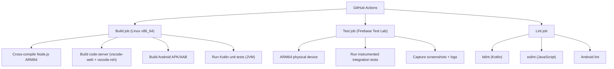
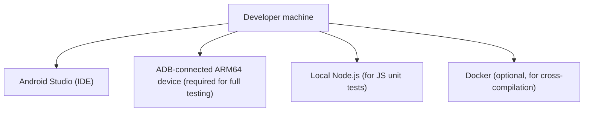

# Testing Strategy

**Project**: VSCodroid
**Version**: 1.0-draft
**Date**: 2026-02-10

---

## 1. Testing Philosophy

VSCodroid has unique testing challenges: it's a hybrid app (Kotlin + WebView + Node.js) that cross-compiles native binaries. Testing must cover all layers and their integration points.

**Principles**:
- Test the integration boundaries (Kotlin ↔ WebView ↔ Node.js) — that's where bugs hide
- Automate what can run on CI; manual test what requires real devices
- Prioritize real device testing over emulator (ARM64 binaries don't run on x86 emulators)
- Test on the lowest-spec supported device (4GB RAM, Android 13)

---

## 2. Test Pyramid



---

## 3. Test Types

### 3.1 Unit Tests

**Kotlin (JUnit 5 + MockK)**

| Component | What to Test | Examples |
|-----------|-------------|---------|
| ProcessManager | Process lifecycle logic | Start/stop/restart, PID tracking |
| Environment | Env variable construction | PATH building, HOME directory |
| PortFinder | Port allocation | Find free port, handle collisions |
| ExtraKeyRow | Key mapping logic | Ctrl toggle, key code conversion |
| ToolchainManager | Manifest parsing, state tracking | Available toolchains, install state |
| PackageManager | Package resolution, dependency checking | Search, version matching |
| FirstRunSetup | Asset extraction logic | File existence checks, version migration |

**JavaScript/TypeScript (Jest)**

| Component | What to Test | Examples |
|-----------|-------------|---------|
| AndroidBridge wrapper | Bridge method calls | Clipboard API, navigation |
| Key injection | Key event construction | Correct keyCode, modifiers |
| Server bootstrap | Argument parsing | Port, directories, flags |

**Run**: CI on every commit, local before push
**Coverage target**: ≥ 80% for Kotlin core, ≥ 70% for JS utilities

**Coverage enforcement**: CI pipeline SHALL fail if coverage drops below targets. See [Release Plan § CI Pipeline](./10-RELEASE_PLAN.md#2-cicd-pipeline).

### 3.2 Integration Tests

| Test | Description | Setup |
|------|-------------|-------|
| **Node.js launch** | ProcessBuilder starts Node.js, health check returns 200 | ARM64 physical device (local or Firebase Test Lab) |
| **WebView loads VS Code** | WebView navigates to localhost, Workbench renders | Instrumented test |
| **WebSocket connection** | WebView establishes WS connection, receives RPC messages | Instrumented test |
| **Android Bridge** | JS calls @JavascriptInterface methods, gets correct results | Instrumented test |
| **Extra Key Row** | Key press dispatches correct event to WebView | Instrumented test |
| **Terminal creation** | Terminal service creates tmux session, I/O works | ARM64 device |
| **tmux multi-session** | Create 3+ terminal tabs, verify single tmux process manages all sessions | ARM64 device |
| **Extension install** | Download and activate extension from Open VSX (or mock) | ARM64 device |
| **File CRUD** | Create, read, update, delete files via VS Code File Explorer | ARM64 device |
| **Server crash recovery** | Kill Node.js process, verify auto-restart + WebView reconnect | ARM64 device |
| **WebView crash recovery** | Simulate renderer crash, verify WebView recreation | Instrumented test |

**Framework**: Android Instrumented Tests (AndroidJUnit4 + Espresso + UI Automator)
**Run**: CI on every PR (using Firebase Test Lab with ARM64 device), local on device

### 3.3 End-to-End Tests

Manual test scenarios that verify the full user experience:

| # | Scenario | Steps | Expected Result |
|---|----------|-------|-----------------|
| E2E-01 | **First launch** | Install → Open app | Splash screen → Binary extraction → Welcome tab → VS Code ready |
| E2E-02 | **Edit and save file** | Open file → Edit → Ctrl+S | File saved, no data loss |
| E2E-03 | **Terminal operations** | Open terminal → `node --version` → `git --version` | Correct versions displayed (Note: `python3` test deferred to M3 gate) |
| E2E-04 | **Install extension** | Extensions panel → Search "Material Icon" → Install | Icon theme applies to File Explorer |
| E2E-05 | **Extra Key Row** | Open editor → Type with soft keyboard → Use Ctrl+S, Ctrl+P | Keys work correctly |
| E2E-06 | **Git operations** | Terminal → `git init` → create file → `git add` → `git commit` | Git operations succeed |
| E2E-07 | **Background/foreground** | Open editor → Home button → Wait 5 min → Return | Session preserved, server still running |
| E2E-08 | **Rotation** | Edit code → Rotate to landscape → Rotate back | No data loss, layout adapts |
| E2E-09 | **Copy/paste** | Copy text in Chrome → Paste in VSCodroid editor | Text pastes correctly |
| E2E-10 | **Large file** | Open 10,000-line file → Scroll → Search → Edit | No crash, responsive scrolling |
| E2E-11 | **Phantom process count** | Open editor + 3 terminals + 1 extension with LSP → check `adb shell ps` | Phantom processes ≤ 5 |
| E2E-12 | **Python terminal** | Open terminal → `python3 --version` → `pip install requests` | Correct version, pip works (M3+) |
| E2E-13 | **Low-memory handling** | Simulate low-memory via `adb shell am send-trim-memory` | App reduces memory, no crash |
| E2E-14 | **Package manager** | Terminal → `vscodroid pkg search curl` → `vscodroid pkg install curl` | Package installs successfully (M3+) |

**Run**: Before each milestone release, on physical devices

### 3.4 Performance Tests

| Test | Metric | Target | Tool |
|------|--------|--------|------|
| Cold start time | Time from app launch to editor ready | < 5 sec | Android Profiler |
| Warm start time | Time from background to foreground | < 2 sec | Android Profiler |
| Keystroke latency | Input to screen update | < 50 ms | Custom instrumentation |
| Memory usage (idle) | RAM after opening empty editor | < 300 MB | `adb shell dumpsys meminfo` |
| Memory usage (active) | RAM during active coding + terminal | < 700 MB | `adb shell dumpsys meminfo` |
| File open time | Time to open and render file | < 1 sec (1MB file) | Custom instrumentation |
| Extension install time | Download + extract + activate | < 30 sec | Stopwatch |
| Phantom process count | Total child processes during use | ≤ 5 | `adb shell ps` |
| Battery drain (active) | Battery consumption during coding session | < 15% per hour | `adb shell dumpsys batterystats` |
| Battery drain (idle) | Battery consumption with app in foreground, no input | < 5% per hour | `adb shell dumpsys batterystats` |

**Run**: Every milestone, on reference devices

### 3.5 Compatibility Tests

| Dimension | Test Targets |
|-----------|-------------|
| **Android versions** | 13 (API 33), 14 (API 34), 15 (API 35), 16 (API 36) |
| **Devices** | Pixel 7/8 (reference), Samsung Galaxy S23/S24, Xiaomi (budget), Samsung Tab S9 (tablet) |
| **RAM** | 4 GB (minimum), 8 GB (typical), 12+ GB (high-end) |
| **Screen sizes** | Phone 6" (1080p), Phone 6.7" (1440p), Tablet 11" (2560p) |
| **Input methods** | GBoard, Samsung Keyboard, SwiftKey, Hardware keyboard |
| **WebView versions** | Chrome 105 (minimum), Chrome 120+, Chrome 131+ |

**Run**: Before each major release, using Firebase Test Lab + physical devices

### 3.6 Accessibility Tests

| Test | Criteria | Method |
|------|----------|--------|
| TalkBack navigation | Native UI elements (Extra Key Row, dialogs, first-run) navigable with TalkBack | Manual with TalkBack enabled |
| Content descriptions | All native buttons and controls have meaningful content descriptions | Accessibility Scanner app |
| Touch target size | All interactive native elements ≥ 48dp × 48dp | Layout Inspector |
| Font scaling | Native UI (not WebView) respects system font size setting | Change system font scale to 1.3x |
| Color contrast | Native UI elements meet WCAG AA contrast ratio (4.5:1) | Accessibility Scanner app |

> **Note**: WebView accessibility (VS Code UI) is managed by VS Code itself and the Chromium WebView engine. Native accessibility testing focuses on the Android shell: Extra Key Row, splash screen, dialogs, notifications, and Toolchain Manager UI.

**Run**: Before each major release, on reference device with TalkBack

### 3.7 Security Tests

See [Security Design § Testing Checklist](./06-SECURITY.md#7-security-testing-checklist).

### 3.8 Backup & Restore Tests

| Test | Criteria | Method |
|------|----------|--------|
| Settings backup | `~/.vscodroid/User/` is included in backup payload | `adb backup`/device transfer test |
| Settings restore | Restored app keeps themes/keybindings/settings | Uninstall → restore backup → verify settings |
| Sensitive exclusion: SSH keys | `~/.ssh/` is excluded from backup | Inspect backup payload, verify absent |
| Sensitive exclusion: git credentials | `~/.gitconfig` is excluded from backup | Inspect backup payload, verify absent |
| Workspace exclusion | `workspace/` is excluded from backup | Inspect backup payload, verify absent |
| Post-update backup compatibility | Backup/restore still works after app update | Backup on version N, restore on N+1 |

**Run**: Before M4 exit and before each production release.

---

## 4. Test Environment

### 4.1 CI Environment



### 4.2 Local Development



### 4.3 Reference Devices

| Device | Purpose |
|--------|---------|
| Pixel 8 (8GB RAM, Android 16) | Primary development/testing device |
| Samsung Galaxy S23 (8GB RAM, Android 15) | Second manufacturer compatibility |
| Budget phone (4GB RAM, Android 13) | Minimum spec testing |
| Samsung Galaxy Tab S9 (8GB RAM) | Tablet/large screen testing |

---

## 5. Test Data

### 5.1 Test Projects

| Project | Purpose | Size |
|---------|---------|------|
| `test-minimal/` | 1 file, basic editing | < 1 KB |
| `test-small/` | 10 files, HTML/JS project | ~ 50 KB |
| `test-medium/` | 100 files, Node.js project | ~ 5 MB |
| `test-large/` | 1000+ files, real-world project | ~ 50 MB |
| `test-single-large-file/` | Single 10,000-line file | ~ 500 KB |

### 5.2 Test Extensions

| Extension | Purpose |
|-----------|---------|
| Material Icon Theme | Theme extension (UI change verification) |
| ESLint | Language extension (diagnostics verification) |
| Python | Language extension (LSP verification) |
| Prettier | Formatter extension (action verification) |

---

## 6. Bug Triage

### 6.1 Severity Levels

| Level | Definition | Response Time | Fix Time |
|-------|-----------|---------------|----------|
| **S1 Critical** | App crash, data loss, security vulnerability | Immediate | 24 hours |
| **S2 Major** | Core feature broken (editor, terminal, extensions) | 24 hours | 1 week |
| **S3 Minor** | Non-core feature broken, cosmetic issue | 1 week | Next release |
| **S4 Trivial** | Enhancement request, rare edge case | Backlog | When possible |

### 6.2 Bug Report Template

```markdown
**Severity**: S1/S2/S3/S4
**Device**: [model, Android version, RAM]
**Steps to Reproduce**:
1. ...
2. ...
3. ...
**Expected**: ...
**Actual**: ...
**Logs**: [Logcat output, screenshot, screen recording]
```

---

## 7. Milestone Test Gates

Each milestone must pass its test gate before proceeding:

| Milestone | Required Tests | Pass Criteria |
|-----------|---------------|---------------|
| M0 (POC) | Manual E2E-01, E2E-03 (node + git only) | Node.js runs, WebView loads |
| M1 (Core) | Unit tests, Integration (Node, WebView, Extensions, tmux), E2E 1-6 | All pass on Pixel 8, phantom processes ≤ 5 |
| M2 (Mobile) | + E2E 7-10, Compatibility (2 devices) | All pass on 2 devices |
| M3 (Dev Env) | + E2E-12, E2E-14, Python/Git tests, Toolchain install, RAM check after Python+toolchains | All pass on 2 devices |
| M4 (Polish) | Full suite incl. E2E-11/E2E-13, Performance tests, Compatibility (4 devices), Backup & Restore tests, phantom process count gate (≤ 5) | All targets met |
| M5 (Release) | Full suite, Security tests (see 06-SECURITY §7), 48-hour beta soak | Zero S1/S2 bugs, security checklist pass |
