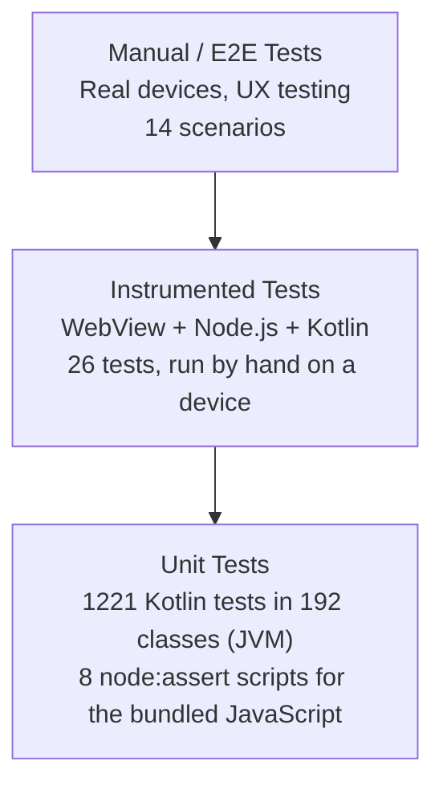
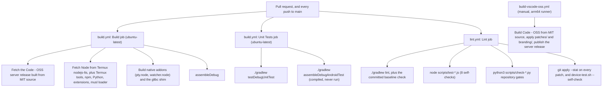
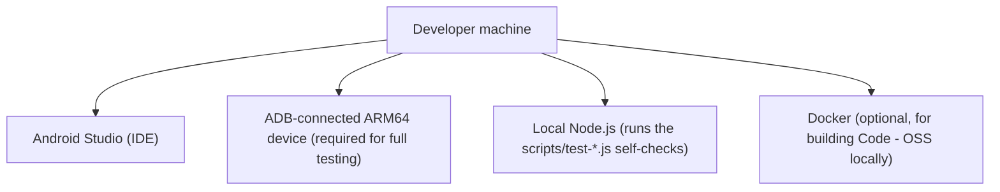

# Testing Strategy

**Project**: VSCodroid
**Version**: 1.0-draft
**Date**: 2026-02-10

---

## 1. Testing Philosophy

VSCodroid has unique testing challenges: it's a hybrid app (Kotlin + WebView + Node.js) that cross-compiles native binaries. Testing must cover all layers and their integration points.

**Principles**:
- Test the integration boundaries (Kotlin ↔ WebView ↔ Node.js) — that's where bugs hide
- Automate what can run on CI; manual test what requires real devices
- Prioritize real device testing over emulator (ARM64 binaries don't run on x86 emulators)
- Test on the lowest-spec supported device (4GB RAM, Android 13)

---

## 2. Test Pyramid


```mermaid
flowchart TD
  E2E["Manual / E2E Tests<br/>Real devices, UX testing<br/>14 scenarios"] --> INT["Instrumented Tests<br/>WebView + Node.js + Kotlin<br/>26 tests, run by hand on a device"]
  INT --> UNIT["Unit Tests<br/>1221 Kotlin tests in 192 classes (JVM)<br/>8 node:assert scripts for the bundled JavaScript"]
```

---

## 3. Test Types

### 3.1 Unit Tests

**Kotlin (JUnit 5 + MockK, JVM only)**

| Component | What is covered | Example classes |
|-----------|-------------|---------|
| ProcessManager / NodeService | Server lifecycle, readiness, restart budget, port adoption | `ProcessManagerTest`, `ServerReadinessTest`, `RestartBudgetTest`, `AdoptionTest` |
| Environment | Env variable construction, PATH and shell paths, SAF mirror paths | `EnvironmentTest`, `TerminalShellPathTest`, `EnvironmentSafTest` |
| PortFinder | Port allocation and reuse across restarts | `PortFinderTest` |
| ExtraKeyRow / KeyInjector | Key mapping, modifier state, trackpad gestures | `KeyMappingTest`, `ExtraKeyToggleStateTest`, `TrackpadGestureTest` |
| AndroidBridge | Registered method surface, session tokens, log redaction | `BridgeApiSpecParityTest`, `SecurityManagerTest`, `LogRelayRedactionTest` |
| ToolchainManager / ToolchainRegistry | Catalog, download and install state, digests, retirement sweep | `ToolchainRegistryTest`, `ToolchainInstallTest`, `ToolchainDigestTest`, `RetiredToolchainTest` |
| FirstRunSetup | Asset extraction, symlinks, `settings.json` contents, storage preflight | `SettingsPathsTest`, `StoragePreflightTest`, `SymlinkPredicateTest` |
| SafSyncEngine | Mirror reconciliation, write-back filtering, rename pairing | `SafSyncEngineTest`, `SafWriteBackFilterTest`, `SafRenamePairingTest` |
| VSCodroidWebViewClient | CDN interception, `vscode-remote` resource serving, downloads | `ResourceInterceptionWiringTest`, `WebviewResourceResolutionTest`, `DownloadCoordinatorTest` |

The suite is **1221 tests in 192 classes**, and it is green. A test that needs a
filesystem builds its tree under a JUnit `@TempDir` rather than touching the
checkout.

**Run**: `./gradlew testDebugUnitTest` from `android/`. CI runs it in the
`Unit Tests` job of `build.yml`, on every pull request and on every push to
`main`.

**JavaScript (hand-written `node:assert` scripts)**

No test framework. Each script is plain Node, builds its own fixtures in a
temporary directory, and is executed directly by `node`.

| Component | What is covered | Script |
|-----------|-------------|---------|
| Server bootstrap | The `product.json` rewrite `server.js` performs on every start, including a SIGKILL landing inside the write | `scripts/test-server-bootstrap.js` |
| Platform override | What `process.platform` reports in the server, every terminal command and every user script | `scripts/test-platform-fix.js` |
| Process monitor | Process classification and the phantom count, against a fixture `/proc` tree | `scripts/test-process-monitor.js` |
| Process monitor extension | The status bar entry and the notification it renders | `scripts/test-process-monitor-extension.js` |
| DNS proxy | The Basic-auth token on the loopback proxy every musl DNS lookup goes through | `scripts/test-dns-proxy.js` |
| Bridge relay | The BroadcastChannel relay injected into the workbench | `scripts/test-bridge-relay.js` |
| Download capture | The script that makes saving a file out of the Explorer possible at all | `scripts/test-download-capture.js` |
| Serve on Network | The port scan and its reachable/local split | `scripts/test-serve-network.js` |

**Run**: all eight, one `node` invocation each, in the `Check the bundled
JavaScript runtime` step of `lint.yml`, and again in `release.yml`.

**What is enforced**: the suites themselves. A single failing test fails the job.
There is no coverage instrumentation in this project: no JaCoCo, no Kover, no
coverage task, no threshold, and nothing in any workflow that reads one.

### 3.2 Instrumented Tests

Twenty-six tests across seven classes, in `android/app/src/androidTest/`. They
need an `arm64-v8a` device or emulator, because the app ships that ABI alone.

| Test | Description | Setup |
|------|-------------|-------|
| **ServerHealthTest** | The server becomes reachable, answers its `GET /version` readiness probe with 200, and survives activity recreation | arm64 device, app launched once so the assets are extracted |
| **SplashActivityTest** | First-run extraction, and that a later launch skips it | arm64 device |
| **ExtractionOnDeviceTest** | Bundled-extension extraction against the real `AssetManager`, including the abort and retry driven by a genuine out-of-space condition | arm64 device |
| **MainActivityTest** | WebView and ExtraKeyRow initial state, and the About dialog's trademark disclaimer | arm64 device |
| **ToolchainInsetsTest** | With edge-to-edge enforced, the Toolchains screen stays clear of the status and navigation bars | arm64 device |
| **FileObserverTreeSemanticsTest** | The platform behaviour SAF write-back rests on: a watch covers a directory and not a tree, and an event reports the bare entry name | arm64 device |
| **SafWatchWiringTest** | That those semantics are wired up: a save two directories down is queued for write-back, a scratch file beside it is not, and a skipped directory is never watched | arm64 device |

**Framework**: AndroidJUnit4 + Espresso + UI Automator (JUnit 4, on device)

**Run**: by hand, `ANDROID_SERIAL=<serial> ./gradlew connectedDebugAndroidTest`
from `android/`, after touching MainActivity, SplashActivity, NodeService,
ProcessManager or FirstRunSetup, and before tagging a release. Read the XML under
`app/build/outputs/androidTest-results/connected/` rather than the exit code: a
run that dies before reaching the tests writes no results and exits the same way
a genuine failure does.

CI compiles them and stops there, in the `Unit Tests` job of `build.yml`
(`assembleDebugAndroidTest`). That catches them drifting out of the app's API and
is not a substitute for running them. No runner GitHub offers can run them:
`ubuntu-latest` has `/dev/kvm` but accelerates only x86_64 images,
`ubuntu-24.04-arm` reports no `/dev/kvm` and no virtualisation flag, and
`macos-15` is itself a virtual machine with no nested virtualisation, so QEMU
fails with `HV_UNSUPPORTED` before the emulator reaches adb.
`android/app/src/androidTest/README.md` carries the measurements.

What a device has to prove and these cannot reach (terminal I/O, extension
install, file CRUD, crash recovery) belongs to `scripts/device-test.sh` and
`docs/DEVICE_TEST_CHECKLIST.md`. A terminal there is a `bash` process on a real
PTY through node-pty, one process per terminal tab.

### 3.3 End-to-End Tests

Manual test scenarios that verify the full user experience:

| # | Scenario | Steps | Expected Result |
|---|----------|-------|-----------------|
| E2E-01 | **First launch** | Install → Open app | Splash screen → Binary extraction → Welcome tab → VS Code ready |
| E2E-02 | **Edit and save file** | Open file → Edit → Ctrl+S | File saved, no data loss |
| E2E-03 | **Terminal operations** | Open terminal → `node --version` → `git --version` | Correct versions displayed |
| E2E-04 | **Install extension** | Extensions panel → Search "Material Icon" → Install | Icon theme applies to File Explorer |
| E2E-05 | **Extra Key Row** | Open editor → Type with soft keyboard → Use Ctrl+S, Ctrl+P | Keys work correctly |
| E2E-06 | **Git operations** | Terminal → `git init` → create file → `git add` → `git commit` | Git operations succeed |
| E2E-07 | **Background/foreground** | Open editor → Home button → Wait 5 min → Return | Session preserved, server still running |
| E2E-08 | **Rotation** | Edit code → Rotate to landscape → Rotate back | No data loss, layout adapts |
| E2E-09 | **Copy/paste** | Copy text in Chrome → Paste in VSCodroid editor | Text pastes correctly |
| E2E-10 | **Large file** | Open 10,000-line file → Scroll → Search → Edit | No crash, responsive scrolling |
| E2E-11 | **Phantom process count** | Open editor + 3 terminals + 1 extension with LSP → check `adb shell ps` | Phantom processes ≤ 5 |
| E2E-12 | **Python terminal** | Open terminal → `python3 --version` → `pip install requests` | Correct version, pip works |
| E2E-13 | **Low-memory handling** | Simulate low-memory via `adb shell am send-trim-memory` | App reduces memory, no crash |
| E2E-14 | **Package manager** | Terminal → `vscodroid pkg search curl` → `vscodroid pkg install curl` | Package installs successfully (planned Tier 3 package manager) |

**Run**: Before each milestone release, on physical devices

### 3.4 Performance Tests

| Test | Metric | Target | Tool |
|------|--------|--------|------|
| Cold start time | Time from app launch to editor ready | < 5 sec | Android Profiler |
| Warm start time | Time from background to foreground | < 2 sec | Android Profiler |
| Keystroke latency | Input to screen update | < 50 ms | Custom instrumentation |
| Memory usage (idle) | RAM after opening empty editor | < 300 MB | `adb shell dumpsys meminfo` |
| Memory usage (active) | RAM during active coding + terminal | < 700 MB | `adb shell dumpsys meminfo` |
| File open time | Time to open and render file | < 1 sec (1MB file) | Custom instrumentation |
| Extension install time | Download + extract + activate | < 30 sec | Stopwatch |
| Phantom process count | Total child processes during use | ≤ 5 | `adb shell ps` |
| Battery drain (active) | Battery consumption during coding session | < 15% per hour | `adb shell dumpsys batterystats` |
| Battery drain (idle) | Battery consumption with app in foreground, no input | < 5% per hour | `adb shell dumpsys batterystats` |

**Run**: Every milestone, on reference devices

### 3.5 Compatibility Tests

| Dimension | Test Targets |
|-----------|-------------|
| **Android versions** | 13 (API 33), 14 (API 34), 15 (API 35), 16 (API 36) |
| **Devices** | Pixel 7/8 (reference), Samsung Galaxy S23/S24, Xiaomi (budget), Samsung Tab S9 (tablet) |
| **RAM** | 4 GB (minimum), 8 GB (typical), 12+ GB (high-end) |
| **Screen sizes** | Phone 6" (1080p), Phone 6.7" (1440p), Tablet 11" (2560p) |
| **Input methods** | GBoard, Samsung Keyboard, SwiftKey, Hardware keyboard |
| **WebView versions** | Chrome 105 (minimum), Chrome 120+, Chrome 131+ |

**Run**: Before each major release, on the physical devices in § 4.3

### 3.6 Accessibility Tests

| Test | Criteria | Method |
|------|----------|--------|
| TalkBack navigation | Native UI elements (Extra Key Row, dialogs, first-run) navigable with TalkBack | Manual with TalkBack enabled |
| Content descriptions | All native buttons and controls have meaningful content descriptions | Accessibility Scanner app |
| Touch target size | All interactive native elements ≥ 48dp × 48dp | Layout Inspector |
| Font scaling | Native UI (not WebView) respects system font size setting | Change system font scale to 1.3x |
| Color contrast | Native UI elements meet WCAG AA contrast ratio (4.5:1) | Accessibility Scanner app |

> **Note**: WebView accessibility (VS Code UI) is managed by VS Code itself and the Chromium WebView engine. Native accessibility testing focuses on the Android shell: Extra Key Row, splash screen, dialogs, notifications, and Toolchain Manager UI.

**Run**: Before each major release, on reference device with TalkBack

### 3.7 Security Tests

See [Security Design § Testing Checklist](./06-SECURITY.md#7-security-testing-checklist).

### 3.8 Backup & Restore Tests

`data_extraction_rules.xml` is written as an **allowlist with no exclusions**: it names
`home/.vscodroid/data/Machine` and nothing else, so everything unnamed is already out. That makes
the exclusion rows below a check on the shape of the rule as much as on the payload, and the row
that matters most is **Rule shape**.

| Test | Criteria | Method |
|------|----------|--------|
| Settings backup | `home/.vscodroid/data/Machine` is included in the backup payload. **Not** `~/.vscodroid/User/`, which this row named until 2026-08-20 and which the rules have never listed; `Environment.getMachineSettingsPath` explains why the machine path is the live one | `adb backup`/device transfer test |
| Settings restore | Restored app keeps its machine-scoped settings. `createDefaultSettings()` writes only when the file is absent, so a restored copy is kept rather than overwritten | Uninstall → restore backup → verify settings |
| Sensitive exclusion: SSH keys | `~/.ssh/` is absent from the payload. The key is generated without a passphrase, so this is the exclusion with real consequences | Inspect backup payload, verify absent |
| Sensitive exclusion: connection token | `home/.vscodroid/data/token` is absent. It sits one directory from the included path, which is the near miss the allowlist exists to survive | Inspect backup payload, verify absent |
| Workspace exclusion | The `external` domain (which holds the projects directory, `Android/data/<pkg>/files/projects`) and `filesDir/saf-mirrors` are both absent | Inspect backup payload, verify absent |
| Preferences exclusion | The `sharedpref` domain is absent. Restoring `setup_version` onto a device with an empty `filesDir` would make the app skip extraction and start a server that is not there | Inspect backup payload, verify absent |
| Rule shape | `backup_rules.xml` still matches the `<cloud-backup>` section of `data_extraction_rules.xml`. No supported device reads the first file, but it is the floor if `minSdk` ever drops to 30 | Diff the two files |
| Post-update backup compatibility | Backup/restore still works after app update | Backup on version N, restore on N+1 |

**Run**: Before M4 exit and before each production release.

---

## 4. Test Environment

### 4.1 CI Environment


```mermaid
flowchart TD
  PR["Pull request, and every push to main"] --> BUILD["build.yml: Build job (ubuntu-latest)"]
  BUILD --> B1["Fetch the Code - OSS server release built from MIT source"]
  BUILD --> B2["Fetch Node from Termux nodejs-lts, plus Termux tools, npm, Python, extensions, musl loader"]
  BUILD --> B3["Build native addons (pty.node, watcher.node) and the glibc shim"]
  BUILD --> B4["assembleDebug"]

  PR --> TEST["build.yml: Unit Tests job (ubuntu-latest)"]
  TEST --> T1["./gradlew testDebugUnitTest"]
  TEST --> T2["./gradlew assembleDebugAndroidTest (compiled, never run)"]

  PR --> LINT["lint.yml: Lint job"]
  LINT --> L1["./gradlew lint, plus the committed baseline check"]
  LINT --> L2["node scripts/test-*.js (8 self-checks)"]
  LINT --> L3["python3 scripts/check-*.py repository gates"]
  LINT --> L4["git apply --stat on every patch, and device-test.sh --self-check"]

  MAN["build-vscode-oss.yml (manual, arm64 runner)"] --> M1["Build Code - OSS from MIT source, apply patches/ and branding/, publish the server release"]
```

### 4.2 Local Development


```mermaid
flowchart TD
  DEV["Developer machine"] --> D1["Android Studio (IDE)"]
  DEV --> D2["ADB-connected ARM64 device (required for full testing)"]
  DEV --> D3["Local Node.js (runs the scripts/test-*.js self-checks)"]
  DEV --> D4["Docker (optional, for building Code - OSS locally)"]
```

### 4.3 Reference Devices

| Device | Purpose |
|--------|---------|
| Pixel 8 (8GB RAM, Android 16) | Primary development/testing device |
| Samsung Galaxy S23 (8GB RAM, Android 15) | Second manufacturer compatibility |
| Budget phone (4GB RAM, Android 13) | Minimum spec testing |
| Samsung Galaxy Tab S9 (8GB RAM) | Tablet/large screen testing |

---

## 5. Test Data

### 5.1 Test Fixtures

Nothing is checked in as a fixture project. Each layer builds what it needs and
throws it away:

| Fixture | Purpose | Lifetime |
|---------|---------|------|
| JUnit `@TempDir` | Every JVM test that needs a filesystem, 72 declarations across the suite | Removed when the test method ends |
| `mkdtempSync` under the system temp directory | The `scripts/test-*.js` self-checks, including the fake `/proc` tree the process monitor is pointed at | Removed when the script ends |
| The app's projects folder on the device | Where a manual pass creates files, opens folders and runs terminals | Kept between passes unless app data is cleared |

### 5.2 Test Extensions

| Extension | Purpose |
|-----------|---------|
| Material Icon Theme | Theme extension (UI change verification) |
| ESLint | Language extension (diagnostics verification) |
| Python | Language extension (LSP verification) |
| Prettier | Formatter extension (action verification) |

---

## 6. Bug Triage

### 6.1 Severity Levels

| Level | Definition | Response Time | Fix Time |
|-------|-----------|---------------|----------|
| **S1 Critical** | App crash, data loss, security vulnerability | Immediate | 24 hours |
| **S2 Major** | Core feature broken (editor, terminal, extensions) | 24 hours | 1 week |
| **S3 Minor** | Non-core feature broken, cosmetic issue | 1 week | Next release |
| **S4 Trivial** | Enhancement request, rare edge case | Backlog | When possible |

### 6.2 Bug Report Template

```markdown
**Severity**: S1/S2/S3/S4
**Device**: [model, Android version, RAM]
**Steps to Reproduce**:
1. ...
2. ...
3. ...
**Expected**: ...
**Actual**: ...
**Logs**: [Logcat output, screenshot, screen recording]
```

---

## 7. Milestone Test Gates

Each milestone must pass its test gate before proceeding:

| Milestone | Required Tests | Pass Criteria |
|-----------|---------------|---------------|
| M0 (POC) | Manual E2E-01, E2E-03 (node + git only) | Node.js runs, WebView loads |
| M1 (Core) | Unit tests, Instrumented (Node, WebView, Extensions, Terminal), E2E 1-6 | All pass on Pixel 8, phantom processes ≤ 5 |
| M2 (Mobile) | + E2E 7-10, Compatibility (2 devices) | All pass on 2 devices |
| M3 (Dev Env) | + E2E-12, E2E-14, Python/Git tests, Toolchain install, RAM check after Python+toolchains | All pass on 2 devices |
| M4 (Polish) | Full suite incl. E2E-11/E2E-13, Performance tests, Compatibility (4 devices), Backup & Restore tests, phantom process count gate (≤ 5) | All targets met |
| M5 (Release) | Full suite, Security tests (see 06-SECURITY §7), 48-hour beta soak | Zero S1/S2 bugs, security checklist pass |
