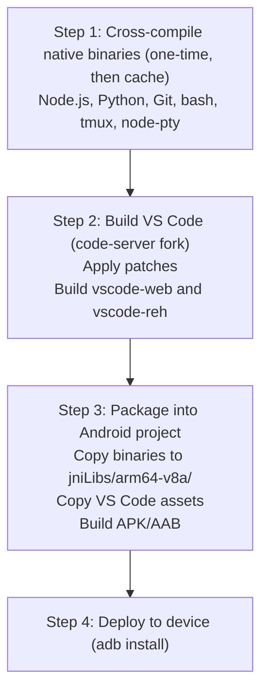
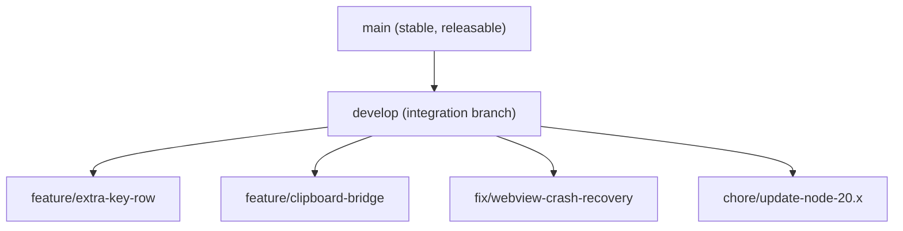

# Development Guide

**Project**: VSCodroid
**Version**: 1.0-draft
**Date**: 2026-02-10

---

## 1. Prerequisites

### 1.1 Hardware

| Requirement | Minimum | Recommended |
|------------|---------|-------------|
| Development machine | Any x86_64 with 16GB RAM | macOS/Linux, 32GB RAM, SSD |
| Android device | ARM64, Android 13+, 4GB RAM | Pixel 7/8, 8GB RAM, Android 14+ |
| USB cable | For ADB debugging | USB-C to USB-C |

> **Note**: x86_64 Android emulators cannot run ARM64 binaries. You MUST have a physical ARM64 device for integration testing.

### 1.2 Software

| Tool | Version | Purpose |
|------|---------|---------|
| Android Studio | Latest stable with Android API 36 support | IDE, build tools, ADB |
| Android SDK | API 33-36 | Compilation targets |
| Android NDK | r27+ | Native binary cross-compilation |
| JDK | 17 | Android build system |
| Node.js | 20 LTS | VS Code build, development tools |
| Yarn | 1.x (Classic) | VS Code build dependency |
| Python | 3.11+ | Build scripts |
| Git | 2.40+ | Version control |
| Docker | Latest (optional) | Reproducible cross-compilation |

### 1.3 Installation

```bash
# macOS
brew install node@20 yarn python git

# Android SDK/NDK — install via Android Studio SDK Manager:
# - Android SDK Platform API 33, 34, 36
# - Android SDK Build-Tools
# - NDK (Side by side) r27
# - CMake
```

---

## 2. Project Structure

```mermaid
flowchart TD
  ROOT["VSCodroid/"] --> C1["CLAUDE.md (Project source of truth)"]
  ROOT --> C2["MILESTONES.md (Development milestones)"]
  ROOT --> C3["docs/ (Documentation)"]

  ROOT --> ANDROID["android/ (Android app)"]
  ANDROID --> A1["app/src/main/kotlin/com/vscodroid/"]
  ANDROID --> A2["app/src/main/res/"]
  ANDROID --> A3["app/src/main/assets/ (VS Code server + web client)"]
  ANDROID --> A4["app/src/main/jniLibs/ (.so binaries)"]
  ANDROID --> A5["app/build.gradle.kts, build.gradle.kts, settings.gradle.kts"]

  ROOT --> SERVER["server/ (code-server fork submodule)"]
  SERVER --> S1["lib/vscode/ (VS Code source)"]
  SERVER --> S2["patches/"]

  ROOT --> PATCH["patches/ (VSCodroid-specific patches)"]
  PATCH --> P1["code-server/ (inherited patches)"]
  PATCH --> P2["vscodroid/ (custom patches)"]

  ROOT --> TOOL["toolchains/ (cross-compilation scripts)"]
  TOOL --> T1["build-node.sh, build-python.sh, build-node-pty.sh"]
  TOOL --> T2["build-git.sh, build-bash.sh, build-tmux.sh"]
  TOOL --> T3["Dockerfile"]

  ROOT --> SCRIPT["scripts/ (development scripts)"]
  SCRIPT --> SC1["setup.sh, build-all.sh, apply-patches.sh"]
  SCRIPT --> SC2["package-assets.sh, deploy.sh"]

  ROOT --> TEST["test/ (test suites)"]
  TEST --> TE1["projects/ (fixtures)"]
  TEST --> TE2["extensions/ (fixtures)"]

  ROOT --> GH[".github/workflows/ (planned)"]
  GH --> G1["build.yml (planned)"]
  GH --> G2["test.yml (planned)"]
  GH --> G3["release.yml (planned)"]
```



---

## 3. Getting Started

### 3.1 Clone and Setup

```bash
# Clone repository
git clone https://github.com/rmyndharis/VSCodroid.git
cd VSCodroid

# Initialize submodules (code-server)
git submodule update --init --recursive

# Run setup script
./scripts/setup.sh
```

### 3.2 Build Pipeline Overview



### 3.3 Quick Build (Development)

```bash
# Build everything (first time — takes ~30-60 minutes)
./scripts/build-all.sh

# Build and install on connected device
./scripts/deploy.sh

# Rebuild only Android app (after code changes, ~2 minutes)
cd android && ./gradlew assembleDebug && adb install -r app/build/outputs/apk/debug/app-debug.apk
```

### 3.4 Incremental Development

For rapid iteration on the Android app (Kotlin changes):

```bash
# Only rebuild and deploy Android app
cd android
./gradlew installDebug
```

For VS Code server/client changes:

```bash
# Rebuild VS Code, repackage, deploy
./scripts/build-vscode.sh
./scripts/package-assets.sh
./scripts/deploy.sh
```

---

## 4. Development Workflow

### 4.1 Branch Strategy



**Rules**:
- `main` is always releasable
- Feature branches from `develop`
- PRs require at least 1 review
- Squash merge to `develop`
- Merge `develop` to `main` for releases

### 4.2 Commit Convention

```
<type>(<scope>): <description>

Types: feat, fix, chore, docs, refactor, test, perf, build
Scopes: android, server, patches, toolchain, ci

Examples:
feat(android): add Extra Key Row with Ctrl/Alt toggles
fix(server): handle tmux session cleanup on server restart
build(toolchain): update Node.js to 20.11.0
chore(patches): rebase code-server patches on VS Code 1.96
docs: add testing strategy document
```

### 4.3 Code Review Checklist

- [ ] Code compiles without warnings
- [ ] Unit tests pass
- [ ] No hardcoded paths or secrets
- [ ] Follows Kotlin/JS style conventions
- [ ] Relevant documentation updated
- [ ] Patch changes are minimal and focused
- [ ] New features have corresponding tests
- [ ] Performance impact considered (especially for hot paths)

---

## 5. Coding Conventions

### 5.1 Kotlin

- Style: [Kotlin Coding Conventions](https://kotlinlang.org/docs/coding-conventions.html)
- Linter: ktlint
- Coroutines for async operations (not callbacks)
- Prefer `val` over `var`
- Use sealed classes for state management
- Android-specific: Follow [Android Kotlin Style Guide](https://developer.android.com/kotlin/style-guide)

### 5.2 JavaScript / TypeScript

- Style: VS Code's own style (inherited from code-server)
- Linter: ESLint (VS Code config)
- Formatter: Prettier (if configured)
- TypeScript strict mode

### 5.3 Patches

- Each patch file should do ONE thing
- Include descriptive header comments:
  ```diff
  # ext-host-worker.diff
  # Purpose: Run Extension Host as worker_thread instead of child_process.fork
  # Files modified: src/vs/workbench/api/node/extensionHostProcess.ts
  # Reason: Reduce phantom process count on Android
  ```
- Test patch with `git apply --check` before committing
- Keep patches as small as possible

---

## 6. Debugging

### 6.1 Android App (Kotlin)

```bash
# View logs
adb logcat -s VSCodroid

# View all app logs
adb logcat --pid=$(adb shell pidof com.vscodroid)

# Memory info
adb shell dumpsys meminfo com.vscodroid

# Process list (check phantom processes)
adb shell ps -A | grep vscodroid
```

### 6.2 WebView (Chrome DevTools)

1. Enable debug builds: `WebView.setWebContentsDebuggingEnabled(true)`
2. Open Chrome on desktop: `chrome://inspect/#devices`
3. Find VSCodroid WebView → Click "inspect"
4. Full Chrome DevTools available (Console, Network, Elements, etc.)

### 6.3 Node.js Server

```bash
# View server logs
adb shell cat /data/data/com.vscodroid/files/home/.vscodroid/logs/server.log

# Interactive shell into app directory
adb shell run-as com.vscodroid

# Test server health
adb shell curl http://localhost:PORT/healthz

# Check Node.js process
adb shell ps -A | grep libnode
```

### 6.4 Common Issues

| Issue | Diagnosis | Solution |
|-------|-----------|---------|
| Server won't start | Check Logcat for Node.js errors | Verify libnode.so exists and has execute permission |
| WebView blank screen | Chrome DevTools → Console | Check if server is running, correct port |
| Extension won't install | Chrome DevTools → Network | Check Open VSX connectivity |
| Terminal not working | Server logs | Verify libtmux.so and libbash.so present |
| Phantom process killed | `adb shell dumpsys activity processes` | Reduce child process count |
| OOM crash | `adb shell dumpsys meminfo` | Reduce V8 heap, close unused features |

---

## 7. Release Process

### 7.1 Version Bump

```bash
# In android/app/build.gradle.kts
versionCode = <increment>
versionName = "X.Y.Z"
```

### 7.2 Release Build

```bash
# Build signed AAB
cd android
./gradlew bundleRelease

# Output: app/build/outputs/bundle/release/app-release.aab
```

### 7.3 Release Checklist

- [ ] All tests pass (unit + integration + E2E)
- [ ] Performance targets met on reference device
- [ ] Version number bumped
- [ ] CHANGELOG updated
- [ ] Release notes written
- [ ] Signed AAB built
- [ ] Tested on 4 devices (see Testing Strategy §7)
- [ ] No S1/S2 open bugs
- [ ] Security tests pass

---

## 8. Useful Commands

```bash
# --- Android ---
adb devices                              # List connected devices
adb install -r app-debug.apk            # Install APK
adb shell am start com.vscodroid/.MainActivity  # Launch app
adb shell am force-stop com.vscodroid    # Force stop app
adb shell pm clear com.vscodroid         # Clear app data

# --- Cross-compilation ---
$NDK/toolchains/llvm/prebuilt/linux-x86_64/bin/aarch64-linux-android28-clang --version
# Note: android28 is NDK compile target ABI baseline; app minSdk remains API 33.
file libnode.so                          # Verify ARM64 ELF

# --- VS Code build ---
cd server/lib/vscode
yarn                                     # Install dependencies
yarn gulp vscode-web-min                 # Build web client
yarn gulp vscode-reh-min                 # Build server

# --- Patches ---
git -C server/lib/vscode apply --check patches/vscodroid/ext-host-worker.diff
git -C server/lib/vscode diff > patches/vscodroid/new-patch.diff
```
