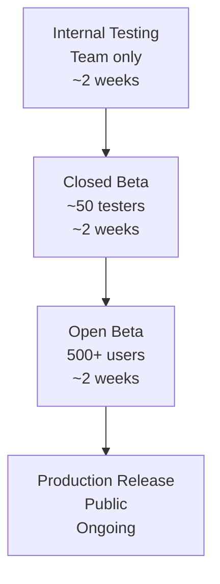
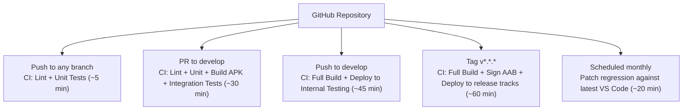

# Release Plan

**Project**: VSCodroid
**Version**: 1.0-draft
**Date**: 2026-02-10

---

## 1. Release Strategy

### 1.1 Release Phases



### 1.2 Release Tracks (Google Play)

| Track | Purpose | Audience | Duration |
|-------|---------|----------|----------|
| Internal testing | Dev team validation | 5-10 testers | Continuous |
| Closed testing (Alpha) | Early adopter feedback | 50 invited testers | 2 weeks minimum |
| Open testing (Beta) | Broader validation | 500+ public opt-in | 2 weeks minimum |
| Production | Public release | Everyone | Ongoing |

### 1.3 Track Promotion Criteria

| Promotion | Required Gate |
|-----------|---------------|
| Internal → Closed | 100% M4 exit criteria pass, zero open S1/S2 bugs, crash-free rate ≥ 95% on internal track for 7 consecutive days |
| Closed → Open | At least 50 active testers, no new S1 bugs in last 7 days, ANR rate < 0.5%, extension install success ≥ 90% |
| Open → Production | At least 500 beta testers, crash-free rate ≥ 95% for 14 days, ANR rate < 0.5%, Play policy checklist complete |
| Production rollout increase (5%→10%→25%→50%→100%) | No halt condition triggered for previous stage over 24 hours |

---

## 2. CI/CD Pipeline

### 2.1 Pipeline Architecture



### 2.2 Build Pipeline

```yaml
# .github/workflows/build.yml (simplified)

jobs:
  lint:
    # ktlint, eslint, android lint
    runs-on: ubuntu-latest

  unit-test:
    # JUnit tests (Kotlin), Jest tests (JS)
    # Coverage gate: Kotlin ≥ 80%, JS ≥ 70% — fails build if below targets
    runs-on: ubuntu-latest

  build-binaries:
    # Cross-compile Node.js, Python, etc. for ARM64
    # Cached: only rebuild when toolchain scripts change
    runs-on: ubuntu-latest
    container: vscodroid/build-env  # Docker with NDK

  build-vscode:
    # Build code-server fork (vscode-web + vscode-reh)
    # Cached: only rebuild when patches or VS Code version changes
    runs-on: ubuntu-latest

  build-android:
    needs: [build-binaries, build-vscode]
    # Assemble Android APK/AAB
    runs-on: ubuntu-latest

  integration-test:
    needs: [build-android]
    # Run on Firebase Test Lab (ARM64 device)
    runs-on: ubuntu-latest

  patch-regression:
    # Scheduled monthly: try applying patches to latest upstream VS Code
    # Fails if patch apply --check fails; posts issue/notification
    runs-on: ubuntu-latest

  deploy:
    needs: [integration-test]
    # Upload to Play Store (conditional on branch/tag)
    runs-on: ubuntu-latest
```

### 2.4 Scheduled Compatibility Jobs

| Job | Schedule | Purpose | Failure Action |
|-----|----------|---------|----------------|
| Patch regression | Monthly | Apply all patches to latest VS Code snapshot | Block upstream sync, open maintenance issue |
| Android preview smoke test | On Android beta release | Detect platform breakage early | Add risk item and mitigation task |

### 2.3 Caching Strategy

| Artifact | Cache Key | Size | Rebuild When |
|----------|-----------|------|-------------|
| Node.js ARM64 binary | `node-{version}-{ndk-version}-{script-hash}` | ~50 MB | Node.js version change or build script change |
| Python ARM64 binary | `python-{version}-{ndk-version}-{script-hash}` | ~30 MB | Python version change |
| VS Code build | `vscode-{commit}-{patches-hash}` | ~200 MB | VS Code version or patch change |
| Gradle build cache | `gradle-{dependencies-hash}` | ~100 MB | Dependency change |
| node_modules | `yarn-{lockfile-hash}` | ~500 MB | yarn.lock change |

**Expected CI times**:
- Cold build (no cache): ~60 minutes
- Warm build (cached binaries): ~15 minutes
- Hot build (only Kotlin changes): ~5 minutes

---

## 3. Versioning

### 3.1 Version Scheme

```
Format: MAJOR.MINOR.PATCH

MAJOR: Breaking changes, major architecture shifts
MINOR: New features, VS Code upstream updates
PATCH: Bug fixes, security patches

Examples:
  1.0.0  — First public release
  1.1.0  — Updated to VS Code 1.97, added Go toolchain
  1.1.1  — Fixed WebView crash on Samsung devices
  2.0.0  — Major architecture change (hypothetical)
```

### 3.2 Version Code (Android)

```kotlin
// Monotonically increasing integer for Play Store
// Format: XYYZZPP
// X  = major (1 digit)
// YY = minor (2 digits)
// ZZ = patch (2 digits)
// PP = build (2 digits, for hotfixes)

// Example: 1.2.3 build 1 = 1020301
versionCode = major * 1_000_000 + minor * 10_000 + patch * 100 + build
```

---

## 4. Signing

### 4.1 Key Management

| Key | Purpose | Storage |
|-----|---------|---------|
| Upload key | Sign AAB for Play Store upload | Local keystore (developer machine) + encrypted backup |
| App signing key | Google Play re-signs with this | Managed by Google Play App Signing |

### 4.2 Play Store App Signing

- **Enrolled in Google Play App Signing** (mandatory for AAB)
- Upload key kept locally, backed up securely
- If upload key is lost, can request key reset from Google

### 4.3 CI Signing

```bash
# Store signing config as GitHub Secrets:
# KEYSTORE_BASE64 — Base64-encoded .jks file
# KEYSTORE_PASSWORD
# KEY_ALIAS
# KEY_PASSWORD

# In CI:
echo $KEYSTORE_BASE64 | base64 -d > keystore.jks
./gradlew bundleRelease \
  -Pandroid.injected.signing.store.file=keystore.jks \
  -Pandroid.injected.signing.store.password=$KEYSTORE_PASSWORD \
  -Pandroid.injected.signing.key.alias=$KEY_ALIAS \
  -Pandroid.injected.signing.key.password=$KEY_PASSWORD
```

---

## 5. Play Store Configuration

### 5.1 Store Listing

| Field | Value |
|-------|-------|
| App name | VSCodroid |
| Short description | Full VS Code IDE on Android. Code anywhere. |
| Category | Tools > Developer Tools |
| Content rating | Everyone |
| Target audience | Developers, CS students |

### 5.2 Store Description (Draft)

```
VSCodroid brings the full power of Visual Studio Code to your Android device.

Features:
• Full VS Code editor with syntax highlighting, IntelliSense, and multi-cursor
• Extension support — install themes, linters, language packs from Open VSX
• Integrated terminal with Node.js, Python, and Git pre-installed
• Extra Key Row for Ctrl, Alt, Tab, Esc, and arrow keys
• Offline-first — code without internet
• Open projects from your file manager
• Portrait, landscape, and split-screen support

Built for developers who code on-the-go. Whether you're on a train, in a coffee shop, or just prefer your tablet — VSCodroid gives you a real IDE experience.

Built from the MIT-licensed Code-OSS source code.
Not affiliated with or endorsed by Microsoft Corporation.
Uses Open VSX extension registry.
```

### 5.3 Policy Compliance

| Policy | Compliance |
|--------|-----------|
| Binary execution | All binaries delivered via Play Store. Core tools (Node.js, Python, Git, bash, tmux) bundled as .so in base APK. Additional toolchains (Go, Rust, Java, C/C++, Ruby) delivered as on-demand asset packs — user selects via Language Picker, Play Store handles download. Pre-compiled development tools for educational/developer use. |
| Foreground Service (specialUse) | Local development server powering the code editor. Must run persistently to serve the IDE UI and handle file operations. |
| Permissions | Required: INTERNET (extension marketplace), FOREGROUND_SERVICE + FOREGROUND_SERVICE_SPECIAL_USE (dev server), POST_NOTIFICATIONS (service notification). Optional: WAKE_LOCK (long operations), MANAGE_EXTERNAL_STORAGE (external projects, M4). No camera/mic/location/contacts. |
| Privacy | No telemetry collected. No personal data transmitted. All data stays on device. Privacy policy available at [URL]. |
| Content rating | No user-generated content, no social features, no violence, no mature content. |

---

## 6. Update Strategy

### 6.1 Update Types

| Type | Frequency | Contents | Delivery |
|------|-----------|----------|----------|
| Major release | Every 2-3 months | New features, VS Code updates | Play Store update |
| Patch release | As needed | Bug fixes, security patches | Play Store update |
| Toolchain update | With app update | Updated language toolchains | Play Store update (new asset pack versions via on-demand delivery) |
| Extension update | User-controlled | Extension updates from Open VSX | In-app (VS Code UI) |

### 6.2 Rollout Strategy

```
Production release rollout:
  Day 1:  5% of users
  Day 2:  10% (if no spike in crashes)
  Day 3:  25%
  Day 5:  50%
  Day 7:  100% (if crash-free rate > 95%)

Halt rollout if:
  - Crash-free rate drops below 90%
  - S1 bug reported by multiple users
  - ANR rate exceeds 1%
```

### 6.3 Rollback Plan

```
If rollout is halted:
1. Freeze rollout percentage immediately in Play Console
2. Promote last known-good production artifact as active release
3. Deactivate faulty release from further rollout
4. Publish in-app and release-note notice for affected users
5. Triage logs/crashes and prepare hotfix release

Notes:
- Play Store does not support forced app downgrade for users who already updated.
- Users already on faulty build receive fix via expedited hotfix rollout.
```

### 6.4 Hotfix Process

```
1. Identify critical bug (S1)
2. Create hotfix branch from main
3. Fix, test on device
4. Tag patch version (e.g., v1.0.1)
5. CI builds + signs AAB
6. Upload to Play Store with expedited review request
7. 100% rollout immediately (critical fix)
8. Cherry-pick fix to develop branch
```

---

## 7. Monitoring (Post-Release)

### 7.1 Metrics to Track

| Metric | Source | Alert Threshold |
|--------|--------|----------------|
| Crash-free rate | Play Console (Android Vitals) | < 95% |
| ANR rate | Play Console | > 0.5% |
| Daily active users | Play Console | Trend monitoring |
| User rating | Play Console | < 4.0 stars |
| Install/uninstall ratio | Play Console | Uninstall > 30% |
| Extension install success | On-device metrics only (no data transmitted) | < 90% |

### 7.2 Crash Reporting

- **In-app crash reporting**: Capture crash logs locally (not uploaded without consent)
- **Play Console**: Android Vitals for crash clusters and ANR analysis
- **User-initiated reports**: "Report a Bug" option in app settings → generates log bundle

### 7.3 Feedback Channels

| Channel | Purpose |
|---------|---------|
| GitHub Issues | Bug reports, feature requests |
| Play Store reviews | User feedback, rating management |
| GitHub Discussions | Community Q&A |

---

## 8. Distribution Channels

### 8.1 Primary: Google Play Store

- AAB format for per-device optimization
- Play App Signing for key management
- Staged rollouts for risk mitigation

### 8.2 Secondary: GitHub Releases

- APK download for sideloading
- Useful for users who can't access Play Store
- Each GitHub Release includes: APK, changelog, SHA256 checksums

### 8.3 Future: F-Droid

- Open-source app repository
- Requires reproducible builds
- Good for privacy-conscious users
- Consider after Play Store launch is stable
