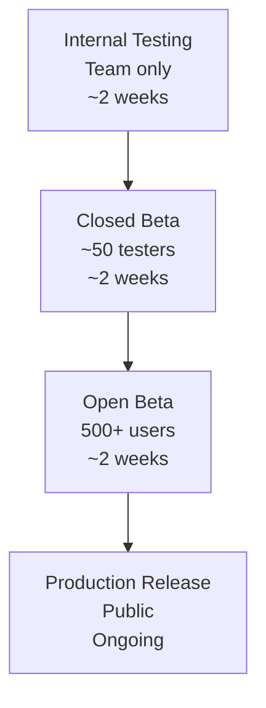
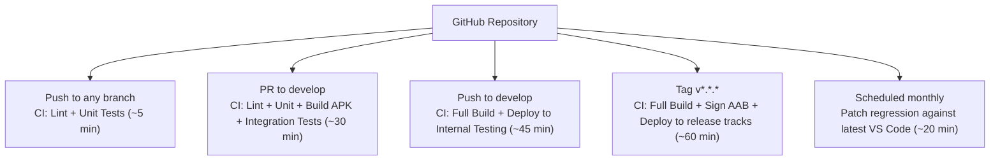

# Release Plan

**Project**: VSCodroid
**Version**: 1.0-draft
**Date**: 2026-02-10

---

## 1. Release Strategy

### 1.1 Release Phases


```mermaid
flowchart TD
  I["Internal Testing<br/>Team only<br/>~2 weeks"] --> C["Closed Beta<br/>~50 testers<br/>~2 weeks"]
  C --> O["Open Beta<br/>500+ users<br/>~2 weeks"]
  O --> P["Production Release<br/>Public<br/>Ongoing"]
```

### 1.2 Release Tracks (Google Play)

| Track | Purpose | Audience | Duration |
|-------|---------|----------|----------|
| Internal testing | Dev team validation | 5-10 testers | Continuous |
| Closed testing (Alpha) | Early adopter feedback | 50 invited testers | 2 weeks minimum |
| Open testing (Beta) | Broader validation | 500+ public opt-in | 2 weeks minimum |
| Production | Public release | Everyone | Ongoing |

### 1.3 Track Promotion Criteria

| Promotion | Required Gate |
|-----------|---------------|
| Internal → Closed | 100% M4 exit criteria pass, zero open S1/S2 bugs, crash-free rate ≥ 95% on internal track for 7 consecutive days |
| Closed → Open | At least 50 active testers, no new S1 bugs in last 7 days, ANR rate < 0.5%, extension install success ≥ 90% |
| Open → Production | At least 500 beta testers, crash-free rate ≥ 95% for 14 days, ANR rate < 0.5%, Play policy checklist complete |
| Production rollout increase (5%→10%→25%→50%→100%) | No halt condition triggered for previous stage over 24 hours |

---

## 2. CI/CD Pipeline

> **This section is the pipeline as sketched on 2026-02-10, not the one in `.github/workflows/`.**
> The rest of this document is maintained, §5 in particular is checked against the manifest and
> the shipped strings before a submission, but nothing below reflects how the project builds.
> The real workflows are `build.yml` and `lint.yml` on pull requests, `release.yml` on a `v*` tag,
> `r8.yml` on a weekly cron, `pages.yml` when `docs/site/**` lands on main, and
> `build-vscode-oss.yml`, which is dispatched by hand on a version bump.
>
> Several of the jobs sketched in §2.2 describe work that is done differently or not at all.
> `build-vscode` is not "a code-server fork": `build-vscode-oss.sh` builds vanilla Code - OSS from
> the MIT `microsoft/vscode` source with the diffs in `patches/` applied first, on an arm64
> runner, once per VS Code version, the pre-built server on Microsoft's update CDN carries terms
> that do not permit modifying and redistributing it, which is what forced the source build. It is
> also not part of an app build: those fetch the published tarball with `fetch-vscode-oss.sh`.
> `build-binaries` cross-compiles nothing, `scripts/download-*.sh` take Termux's packages.
> `integration-test` has no counterpart at all; no CI here runs the instrumented tests, and
> `android/app/src/androidTest/README.md` records the measurement behind that. Nor is there a
> monthly `patch-regression` job; the only scheduled workflow is the weekly shrinker run in
> `r8.yml`. For the steps CI really runs, `CONTRIBUTING.md` carries the table, and
> `scripts/check-build-steps.py` fails the build when it drifts.

### 2.1 Pipeline Architecture


```mermaid
flowchart TD
  REPO["GitHub Repository"] --> B1["Push to any branch<br/>CI: Lint + Unit Tests (~5 min)"]
  REPO --> B2["PR to develop<br/>CI: Lint + Unit + Build APK + Integration Tests (~30 min)"]
  REPO --> B3["Push to develop<br/>CI: Full Build + Deploy to Internal Testing (~45 min)"]
  REPO --> B4["Tag v*.*.*<br/>CI: Full Build + Sign AAB + Deploy to release tracks (~60 min)"]
  REPO --> B5["Scheduled monthly<br/>Patch regression against latest VS Code (~20 min)"]
```

### 2.2 Build Pipeline

```yaml
# .github/workflows/build.yml (simplified)

jobs:
  lint:
    # ktlint, eslint, android lint
    runs-on: ubuntu-latest

  unit-test:
    # JUnit tests (Kotlin), Jest tests (JS)
    # Coverage gate: Kotlin ≥ 80%, JS ≥ 70% — fails build if below targets
    runs-on: ubuntu-latest

  build-binaries:
    # Cross-compile Node.js, Python, etc. for ARM64
    # Cached: only rebuild when toolchain scripts change
    runs-on: ubuntu-latest
    container: vscodroid/build-env  # Docker with NDK

  build-vscode:
    # Build code-server fork (vscode-web + vscode-reh)
    # Cached: only rebuild when patches or VS Code version changes
    runs-on: ubuntu-latest

  build-android:
    needs: [build-binaries, build-vscode]
    # Assemble Android APK/AAB
    runs-on: ubuntu-latest

  integration-test:
    needs: [build-android]
    # Run on Firebase Test Lab (ARM64 device)
    runs-on: ubuntu-latest

  patch-regression:
    # Scheduled monthly: try applying patches to latest upstream VS Code
    # Fails if patch apply --check fails; posts issue/notification
    runs-on: ubuntu-latest

  deploy:
    needs: [integration-test]
    # Upload to Play Store (conditional on branch/tag)
    runs-on: ubuntu-latest
```

### 2.4 Scheduled Compatibility Jobs

| Job | Schedule | Purpose | Failure Action |
|-----|----------|---------|----------------|
| Patch regression | Monthly | Apply all patches to latest VS Code snapshot | Block upstream sync, open maintenance issue |
| Android preview smoke test | On Android beta release | Detect platform breakage early | Add risk item and mitigation task |

### 2.3 Caching Strategy

| Artifact | Cache Key | Size | Rebuild When |
|----------|-----------|------|-------------|
| Node.js ARM64 binary | `node-{version}-{ndk-version}-{script-hash}` | ~50 MB | Node.js version change or build script change |
| Python ARM64 binary | `python-{version}-{ndk-version}-{script-hash}` | ~30 MB | Python version change |
| VS Code build | `vscode-{commit}-{patches-hash}` | ~200 MB | VS Code version or patch change |
| Gradle build cache | `gradle-{dependencies-hash}` | ~100 MB | Dependency change |
| node_modules | `yarn-{lockfile-hash}` | ~500 MB | yarn.lock change |

**Expected CI times**:
- Cold build (no cache): ~60 minutes
- Warm build (cached binaries): ~15 minutes
- Hot build (only Kotlin changes): ~5 minutes

---

## 3. Versioning

### 3.1 Version Scheme

```
Format: MAJOR.MINOR.PATCH

MAJOR: Breaking changes, major architecture shifts
MINOR: New features, VS Code upstream updates
PATCH: Bug fixes, security patches

Examples:
  1.0.0  — First public release
  1.1.0  - Updated to VS Code 1.133, withdrew the Go toolchain
  1.1.1  — Fixed WebView crash on Samsung devices
  2.0.0  — Major architecture change (hypothetical)
```

### 3.2 Version Code (Android)

A plain counter, incremented by one for every build uploaded to Play, and
unrelated to the versionName. 1.0.0 shipped as 10; 1.1.0 ships as 12, because 11
was uploaded and burned.

```kotlin
versionCode = 12
versionName = "1.1.0"
```

This document described an encoded scheme, `major * 1_000_000 + minor * 10_000 +
patch * 100 + build`, which no release has used. Following it would take the next
build from 12 to 1,010,000, and Play never accepts a lower versionCode than one
already uploaded, so the million in between would be gone permanently. The two
numbers are deliberately independent: `versionName` is a label for people and may
repeat, `versionCode` is an identity Play enforces and may not.

---

## 4. Signing

### 4.1 Key Management

| Key | Purpose | Storage |
|-----|---------|---------|
| Upload key | Sign AAB for Play Store upload | Local keystore (developer machine) + encrypted backup |
| App signing key | Google Play re-signs with this | Managed by Google Play App Signing |

### 4.2 Play Store App Signing

- **Enrolled in Google Play App Signing** (mandatory for AAB)
- Upload key kept locally, backed up securely
- If upload key is lost, can request key reset from Google

### 4.3 CI Signing

```bash
# Store signing config as GitHub Secrets:
# KEYSTORE_BASE64 — Base64-encoded .jks file
# KEYSTORE_PASSWORD
# KEY_ALIAS
# KEY_PASSWORD

# In CI:
echo $KEYSTORE_BASE64 | base64 -d > keystore.jks
./gradlew bundleRelease \
  -Pandroid.injected.signing.store.file=keystore.jks \
  -Pandroid.injected.signing.store.password=$KEYSTORE_PASSWORD \
  -Pandroid.injected.signing.key.alias=$KEY_ALIAS \
  -Pandroid.injected.signing.key.password=$KEY_PASSWORD
```

---

## 5. Play Store Configuration

### 5.1 Store Listing

| Field | Value |
|-------|-------|
| App name | VSCodroid |
| Short description | A full desktop-class code editor on Android. Code anywhere. |
| Category | Tools > Developer Tools |
| Content rating | Everyone |
| Target audience | Developers, CS students |

### 5.2 Store Description (Draft)

The listing must not lead with a Microsoft trademark, and must carry the project's
four-line disclaimer in full. The wording below is the one in `README.md` §Legal and
in the app's own `legal_disclaimer` string; keep all four lines together and change
them in all three places at once.

```
VSCodroid is a full desktop-class code editor that runs entirely on your Android device.

Features:
• A real editor — syntax highlighting, IntelliSense, multi-cursor
• Extension support: install themes, linters and language support from Open VSX
• Integrated terminal with Node.js, Python and Git pre-installed
• Extra Key Row: Ctrl, Alt, Tab, Esc, F1-F12, symbols and a cursor trackpad
• Offline-first — code without internet
• Open folders from your device storage, including SD cards and cloud providers
• Portrait, landscape and split-screen support

The editor's interface is in English.

Built for developers who code on-the-go. Whether you're on a train, in a coffee shop, or just prefer your tablet — VSCodroid gives you a real development environment.

VSCodroid is built from the MIT-licensed Code - OSS source code.
Not affiliated with or endorsed by Microsoft Corporation.
"Visual Studio Code" and "VS Code" are trademarks of Microsoft.
Uses Open VSX extension registry, not Microsoft Marketplace.
```

Three feature lines are worded the way they are on purpose. "Open folders from your
device storage" is SAF, and the app deliberately offers no "Open with" entry for
individual files — advertising file opening would describe a capability that was
removed. And the editor is never named as the trademarked product; it is built from
Code - OSS, which is what the disclaimer says. The extension line offers "language
support" and not "language packs": a display-language pack from Open VSX installs,
enables, and changes not one word on screen, so the old wording sold a capability
the app does not have to exactly the readers who would miss it. The line under the
list says so outright, because a listing is read before the guide is.

### 5.3 Policy Compliance

| Policy | Compliance |
|--------|-----------|
| Binary execution | On a Play install, every binary is delivered by Play. Core tools (Node.js, Python, Git, bash, tmux, make, ripgrep, ssh) ship as `.so` in the base APK's `jniLibs`. The optional toolchains (**Ruby and Java 17, those two and no others**) are never in the APK and arrive as on-demand asset packs, selected by the user and fetched by Play. Note that the app has a second delivery path outside Play's scope: an install whose installing package is not `com.android.vending` (sideload, debug build, `adb install`) downloads the same toolchains as ZIPs over HTTPS from this project's GitHub Releases. Pre-compiled development tools for developer use. |
| Foreground Service (specialUse) | Local development server powering the code editor. Must run persistently to serve the IDE UI and handle file operations. |
| Permissions | The manifest declares four, and nothing else: INTERNET (extension marketplace, toolchain downloads), FOREGROUND_SERVICE + FOREGROUND_SERVICE_SPECIAL_USE (dev server), POST_NOTIFICATIONS (service notification). **No WAKE_LOCK and no MANAGE_EXTERNAL_STORAGE** — this row claimed both as "optional" and neither was ever declared; MANAGE_EXTERNAL_STORAGE would pull in a Play declaration process the app has no need of. External folders are reached through SAF, which is a user grant per folder and not a permission. No camera/mic/location/contacts. Check against `AndroidManifest.xml` before submitting, not against this row. |
| Privacy | No telemetry collected and nothing sent to any server of ours. One bundled feature does send user content to a third party and must be declared: GitHub Copilot Chat, which is inert until the user signs in to GitHub, after which the prompt and the code it attaches as context go to GitHub. Everything else stays on device. See §5.4 and https://rmyndharis.github.io/VSCodroid/privacy-policy.html |
| Content rating | No user-generated content, no social features, no violence, no mature content. |

### 5.4 Data Safety Declaration

What to enter in the Play Console's Data Safety form. It lives here because the
form has to agree with `docs/PRIVACY_POLICY.md` and nothing else in this
repository held the answers, so the two could drift with nobody able to notice.
When the policy changes, change this in the same commit.

The declaration is short because the app collects nothing itself. The whole of
it turns on one bundled feature.

| Question | Answer |
|----------|--------|
| Does your app collect or share any of the required user data types? | **Yes.** Not by the app itself, but GitHub Copilot Chat ships bundled and sends user content to GitHub. Answering no would be a false declaration. |
| Data type | **App activity → Other user-generated content**, and **Files and docs**, both only through Copilot Chat: the message the user types and the code the extension attaches as context. |
| Collected or shared? | **Shared.** It goes to GitHub, a third party. Nothing reaches any server operated by this project, which has none. |
| Is it processed ephemerally? | Do not claim ephemeral processing. GitHub's retention is GitHub's to state, not ours. |
| Is sharing optional? | **Yes, users can choose.** The feature is inert until the user signs in to GitHub, and the extension can be disabled or uninstalled from the Extensions view. |
| Purpose | **App functionality.** No analytics, no advertising, no personalisation, no fraud prevention. |
| Encrypted in transit? | **Yes**, over HTTPS. |
| Which methods of account creation does your app support? | **My app does not allow users to create an account.** There is no account system here at all, and the OAuth path only relays a callback for an extension signing in to a service the user already belongs to. |
| Can users login to your app with accounts created outside of the app? | **No.** Nothing here authenticates anyone. There is no login gate, no session, and only three activities: splash, editor, toolchain picker. The editor opens with everything available. |
| Can users request deletion? | **No.** The console wants a yes or a no, and this project runs no server and stores nothing, so it can delete nothing. Deletion of what Copilot sent is GitHub's, under GitHub's terms. |

Ticking no account creation opens a follow-up asking whether users can log
in with accounts made elsewhere, and the answer is no for the same reason.
Signing in to GitHub is an extension authenticating to a third party; the
token that comes back is written by `callback.html` into the WebView's
localStorage, where it belongs to the editor. The app holds no account and
no session, and the test that settles it is that someone can use every part
of this app without ever signing in to anything.

The deletion question is marked optional and offers a third choice about
automatic deletion within ninety days. That choice describes data you hold
and age out. This project holds none, so the answer stays a plain no.

The account-creation question is the one worth pausing on, because the wrong
answer is the tempting one. The form says it covers accounts made "by
redirecting users to a webpage where they can create an account", and GitHub's
sign-in page does carry a sign-up link, so ticking OAuth looks conservative.
It is not. Ticking it asserts that this app supports account creation, which
engages Play's account deletion policy and obliges the listing to publish a
route for deleting accounts that this project never creates, never holds and
cannot delete. The question asks about the app's own accounts; it has none.

Everything else the app touches stays on the device or goes only where the user
sent it: Git remotes they configured, package registries they invoked, SSH hosts
they named, and the extension registry when they browse it. None of that is
collection or sharing under Play's definition, because the app is not the party
receiving it.

Android's backup service copies `~/.vscodroid/data/Machine`, the editor
settings, to the user's own Google account when device backup is on. That is a
platform feature rather than app collection, and it is described in the privacy
policy under **Android Backup**.

---

## 6. Update Strategy

### 6.1 Update Types

| Type | Frequency | Contents | Delivery |
|------|-----------|----------|----------|
| Major release | Every 2-3 months | New features, VS Code updates | Play Store update |
| Patch release | As needed | Bug fixes, security patches | Play Store update |
| Toolchain update | With app update | Updated language toolchains | Play Store update (new asset pack versions via on-demand delivery) |
| Extension update | User-controlled | Extension updates from Open VSX | In-app (VS Code UI) |

### 6.2 Rollout Strategy

```
Production release rollout:
  Day 1:  5% of users
  Day 2:  10% (if no spike in crashes)
  Day 3:  25%
  Day 5:  50%
  Day 7:  100% (if crash-free rate > 95%)

Halt rollout if:
  - Crash-free rate drops below 90%
  - S1 bug reported by multiple users
  - ANR rate exceeds 1%
```

### 6.3 Rollback Plan

```
If rollout is halted:
1. Freeze rollout percentage immediately in Play Console
2. Promote last known-good production artifact as active release
3. Deactivate faulty release from further rollout
4. Publish in-app and release-note notice for affected users
5. Triage logs/crashes and prepare hotfix release

Notes:
- Play Store does not support forced app downgrade for users who already updated.
- Users already on faulty build receive fix via expedited hotfix rollout.
```

### 6.4 Hotfix Process

```
1. Identify critical bug (S1)
2. Create hotfix branch from main
3. Fix, test on device
4. Tag patch version (e.g., v1.0.1)
5. CI builds + signs AAB
6. Upload to Play Store with expedited review request
7. 100% rollout immediately (critical fix)
8. Cherry-pick fix to develop branch
```

---

## 7. Monitoring (Post-Release)

### 7.1 Metrics to Track

| Metric | Source | Alert Threshold |
|--------|--------|----------------|
| Crash-free rate | Play Console (Android Vitals) | < 95% |
| ANR rate | Play Console | > 0.5% |
| Daily active users | Play Console | Trend monitoring |
| User rating | Play Console | < 4.0 stars |
| Install/uninstall ratio | Play Console | Uninstall > 30% |
| Extension install success | On-device metrics only (no data transmitted) | < 90% |

### 7.2 Crash Reporting

- **In-app crash reporting**: Capture crash logs locally (not uploaded without consent)
- **Play Console**: Android Vitals for crash clusters and ANR analysis
- **User-initiated reports**: "Report a Bug" option in app settings → generates log bundle

**A v1.0.0 trace can be read back through Play, and not otherwise.** AGP puts the
map inside the App Bundle as
`BUNDLE-METADATA/com.android.tools.build.obfuscation/proguard.map` (measured: 14 MB
in the release AAB), so Play received v1.0.0's own map with the upload and
deobfuscates the crashes it collects without anyone doing anything. That covers
the channel that gathers traces at scale.

What is not covered is a trace someone pastes into an issue from a sideloaded
APK. The GitHub release for v1.0.0 attached no `mapping.txt`, and the only other
copy would have been a local build directory, which holds one build at a time and
has long since been overwritten. Measured: the published v1.0.0 APK carries
`pg-map-id 7e59ec8`, while the map on disk is from a later build. Such a trace can
be triaged by its message and its unobfuscated frames and no further.

One R8 run serves both artefacts, so this is a publishing gap and not a
correspondence problem. Measured on one tree: `assembleRelease` then
`bundleRelease` leave a single `pg_map_id`, and that same id is stamped in the
APK's dex, embedded in the AAB, and carried by the `mapping.txt` the release
attaches. The map on a release describes the APK on that release.

Later releases do not have this problem. `release.yml` attaches `mapping.txt` to
the release it builds, and `r8.yml` keeps it as a workflow artifact, so the map
travels with the build that produced it. When triaging, take the map from the
release the reporter installed rather than from a local build directory, which
holds whatever was compiled last.

### 7.3 Feedback Channels

| Channel | Purpose |
|---------|---------|
| GitHub Issues | Bug reports, feature requests |
| Play Store reviews | User feedback, rating management |
| GitHub Discussions | Community Q&A |

---

## 8. Distribution Channels

### 8.1 Primary: Google Play Store

- AAB format for per-device optimization
- Play App Signing for key management
- Staged rollouts for risk mitigation

### 8.2 Secondary: GitHub Releases

- APK download for sideloading
- Useful for users who can't access Play Store
- Each GitHub Release includes: APK, AAB, the toolchain ZIPs, `toolchains.sha256`,
  `checksums.sha256`, a build manifest, and generated release notes (`release.yml`)
- **The toolchain ZIPs are a delivery channel, not a convenience artifact.**
  `ToolchainRegistry` points every non-Play install at `releases/latest/download/`, so a release
  that omits them, or that publishes them without the matching `toolchains.sha256`, breaks
  toolchain installation for those users, including ones who already have the app. The packs in
  the AAB and the ZIPs on the release are built from the same download in the same job, so the
  two channels cannot ship different toolchain versions for one app version.

### 8.3 Future: F-Droid

- Open-source app repository
- Requires reproducible builds
- Good for privacy-conscious users
- Consider after Play Store launch is stable
