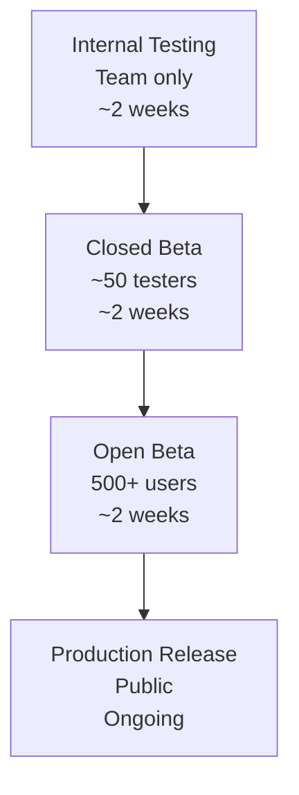
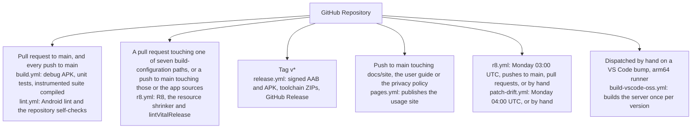

# Release Plan

**Project**: VSCodroid
**Version**: 1.0-draft
**Date**: 2026-02-10

---

## 1. Release Strategy

### 1.1 Release Phases


```mermaid
flowchart TD
  I["Internal Testing<br/>Team only<br/>~2 weeks"] --> C["Closed Beta<br/>~50 testers<br/>~2 weeks"]
  C --> O["Open Beta<br/>500+ users<br/>~2 weeks"]
  O --> P["Production Release<br/>Public<br/>Ongoing"]
```

### 1.2 Release Tracks (Google Play)

| Track | Purpose | Audience | Duration |
|-------|---------|----------|----------|
| Internal testing | Dev team validation | 5-10 testers | Continuous |
| Closed testing (Alpha) | Early adopter feedback | 50 invited testers | 2 weeks minimum |
| Open testing (Beta) | Broader validation | 500+ public opt-in | 2 weeks minimum |
| Production | Public release | Everyone | Ongoing |

### 1.3 Track Promotion Criteria

| Promotion | Required Gate |
|-----------|---------------|
| Internal → Closed | 100% M4 exit criteria pass, zero open S1/S2 bugs, crash-free rate ≥ 95% on internal track for 7 consecutive days |
| Closed → Open | At least 50 active testers, no new S1 bugs in last 7 days, ANR rate < 0.5%, extension install success ≥ 90% |
| Open → Production | At least 500 beta testers, crash-free rate ≥ 95% for 14 days, ANR rate < 0.5%, Play policy checklist complete |
| Production rollout increase (5%→10%→25%→50%→100%) | No halt condition triggered for previous stage over 24 hours |

---

## 2. CI/CD Pipeline

> `CONTRIBUTING.md` carries the table of the steps each workflow runs, and
> `scripts/check-build-steps.py` fails the build when a script CI runs is missing from it.

### 2.1 Pipeline Architecture


```mermaid
flowchart TD
  REPO["GitHub Repository"] --> B1["Pull request to main, and every push to main<br/>build.yml: debug APK, unit tests, instrumented suite compiled<br/>lint.yml: Android lint and the repository self-checks"]
  REPO --> B2["A pull request touching one of seven build-configuration paths, or a push to main touching those or the app sources<br/>r8.yml: R8, the resource shrinker and lintVitalRelease"]
  REPO --> B3["Tag v*<br/>release.yml: signed AAB and APK, toolchain ZIPs, GitHub Release"]
  REPO --> B4["Push to main touching docs/site, the user guide or the privacy policy<br/>pages.yml: publishes the usage site"]
  REPO --> B5["r8.yml: Monday 03:00 UTC, pushes to main, pull requests, or by hand<br/>patch-drift.yml: Monday 04:00 UTC, or by hand"]
  REPO --> B6["Dispatched by hand on a VS Code bump, arm64 runner<br/>build-vscode-oss.yml: builds the server once per version"]
```

### 2.2 Build Pipeline

Two workflows answer every pull request and every push to `main`.

```yaml
# .github/workflows/build.yml
jobs:
  build:            # "Build Debug APK"
    # Assembles the asset tree, then ./gradlew assembleDebug.
    # Fetches the published Code - OSS server tarball with fetch-vscode-oss.sh,
    # takes Node, Python and the Termux tools with the download-*.sh scripts,
    # and compiles the three native addons with build-native-addons.sh.
    runs-on: ubuntu-latest

  test:             # "Unit Tests"
    # ./gradlew testDebugUnitTest, and assembleDebugAndroidTest so the
    # instrumented suite is compiled. No CI here runs it on a device;
    # android/app/src/androidTest/README.md records why.
    runs-on: ubuntu-latest

# .github/workflows/lint.yml
jobs:
  lint:
    # ./gradlew lint against the recorded baseline, the node:assert scripts
    # under scripts/test-*.js, and the repository self-checks in scripts/check-*.py.
    runs-on: ubuntu-latest
```

The release build type is exercised separately, because it is the only one that runs R8 and the
resource shrinker.

```yaml
# .github/workflows/r8.yml  ("Shrinker")
# Monday 03:00 UTC, workflow_dispatch, pull requests touching one of seven
# build-configuration paths, and pushes to main touching those or the Kotlin,
# resources and manifest the shrinkers run over.
jobs:
  shrinker:
    # ./gradlew :app:optimizeReleaseResources :app:lintVitalRelease
    # Needs neither the keystore nor the asset tree.
    runs-on: ubuntu-latest
```

### 2.3 Caching Strategy

`build.yml` keeps two caches, both keyed by `hashFiles` over everything that shapes their contents.

| Cache | Holds | Key | Rebuilt when |
|-------|-------|-----|--------------|
| `downloads-` | The server tarball, the Termux `.deb` files and their index, the npm and musl payloads, the fetched extensions | Hash of `VSCODE_VERSION`, `VSCODE_COMMIT`, `patches/**`, `branding/**` and every `scripts/` file that fetches or verifies one of them | Any of those change |
| `assets-` | The unpacked tree that goes into the APK: `assets/vscode-reh/`, `assets/usr/`, `assets/extensions/` and `jniLibs/arm64-v8a/` | The same hash inputs | Any of those change |

Both declare `restore-keys`, so a miss on the exact key still restores the newest older entry.
That matters for correctness, not just speed: on an `assets-` hit the fetch step and its digest
check against the release never run, which is why `patches/`, `branding/` and
`build-vscode-oss.sh` are in the key even though no step in this workflow reads them. They change
the server tarball, which is republished under the same `server-<version>` tag, and the key is
what stops a stale tree going into the APK. The steps that build the three native addons run
unconditionally, so a change to `build-native-addons.sh` reaches the artifact whether or not the
cache hits.

Gradle's own dependency and build caches are handled by `gradle/actions/setup-gradle`.

### 2.4 Scheduled Compatibility Jobs

| Workflow | Schedule | Purpose | Failure Action |
|----------|----------|---------|----------------|
| `patch-drift.yml` | Monday 04:00 UTC, or dispatched with a tag | Applies every patch in `patches/` to an upstream VS Code tag, cumulatively and in glob order, the way the build does. Not `git apply --check`: two patches touch the same server source, so checking them independently would judge the second against a tree the first was supposed to have changed | Rebase the patch set before the next version bump |
| `r8.yml` | Monday 03:00 UTC, pushes to main, pull requests, or dispatched. A pull request is filtered to the files that configure the shrinkers; a push to main also covers the app sources they run over, so a change to Kotlin alone reaches a minified build when it lands rather than at the cron | Runs R8, the resource shrinker and `lintVitalRelease`, so a dependency that arrives without its consumer rules is caught before a tag | Fix the keep rules, or the shrinker configuration, before tagging |

---

## 3. Versioning

### 3.1 Version Scheme

```
Format: MAJOR.MINOR.PATCH

MAJOR: Breaking changes, major architecture shifts
MINOR: New features, VS Code upstream updates
PATCH: Bug fixes, security patches

Examples:
  1.0.0  - First public release
  1.1.0  - Updated to VS Code 1.133, withdrew the Go toolchain
  1.1.1  - Fixed WebView crash on Samsung devices
  2.0.0  - Major architecture change (hypothetical)
```

### 3.2 Version Code (Android)

A plain counter, incremented by one for every build uploaded to Play, and
unrelated to the versionName. 1.0.0 shipped as 10; 1.1.0 ships as 12, because 11
was uploaded and burned.

```kotlin
versionCode = 13
versionName = "1.2.0"
```

This document described an encoded scheme, `major * 1_000_000 + minor * 10_000 +
patch * 100 + build`, which no release has used. Following it would take the next
build from 12 to 1,010,000, and Play never accepts a lower versionCode than one
already uploaded, so the million in between would be gone permanently. The two
numbers are deliberately independent: `versionName` is a label for people and may
repeat, `versionCode` is an identity Play enforces and may not.

---

## 4. Signing

### 4.1 Key Management

| Key | Purpose | Storage |
|-----|---------|---------|
| Upload key | Sign AAB for Play Store upload | Local keystore (developer machine) + encrypted backup |
| App signing key | Google Play re-signs with this | Managed by Google Play App Signing |

### 4.2 Play Store App Signing

- **Enrolled in Google Play App Signing** (mandatory for AAB)
- Upload key kept locally, backed up securely
- If upload key is lost, can request key reset from Google

### 4.3 CI Signing

```bash
# Store signing config as GitHub Secrets:
# KEYSTORE_BASE64: Base64-encoded .jks file
# KEYSTORE_PASSWORD
# KEY_ALIAS
# KEY_PASSWORD

# In CI:
echo $KEYSTORE_BASE64 | base64 -d > keystore.jks
./gradlew bundleRelease \
  -Pandroid.injected.signing.store.file=keystore.jks \
  -Pandroid.injected.signing.store.password=$KEYSTORE_PASSWORD \
  -Pandroid.injected.signing.key.alias=$KEY_ALIAS \
  -Pandroid.injected.signing.key.password=$KEY_PASSWORD
```

---

## 5. Play Store Configuration

### 5.1 Store Listing

| Field | Value |
|-------|-------|
| App name | VSCodroid |
| Short description | A full desktop-class code editor on Android. Code anywhere. |
| Category | Tools > Developer Tools |
| Content rating | Everyone |
| Target audience | Developers, CS students |

### 5.2 Store Description (Draft)

The listing must not lead with a Microsoft trademark, and must carry the project's
four-line disclaimer in full. The wording below is the one in `README.md` §Legal and
in the app's own `legal_disclaimer` string; keep all four lines together and change
them in all three places at once.

```
VSCodroid is a full desktop-class code editor that runs entirely on your Android device.

Features:
• A real editor: syntax highlighting, IntelliSense, multi-cursor
• Extension support: install themes, linters and language support from Open VSX
• Integrated terminal with Node.js, Python and Git pre-installed
• Extra Key Row: Ctrl, Alt, Tab, Esc, F1-F12, symbols and a cursor trackpad
• Offline-first: code without internet
• Open folders from your device storage, including SD cards and cloud providers
• Portrait, landscape and split-screen support

The interface follows your phone's language, in 13 of them, the app's own screens
included. Extensions you install from Open VSX carry their own translations, or none.

Built for developers who code on-the-go. Whether you're on a train, in a coffee shop, or just prefer your tablet, VSCodroid gives you a real development environment.

VSCodroid is built from the MIT-licensed Code - OSS source code.
Not affiliated with or endorsed by Microsoft Corporation.
"Visual Studio Code" and "VS Code" are trademarks of Microsoft.
Uses Open VSX extension registry, not Microsoft Marketplace.
```

Three feature lines are worded the way they are on purpose. "Open folders from your
device storage" is SAF, and the app deliberately offers no "Open with" entry for
individual files; advertising file opening would describe a capability that was
removed. And the editor is never named as the trademarked product; it is built from
Code - OSS, which is what the disclaimer says. The extension line offers "language
support" and not "language packs": the interface translations ship in the app, so a
display-language pack from Open VSX buys nothing, and naming packs would send
readers to the marketplace for what they already have. The line under the list says
what is translated and what is not, because a listing is read before the guide is.

### 5.3 Policy Compliance

| Policy | Compliance |
|--------|-----------|
| Binary execution | On a Play install, every binary is delivered by Play. Core tools (Node.js, Python, Git plus its `git-remote-curl` helper, bash, tmux, make, ripgrep, ssh, ssh-keygen and the musl loader) ship as `.so` in the base APK's `jniLibs`. The optional toolchains (**Ruby and Java 17, those two and no others**) are never in the APK and arrive as on-demand asset packs, selected by the user and fetched by Play. Note that the app has a second delivery path outside Play's scope: an install whose installing package is neither `com.android.vending` nor Play's legacy `com.google.android.feedback` (sideload, debug build, `adb install`, and any installer that records no name at all) downloads the same toolchains as ZIPs over HTTPS from this project's GitHub Releases. Pre-compiled development tools for developer use. |
| Foreground Service (specialUse) | Local development server powering the code editor. Must run persistently to serve the IDE UI and handle file operations. |
| Permissions | Six on the listing, four of them ours. `android/app/src/main/AndroidManifest.xml` declares INTERNET (extension marketplace, toolchain downloads), FOREGROUND_SERVICE + FOREGROUND_SERVICE_SPECIAL_USE (dev server) and POST_NOTIFICATIONS (service notification). The manifest merger then adds two the source file never names, and the Play listing shows that merged set: FOREGROUND_SERVICE_DATA_SYNC, from Play's asset delivery library, and `com.vscodroid.DYNAMIC_RECEIVER_NOT_EXPORTED_PERMISSION`, which AndroidX defines for the app itself at signature protection level. **No WAKE_LOCK and no MANAGE_EXTERNAL_STORAGE**: this row claimed both as "optional" and neither was ever declared; MANAGE_EXTERNAL_STORAGE would pull in a Play declaration process the app has no need of. External folders are reached through SAF, which is a user grant per folder and not a permission. No camera/mic/location/contacts. Check the merged manifest a release build writes under `app/build/intermediates/merged_manifest/release/`, not this row and not the source file; `scripts/check-permission-claims.py` reads both halves and holds `docs/PRIVACY_POLICY.md` to what it finds. |
| Privacy | No telemetry collected and nothing sent to any server of ours. One bundled feature does send user content to a third party and must be declared: GitHub Copilot Chat, which has no account and no chat until the user signs in to GitHub, after which the prompt and the code it attaches as context go to GitHub. It still loads and runs from every start, signed in or not. Everything else stays on device. See §5.4 and https://rmyndharis.github.io/VSCodroid/privacy-policy.html |
| Content rating | No user-generated content, no social features, no violence, no mature content. |

### 5.4 Data Safety Declaration

What to enter in the Play Console's Data Safety form. It lives here because the
form has to agree with `docs/PRIVACY_POLICY.md` and nothing else in this
repository held the answers, so the two could drift with nobody able to notice.
When the policy changes, change this in the same commit.

The declaration is short because the app collects nothing itself. The whole of
it turns on one bundled feature.

| Question | Answer |
|----------|--------|
| Does your app collect or share any of the required user data types? | **Yes.** Not by the app itself, but GitHub Copilot Chat ships bundled and sends user content to GitHub. Answering no would be a false declaration. |
| Data type | **App activity → Other user-generated content**, and **Files and docs**, both only through Copilot Chat: the message the user types and the code the extension attaches as context. |
| Collected or shared? | **Shared.** It goes to GitHub, a third party. Nothing reaches any server operated by this project, which has none. |
| Is it processed ephemerally? | Do not claim ephemeral processing. GitHub's retention is GitHub's to state, not ours. |
| Is sharing optional? | **The form does not ask.** Optionality belongs to the collection branch, and the console refuses an answer to it for data that is only shared. Still worth knowing: Copilot has no account and no chat until the user signs in, and the extension can be disabled from the Extensions view. It ships as a built-in, so the view offers Disable rather than Uninstall. |
| Purpose | **App functionality.** No analytics, no advertising, no personalisation, no fraud prevention. |
| Encrypted in transit? | **Yes**, over HTTPS. |
| Which methods of account creation does your app support? | **My app does not allow users to create an account.** There is no account system here at all, and the OAuth path only relays a callback for an extension signing in to a service the user already belongs to. |
| Can users login to your app with accounts created outside of the app? | **No.** Nothing here authenticates anyone. There is no login gate, no session, and only three activities: splash, editor, toolchain picker. The editor opens with everything available. |
| Can users request deletion? | **No.** The console wants a yes or a no, and this project runs no server and stores nothing, so it can delete nothing. Deletion of what Copilot sent is GitHub's, under GitHub's terms. |

Ticking no account creation opens a follow-up asking whether users can log
in with accounts made elsewhere, and the answer is no for the same reason.
Signing in to GitHub is an extension authenticating to a third party; the
token that comes back is written by `callback.html` into the WebView's
localStorage, where it belongs to the editor. The app holds no account and
no session, and the test that settles it is that someone can use every part
of this app without ever signing in to anything.

The deletion question is marked optional and offers a third choice about
automatic deletion within ninety days. That choice describes data you hold
and age out. This project holds none, so the answer stays a plain no.

The account-creation question is the one worth pausing on, because the wrong
answer is the tempting one. The form says it covers accounts made "by
redirecting users to a webpage where they can create an account", and GitHub's
sign-in page does carry a sign-up link, so ticking OAuth looks conservative.
It is not. Ticking it asserts that this app supports account creation, which
engages Play's account deletion policy and obliges the listing to publish a
route for deleting accounts that this project never creates, never holds and
cannot delete. The question asks about the app's own accounts; it has none.

Marking a data type as shared rather than collected closes the whole
collection branch of the form, and the console enforces that on import.
Three questions live in that branch and must stay unanswered: whether the
data is processed ephemerally, whether users can choose, and the collection
purposes. Answering any of them fails with `You cannot answer` naming the
question. The sharing purposes are a separate set and are the ones to fill.

The form can be filled by CSV instead of by clicking. Export from the Data
safety page, set the response value column, and import the result. For this
app that is six cells: the two data types, and for each of them shared
rather than collected plus a sharing purpose of app functionality. Check the
other thirty-six data types are still blank before importing, because a
stray value there declares sharing the app does not do.

Everything else the app touches stays on the device or goes only where the user
sent it: Git remotes they configured, package registries they invoked, SSH hosts
they named, and the extension registry when they browse it. None of that is
collection or sharing under Play's definition, because the app is not the party
receiving it.

Android's backup service copies `~/.vscodroid/data/Machine`, the editor
settings, to the user's own Google account when device backup is on. That is a
platform feature rather than app collection, and it is described in the privacy
policy under **Android Backup**.

---

## 6. Update Strategy

### 6.1 Update Types

| Type | Frequency | Contents | Delivery |
|------|-----------|----------|----------|
| Major release | Every 2-3 months | New features, VS Code updates | Play Store update |
| Patch release | As needed | Bug fixes, security patches | Play Store update |
| Toolchain update | With app update | Updated language toolchains | Play Store update (new asset pack versions via on-demand delivery) |
| Extension update | User-controlled | Extension updates from Open VSX | In-app (VS Code UI) |

### 6.2 Rollout Strategy

```
Production release rollout:
  Day 1:  5% of users
  Day 2:  10% (if no spike in crashes)
  Day 3:  25%
  Day 5:  50%
  Day 7:  100% (if crash-free rate > 95%)

Halt rollout if:
  - Crash-free rate drops below 90%
  - S1 bug reported by multiple users
  - ANR rate exceeds 1%
```

### 6.3 Rollback Plan

```
If rollout is halted:
1. Freeze rollout percentage immediately in Play Console
2. Promote last known-good production artifact as active release
3. Deactivate faulty release from further rollout
4. Publish in-app and release-note notice for affected users
5. Triage logs/crashes and prepare hotfix release

Notes:
- Play Store does not support forced app downgrade for users who already updated.
- Users already on faulty build receive fix via expedited hotfix rollout.
```

### 6.4 Hotfix Process

```
1. Identify critical bug (S1)
2. Branch from main, fix, and test on device
3. Land it on main, so there is one line of history and nothing to cherry-pick afterwards
4. Bump versionName and versionCode together, and add the CHANGELOG entry
5. Tag the patch version from main (e.g., v1.0.1); release.yml triggers on `v*` and signs the AAB
6. Upload to Play Store with expedited review request
7. 100% rollout immediately (critical fix)
```

### 6.5 Release Checklist

The hotfix process above is this list compressed. The first step is the one
nothing else performs: the published release notes are generated from commits
(`generate_release_notes: true` in `release.yml`), so nothing reads `CHANGELOG.md`
and a tag taken with the heading still reading Unreleased leaves the repository
with no section naming the version a user installed.

```
1. Rename the CHANGELOG's `## [Unreleased]` heading to `## [X.Y.Z] - YYYY-MM-DD`,
   open a fresh empty `## [Unreleased]` above it, and move the link definitions
   at the foot of the file with it: `[Unreleased]` now compares vX.Y.Z...HEAD,
   and a new `[X.Y.Z]` line compares the previous tag with vX.Y.Z
2. Bump versionName and versionCode together in android/app/build.gradle.kts.
   release.yml refuses a tag that disagrees with versionName, and refuses a
   versionCode that is not greater than the previous v* tag's
3. Land both on main. The tag is taken from main, so there is one line of
   history and nothing to cherry-pick afterwards
4. Tag vX.Y.Z from main and push it. release.yml signs the AAB and the APK,
   attaches the toolchain ZIPs and the build manifest, and publishes the release
5. Upload the AAB to Play and start the staged rollout in 6.2
```

Step 1 is gated on the tag path. The "Check the tag matches the app version"
step in `release.yml` refuses a tag whose `versionName` has no `## [X.Y.Z]`
heading in `CHANGELOG.md`, so a tag taken with the section still open fails
before the build starts rather than publishing a version the file does not name.

The tag is the only honest home for it. A check on a pull request would fail
every branch that correctly leaves the section open, and the heading is wrong
at no other moment; that step already holds the version to look for, which is
why the two checks step 2 names live there as well.

---

## 7. Monitoring (Post-Release)

### 7.1 Metrics to Track

| Metric | Source | Alert Threshold |
|--------|--------|----------------|
| Crash-free rate | Play Console (Android Vitals) | < 95% |
| ANR rate | Play Console | > 0.5% |
| Daily active users | Play Console | Trend monitoring |
| User rating | Play Console | < 4.0 stars |
| Install/uninstall ratio | Play Console | Uninstall > 30% |
| Extension install success | On-device metrics only (no data transmitted) | < 90% |

### 7.2 Crash Reporting

- **In-app crash reporting**: Capture crash logs locally (not uploaded without consent)
- **Play Console**: Android Vitals for crash clusters and ANR analysis
- **User-initiated reports**: "Report a Bug" option in app settings → generates log bundle

**A v1.0.0 trace can be read back through Play, and not otherwise.** AGP puts the
map inside the App Bundle as
`BUNDLE-METADATA/com.android.tools.build.obfuscation/proguard.map` (measured: 14 MB
in the release AAB), so Play received v1.0.0's own map with the upload and
deobfuscates the crashes it collects without anyone doing anything. That covers
the channel that gathers traces at scale.

What is not covered is a trace someone pastes into an issue from a sideloaded
APK. The GitHub release for v1.0.0 attached no `mapping.txt`, and the only other
copy would have been a local build directory, which holds one build at a time and
has long since been overwritten. Measured: the published v1.0.0 APK carries
`pg-map-id 7e59ec8`, while the map on disk is from a later build. Such a trace can
be triaged by its message and its unobfuscated frames and no further.

One R8 run serves both artefacts, so this is a publishing gap and not a
correspondence problem. Measured on one tree: `assembleRelease` then
`bundleRelease` leave a single `pg_map_id`, and that same id is stamped in the
APK's dex, embedded in the AAB, and carried by the `mapping.txt` the release
attaches. The map on a release describes the APK on that release.

Later releases do not have this problem. `release.yml` attaches `mapping.txt` to
the release it builds, and `r8.yml` keeps it as a workflow artifact, so the map
travels with the build that produced it. When triaging, take the map from the
release the reporter installed rather than from a local build directory, which
holds whatever was compiled last.

### 7.3 Feedback Channels

| Channel | Purpose |
|---------|---------|
| GitHub Issues | Bug reports, feature requests |
| Play Store reviews | User feedback, rating management |
| GitHub Discussions | Community Q&A |

---

## 8. Distribution Channels

### 8.1 Primary: Google Play Store

- AAB format for per-device optimization
- Play App Signing for key management
- Staged rollouts for risk mitigation

### 8.2 Secondary: GitHub Releases

- APK download for sideloading
- Useful for users who can't access Play Store
- Each GitHub Release includes: APK, AAB, the toolchain ZIPs, `toolchains.sha256`,
  `checksums.sha256`, a build manifest, and generated release notes (`release.yml`)
- **The toolchain ZIPs are a delivery channel, not a convenience artifact.**
  `ToolchainRegistry` points every non-Play install at `releases/latest/download/`, and
  `ToolchainManager.pinLatest` then prefers `releases/download/v<versionName>/` when that
  release publishes the asset, falling back to `latest` when it does not. A release that omits
  the ZIPs, or that publishes them without the matching `toolchains.sha256`, therefore breaks
  toolchain installation for every install that resolves through it. Both halves have to hold:
  an app version's own release is asked first, and `latest` still has to carry the ZIPs for
  every install that falls back to it. The packs in the AAB and the ZIPs on the release are
  built from the same download in the same job, so the two channels cannot ship different
  toolchain versions for one app version.

### 8.3 Future: F-Droid

- Open-source app repository
- Requires reproducible builds
- Good for privacy-conscious users
- Consider after Play Store launch is stable
