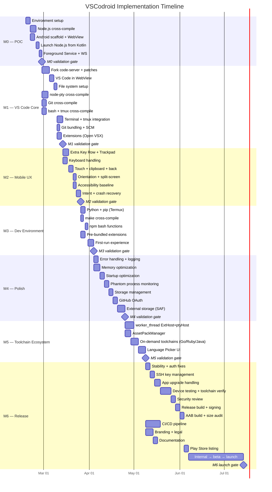
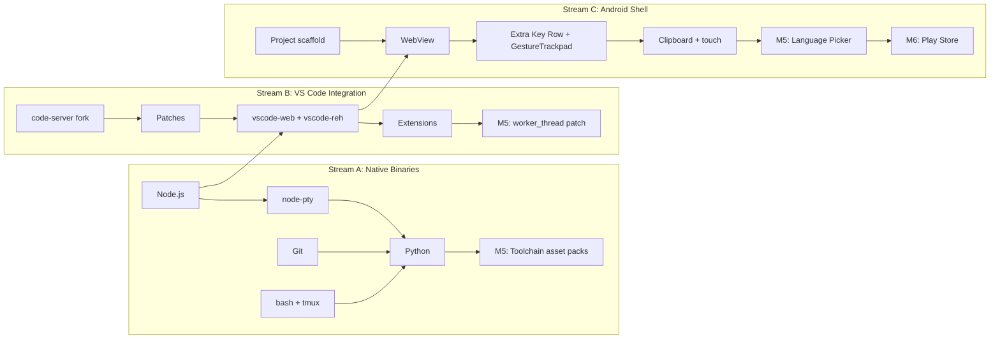
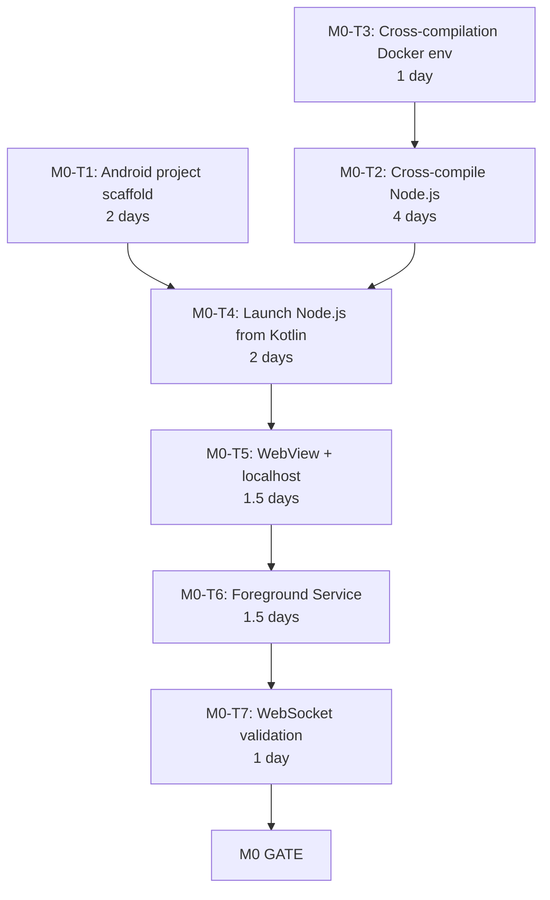
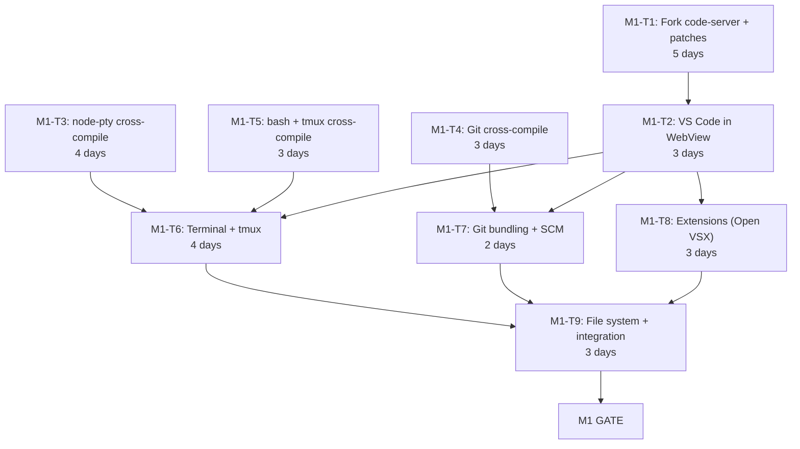
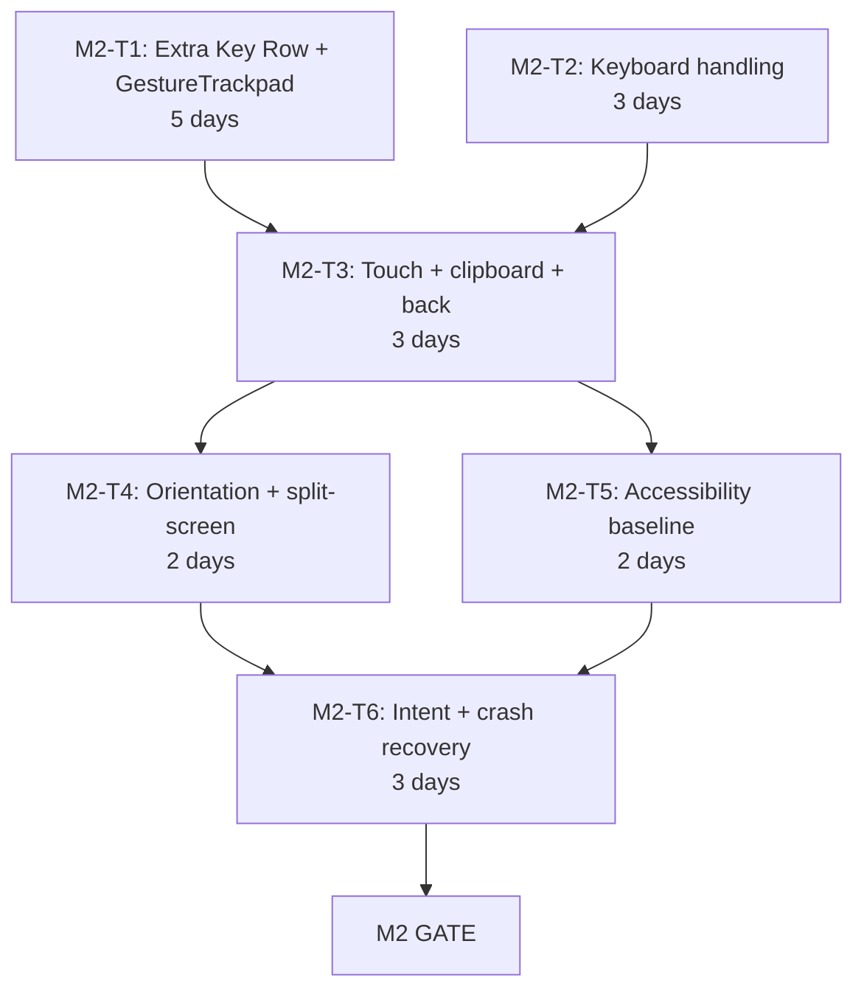
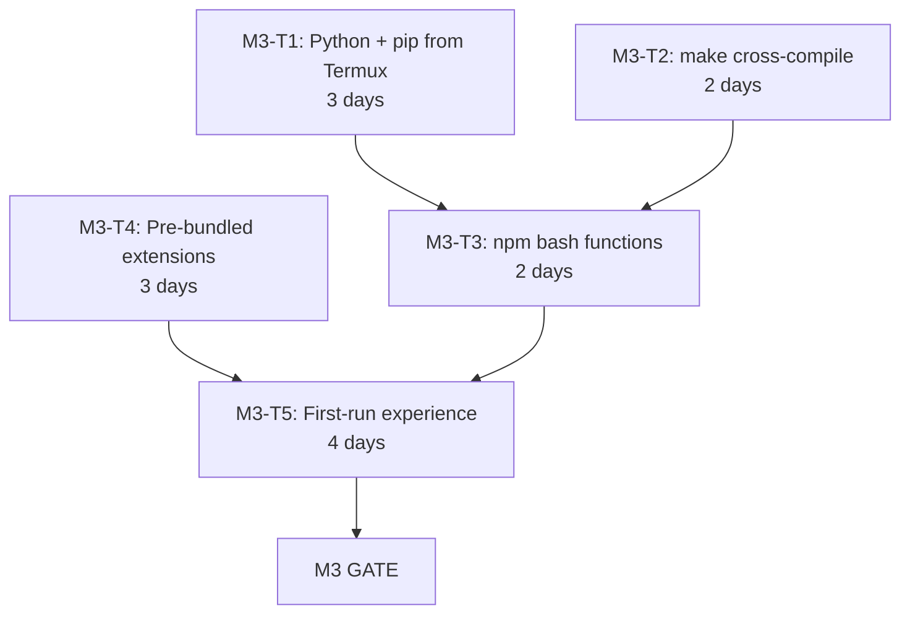
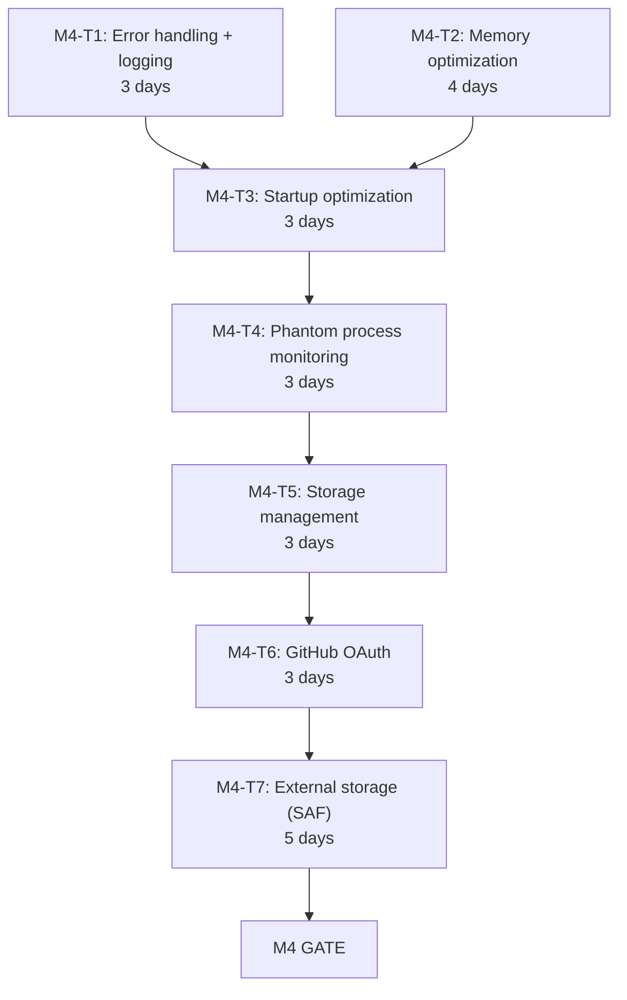
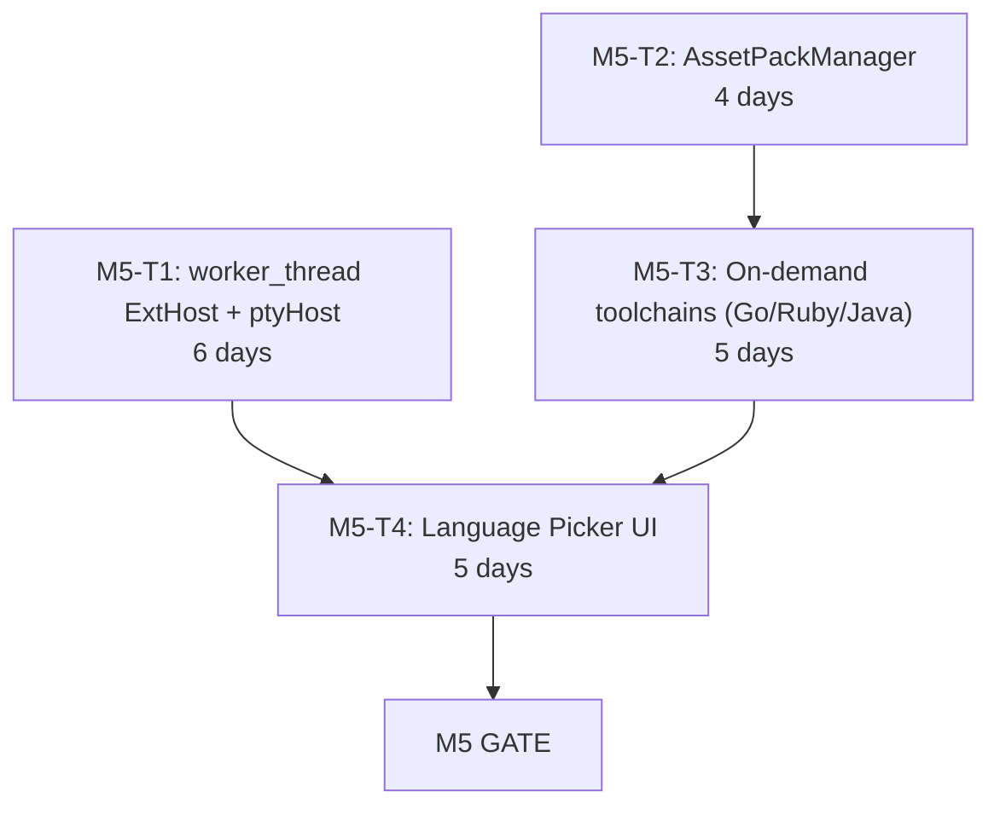
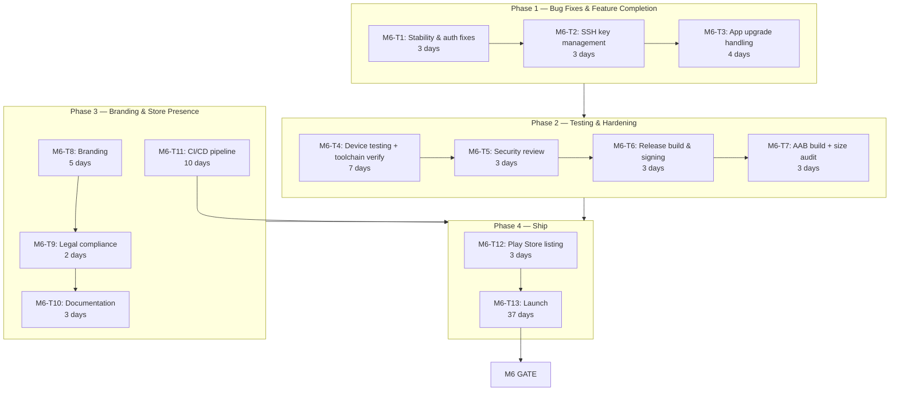

# Implementation Plan

**Project**: VSCodroid
**Version**: 1.0-draft
**Date**: 2026-02-10

---

## 1. Overview

This document translates the VSCodroid documentation suite (PRD, SRS, Architecture, Technical Spec, Milestones) into an actionable, week-by-week implementation plan with explicit task dependencies, file inventories, and validation checkpoints.

### 1.1 Guiding Principles

| Principle                         | Implication                                                                       |
| --------------------------------- | --------------------------------------------------------------------------------- |
| **Fail fast on highest risk**     | M0 exists solely to validate Node.js on Android — if this fails, everything stops |
| **Dependency-driven ordering**    | Tasks are sequenced so no task starts before its inputs are ready                 |
| **Parallelizable where possible** | Independent work streams identified within each milestone                         |
| **Risk checkpoints embedded**     | Go/no-go gates at week boundaries, not just milestone boundaries                  |
| **Files-first specification**     | Every task lists the exact files to create or modify                              |

### 1.2 Timeline Overview



### 1.3 Work Streams

Three largely independent work streams allow parallelism within milestones:



---

## 2. Prerequisites (Before M0 Starts)

**Duration**: 1-2 days (one-time setup)

### 2.1 Development Machine Setup

| Step                      | Command / Action                         | Validation                              |
| ------------------------- | ---------------------------------------- | --------------------------------------- |
| Install Android Studio    | Latest stable with API 36 support        | `sdkmanager --list` shows API 33-36     |
| Install NDK r27           | Via SDK Manager → NDK (Side by side)     | `$ANDROID_NDK_HOME/ndk-build --version` |
| Install JDK 17            | System package manager or Android Studio | `java --version` → 17.x                 |
| Install Node.js 20 LTS    | `brew install node@20` (macOS)           | `node --version` → v20.x                |
| Install Yarn Classic      | `npm install -g yarn`                    | `yarn --version` → 1.x                  |
| Install Python 3.11+      | `brew install python`                    | `python3 --version` → 3.11+             |
| Install Docker (optional) | For reproducible cross-compilation       | `docker --version`                      |

### 2.2 Repository Initialization

```
Files to create:
├── .gitignore
├── CLAUDE.md                      ← already exists
├── MILESTONES.md                  ← already exists
├── README.md                      ← already exists
├── LICENSE                        ← already exists
├── docs/                          ← already exists (01-12)
├── android/                       ← M0 creates this
├── server/                        ← M1 creates this (code-server submodule)
├── patches/
│   ├── code-server/               ← M1 populates
│   └── vscodroid/                 ← M1 populates
├── toolchains/
│   ├── Dockerfile                 ← M0 creates
│   ├── build-node.sh              ← M0 creates
│   ├── build-python.sh            ← M3 creates
│   ├── build-node-pty.sh          ← M1 creates
│   ├── build-git.sh               ← M1 creates
│   ├── build-bash.sh              ← M1 creates
│   └── build-tmux.sh              ← M1 creates
├── scripts/
│   ├── setup.sh                   ← M0 creates
│   ├── build-all.sh               ← M1 creates
│   ├── apply-patches.sh           ← M1 creates
│   ├── package-assets.sh          ← M1 creates
│   └── deploy.sh                  ← M0 creates
└── test/
    ├── projects/                  ← M1 creates (test fixtures)
    └── extensions/                ← M1 creates (test fixtures)
```

### 2.3 Hardware Requirements

- [ ] ARM64 physical Android device (API 33+) available and USB-debuggable
- [ ] ADB connection verified: `adb devices` shows device
- [ ] Developer options + USB debugging enabled on device
- [ ] Device has ≥ 2 GB free storage

---

## 3. M0 — Proof of Concept

**Goal**: Validate that Node.js runs on Android and WebView can connect to it via localhost.
**Duration**: 2 weeks (10 working days)
**Risk level**: HIGH — this is the "can we even do this?" milestone

### 3.1 Task Breakdown



---

#### M0-T1: Android Project Scaffold

**Effort**: 2 days | **Dependencies**: Prerequisites complete | **Parallel with**: M0-T2, M0-T3

**Files to create**:

```
android/
├── build.gradle.kts                    (root build file)
├── settings.gradle.kts                 (project settings)
├── gradle.properties                   (JVM args, Android config)
├── gradle/
│   └── libs.versions.toml              (version catalog)
├── app/
│   ├── build.gradle.kts                (app module — minSdk 33, targetSdk 36)
│   ├── proguard-rules.pro
│   └── src/
│       └── main/
│           ├── AndroidManifest.xml     (permissions, services, activities)
│           ├── kotlin/com/vscodroid/
│           │   ├── VSCodroidApp.kt     (Application class)
│           │   └── MainActivity.kt     (WebView host — placeholder)
│           ├── res/
│           │   ├── layout/
│           │   │   └── activity_main.xml   (WebView container)
│           │   ├── values/
│           │   │   └── strings.xml
│           │   └── drawable/
│           │       └── ic_launcher.xml     (placeholder icon)
│           └── jniLibs/
│               └── arm64-v8a/              (empty — M0-T2 populates)
```

**Implementation steps**:

1. Create new Gradle project with Kotlin DSL
2. Configure `app/build.gradle.kts`:
   ```kotlin
   android {
       namespace = "com.vscodroid"
       compileSdk = 36
       defaultConfig {
           applicationId = "com.vscodroid"
           minSdk = 33
           targetSdk = 36
           versionCode = 1
           versionName = "0.0.1-m0"
           ndk { abiFilters += "arm64-v8a" }
       }
       packaging {
           jniLibs { useLegacyPackaging = true }  // Critical for .so trick
       }
   }
   ```
3. Configure `AndroidManifest.xml` with:
   - `INTERNET`, `FOREGROUND_SERVICE`, `FOREGROUND_SERVICE_SPECIAL_USE`, `POST_NOTIFICATIONS` permissions
   - `MainActivity` declaration
   - `NodeService` declaration (placeholder)
4. Create `VSCodroidApp.kt` with `WebView.setDataDirectorySuffix("vscodroid")` in `onCreate()`
5. Create `MainActivity.kt` with basic WebView setup
6. Create `activity_main.xml` with WebView filling the layout

**Acceptance criteria**:

- [ ] `./gradlew assembleDebug` succeeds
- [ ] APK installs on ARM64 device
- [ ] App launches and shows blank WebView
- [ ] Logcat shows "VSCodroid" tag

---

#### M0-T2: Cross-Compile Node.js for ARM64 Android

**Effort**: 4 days | **Dependencies**: M0-T3 | **Critical path item**

**Files to create**:

```
toolchains/
├── build-node.sh         (main build script)
└── patches/
    └── node/             (Termux patches for Node.js)
        ├── 001-android-fixes.patch
        └── ...
```

**Output**: `android/app/src/main/jniLibs/arm64-v8a/libnode.so`

**Implementation steps**:

1. **Day 1 — Setup and research**:
   - Study Termux's `packages/nodejs/build.sh` for patch inventory
   - Download Node.js LTS source (v20.x)
   - Identify required Termux patches (typically 5-15 patches)
   - Create `build-node.sh` script skeleton

2. **Day 2 — Cross-compilation attempt**:
   - Set NDK toolchain variables:
     ```bash
     export CC=$NDK/toolchains/llvm/prebuilt/linux-x86_64/bin/aarch64-linux-android28-clang
     export CXX=${CC}++
     ```
   - Apply Termux patches to Node.js source
   - Run configure:
     ```bash
     ./configure \
       --dest-cpu=arm64 --dest-os=android --cross-compiling \
       --partly-static --with-intl=small-icu --openssl-no-asm \
       --without-inspector --without-node-snapshot --shared-zlib \
       --prefix=/data/data/com.vscodroid/files/usr
     ```
   - Start build: `make -j$(nproc)`

3. **Day 3 — Debug build failures**:
   - Fix compilation errors (expect 3-5 issues)
   - Common issues: missing headers, linker flags, V8 assembly
   - Apply 16KB page alignment: `LDFLAGS="-Wl,-z,max-page-size=16384"`
   - Successful build → strip: `aarch64-linux-android-strip --strip-unneeded out/Release/node`

4. **Day 4 — Validate and package**:
   - Copy to jniLibs: `cp out/Release/node android/app/src/main/jniLibs/arm64-v8a/libnode.so`
   - Verify: `file libnode.so` → `ELF 64-bit LSB pie executable, ARM aarch64`
   - Push to device via adb, test execution: `adb shell /data/local/tmp/libnode.so --version`
   - Create minimal HTTP server test script

**Risk checkpoint (end of Day 3)**:

> If Node.js compilation fails after 3 days of attempts, activate contingency: extract pre-built Node.js binary from Termux .deb package. See Risk Matrix T02.

**Acceptance criteria**:

- [ ] `libnode.so` is a valid ARM64 ELF binary
- [ ] Binary runs on physical device: `node --version` outputs version string
- [ ] Binary can execute a simple `http.createServer` script
- [ ] Binary size < 60 MB after stripping

---

#### M0-T3: Cross-Compilation Docker Environment

**Effort**: 1 day | **Dependencies**: None | **Parallel with**: M0-T1

**Files to create**:

```
toolchains/
└── Dockerfile
```

**Implementation steps**:

1. Create Dockerfile based on Ubuntu 22.04 with:
   - Android NDK r27 pre-installed
   - Build dependencies (python3, make, gcc, etc.)
   - Environment variables for NDK paths
2. Build and test: `docker build -t vscodroid/build-env toolchains/`
3. Verify NDK compiler works inside container:
   ```bash
   docker run vscodroid/build-env aarch64-linux-android28-clang --version
   ```

**Acceptance criteria**:

- [ ] Docker image builds successfully
- [ ] NDK compiler accessible inside container
- [ ] Can cross-compile a trivial C program for ARM64 Android

---

#### M0-T4: Launch Node.js from Kotlin

**Effort**: 2 days | **Dependencies**: M0-T1, M0-T2

**Files to create / modify**:

```
android/app/src/main/kotlin/com/vscodroid/
├── service/
│   └── ProcessManager.kt       (Node.js process lifecycle)
├── util/
│   ├── Environment.kt          (env var construction)
│   └── PortFinder.kt           (find available localhost port)
└── assets/
    └── test-server.js           (minimal Express-like HTTP server)
```

**Implementation steps**:

1. **PortFinder.kt** — find available localhost port:
   - Bind to port 0, read assigned port, close socket
   - Return port number

2. **Environment.kt** — construct environment variables:

   ```kotlin
   fun buildEnvironment(context: Context, port: Int): Map<String, String> {
       val nativeLibDir = context.applicationInfo.nativeLibraryDir
       val filesDir = context.filesDir.absolutePath
       return mapOf(
           "HOME" to "$filesDir/home",
           "TMPDIR" to "${context.cacheDir}/tmp",
           "PATH" to "$nativeLibDir:/system/bin",
           "LD_LIBRARY_PATH" to nativeLibDir,
           "NODE_PATH" to "$filesDir/node_modules",
           "LANG" to "en_US.UTF-8",
           "TERM" to "xterm-256color",
       )
   }
   ```

3. **ProcessManager.kt** — launch and monitor Node.js:
   - `startServer()`: ProcessBuilder with `libnode.so` path + `--max-old-space-size=512` + server script
   - `waitForReady()`: Poll `http://localhost:PORT/healthz` every 200ms, timeout 30s
   - `stopServer()`: SIGTERM → wait 5s → SIGKILL
   - `isServerHealthy()`: Single HTTP GET to `/healthz`

4. **test-server.js** — minimal HTTP server:

   ```javascript
   const http = require("http");
   const port = process.argv[2] || 8080;
   http
     .createServer((req, res) => {
       if (req.url === "/healthz") {
         res.writeHead(200);
         res.end("OK");
         return;
       }
       res.writeHead(200, { "Content-Type": "text/html" });
       res.end("<h1>Hello from Node.js on Android!</h1>");
     })
     .listen(port, "127.0.0.1", () => console.log(`Listening on :${port}`));
   ```

5. Wire up in `MainActivity.kt`: start ProcessManager → wait for ready → log success

**Acceptance criteria**:

- [ ] Node.js process starts from Kotlin via ProcessBuilder
- [ ] Health check returns 200 within 30 seconds
- [ ] `curl http://localhost:PORT/` from adb shell returns HTML
- [ ] Process PID is trackable

---

#### M0-T5: WebView Loads Localhost Content

**Effort**: 1.5 days | **Dependencies**: M0-T4

**Files to modify**:

```
android/app/src/main/kotlin/com/vscodroid/
├── MainActivity.kt              (add WebView configuration + loadUrl)
└── webview/
    ├── VSCodroidWebView.kt      (WebView settings configuration)
    └── VSCodroidWebViewClient.kt (URL loading, error handling)
```

**Implementation steps**:

1. **VSCodroidWebView.kt** — configure WebView settings:

   ```kotlin
   fun configure(webView: WebView) {
       webView.settings.apply {
           javaScriptEnabled = true
           domStorageEnabled = true
           databaseEnabled = true
           setSupportZoom(false)
           builtInZoomControls = false
           textZoom = 100
           mixedContentMode = MIXED_CONTENT_ALWAYS_ALLOW
           cacheMode = LOAD_DEFAULT
       }
   }
   ```

2. **VSCodroidWebViewClient.kt** — handle page load errors:
   - `onReceivedError()`: show retry UI
   - `onReceivedHttpError()`: log

3. **MainActivity.kt** — orchestrate:
   - Start ProcessManager
   - Wait for server ready
   - `webView.loadUrl("http://localhost:$port/")`
   - Verify "Hello from Node.js on Android!" displays

**Acceptance criteria**:

- [ ] WebView displays "Hello from Node.js on Android!" served by Node.js
- [ ] Page load completes within 5 seconds of server ready
- [ ] No WebView errors in Logcat

---

#### M0-T6: Foreground Service

**Effort**: 1.5 days | **Dependencies**: M0-T5

**Files to create / modify**:

```
android/app/src/main/kotlin/com/vscodroid/
├── service/
│   └── NodeService.kt           (Foreground Service)
├── MainActivity.kt              (bind to service)
└── AndroidManifest.xml           (service declaration)

android/app/src/main/res/
└── values/
    └── strings.xml              (notification text)
```

**Implementation steps**:

1. **NodeService.kt** — Foreground Service with `specialUse` type:
   - `onCreate()`: create notification channel, start foreground
   - Move ProcessManager logic into service
   - Node.js watchdog thread: `process.waitFor()` → auto-restart if exit != 0
   - `onDestroy()`: graceful shutdown of Node.js

2. **AndroidManifest.xml** — declare service:

   ```xml
   <service
       android:name=".service.NodeService"
       android:foregroundServiceType="specialUse"
       android:exported="false">
       <property
           android:name="android.app.PROPERTY_SPECIAL_USE_FGS_SUBTYPE"
           android:value="Local development server for code editor" />
   </service>
   ```

3. **MainActivity.kt** — bind to NodeService, receive server-ready callback

**Acceptance criteria**:

- [ ] Foreground Service starts with persistent notification
- [ ] Node.js survives Activity going to background (Home button)
- [ ] Return to app after 5 minutes → WebView still connected
- [ ] Kill Node.js via `adb shell kill` → auto-restarts within 5 seconds

---

#### M0-T7: WebSocket Validation

**Effort**: 1 day | **Dependencies**: M0-T6

**Files to modify**:

```
android/app/src/main/assets/
└── test-server.js               (add WebSocket support)
```

**Implementation steps**:

1. Add WebSocket support to test server (using `ws` npm package or raw HTTP upgrade)
2. WebView JavaScript: open `ws://localhost:PORT/ws`, send message, receive echo
3. Validate bidirectional communication works through WebView

**Acceptance criteria**:

- [ ] WebSocket connection established from WebView to localhost
- [ ] Bidirectional message exchange works
- [ ] Connection survives for 10+ minutes without dropping

---

### 3.2 M0 Validation Gate

**All criteria must pass before proceeding to M1**:

| #   | Criterion                                                 | Test Method                        |
| --- | --------------------------------------------------------- | ---------------------------------- |
| 1   | Node.js ARM64 binary runs on physical device              | `adb shell` execution              |
| 2   | Express-style HTTP server responds on localhost           | `curl` from adb shell              |
| 3   | WebView renders content from localhost                    | Visual inspection                  |
| 4   | WebSocket bidirectional communication works               | JS console test                    |
| 5   | Process survives app backgrounding via Foreground Service | Home → 5 min → return              |
| 6   | Auto-restart works after process kill                     | `adb shell kill` → observe restart |

**Risk checkpoint**: If any criterion fails, review Risk Matrix T02 and T06 before attempting fixes. Consider Termux binary fallback.

---

## 4. M1 — VS Code Core

**Goal**: VS Code Workbench running in WebView with extensions, terminal, and Git.
**Duration**: 3-4 weeks (15-20 working days)
**Entry criteria**: All M0 gate criteria passed

### 4.1 Task Breakdown



**Parallelization**: M1-T3, M1-T4, M1-T5 can all run in parallel with M1-T1 (different work streams).

---

#### M1-T1: Fork code-server + Build VS Code

**Effort**: 5 days | **Dependencies**: M0 gate passed | **Critical path**

**Files to create**:

```
server/                             (git submodule → code-server fork)
├── lib/vscode/                     (VS Code source, managed by code-server)
├── patches/                        (code-server's patches)
└── ci/dev/patch-vscode.sh          (code-server's patch script)

patches/
├── code-server/
│   ├── product.diff                (branding → "VSCodroid", Open VSX URLs)
│   ├── disable-telemetry.diff
│   ├── disable-update-check.diff
│   ├── marketplace.diff            (Open VSX integration)
│   ├── serve-web.diff
│   ├── webview.diff
│   ├── browser-command.diff
│   ├── github-auth.diff
│   └── local-storage.diff
└── vscodroid/                      (empty for M1 — populated M2+)

scripts/
├── apply-patches.sh
├── build-vscode.sh
├── build-all.sh
└── package-assets.sh
```

**Implementation steps**:

1. **Day 1 — Fork and understand code-server**:
   - Fork `coder/code-server` to `rmyndharis/code-server`
   - Clone as git submodule: `git submodule add <url> server`
   - Study code-server build system: `ci/dev/`, `ci/build/`, patch mechanism
   - Read each existing code-server patch to understand what it does

2. **Day 2 — Apply and customize patches**:
   - Run `./ci/dev/patch-vscode.sh` to apply code-server patches
   - Create `patches/code-server/product.diff` with VSCodroid branding:
     ```json
     {
       "nameShort": "VSCodroid",
       "nameLong": "VSCodroid",
       "applicationName": "vscodroid",
       "dataFolderName": ".vscodroid",
       "extensionsGallery": {
         "serviceUrl": "https://open-vsx.org/vscode/gallery",
         "itemUrl": "https://open-vsx.org/vscode/item",
         "resourceUrlTemplate": "https://open-vsx.org/vscode/unpkg/{publisher}/{name}/{version}/{path}"
       },
       "telemetryOptIn": false
     }
     ```
   - Create `scripts/apply-patches.sh` (as specified in Tech Spec §6.2)

3. **Day 3 — Build vscode-web**:
   - Install VS Code dependencies: `cd server/lib/vscode && yarn`
   - Build web client: `yarn gulp vscode-web-min`
   - Verify output in `out-vscode-web/`

4. **Day 4 — Build vscode-reh (server)**:
   - Build server: `yarn gulp vscode-reh-min`
   - Verify output in `out-vscode-reh/`
   - Verify `@vscode/ripgrep` binary is included in `node_modules`
   - Bundle ripgrep as `libripgrep.so` in `jniLibs/arm64-v8a/` (symlink created by `FirstRunSetup.setupToolSymlinks()`)

5. **Day 5 — Package and scripts**:
   - Create `scripts/build-vscode.sh` (automates steps 2-4)
   - Create `scripts/package-assets.sh`:
     - Copy `out-vscode-web/` → `android/app/src/main/assets/vscode-web/`
     - Copy `out-vscode-reh/` → `android/app/src/main/assets/vscode-reh/`
   - Create `android/app/src/main/assets/server.js` (bootstrap script)
   - Test: full build from clean state

**Acceptance criteria**:

- [ ] `apply-patches.sh` applies all patches without conflict
- [ ] `yarn gulp vscode-web-min` succeeds
- [ ] `yarn gulp vscode-reh-min` succeeds
- [ ] `out-vscode-web/` contains index.html and static assets
- [ ] `out-vscode-reh/` contains server entry point and node_modules

---

#### M1-T2: VS Code Running in WebView

**Effort**: 3 days | **Dependencies**: M1-T1

**Files to create / modify**:

```
android/app/src/main/assets/
├── vscode-web/                  (from M1-T1 build output)
├── vscode-reh/                  (from M1-T1 build output)
└── server.js                    (bootstrap script — replaces test-server.js)

android/app/src/main/kotlin/com/vscodroid/
├── service/
│   ├── NodeService.kt           (update to launch VS Code server)
│   └── ProcessManager.kt        (update server launch command)
├── setup/
│   └── FirstRunSetup.kt         (asset extraction on first run)
└── MainActivity.kt              (update to load VS Code)
```

**Implementation steps**:

1. **FirstRunSetup.kt** — extract VS Code assets:
   - Check if `files/server/vscode-reh/` exists
   - If not, extract from APK assets to app-private storage
   - Create required directories: `home/`, `home/.vscodroid/`, `home/.vscodroid/extensions/`
   - Track extraction version for future upgrades
   - Configure VS Code settings (`settings.json`):
     ```json
     {
       "terminal.integrated.profiles.linux": {
         "bash": { "path": "/data/data/com.vscodroid/files/usr/bin/bash" }
       },
       "terminal.integrated.defaultProfile.linux": "bash",
       "git.path": "/data/data/com.vscodroid/files/usr/bin/git"
     }
     ```

2. **server.js** — bootstrap script (see Tech Spec §3.1):
   - Parse command-line arguments
   - Set up VS Code product.json overrides
   - Launch vscode-reh server entry point
   - Expose `/healthz` endpoint
   - Serve vscode-web static files

3. **ProcessManager.kt** — update server launch:

   ```kotlin
   val command = listOf(
       "$nativeLibDir/libnode.so",
       "--max-old-space-size=512",
       "$filesDir/server/server.js",
       "--host=127.0.0.1",
       "--port=$port",
       "--without-connection-token",
       "--extensions-dir=$home/.vscodroid/extensions",
       "--user-data-dir=$home/.vscodroid",
       "--server-data-dir=$home/.vscodroid",
       "--accept-server-license-terms"
   )
   ```

4. **MainActivity.kt** — load VS Code:
   - Wait for server ready
   - `webView.loadUrl("http://localhost:$port/")`

**Acceptance criteria**:

- [ ] VS Code Workbench UI renders in WebView
- [ ] Monaco Editor loads and is interactive (typing works)
- [ ] Command Palette opens (F1 or via menu)
- [ ] File Explorer panel visible
- [ ] No critical JS errors in WebView console

---

#### M1-T3: Cross-Compile node-pty

**Effort**: 4 days | **Dependencies**: M0 gate | **Parallel with M1-T1**

**Files to create**:

```
toolchains/
└── build-node-pty.sh
```

**Output**: `android/app/src/main/jniLibs/arm64-v8a/libnode_pty.so`

**Implementation steps**:

1. Set up node-gyp cross-compilation environment
2. Build with NDK toolchain:
   ```bash
   node-gyp rebuild \
     --target=20.0.0 --arch=arm64 \
     --nodedir=/path/to/node-source \
     CC=$NDK_CC CXX=$NDK_CXX
   ```
3. Copy output: `build/Release/pty.node` → `libnode_pty.so`
4. Test PTY creation on device

**Acceptance criteria**:

- [ ] `libnode_pty.so` is valid ARM64 ELF
- [ ] PTY allocation works on physical device
- [ ] Can spawn a shell process through PTY

---

#### M1-T4: Cross-Compile Git

**Effort**: 3 days | **Dependencies**: M0 gate | **Parallel with M1-T1**

**Files to create**:

```
toolchains/
└── build-git.sh
```

**Output**: `android/app/src/main/jniLibs/arm64-v8a/libgit.so` + `assets/usr/lib/git-core/`

**Implementation steps** (see Tech Spec §1.6):

1. Download Git 2.40+ source
2. Apply Termux patches
3. Configure and build:
   ```bash
   ./configure --host=aarch64-linux-android \
     --prefix=/data/data/com.vscodroid/files/usr \
     ac_cv_fread_reads_directories=no ac_cv_snprintf_returns_bogus=no
   make -j$(nproc) NO_GETTEXT=YesPlease NO_TCLTK=YesPlease
   ```
4. Package: main binary as `libgit.so`, helper binaries in assets

**Acceptance criteria**:

- [ ] `git --version` runs on device
- [ ] `git init`, `git add`, `git commit` work
- [ ] `git status` produces correct output

---

#### M1-T5: Cross-Compile bash + tmux

**Effort**: 3 days | **Dependencies**: M0 gate | **Parallel with M1-T1**

**Files to create**:

```
toolchains/
├── build-bash.sh
└── build-tmux.sh
```

**Output**:

- `android/app/src/main/jniLibs/arm64-v8a/libbash.so`
- `android/app/src/main/jniLibs/arm64-v8a/libtmux.so`
- `assets/usr/share/terminfo/` (terminfo database)

**Implementation steps** (see Tech Spec §1.7, §1.8):

1. **bash** (1 day):
   - Configure: `--host=aarch64-linux-android --without-bash-malloc`
   - Build and strip
   - Package as `libbash.so`

2. **tmux** (2 days):
   - Cross-compile dependency: `libevent`
   - Cross-compile dependency: `ncurses` (for terminfo)
   - Configure tmux with cross-compiled deps
   - Build and strip
   - Package as `libtmux.so` + terminfo data

**Acceptance criteria**:

- [ ] `libbash.so` starts an interactive shell on device
- [ ] `libtmux.so` starts tmux on device
- [ ] tmux can create multiple sessions
- [ ] terminfo works (colors, cursor movement)

---

#### M1-T6: Terminal + tmux Integration

**Effort**: 4 days | **Dependencies**: M1-T2, M1-T3, M1-T5

**Files to modify**:

```
android/app/src/main/kotlin/com/vscodroid/
└── util/
    └── Environment.kt              (add SHELL, TERMINFO, etc.)

patches/vscodroid/
└── terminal-tmux.diff              (VS Code terminal → tmux integration)
```

**Implementation steps**:

1. **Day 1** — Verify node-pty works with bash:
   - Load `libnode_pty.so` in VS Code server
   - Configure terminal to use `libbash.so` as shell
   - Test: open terminal in VS Code → bash prompt appears

2. **Day 2** — tmux integration:
   - Configure tmux as terminal multiplexer layer
   - VS Code terminal tabs → tmux sessions
   - Single tmux process manages all terminal sessions

3. **Day 3** — Create `terminal-tmux.diff` patch:
   - Modify VS Code's terminal service to route through tmux
   - Handle session create/destroy/resize

4. **Day 4** — Test and verify phantom process count:
   - Open 3 terminal tabs
   - `adb shell ps -A | grep vscodroid` → verify only 1 tmux process
   - Test: terminal I/O, colors, interactive programs (vim, top)

**Acceptance criteria**:

- [ ] Terminal opens in VS Code with bash shell
- [ ] Multiple terminal tabs work via tmux
- [ ] Only 1 tmux process regardless of terminal tab count
- [ ] Terminal supports colors, cursor movement, interactive programs
- [ ] Phantom process count stays under 5 with 3 terminal tabs open

---

#### M1-T7: Git Bundling + SCM Panel

**Effort**: 2 days | **Dependencies**: M1-T2, M1-T4

**Files to modify**:

```
android/app/src/main/kotlin/com/vscodroid/
└── util/
    └── Environment.kt              (add GIT_EXEC_PATH)
```

**Implementation steps**:

1. Configure `GIT_EXEC_PATH` environment variable to point to extracted git-core helpers
2. `FirstRunSetup.setupGitCore()` — create symlinks for git-core helper binaries:
   - Extract `assets/usr/lib/git-core/` to app-private storage on first run
   - Create symlinks: `git` → `libgit.so`, plus helper binaries (`git-remote-https`, `git-upload-pack`, etc.)
3. Verify Git works in VS Code terminal
4. Verify VS Code SCM panel detects Git and shows status
5. Test: `git init` → create file → `git add` → `git commit` → SCM panel reflects

**Acceptance criteria**:

- [ ] `git --version` works in VS Code terminal
- [ ] VS Code SCM panel shows repository status
- [ ] `git init`, `git add`, `git commit` work from terminal
- [ ] SCM panel updates after git operations

---

#### M1-T8: Extension Marketplace (Open VSX)

**Effort**: 3 days | **Dependencies**: M1-T2

**Files to modify**:

```
patches/code-server/
└── marketplace.diff              (verify Open VSX URLs work)
```

**Implementation steps**:

1. Verify Open VSX search/browse works in Extensions panel
2. Install a theme extension (e.g., One Dark Pro)
3. Install a functional extension (e.g., Material Icon Theme)
4. Verify extension activation and function
5. Test extension uninstall/disable

**Acceptance criteria**:

- [ ] Extensions panel shows search results from Open VSX
- [ ] Can install, activate, and use a theme extension
- [ ] Can install, activate, and use Material Icon Theme
- [ ] Extensions persist across app restart
- [ ] Extension uninstall works

---

#### M1-T9: File System + Integration Testing

**Effort**: 3 days | **Dependencies**: M1-T6, M1-T7, M1-T8

**Files to create**:

```
test/
├── projects/
│   ├── test-minimal/           (1 file)
│   ├── test-small/             (10 files, HTML/JS)
│   └── test-medium/            (100 files, Node.js project)
└── extensions/                 (test VSIX files)

android/app/src/androidTest/    (instrumented tests)
└── kotlin/com/vscodroid/
    ├── NodeLaunchTest.kt
    ├── WebViewLoadTest.kt
    ├── TerminalTest.kt
    └── ExtensionTest.kt
```

**Implementation steps**:

1. **Day 1** — Create test fixtures and instrumented test scaffolding
2. **Day 2** — Integration testing:
   - File explorer shows files, create/edit/save works
   - Open test-small project → verify file tree
   - Edit file → Ctrl+S → verify saved content
   - Open 10K-line file → verify no crash
3. **Day 3** — Full integration validation:
   - Run all E2E tests from Testing Strategy §3.3 (E2E-01 through E2E-06)
   - Fix any integration issues found
   - Document known issues

**Acceptance criteria**:

- [ ] File explorer shows correct directory tree
- [ ] Create, edit, save files works
- [ ] Monaco editor: typing, syntax highlighting, multi-cursor all work
- [ ] Terminal + Git + Extensions all function together
- [ ] 30-minute stability test passes (no crash)

---

### 4.2 M1 Validation Gate

| #   | Criterion                                                | Test Method                                  |
| --- | -------------------------------------------------------- | -------------------------------------------- |
| 1   | VS Code Workbench UI renders correctly                   | Visual inspection                            |
| 2   | Monaco Editor works (typing, highlighting, multi-cursor) | Manual editing test                          |
| 3   | Terminal opens with bash shell                           | Open terminal, type commands                 |
| 4   | tmux multiplexing works                                  | Open 3+ terminal tabs, verify 1 tmux process |
| 5   | Extensions install from Open VSX                         | Install theme + icon pack                    |
| 6   | Extensions activate and function                         | Verify theme applies, icons show             |
| 7   | File explorer shows files, CRUD works                    | Create/edit/save test                        |
| 8   | Git works in terminal                                    | `git init`, `git add`, `git commit`          |
| 9   | Git SCM panel works                                      | Verify status updates                        |
| 10  | Phantom processes ≤ 5                                    | `adb shell ps -A \| grep vscodroid`          |
| 11  | Node.js startup + health check stable 30 min             | Automated stability test                     |

---

## 5. M2 — Mobile UX

**Goal**: Make VS Code usable on a touchscreen device.
**Duration**: 2-3 weeks (10-15 working days)
**Entry criteria**: All M1 gate criteria passed, no open P0 defects

### 5.1 Task Breakdown



---

#### M2-T1: Extra Key Row + GestureTrackpad

**Effort**: 5 days | **Dependencies**: M1 gate

**Files to create**:

```
android/app/src/main/kotlin/com/vscodroid/
└── keyboard/
    ├── ExtraKeyRow.kt              (ViewPager2-based multi-page key row)
    ├── ExtraKeyButton.kt           (individual key button with long-press popup)
    ├── KeyPageConfig.kt            (multi-page key layout configuration)
    ├── KeyPageAdapter.kt           (RecyclerView.Adapter for ViewPager2 pages)
    ├── KeyInjector.kt              (JS key event injection)
    └── GestureTrackpad.kt          (3-speed drag-to-navigate trackpad)

android/app/src/main/res/
├── layout/
│   └── view_extra_key_row.xml      (ViewPager2 + dot indicators + trackpad)
└── values/
    ├── dimens.xml                  (key sizes, 48dp minimum)
    └── colors.xml                  (key colors)
```

**Implementation steps**:

1. **Day 1** — Multi-page key row with ViewPager2:
   - `KeyPageConfig.kt` defines page layouts:
     - Page 1: `[Tab] [Esc] [Ctrl] [Alt] [←] [↑] [↓] [→]`
     - Page 2: `[{] [}] [(] [)] [;] [:] ["] [/]`
     - Page 3: `[|] [\] [<] [>] [=] [+] [-] [_]` (optional)
   - `KeyPageAdapter.kt` — `RecyclerView.Adapter` for `ViewPager2` pages
   - Dot indicators below the key row to show current page

2. **Day 2** — Key injection + modifiers:
   - `KeyInjector.kt`: construct JavaScript `KeyboardEvent` and dispatch via `evaluateJavascript`
   - Handle modifier state (Ctrl held + S = Ctrl+S)
   - Map key names to `keyCode`, `code`, `key` values
   - `setupModifierInterceptor()` — intercept physical keyboard modifier keys (Ctrl, Alt) and sync state with Extra Key Row toggle buttons

3. **Day 3** — Long-press popup + alternate keys:
   - `ExtraKeyButton.showLongPressPopup()` — long-press on a key shows alternate keys
     - Example: long-press `{` shows `[`, `<`, `(`
     - Example: long-press `Ctrl` shows `Meta`, `Fn`
   - Each button ≥ 48dp × 48dp (accessibility requirement)
   - Ctrl and Alt are sticky toggle buttons (highlight when active)

4. **Day 4** — GestureTrackpad:
   - `GestureTrackpad.kt` — swipeable area (rightmost zone or dedicated area)
   - 3-speed drag-to-navigate: slow drag = character-by-character, medium = word, fast = line
   - Injected as arrow key events via `KeyInjector`
   - Horizontal swipe = left/right cursor, vertical swipe = up/down cursor

5. **Day 5** — Visibility + integration:
   - Use `WindowInsetsCompat.Type.ime()` to detect keyboard visibility
   - Show Extra Key Row + GestureTrackpad when keyboard appears, hide when it disappears
   - Position above soft keyboard using `WindowInsets` padding
   - Wire into `activity_main.xml` layout
   - Test all key combinations: Ctrl+S, Ctrl+P, Ctrl+Shift+P, Ctrl+Z, etc.
   - Test with different keyboard apps (GBoard, Samsung Keyboard)

**Acceptance criteria**:

- [ ] Multi-page Extra Key Row with ViewPager2 + dot indicators
- [ ] All key buttons work: Tab, Esc, Ctrl, Alt, arrows, brackets, semicolons
- [ ] Long-press on keys shows alternate key popup
- [ ] GestureTrackpad navigates with 3-speed sensitivity
- [ ] Modifier interceptor syncs physical keyboard state with toggle buttons
- [ ] Ctrl+S saves file, Ctrl+P opens Quick Open, Ctrl+Shift+P opens Command Palette
- [ ] Touch targets ≥ 48dp × 48dp

---

#### M2-T2: Keyboard Handling

**Effort**: 3 days | **Dependencies**: M1 gate | **Parallel with M2-T1**

**Files to modify**:

```
android/app/src/main/kotlin/com/vscodroid/
├── MainActivity.kt              (soft input mode)
└── webview/
    └── VSCodroidWebView.kt      (viewport handling)

patches/vscodroid/
└── keyboard-aware.diff           (VS Code viewport fixes)
```

**Implementation steps**:

1. `windowSoftInputMode = adjustResize` — WebView shrinks when keyboard appears
2. Handle viewport resize: ensure cursor scrolls into view
3. Fix `position:fixed` elements (command palette, suggest widget) via patch
4. Test with different screen sizes and keyboard heights

**Acceptance criteria**:

- [ ] Editor viewport resizes correctly when keyboard opens
- [ ] Cursor always visible when typing
- [ ] Command Palette and suggest widget position correctly above keyboard
- [ ] Keystroke latency < 50ms on reference device

---

#### M2-T3: Touch Optimization + Clipboard + Back Button

**Effort**: 3 days | **Dependencies**: M2-T1, M2-T2

**Files to create / modify**:

```
android/app/src/main/kotlin/com/vscodroid/
├── bridge/
│   ├── AndroidBridge.kt            (bridge with security model)
│   ├── ClipboardBridge.kt          (clipboard methods)
│   └── IntentBridge.kt             (external URL, back button)
└── MainActivity.kt                 (back button handling)

patches/vscodroid/
└── touch-ui.diff                   (touch target adjustments)
```

**Implementation steps**:

1. **AndroidBridge.kt** — implement security model (API Spec §2.2):
   - Origin check: only `http://127.0.0.1:PORT/` or `http://localhost:PORT/`
   - Per-session capability token
   - Sensitive method gating via `authToken` parameter

2. **ClipboardBridge.kt**:
   - `copyToClipboard(text)`, `readFromClipboard(authToken)`, `hasClipboardText()`
   - Test: copy in Chrome → paste in VSCodroid and vice versa

3. **IntentBridge.kt**:
   - `openExternalUrl(url, authToken)` — scheme allowlist (https, mailto only)
   - `onBackPressed()` — close panels/dialogs first, then minimize
   - `minimizeApp()`

4. **touch-ui.diff** — larger touch targets for mobile:
   - Disable WebView zoom conflicts
   - Handle long-press: prefer Monaco selection over WebView default
   - Context menu: use Monaco's

**Acceptance criteria**:

- [ ] Copy/paste works between VSCodroid and other apps
- [ ] Back button closes panels/dialogs before minimizing
- [ ] External URLs open in system browser (https only)
- [ ] Long-press selects text in editor (not WebView default)
- [ ] Bridge rejects calls from untrusted origins

---

#### M2-T4: Screen Orientation + Split-Screen

**Effort**: 2 days | **Dependencies**: M2-T3

**Files to create / modify**:

```
patches/vscodroid/
└── orientation.diff                (rotation handling)

android/app/src/main/
└── AndroidManifest.xml             (configChanges handling)
```

**Implementation steps**:

1. Support portrait, landscape, and reverse orientations
2. Handle configuration changes without losing editor state
3. Split-screen support: test multi-window mode
4. Foldable awareness (if testing device available)

**Acceptance criteria**:

- [ ] Rotation preserves editor content and cursor position
- [ ] Layout adapts correctly in landscape
- [ ] Split-screen mode works without crash
- [ ] No data loss on any orientation change

---

#### M2-T5: Accessibility Baseline

**Effort**: 2 days | **Dependencies**: M2-T3 | **Parallel with M2-T4**

**Files to modify**:

```
android/app/src/main/kotlin/com/vscodroid/
└── keyboard/
    ├── ExtraKeyRow.kt              (add contentDescription)
    └── ExtraKeyButton.kt           (add contentDescription)

android/app/src/main/res/
└── values/
    └── strings.xml                 (accessibility strings)
```

**Implementation steps**:

1. Add `contentDescription` to all Extra Key Row buttons
2. Ensure all interactive elements ≥ 48dp × 48dp
3. Verify native UI respects system font scaling
4. Test with TalkBack enabled

**Acceptance criteria**:

- [ ] TalkBack navigates Extra Key Row buttons with meaningful descriptions
- [ ] All native interactive elements ≥ 48dp
- [ ] Native UI scales with system font size
- [ ] Color contrast meets WCAG AA (4.5:1) for native elements

---

#### M2-T6: Android Intent + Crash Recovery

**Effort**: 3 days | **Dependencies**: M2-T4, M2-T5

**Files to create / modify**:

```
android/app/src/main/
├── AndroidManifest.xml             (intent filter for code files)
└── kotlin/com/vscodroid/
    ├── MainActivity.kt             (intent handling, crash recovery)
    └── webview/
        └── VSCodroidWebViewClient.kt  (onRenderProcessGone)

patches/vscodroid/
└── android-intent.diff             ("Open with VSCodroid")
```

**Implementation steps**:

1. **Intent filter** for common code file types: `.js`, `.ts`, `.py`, `.html`, `.css`, `.json`, `.md`, `.go`, `.rs`, `.java`, `.kt`, `.rb`, `.c`, `.cpp`, `.h`
2. **Intent handler**: receive file URI → copy to app-private workspace → open in editor
3. **WebView crash recovery** (Tech Spec §4.2):
   - `onRenderProcessGone()`: destroy WebView, recreate, reload
4. **Node.js death recovery**: auto-restart + reconnect WebView
5. **Low memory handling**: `onTrimMemory()` → notify VS Code

**Acceptance criteria**:

- [ ] "Open with VSCodroid" appears in Android share/open menus for code files
- [ ] File opens in editor after intent
- [ ] WebView crash → recovery → editor reloads (no data loss)
- [ ] Node.js kill → auto-restart → WebView reconnects
- [ ] Low memory signal handled without crash

---

### 5.2 M2 Validation Gate

| #   | Criterion                                             | Test Method                  |
| --- | ----------------------------------------------------- | ---------------------------- |
| 1   | Comfortable typing with soft keyboard + Extra Key Row | Manual coding session        |
| 2   | Multi-page keys (ViewPager2) + GestureTrackpad work   | Swipe page + drag cursor     |
| 3   | Ctrl+S, Ctrl+P, Ctrl+Shift+P work                     | Key combination test         |
| 4   | Copy/paste works with other apps                      | Cross-app clipboard test     |
| 5   | Keystroke latency < 50ms                              | Instrumented measurement     |
| 6   | Portrait, landscape, split-screen work                | Rotation test                |
| 7   | TalkBack works for native controls                    | TalkBack navigation test     |
| 8   | Touch targets ≥ 48dp                                  | Layout Inspector measurement |
| 9   | "Open with VSCodroid" works                           | Share from file manager      |
| 10  | Crash recovery works (WebView + Node.js)              | Kill process tests           |
| 11  | Validated on at least 2 device models                 | Test on Pixel + Samsung      |

---

## 6. M3 — All-in-One Dev Environment

**Goal**: Bundle Python, npm, and essential tools for out-of-the-box development.
**Duration**: 3-4 weeks (15-20 working days)
**Entry criteria**: All M2 gate passed, validated on 2 devices, no P0/P1 regressions

### 6.1 Task Breakdown



---

#### M3-T1: Bundle Python 3 + pip from Termux

**Effort**: 3 days | **Dependencies**: M2 gate

**Files to create**:

```
scripts/
└── download-python.sh              (download from Termux APT)

android/app/src/main/
├── jniLibs/arm64-v8a/
│   └── libpython.so                (Python binary)
└── assets/
    └── usr/lib/python3.12/         (stdlib + pip site-packages)
```

**Implementation steps**:

1. **Day 1** — Download pre-compiled Python from Termux APT:
   - Download `python` and `python-pip` packages from Termux APT repo
   - Extract `.deb` packages, place binary as `libpython.so` in jniLibs
   - Place stdlib in `assets/usr/lib/python3.12/`
   - Place pip site-packages alongside stdlib

2. **Day 2** — Setup and integration:
   - Create symlinks: `python3` and `python` → `libpython.so` via `setupToolSymlinks()`
   - Configure `PYTHONPATH` and `PYTHONHOME` environment variables
   - Test: `python3 --version`, `python3 -c "import json; print('ok')"`

3. **Day 3** — pip validation:
   - Verify pip works: `pip install requests`
   - Strip `.pyc` files for size reduction
   - Test: import installed packages

> **Note**: Using pre-compiled Termux packages instead of cross-compiling from source significantly reduces build complexity (3 days vs 5 days). The Termux packages are already patched and tested for ARM64 Android.

**Acceptance criteria**:

- [ ] `python3 --version` works on device
- [ ] `pip install requests` succeeds
- [ ] Python stdlib modules work (os, sys, json, http, etc.)
- [ ] Binary size < 35 MB

---

#### M3-T2: Cross-Compile make

**Effort**: 2 days | **Dependencies**: M2 gate | **Parallel with M3-T1**

**Files to create**:

```
scripts/
└── download-termux-tools.sh
```

**Output**: `android/app/src/main/jniLibs/arm64-v8a/libmake.so`

**Implementation steps** (see Tech Spec §1.9): Download from Termux packages, similar to Python approach.

**Acceptance criteria**:

- [ ] `make --version` works on device
- [ ] Can execute a simple Makefile

---

#### M3-T3: npm Integration via Bash Functions

**Effort**: 2 days | **Dependencies**: M3-T1, M3-T2

**Files to modify**:

```
android/app/src/main/kotlin/com/vscodroid/
└── setup/
    └── FirstRunSetup.kt            (createNpmWrappers function)
```

**Implementation steps**:

1. **Day 1** — Create npm bash functions:
   - Define `npm` and `npx` as bash functions in `.bashrc` (not script wrappers)
   - Functions invoke Node.js with `npm-cli.js` entry point from `usr/lib/node_modules/npm/`
   - Bash functions required because Android's noexec restriction prevents running script files from app storage
   - Create `.npmrc` with `script-shell` pointing to `libbash.so`

2. **Day 2** — Validation:
   - Test: `npm --version`, `npm init -y`, `npm install express`
   - Test: `npx create-vite-app test-app`
   - Verify npm cache directory is properly configured

> **Android noexec note**: Android mounts app data partitions with `noexec`, so traditional npm shim scripts (`#!/usr/bin/env node`) cannot be executed directly. Bash functions defined in `.bashrc` bypass this by invoking Node.js with the npm CLI entry point as an argument.

**Acceptance criteria**:

- [ ] `npm --version` works
- [ ] `npm init -y` creates package.json
- [ ] `npm install express` installs successfully
- [ ] `npx` works for running packages

---

#### M3-T4: Pre-Bundled Extensions

**Effort**: 3 days | **Dependencies**: M2 gate | **Parallel with M3-T1**

**Files to create**:

```
android/app/src/main/assets/
└── extensions/
    ├── pkief.material-icon-theme/
    ├── esbenp.prettier-vscode/
    ├── dbaeumer.vscode-eslint/
    ├── ms-python.python/
    ├── eamodio.gitlens/
    ├── bradlc.vscode-tailwindcss/
    ├── vscodroid.vscodroid-welcome-1.0.0/
    ├── vscodroid.vscodroid-saf-bridge-1.0.0/
    └── vscodroid.vscodroid-process-monitor-1.0.0/
```

**Implementation steps**:

1. **Day 1** — Download and bundle marketplace extensions:
   - Download 6 VSIX files from Open VSX: Material Icon Theme, Prettier, ESLint, Python, GitLens, Tailwind CSS
   - Extract to `assets/extensions/` directory

2. **Day 2** — Develop 3 custom VSCodroid extensions:
   - `vscodroid-welcome`: Welcome tab with quick actions ("Open Folder", "Clone Repo", "New File", tool versions)
   - `vscodroid-saf-bridge`: VS Code UI for SAF folder management (used in M4)
   - `vscodroid-process-monitor`: Phantom process monitoring UI (used in M4)

3. **Day 3** — Integration:
   - `FirstRunSetup.extractBundledExtensions()` extracts all 9 extensions
   - `extensions.json` manifest auto-generated on first run
   - Verify extensions load without internet (airplane mode)

**Acceptance criteria**:

- [ ] All 9 extensions load on first launch (airplane mode)
- [ ] Theme + icon theme apply correctly
- [ ] ESLint activates on JS files
- [ ] Custom extensions provide their respective UI

---

#### M3-T5: First-Run Experience

**Effort**: 4 days | **Dependencies**: M3-T3, M3-T4

**Files to create / modify**:

```
android/app/src/main/kotlin/com/vscodroid/
├── SplashActivity.kt               (first-run progress screen)
└── setup/
    └── FirstRunSetup.kt            (update: extraction + welcome project)

android/app/src/main/res/
└── layout/
    └── activity_splash.xml          (extraction progress UI)
```

**Implementation steps**:

1. **Day 1** — `SplashActivity`:
   - Check if first run (shared preferences flag)
   - Show progress: percentage-based progress bar with step labels
   - Steps flow: create dirs → extract vscode-reh → extract vscode-web → extract tools → setup git → setup symlinks → extract extensions → configure settings

2. **Day 2** — `FirstRunSetup.runSetup()`:
   - Percentage-based progress reporting via callback
   - Create welcome project (`createWelcomeProject`)
   - Configure VS Code settings (terminal profile, git path, etc.)
   - Create npm bash function wrappers (`createNpmWrappers`)

3. **Day 3-4** — Welcome extension + polish:
   - Welcome extension provides quick-start tab with tool versions
   - Subsequent launches skip extraction (< 5 sec to editor)
   - Edge cases: interrupted extraction, reinstall, app update

**Acceptance criteria**:

- [ ] First-run extraction completes with progress UI
- [ ] All pre-installed tools work: `node`, `python3`, `pip`, `npm`, `git`, `make`
- [ ] Welcome tab appears after first-run setup
- [ ] Subsequent launches skip extraction (< 5 sec to editor)

---

### 6.2 M3 Validation Gate

| #   | Criterion                                                 | Test Method         |
| --- | --------------------------------------------------------- | ------------------- |
| 1   | python3 and pip work out of the box                       | Terminal commands   |
| 2   | node and npm work out of the box (npm via bash functions) | Terminal commands   |
| 3   | git works out of the box                                  | Terminal commands   |
| 4   | make works out of the box                                 | Terminal commands   |
| 5   | Pre-bundled extensions load offline (9 extensions)        | Airplane mode test  |
| 6   | First-run extraction completes with progress UI           | Visual inspection   |
| 7   | Welcome project and extension provide onboarding          | First-run flow test |
| 8   | RAM usage stable after tool usage                         | `dumpsys meminfo`   |

---

## 7. M4 — Polish & Performance

**Goal**: Production-quality stability and performance.
**Duration**: 3-4 weeks (15-20 working days)
**Entry criteria**: All M3 gate passed, no P0 defects

### 7.1 Task Breakdown



**Key change from original IP**: Error handling/logging is now first (foundational), worker_thread patch moved to M5, extensive testing moved to M6.

---

#### M4-T1: Error Handling & Logging

**Effort**: 3 days | **Dependencies**: M3 gate | **Foundational task**

**Files to create**:

```
android/app/src/main/kotlin/com/vscodroid/
└── util/
    ├── CrashReporter.kt            (in-app crash capture)
    └── Logger.kt                   (debug logging with tag filtering)
```

> **Why first?** Error handling and logging are foundational — all subsequent M4 tasks benefit from having proper crash capture and logging in place for debugging.

**Implementation steps**:

1. **CrashReporter.kt**:
   - Initialize in `VSCodroidApp.onCreate()` (app-level, catches all crashes)
   - Local-only, privacy-respecting (no remote telemetry)
   - Capture uncaught exceptions + ANR detection
   - Store crash logs in app-private directory

2. **Logger.kt**:
   - Tag-based logging with level filtering (DEBUG, INFO, WARN, ERROR)
   - Debug logging toggle in settings
   - "Report a Bug" option in settings → generates log bundle
   - All VSCodroid components use Logger instead of raw `Log.d()`

3. **User-facing error messages**:
   - Map common error codes (E001-E305 from API Spec §7) to human-readable messages
   - User sees helpful messages (not stack traces)

**Acceptance criteria**:

- [ ] `CrashReporter.init(this)` in Application.onCreate catches crashes
- [ ] Logger provides tag-filtered logging
- [ ] Debug logging toggle works in settings
- [ ] Bug report generates useful log bundle
- [ ] User-facing error messages for common failures

---

#### M4-T2: Memory Optimization

**Effort**: 4 days | **Dependencies**: M3 gate | **Parallel with M4-T1**

**Files to modify**:

```
patches/vscodroid/
└── memory-hooks.diff               (low-memory signal handling)

android/app/src/main/kotlin/com/vscodroid/
└── MainActivity.kt                 (onTrimMemory handling)
```

**Implementation steps**:

1. V8 `--max-old-space-size` tuning (512 MB baseline, test 384 MB on 4GB device)
2. Lazy extension loading: defer non-essential extensions until first use
3. `onTrimMemory()` → signal VS Code to reduce memory (close unused tabs, GC)
4. Profile WebView heap usage with Chrome DevTools
5. Test on 4GB RAM device

**Acceptance criteria**:

- [ ] Idle memory < 300 MB
- [ ] Active memory < 700 MB
- [ ] Works on 4GB RAM device without OOM
- [ ] `onTrimMemory` reduces memory usage measurably

---

#### M4-T3: Startup Time Optimization

**Effort**: 3 days | **Dependencies**: M4-T1, M4-T2

**Implementation steps**:

1. Pre-warm WebView in `Application.onCreate()` (throwaway WebView destroy pattern):
   ```kotlin
   // Pre-warm: loading the Chromium library is ~200-400ms.
   // Creating and immediately destroying a throwaway WebView
   // triggers the library load so the real WebView starts faster.
   WebView(this).destroy()
   ```
2. Start Node.js server early (before Activity visible)
3. HTTP caching for static assets (`Cache-Control: immutable`)
4. Measure and optimize: target < 5 seconds to editor ready

**Acceptance criteria**:

- [ ] Cold start < 5 seconds on mid-range device
- [ ] Warm start < 2 seconds

---

#### M4-T4: Phantom Process Monitoring

**Effort**: 3 days | **Dependencies**: M4-T3

**Files to create / modify**:

```
android/app/src/main/kotlin/com/vscodroid/
└── service/
    └── PhantomProcessMonitor.kt    (process count tracking)
```

**Implementation steps**:

1. Implement process counting and monitoring
2. Track child processes spawned by Node.js (extension host, terminal sessions)
3. Enforce budget: total child processes ≤ 5
4. Integrate with `vscodroid-process-monitor` extension (from M3)
5. Aggressive cleanup: kill idle processes when budget exceeded

**Acceptance criteria**:

- [ ] Process monitor tracks all child processes
- [ ] Process count stays ≤ 5 in typical use (editor + 3 terminals)
- [ ] Process monitor extension shows real-time count
- [ ] `adb shell ps -A | grep vscodroid` confirms count

---

#### M4-T5: Storage Management

**Effort**: 3 days | **Dependencies**: M4-T4

**Files to create**:

```
android/app/src/main/kotlin/com/vscodroid/
└── setup/
    └── StorageManager.kt           (track storage per component)
```

**Implementation steps**:

1. Track storage usage per component (VS Code, extensions, toolchains, workspace)
2. Settings UI: clear caches, show per-component sizes
3. `StorageManager.isStorageLow()` → Toast warning when storage < threshold
4. Handle low storage gracefully (prevent new installs, suggest cleanup)

**Acceptance criteria**:

- [ ] Storage usage visible in settings per component
- [ ] Can clear caches from settings
- [ ] Low storage warning appears at threshold
- [ ] App doesn't crash on low storage

---

#### M4-T6: GitHub OAuth

**Effort**: 3 days | **Dependencies**: M4-T5

**Files to create / modify**:

```
android/app/src/main/kotlin/com/vscodroid/
└── bridge/
    └── AndroidBridge.kt            (add startGitHubOAuth)

patches/vscodroid/
└── github-auth-android.diff        (OAuth via Chrome Custom Tabs)
```

**Implementation steps**:

1. `startGitHubOAuth(scopes, authToken)` opens Chrome Custom Tabs
2. Handle deep link callback: `vscodroid://oauth/github?code=...&state=...`
3. Forward OAuth token to WebView via `window.vscodroid.onOAuthCallback()`
4. VS Code's built-in GitHub auth uses the callback
5. Test: login → push/pull to GitHub

**Acceptance criteria**:

- [ ] GitHub OAuth login works via Chrome Custom Tabs
- [ ] Deep link callback properly handled
- [ ] Git push/pull to GitHub works after auth
- [ ] Token persists across app restarts

---

#### M4-T7: External Storage Access (SAF)

**Effort**: 5 days | **Dependencies**: M4-T6

**Files to create**:

```
android/app/src/main/kotlin/com/vscodroid/
└── storage/
    ├── SafStorageManager.kt        (SAF document tree handling)
    └── SafSyncEngine.kt            (bidirectional sync)

patches/vscodroid/
└── android-fs.diff                 (SAF bridge for external storage)
```

**Implementation steps**:

1. **Day 1-2** — `SafStorageManager.kt`:
   - SAF (Storage Access Framework) bridge for files outside app directory
   - `ACTION_OPEN_DOCUMENT_TREE` for folder selection
   - Persist URI permissions across restarts
   - Map SAF URIs to virtual file paths for VS Code

2. **Day 3-4** — `SafSyncEngine.kt`:
   - Bidirectional sync between SAF documents and app-private mirror
   - `FileObserver` watches local mirror for changes → write back to SAF
   - Content provider queries for SAF → local mirror sync
   - Handle conflicts gracefully

3. **Day 5** — Integration:
   - `vscodroid-saf-bridge` extension (from M3) provides UI
   - "Open External Folder" option in Welcome tab
   - Permission request UX with clear explanation

**Acceptance criteria**:

- [ ] Can open projects from external storage via SAF
- [ ] File operations (read/write/create/delete) work on external files
- [ ] Changes sync bidirectionally (SAF ↔ local mirror)
- [ ] Permission request UX is clear
- [ ] URI permissions persist across restarts

---

### 7.2 M4 Validation Gate

| #   | Criterion                                    | Test Method                |
| --- | -------------------------------------------- | -------------------------- |
| 1   | Error handling captures crashes locally      | Trigger crash → verify log |
| 2   | Startup < 5 seconds on mid-range device      | Instrumented timing        |
| 3   | Idle memory < 300 MB, active < 700 MB        | `dumpsys meminfo`          |
| 4   | Works on 4GB RAM device without OOM          | Budget device test         |
| 5   | Phantom processes ≤ 5 in typical use         | `adb shell ps` count       |
| 6   | GitHub push/pull works                       | OAuth + git push test      |
| 7   | External storage access works via SAF        | Open project from /sdcard/ |
| 8   | Storage management shows per-component usage | Settings UI check          |

---

## 8. M5 — Toolchain Ecosystem

**Goal**: On-demand toolchain delivery so users can install additional languages beyond the bundled core.
**Deliverable**: Play Asset Delivery integration with Go, Ruby, and Java toolchains, plus a Language Picker UI.
**Duration**: 3-4 weeks (15-20 working days)
**Entry criteria**: All M4 gate passed, no P0 defects

### 8.1 Task Breakdown



> [!NOTE]
> **Package Manager** (`vscodroid pkg`) was originally scoped for M5 but has been deferred to the **Post-Release Roadmap**. Similarly, **Rust** and **C/C++ (Clang)** toolchains are deferred to Post-Release — M5 focuses on Go, Ruby, and Java only. Toolchain compatibility verification and APK size audit have been moved to M6 (Release) where they logically belong as verification/release activities.

---

#### M5-T1: worker_thread Extension Host & ptyHost Migration

**Effort**: 6 days | **Dependencies**: M4 gate | **High complexity**

**Files to create**:

```
patches/vscodroid/
├── ext-host-worker.diff
└── pty-host-worker.diff
```

**Target VS Code files** (see Tech Spec §6.3):

- `src/vs/workbench/api/node/extensionHostProcess.ts`
- `src/vs/server/node/remoteExtensionHostAgentServer.ts`
- `src/vs/workbench/services/extensions/common/extensionHostEnv.ts`
- `src/vs/platform/extensions/common/extensionHostStarter.ts`
- ptyHost process launcher (equivalent fork → worker mapping)

**Implementation steps**:

1. **Day 1-2** — Research and prototype:
   - Study Extension Host startup code path in VS Code source
   - Map `child_process.fork()` calls → `worker_threads.Worker` equivalents
   - Prototype: replace fork with Worker for Extension Host in isolation

2. **Day 3-4** — Implement Extension Host + ptyHost patches:
   - Fork → Worker mapping (see Tech Spec §6.3 table)
   - Handle message passing: `child.send()` → `worker.postMessage()`
   - Handle stdio: explicit log forwarding via worker message channel
   - Implement crash supervisor: restart with exponential backoff
   - Apply same pattern to ptyHost: patch to run as `worker_threads.Worker()` with graceful disconnect

3. **Day 5** — Crash isolation:
   - Worker crash → supervisor restart (max 3 crashes in 60s)
   - Budget exceeded → degraded mode + user prompt to disable extensions
   - Main server process only restarts if worker recovery fails

4. **Day 6** — Validation:
   - Extension activation/deactivation parity test vs M4 baseline
   - Extensions load correctly under worker_thread mode
   - Fault injection: throw error in worker → verify restart
   - 2-hour stability test with extensions + terminal + SCM
   - Phantom process count: verify -2 vs M4 (ExtHost + ptyHost invisible in `/proc`)

**Contingency**: If patch proves too complex after Day 4, fall back to `child_process.fork()` with more aggressive process management (see Risk Matrix T08).

**Acceptance criteria**:

- [ ] Extension Host runs as `worker_threads.Worker()` instead of `child_process.fork()`
- [ ] ptyHost runs as `worker_threads.Worker()` with graceful disconnect
- [ ] Extensions activate and deactivate correctly under worker_thread mode
- [ ] Worker crash → supervisor restart works
- [ ] Phantom process count reduced by 2 vs M4 (ExtHost + ptyHost)
- [ ] 2-hour stability test passes

---

#### M5-T2: Play Store AssetPackManager Integration

**Effort**: 4 days | **Dependencies**: M4 gate | **Parallel with M5-T1**

**Files to create**:

```
android/app/src/main/kotlin/com/vscodroid/
└── setup/
    └── ToolchainManager.kt         (asset pack management)
```

**Implementation steps**:

1. Integrate Play Asset Delivery (PAD) SDK
2. Implement `listAvailable()`, `install()`, `uninstall()`, `isInstalled()`
3. Handle download progress, error, retry
4. Asset pack extraction to `$PREFIX/lib/<toolchain>/`
5. Sideload detection: if not from Play Store, use bundled assets or package manager

**Acceptance criteria**:

- [ ] AssetPackManager integration works
- [ ] Download progress tracking works
- [ ] Sideload path works (direct asset extraction)

---

#### M5-T3: On-Demand Toolchains (Go, Ruby, Java)

**Effort**: 5 days | **Dependencies**: M5-T2

**Files to create**:

```
toolchain_go/
├── build.gradle.kts                (asset pack module)
└── src/main/assets/                (Go ARM64 binaries, ~179 MB)

toolchain_ruby/
├── build.gradle.kts
└── src/main/assets/                (Ruby + libgmp + libyaml, ~34 MB)

toolchain_java/
├── build.gradle.kts
└── src/main/assets/                (OpenJDK 17 + shmem + spawn, ~146 MB)

scripts/
├── download-go.sh                  (download from Termux golang package)
├── download-ruby.sh                (download from Termux ruby + deps)
└── download-java.sh                (download from Termux openjdk-17 + deps)

android/settings.gradle.kts         (register asset pack modules)
```

> [!NOTE]
> M5 focuses on **Go, Ruby, and Java** only. Additional toolchains (Rust ~100 MB, C/C++ Clang ~84 MB) are deferred to the **Post-Release Roadmap** and will use the same Play Asset Delivery pipeline.

**Implementation steps**:

1. **Day 1-2** — Prepare toolchain asset packs:
   - Go from Termux `golang` package (179 MB asset pack, `CGO_ENABLED=0`)
   - Ruby from Termux `ruby` + libgmp + libyaml (34 MB asset pack)
   - Java from Termux `openjdk-17` + libandroid-shmem + libandroid-spawn (146 MB asset pack)
   - Each script: download .deb → extract → place in asset pack module → strip → write manifest
   - Package each as Android App Bundle asset pack module
   - Configure `build.gradle.kts` with `assetPack` type

2. **Day 3** — Asset pack extraction:
   - Extract toolchain to `$PREFIX/lib/<toolchain>/`
   - Configure PATH and environment variables
   - Create symlinks in `$PREFIX/bin/`

3. **Day 4-5** — Integration:
   - Wire up `AndroidBridge.kt` JS bridge for install/uninstall/query from extensions
   - Configure `.bashrc` to source `toolchain-env.sh` for terminal PATH/env updates
   - `Environment.kt`: dynamic toolchain env vars merged into server process
   - `ToolchainRegistry`: catalog of available toolchains with sizes

**Acceptance criteria**:

- [ ] Toolchain asset pack modules build correctly (Go, Ruby, Java)
- [ ] ToolchainManager handles full lifecycle (install, uninstall, env vars, symlinks)
- [ ] AndroidBridge JS bridge for toolchains works
- [ ] `.bashrc` sources `toolchain-env.sh` for PATH updates

> [!NOTE]
> Actual device-level toolchain verification (`go version`, `ruby --version`, `java -version`) is performed in **M6 Phase 2 (Device Testing)**, not here.

---

#### M5-T4: Language Picker UI

**Effort**: 5 days | **Dependencies**: M5-T3, M5-T1

**Files to create**:

```
android/app/src/main/kotlin/com/vscodroid/
├── ToolchainActivity.kt                (settings screen for toolchain management)
└── setup/
    └── ToolchainPickerAdapter.kt       (shared adapter: PICKER + MANAGER modes)

android/app/src/main/res/layout/
├── layout_toolchain_picker.xml         (first-run picker grid)
├── layout_toolchain_progress.xml       (download progress view)
├── item_toolchain_card.xml             (card for each toolchain)
└── activity_toolchain.xml              (settings screen layout)
```

**Implementation steps**:

1. **Day 1-2** — First-run Toolchain Picker (integrated in `SplashActivity`):
   - `showToolchainPicker()` displays grid of available toolchains after first-run setup
   - `ToolchainPickerAdapter(Mode.PICKER)` — tap toggles checkmark, shows size per toolchain
   - "What do you code in?" title with Continue + Skip buttons
   - `shouldShowPicker()` / `markPickerShown()` via SharedPreferences

2. **Day 3** — Download Progress Phase:
   - `startDownloads()` — sequential per-pack download with progress rows
   - Per-pack progress bar, status text, cancel button
   - Handles `AssetPackStatus.DOWNLOADING`, `COMPLETED`, `FAILED`, `REQUIRES_USER_CONFIRMATION`
   - Failed packs skip to next; all done → launch `MainActivity`

3. **Day 4** — Settings > Toolchains (`ToolchainActivity`):
   - `ToolchainPickerAdapter(Mode.MANAGER)` — shows installed/available/downloading state
   - Action buttons: Install, Remove (with confirmation dialog), Cancel, Retry
   - Opened from `AndroidBridge.openToolchainSettings()`
   - Refreshes installed state on `onStart()`

4. **Day 5** — Polish:
   - Toolchain cards with MaterialCardView, checkmarks, progress bars, status badges
   - Handle edge cases: partial download, interrupted install, remove confirmation
   - String resources for all UI text

**Acceptance criteria**:

- [ ] First-run picker shows "What do you code in?" with language grid
- [ ] Can select and install toolchains on-demand with progress UI
- [ ] Settings > Toolchains allows installing/removing with confirmation
- [ ] Size display per toolchain before download
- [ ] Error handling (retry, cancel, skip failed) works correctly

---

### 8.2 M5 Validation Gate

| #   | Criterion                                                                        | Test Method                                 |
| --- | -------------------------------------------------------------------------------- | ------------------------------------------- |
| 1   | Extension Host runs as worker_thread (phantom process count reduced)             | Extension activation test + `adb shell ps`  |
| 2   | ptyHost runs as worker_thread (additional phantom process saved)                 | `adb shell ps` comparison                   |
| 3   | On-demand toolchains delivered via Play Asset Delivery (Go, Ruby, Java)          | Install Go or Ruby                          |
| 4   | ToolchainManager handles full lifecycle (install, uninstall, env vars, symlinks) | Lifecycle test                              |
| 5   | Language Picker UI works during first-run and from Settings                      | `SplashActivity` + `ToolchainActivity` test |
| 6   | 2-hour stability test passes with worker_thread                                  | Endurance test                              |

---

## 9. M6 — Release

**Goal**: Launch on Google Play Store.
**Deliverable**: Published app with proper branding, legal compliance, and documentation.
**Duration**: 6-8 weeks (30-40 working days)
**Entry criteria**: All M5 gate passed, release candidate build completed with signed AAB, store listing/privacy policy/compliance artifacts ready

_Ordered by dependency: fix bugs → verify features → harden → brand → ship._

### 9.1 Task Breakdown



---

### Phase 1 — Bug Fixes & Feature Completion

#### M6-T1: Stability & Auth Fixes

**Effort**: 3 days | **Dependencies**: M5 gate | _(discovered during device testing)_

**Implementation steps**:

1. **Extension OAuth callback relay**: Chrome Custom Tabs → Android Intent → WebView (`vscodroid://callback`)
2. **Persist extension secrets across app restarts**: patch `isEncryptionAvailable()` → `true` in workbench.js so `SecretStorageService` uses IndexedDB instead of in-memory Map
3. **White screen on app reopen**: `isServerHealthy()` (synchronous HTTP) threw `NetworkOnMainThreadException` on main thread when reconnecting to already-running server; replaced with `isServerRunning()` (process liveness check, no I/O)

**Acceptance criteria**:

- [ ] Extension OAuth callback relay works end-to-end
- [ ] Extension secrets persist across app restarts (OAuth tokens, API keys)
- [ ] App recovers cleanly from close/reopen (no white screen)

---

#### M6-T2: SSH Key Management

**Effort**: 3 days | **Dependencies**: M6-T1

**Files to create / modify**:

```
android/app/src/main/kotlin/com/vscodroid/
└── bridge/
    └── SshKeyBridge.kt             (SSH key generation + management)
```

**Implementation steps**:

1. Bundle OpenSSH client (`libssh.so`, `libssh-keygen.so`) with all deps (ldns, krb5, libdb, libresolv-wrapper)
2. SSH config with absolute paths (Termux openssh resolves `~` to compiled-in prefix, not `$HOME`)
3. `GIT_SSH_COMMAND` env var configured in `Environment.kt`
4. Generate SSH key pair from within app (command palette + AndroidBridge)
5. UI to copy public key (command palette → clipboard)
6. SSH connectivity to GitHub verified (key auth handshake works)

**Acceptance criteria**:

- [ ] SSH key generation works (`ssh-keygen -t ed2519`)
- [ ] SSH config uses absolute paths for Termux compatibility
- [ ] `GIT_SSH_COMMAND` configured in environment
- [ ] Public key viewable and copyable to clipboard
- [ ] Git clone/push/pull via SSH works
- [ ] SSH connectivity to GitHub verified

---

#### M6-T3: App Upgrade Handling

**Effort**: 4 days | **Dependencies**: M6-T2

**Implementation steps**:

1. Detect app version change on launch (compare stored version vs current)
2. Re-extract updated assets on upgrade (vscode-reh, usr/lib, extensions) without losing user data
3. Migrate SSH config, .bashrc additions, settings.json across upgrades
4. Handle stale symlinks after APK reinstall (nativeLibraryDir path changes)

**Acceptance criteria**:

- [ ] App upgrade preserves user data (settings, extensions, SSH keys, projects)
- [ ] Updated assets re-extracted correctly on version change
- [ ] No stale symlinks after upgrade

---

### Phase 2 — Testing & Hardening

#### M6-T4: Device Testing + Toolchain Verification

**Effort**: 7 days | **Dependencies**: M6-T3

**Implementation steps**:

1. **Device matrix**: Pixel 7/8, Samsung S23/S24, budget phone (4GB RAM)
2. **Android version matrix**: 13, 14, 15, 16
3. **Stress tests**: large files (10K+ lines), large projects (1000+ files)
4. **Extension tests**: Python LSP, ESLint, GitLens, themes, icon packs
5. **Lifecycle tests**: background/foreground, split-screen, rotation, low memory
6. Run all E2E tests (E2E-01 through E2E-14)
7. Run all performance tests (Testing Strategy §3.4)
8. Run backup & restore tests (Testing Strategy §3.8)
9. SSH key and GitHub OAuth flow testing
10. Worker_thread stability testing (2-hour endurance)
11. **Toolchain compatibility verification** _(requires physical device)_:
    - [ ] `go version` → works after asset pack install
    - [ ] `ruby --version`, `irb`, `gem` → works after install
    - [ ] `java -version`, `javac -version` → works after install
    - [ ] Verify toolchains persist across app restarts
    - [ ] Verify uninstall cleans up correctly

**Acceptance criteria**:

- [ ] Tested on 4+ device models across Android 13-16
- [ ] Performance targets met (startup < 5s, keystroke < 50ms, memory < 700MB)
- [ ] Phantom processes ≤ 5 in typical use
- [ ] No crash in 2 hours continuous use
- [ ] Go/Ruby/Java verified working on physical device after asset pack install

---

#### M6-T5: Security Review

**Effort**: 3 days | **Dependencies**: M6-T4

**Implementation steps**:

1. Audit WebView security: CSP headers, JS bridge exposure, localhost-only binding
2. Verify no secrets in APK (no API keys, tokens, or private keys bundled)
3. Review all workbench.js patches for unintended side effects
4. Confirm Android app sandbox isolation (no world-readable files)
5. Validate `SecurityManager` URL allowlist (only localhost + known CDN patterns)

**Acceptance criteria**:

- [ ] Security review completed (no exposed secrets, sandbox intact)
- [ ] WebView CSP headers properly configured
- [ ] All SecurityManager URL allowlist entries validated

---

#### M6-T6: Release Build & Signing

**Effort**: 3 days | **Dependencies**: M6-T5

**Implementation steps**:

1. Generate release signing keystore (store securely, NOT in repo)
2. Configure `signingConfigs.release` in build.gradle.kts
3. Enable R8/ProGuard minification for Kotlin code
4. Test release build on device (ProGuard can break reflection-based code)
5. Verify `useLegacyPackaging = true` preserved in release build

**Acceptance criteria**:

- [ ] Release build signed and runs correctly on device
- [ ] R8/ProGuard minification doesn't break functionality
- [ ] `useLegacyPackaging = true` confirmed in release build

---

#### M6-T7: Android App Bundle (AAB) + Size Audit

**Effort**: 3 days | **Dependencies**: M6-T6

**Implementation steps**:

1. Build release AAB (signed)
2. Measure base APK size (without toolchains) — target < 150 MB
3. Verify per-device delivery sizes via bundletool
4. Document per-toolchain on-demand sizes
5. Test asset pack download flow end-to-end on internal track

**Acceptance criteria**:

- [ ] Release AAB signed and < 150 MB (base, without toolchains)
- [ ] Per-device delivery sizes verified
- [ ] Asset packs download on-demand correctly
- [ ] Per-toolchain sizes documented

---

### Phase 3 — Branding & Store Presence

#### M6-T8: Branding

**Effort**: 5 days | **Dependencies**: M5 gate | **Parallel with Phase 1**

**Files to create**:

```
android/app/src/main/res/
├── drawable/
│   ├── ic_launcher.xml             (original icon, NOT VS Code's)
│   ├── ic_launcher_round.xml
│   └── ic_launcher_foreground.xml
├── mipmap-*/                       (icon sizes)

docs/
└── screenshots/                    (Play Store screenshots)
```

**Implementation steps**:

1. Design VSCodroid icon/logo (original, not VS Code's)
2. Adaptive icon for Android 13+ (foreground + background layers)
3. App screenshots for Play Store (phone + tablet)
4. Feature graphic (1024×500)

**Acceptance criteria**:

- [ ] Original VSCodroid icon designed (not VS Code's blue icon)
- [ ] Adaptive icon layers created
- [ ] Phone + tablet screenshots generated
- [ ] Feature graphic ready

---

#### M6-T9: Legal Compliance

**Effort**: 2 days | **Dependencies**: M6-T8

**Files to create**:

```
docs/
└── PRIVACY_POLICY.md

android/app/src/main/res/
└── values/
    └── strings.xml                 (legal disclaimers)
```

**Implementation steps**:

1. Disclaimer in app About screen
2. Privacy policy (required for Play Store)
3. MIT license notice for VS Code source
4. Trademark disclaimers:
   ```
   Built from MIT-licensed Code-OSS source code.
   Not affiliated with or endorsed by Microsoft Corporation.
   "Visual Studio Code" and "VS Code" are trademarks of Microsoft.
   Uses Open VSX extension registry, not Microsoft Marketplace.
   ```

---

#### M6-T10: Documentation

**Effort**: 3 days | **Dependencies**: M6-T9

**Implementation steps**:

1. README.md with project overview
2. CONTRIBUTING.md for contributors
3. User guide: first-run, keyboard shortcuts, extensions
4. Known limitations and FAQ

---

#### M6-T11: CI/CD Pipeline

**Effort**: 10 days | **Dependencies**: M5 gate | **Parallel with Phase 1**

**Files to create**:

```
.github/workflows/
├── build.yml                       (lint + unit test + build)
├── test.yml                        (integration tests on Firebase Test Lab)
├── release.yml                     (build + sign + deploy to Play Store)
└── patch-regression.yml            (monthly: apply patches to latest VS Code)
```

**Implementation steps** (see Release Plan §2):

1. **build.yml**: lint (ktlint, eslint, android lint) + unit tests + build APK
   - Coverage gate: Kotlin ≥ 80%, JS ≥ 70%
2. **test.yml**: integration tests on Firebase Test Lab ARM64 devices
3. **release.yml**: tag → build AAB → sign → upload to Play Store
4. **patch-regression.yml**: scheduled monthly, apply patches to latest VS Code
5. Caching strategy for Node.js binary, VS Code build, Gradle
6. Secrets management: keystore, Play Store API key
7. GitHub Actions: build debug APK on PR, release AAB on tag
8. Automated testing on Firebase Test Lab (physical ARM64 devices)

---

### Phase 4 — Ship

#### M6-T12: Play Store Listing

**Effort**: 3 days | **Dependencies**: M6-T7, M6-T10, M6-T11 | _(requires Google Play Developer account)_

**Implementation steps**:

1. Title: "VSCodroid"
2. Short description + full description with feature list
3. Screenshots: phone + tablet (from M6-T8)
4. Category: Developer Tools
5. Content rating questionnaire
6. Prepare for binary execution policy review (explain .so trick, local-only execution)
7. Prepare `specialUse` foreground service justification

---

#### M6-T13: Launch

**Effort**: 37 days | **Dependencies**: M6-T12

**Internal testing track** (10 days):

- 100% M5 exit criteria pass
- Zero open S1/S2 bugs
- Crash-free rate ≥ 95% for 7 consecutive days

**Closed beta** (10 days):

- At least 50 active testers
- No new S1 bugs in last 7 days
- ANR rate < 0.5%
- Extension install success ≥ 90%

**Open beta** (14 days):

- At least 500 beta testers
- Crash-free rate ≥ 95% for 14 days
- ANR rate < 0.5%
- Play policy checklist complete

**Production launch** (3 days):

- Staged rollout: 5% → 10% → 25% → 50% → 100% (see Release Plan §6.2)
- **Halt conditions**: crash-free < 90%, S1 reported by multiple users, ANR > 1%
- Monitor crash reports (CrashReporter) and user feedback
- Hotfix pipeline for critical bugs
- Post-launch: respond to Play Store reviews

---

### 9.2 M6 Validation Gate

| #   | Criterion                                                                  | Test Method                                     |
| --- | -------------------------------------------------------------------------- | ----------------------------------------------- |
| 1   | Extension secrets persist across app restarts (OAuth tokens, API keys)     | Token persistence test                          |
| 2   | App recovers cleanly from close/reopen (no white screen)                   | Close/reopen cycle                              |
| 3   | SSH push/pull to GitHub works end-to-end                                   | SSH key + git test                              |
| 4   | App upgrade preserves user data (settings, extensions, SSH keys, projects) | Upgrade simulation                              |
| 5   | Security review completed (no exposed secrets, sandbox intact)             | Security checklist                              |
| 6   | Tested on 4+ device models across Android 13-16                            | Device matrix                                   |
| 7   | Go/Ruby/Java verified working on physical device after asset pack install  | `go version`, `ruby --version`, `java -version` |
| 8   | Release AAB signed and < 150 MB (base, without toolchains)                 | APK/AAB file size check                         |
| 9   | App published on Play Store                                                | Play Console                                    |
| 10  | Passes Play Store review (no policy violations)                            | Play Console                                    |
| 11  | No critical bugs in first 48 hours                                         | Crash monitoring                                |
| 12  | At least 500 beta testers before production launch                         | Play Console stats                              |

---

## 10. Cross-Cutting Concerns

### 10.1 Unit Test Development

Tests are written alongside implementation, not as a separate phase.

| Milestone | Tests to Write                                                     | Framework                    |
| --------- | ------------------------------------------------------------------ | ---------------------------- |
| M0        | ProcessManager, Environment, PortFinder                            | JUnit 5 + MockK              |
| M1        | FirstRunSetup, server bootstrap (Jest)                             | JUnit 5 + Jest               |
| M2        | ExtraKeyRow, KeyInjector, ClipboardBridge, AndroidBridge security  | JUnit 5 + Espresso           |
| M3        | npm bash functions, extension extraction                           | JUnit 5                      |
| M4        | StorageManager, CrashReporter, SafSyncEngine                       | JUnit 5                      |
| M5        | ToolchainManager, ToolchainPickerAdapter, worker_thread supervisor | JUnit 5 + Jest               |
| M6        | CI pipeline validation, E2E test suite                             | Espresso + Firebase Test Lab |

**Coverage targets**: Kotlin ≥ 80%, JS ≥ 70%

### 10.2 Documentation Updates

| Milestone | Documentation Task                                             |
| --------- | -------------------------------------------------------------- |
| M0        | Update Dev Guide §3 with actual build steps                    |
| M1        | Document patch application process, known issues               |
| M2        | User guide: keyboard shortcuts, Extra Key Row, GestureTrackpad |
| M3        | User guide: first-run setup, npm usage, extension management   |
| M4        | Performance tuning guide, SAF troubleshooting                  |
| M5        | Toolchain management guide                                     |
| M6        | README final update, CHANGELOG, release notes, user guide      |

### 10.3 Security Checkpoints

| Milestone | Security Task                                                                 |
| --------- | ----------------------------------------------------------------------------- |
| M1        | Verify server binds localhost only, no telemetry requests                     |
| M2        | Verify AndroidBridge origin + token enforcement                               |
| M3        | Verify extension extraction integrity                                         |
| M4        | SAF permission scoping, OAuth token security, backup exclusion test           |
| M5        | Verify toolchain integrity (signed asset packs), worker_thread isolation      |
| M6        | Full security testing checklist (Security §7), APK signature, dependency scan |

---

## 11. Risk Checkpoints

Embedded go/no-go decisions throughout the timeline:

| Week            | Checkpoint                  | Go Condition              | No-Go Action                            |
| --------------- | --------------------------- | ------------------------- | --------------------------------------- |
| M0 Week 1 Day 3 | Node.js compiles?           | ARM64 ELF produced        | Activate Termux binary fallback (T02)   |
| M0 Week 2       | Node.js runs on device?     | HTTP server responds      | Re-evaluate architecture                |
| M1 Week 1       | code-server patches apply?  | All patches apply cleanly | Pin older VS Code version (T03)         |
| M1 Week 2       | VS Code renders in WebView? | Workbench loads           | Debug WebView/server communication      |
| M1 Week 3       | node-pty works?             | PTY creation succeeds     | Fallback terminal mode (T06)            |
| M2 Week 1       | Keystroke latency OK?       | < 50ms                    | Profile and optimize key injection path |
| M3 Week 1       | Python from Termux works?   | Runs on device            | Cross-compile from source (T10)         |
| M4 Week 2       | SAF sync engine stable?     | Bidirectional sync works  | Fall back to `MANAGE_EXTERNAL_STORAGE`  |
| M5 Week 1       | worker_thread patch works?  | Extensions activate       | Fall back to child_process.fork (T08)   |
| M6 Week 3       | Play Store accepts?         | No rejection              | Prepare appeal + APK distribution (P01) |

---

## 12. File Inventory Summary

Total new files created across all milestones:

| Category                   | Approx Count | Key Files                                                                                                                                                                                                                    |
| -------------------------- | ------------ | ---------------------------------------------------------------------------------------------------------------------------------------------------------------------------------------------------------------------------- |
| **Kotlin sources**         | ~30 files    | MainActivity, NodeService, ProcessManager, AndroidBridge, ExtraKeyRow, GestureTrackpad, ToolchainManager, SafStorageManager, SshKeyBridge, CrashReporter, etc.                                                               |
| **Layouts (XML)**          | ~8 files     | activity_main, activity_splash, activity_toolchain, layout_toolchain_picker, layout_toolchain_progress, item_toolchain_card, view_extra_key_row                                                                              |
| **Build/download scripts** | ~13 files    | download-node.sh, download-python.sh, download-go.sh, download-ruby.sh, download-java.sh, build-git.sh, build-bash.sh, build-tmux.sh, build-node-pty.sh, download-termux-tools.sh, build-all.sh, apply-patches.sh, deploy.sh |
| **VS Code patches**        | ~19 files    | 9 code-server patches + 10 VSCodroid patches (incl. ext-host-worker, pty-host-worker, android-fs)                                                                                                                            |
| **Gradle configs**         | ~6 files     | root + app + 3 asset pack modules (Go, Ruby, Java) + settings                                                                                                                                                                |
| **CI workflows**           | ~4 files     | build.yml, test.yml, release.yml, patch-regression.yml                                                                                                                                                                       |
| **Test files**             | ~15+ files   | Unit tests (JUnit), integration tests (Espresso), E2E tests, test fixtures                                                                                                                                                   |
| **Assets**                 | ~6 dirs      | vscode-web/, vscode-reh/, usr/lib/python3.12/, extensions/ (9 extensions), server.js                                                                                                                                         |
| **Native binaries (.so)**  | 8 files      | libnode, libpython, libgit, libbash, libtmux, libmake, libc++\_shared, libnode_pty                                                                                                                                           |
| **Custom extensions**      | 3 dirs       | vscodroid-welcome, vscodroid-saf-bridge, vscodroid-process-monitor                                                                                                                                                           |

---

## 13. Definition of Done (Global)

Every task is "done" when:

1. **Code complete**: all listed files created/modified
2. **Tests written**: unit tests for new Kotlin/JS code
3. **Tests pass**: all existing tests still pass (no regression)
4. **Runs on device**: verified on at least 1 physical ARM64 device
5. **No S1/S2 bugs**: no critical or major bugs introduced
6. **Documented**: any deviation from spec documented
7. **Committed**: code committed with conventional commit message

---

## 14. Reference Cross-Links

| Topic                   | Primary Document                                  | Section                    |
| ----------------------- | ------------------------------------------------- | -------------------------- |
| Product requirements    | [01-PRD](./01-PRD.md)                             | Features §4, Priorities §5 |
| Functional requirements | [02-SRS](./02-SRS.md)                             | FR §3, NFR §4              |
| Architecture decisions  | [03-ARCHITECTURE](./03-ARCHITECTURE.md)           | ADRs §4                    |
| Build system details    | [04-TECHNICAL_SPEC](./04-TECHNICAL_SPEC.md)       | §1-§3                      |
| API interfaces          | [05-API_SPEC](./05-API_SPEC.md)                   | Bridge §2, Process §4      |
| Security controls       | [06-SECURITY](./06-SECURITY.md)                   | §3                         |
| Test plans              | [07-TESTING_STRATEGY](./07-TESTING_STRATEGY.md)   | §3                         |
| Risk mitigations        | [08-RISK_MATRIX](./08-RISK_MATRIX.md)             | §3                         |
| Dev environment         | [09-DEVELOPMENT_GUIDE](./09-DEVELOPMENT_GUIDE.md) | §1-§3                      |
| Release process         | [10-RELEASE_PLAN](./10-RELEASE_PLAN.md)           | §1-§6                      |
| Milestone criteria      | [MILESTONES](../MILESTONES.md)                    | All                        |
