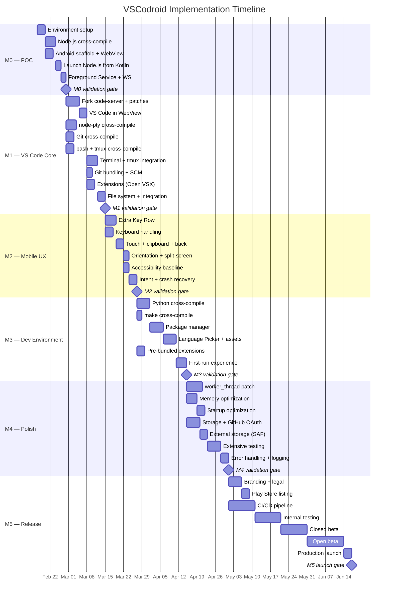
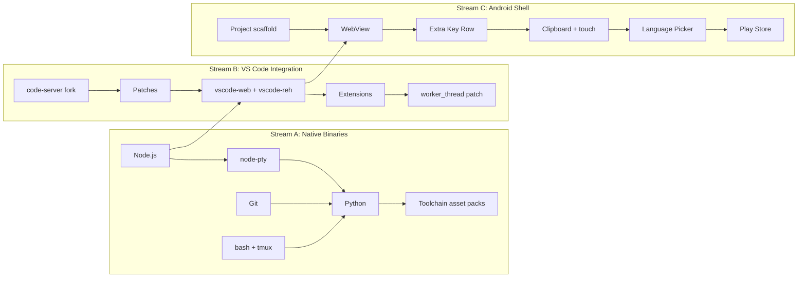
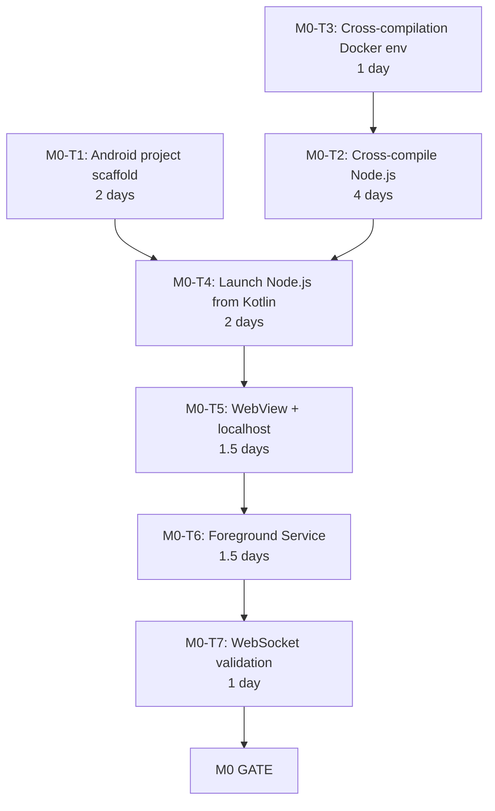
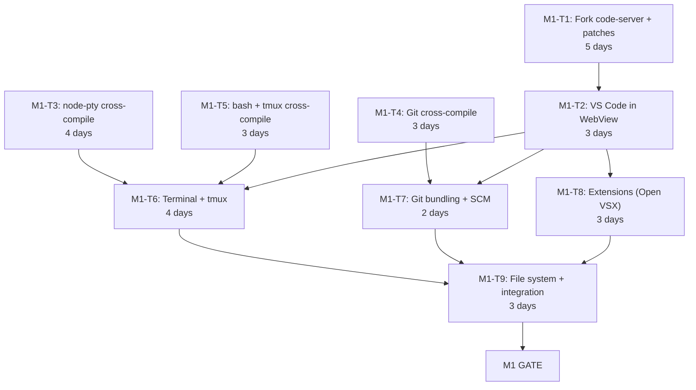
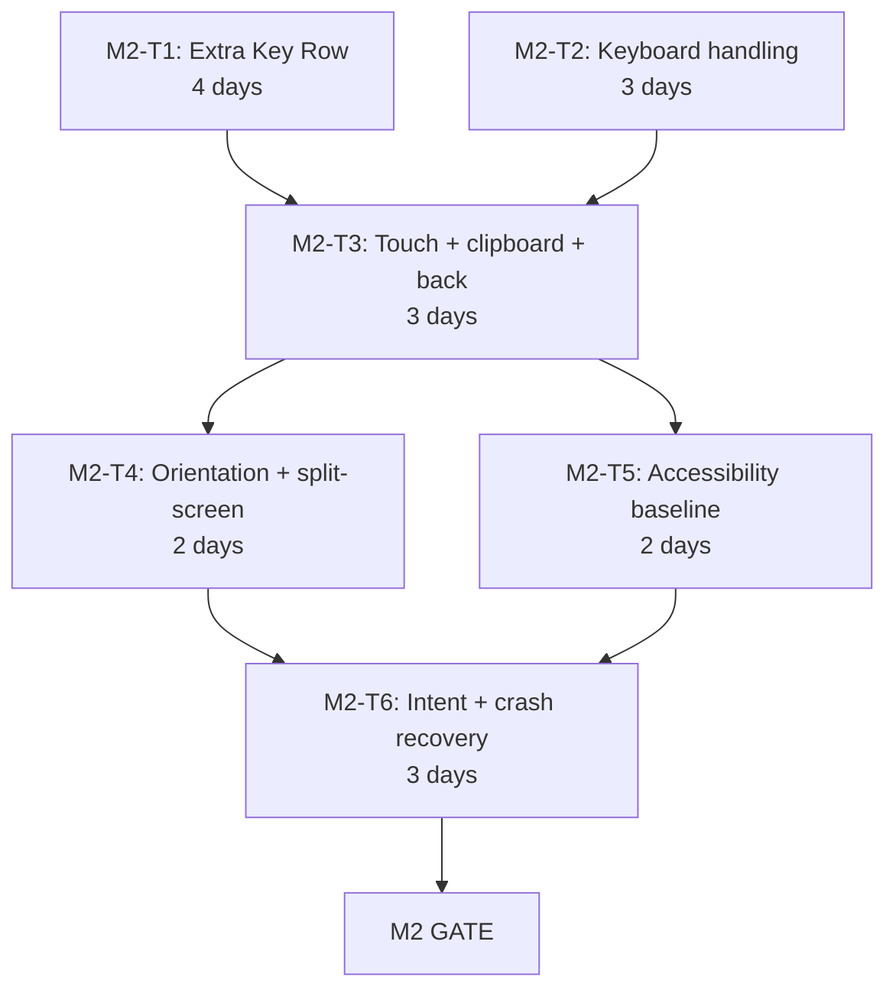
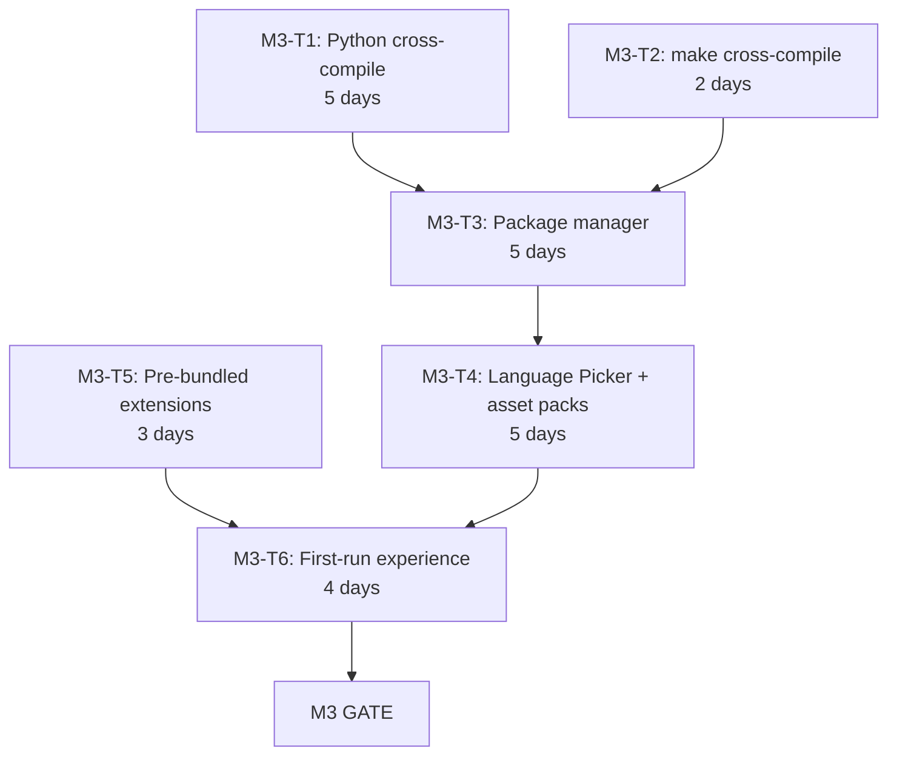
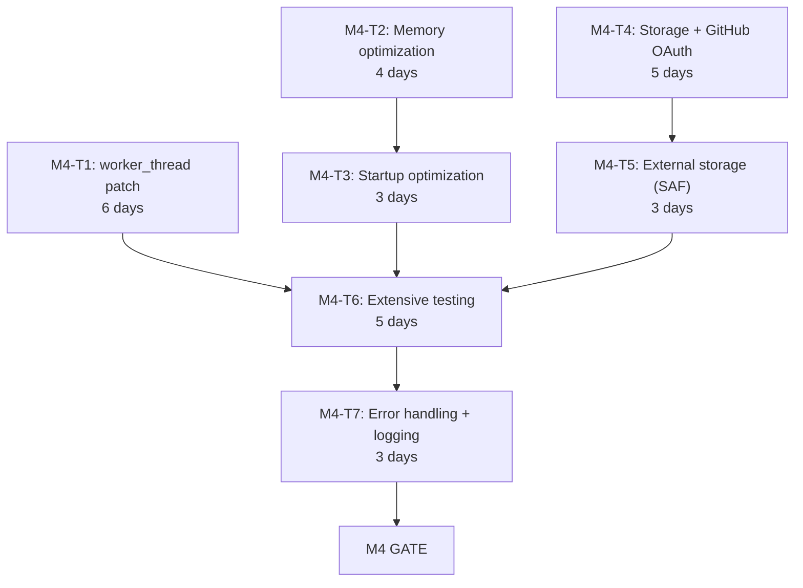
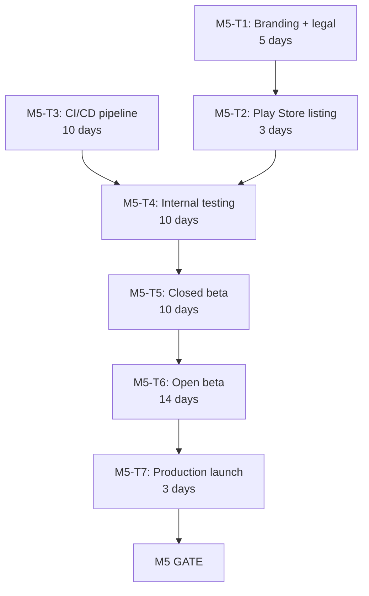

# Implementation Plan

**Project**: VSCodroid
**Version**: 1.0-draft
**Date**: 2026-02-10

---

## 1. Overview

This document translates the VSCodroid documentation suite (PRD, SRS, Architecture, Technical Spec, Milestones) into an actionable, week-by-week implementation plan with explicit task dependencies, file inventories, and validation checkpoints.

### 1.1 Guiding Principles

| Principle | Implication |
|-----------|-------------|
| **Fail fast on highest risk** | M0 exists solely to validate Node.js on Android — if this fails, everything stops |
| **Dependency-driven ordering** | Tasks are sequenced so no task starts before its inputs are ready |
| **Parallelizable where possible** | Independent work streams identified within each milestone |
| **Risk checkpoints embedded** | Go/no-go gates at week boundaries, not just milestone boundaries |
| **Files-first specification** | Every task lists the exact files to create or modify |

### 1.2 Timeline Overview



### 1.3 Work Streams

Three largely independent work streams allow parallelism within milestones:



---

## 2. Prerequisites (Before M0 Starts)

**Duration**: 1-2 days (one-time setup)

### 2.1 Development Machine Setup

| Step | Command / Action | Validation |
|------|------------------|------------|
| Install Android Studio | Latest stable with API 36 support | `sdkmanager --list` shows API 33-36 |
| Install NDK r27 | Via SDK Manager → NDK (Side by side) | `$ANDROID_NDK_HOME/ndk-build --version` |
| Install JDK 17 | System package manager or Android Studio | `java --version` → 17.x |
| Install Node.js 20 LTS | `brew install node@20` (macOS) | `node --version` → v20.x |
| Install Yarn Classic | `npm install -g yarn` | `yarn --version` → 1.x |
| Install Python 3.11+ | `brew install python` | `python3 --version` → 3.11+ |
| Install Docker (optional) | For reproducible cross-compilation | `docker --version` |

### 2.2 Repository Initialization

```
Files to create:
├── .gitignore
├── CLAUDE.md                      ← already exists
├── MILESTONES.md                  ← already exists
├── README.md                      ← already exists
├── LICENSE                        ← already exists
├── docs/                          ← already exists (01-12)
├── android/                       ← M0 creates this
├── server/                        ← M1 creates this (code-server submodule)
├── patches/
│   ├── code-server/               ← M1 populates
│   └── vscodroid/                 ← M1 populates
├── toolchains/
│   ├── Dockerfile                 ← M0 creates
│   ├── build-node.sh              ← M0 creates
│   ├── build-python.sh            ← M3 creates
│   ├── build-node-pty.sh          ← M1 creates
│   ├── build-git.sh               ← M1 creates
│   ├── build-bash.sh              ← M1 creates
│   └── build-tmux.sh              ← M1 creates
├── scripts/
│   ├── setup.sh                   ← M0 creates
│   ├── build-all.sh               ← M1 creates
│   ├── apply-patches.sh           ← M1 creates
│   ├── package-assets.sh          ← M1 creates
│   └── deploy.sh                  ← M0 creates
└── test/
    ├── projects/                  ← M1 creates (test fixtures)
    └── extensions/                ← M1 creates (test fixtures)
```

### 2.3 Hardware Requirements

- [ ] ARM64 physical Android device (API 33+) available and USB-debuggable
- [ ] ADB connection verified: `adb devices` shows device
- [ ] Developer options + USB debugging enabled on device
- [ ] Device has ≥ 2 GB free storage

---

## 3. M0 — Proof of Concept

**Goal**: Validate that Node.js runs on Android and WebView can connect to it via localhost.
**Duration**: 2 weeks (10 working days)
**Risk level**: HIGH — this is the "can we even do this?" milestone

### 3.1 Task Breakdown



---

#### M0-T1: Android Project Scaffold

**Effort**: 2 days | **Dependencies**: Prerequisites complete | **Parallel with**: M0-T2, M0-T3

**Files to create**:
```
android/
├── build.gradle.kts                    (root build file)
├── settings.gradle.kts                 (project settings)
├── gradle.properties                   (JVM args, Android config)
├── gradle/
│   └── libs.versions.toml              (version catalog)
├── app/
│   ├── build.gradle.kts                (app module — minSdk 33, targetSdk 36)
│   ├── proguard-rules.pro
│   └── src/
│       └── main/
│           ├── AndroidManifest.xml     (permissions, services, activities)
│           ├── kotlin/com/vscodroid/
│           │   ├── VSCodroidApp.kt     (Application class)
│           │   └── MainActivity.kt     (WebView host — placeholder)
│           ├── res/
│           │   ├── layout/
│           │   │   └── activity_main.xml   (WebView container)
│           │   ├── values/
│           │   │   └── strings.xml
│           │   └── drawable/
│           │       └── ic_launcher.xml     (placeholder icon)
│           └── jniLibs/
│               └── arm64-v8a/              (empty — M0-T2 populates)
```

**Implementation steps**:

1. Create new Gradle project with Kotlin DSL
2. Configure `app/build.gradle.kts`:
   ```kotlin
   android {
       namespace = "com.vscodroid"
       compileSdk = 36
       defaultConfig {
           applicationId = "com.vscodroid"
           minSdk = 33
           targetSdk = 36
           versionCode = 1
           versionName = "0.0.1-m0"
           ndk { abiFilters += "arm64-v8a" }
       }
       packaging {
           jniLibs { useLegacyPackaging = true }  // Critical for .so trick
       }
   }
   ```
3. Configure `AndroidManifest.xml` with:
   - `INTERNET`, `FOREGROUND_SERVICE`, `FOREGROUND_SERVICE_SPECIAL_USE`, `POST_NOTIFICATIONS` permissions
   - `MainActivity` declaration
   - `NodeService` declaration (placeholder)
4. Create `VSCodroidApp.kt` with `WebView.setDataDirectorySuffix("vscodroid")` in `onCreate()`
5. Create `MainActivity.kt` with basic WebView setup
6. Create `activity_main.xml` with WebView filling the layout

**Acceptance criteria**:
- [ ] `./gradlew assembleDebug` succeeds
- [ ] APK installs on ARM64 device
- [ ] App launches and shows blank WebView
- [ ] Logcat shows "VSCodroid" tag

---

#### M0-T2: Cross-Compile Node.js for ARM64 Android

**Effort**: 4 days | **Dependencies**: M0-T3 | **Critical path item**

**Files to create**:
```
toolchains/
├── build-node.sh         (main build script)
└── patches/
    └── node/             (Termux patches for Node.js)
        ├── 001-android-fixes.patch
        └── ...
```

**Output**: `android/app/src/main/jniLibs/arm64-v8a/libnode.so`

**Implementation steps**:

1. **Day 1 — Setup and research**:
   - Study Termux's `packages/nodejs/build.sh` for patch inventory
   - Download Node.js LTS source (v20.x)
   - Identify required Termux patches (typically 5-15 patches)
   - Create `build-node.sh` script skeleton

2. **Day 2 — Cross-compilation attempt**:
   - Set NDK toolchain variables:
     ```bash
     export CC=$NDK/toolchains/llvm/prebuilt/linux-x86_64/bin/aarch64-linux-android28-clang
     export CXX=${CC}++
     ```
   - Apply Termux patches to Node.js source
   - Run configure:
     ```bash
     ./configure \
       --dest-cpu=arm64 --dest-os=android --cross-compiling \
       --partly-static --with-intl=small-icu --openssl-no-asm \
       --without-inspector --without-node-snapshot --shared-zlib \
       --prefix=/data/data/com.vscodroid/files/usr
     ```
   - Start build: `make -j$(nproc)`

3. **Day 3 — Debug build failures**:
   - Fix compilation errors (expect 3-5 issues)
   - Common issues: missing headers, linker flags, V8 assembly
   - Apply 16KB page alignment: `LDFLAGS="-Wl,-z,max-page-size=16384"`
   - Successful build → strip: `aarch64-linux-android-strip --strip-unneeded out/Release/node`

4. **Day 4 — Validate and package**:
   - Copy to jniLibs: `cp out/Release/node android/app/src/main/jniLibs/arm64-v8a/libnode.so`
   - Verify: `file libnode.so` → `ELF 64-bit LSB pie executable, ARM aarch64`
   - Push to device via adb, test execution: `adb shell /data/local/tmp/libnode.so --version`
   - Create minimal HTTP server test script

**Risk checkpoint (end of Day 3)**:
> If Node.js compilation fails after 3 days of attempts, activate contingency: extract pre-built Node.js binary from Termux .deb package. See Risk Matrix T02.

**Acceptance criteria**:
- [ ] `libnode.so` is a valid ARM64 ELF binary
- [ ] Binary runs on physical device: `node --version` outputs version string
- [ ] Binary can execute a simple `http.createServer` script
- [ ] Binary size < 60 MB after stripping

---

#### M0-T3: Cross-Compilation Docker Environment

**Effort**: 1 day | **Dependencies**: None | **Parallel with**: M0-T1

**Files to create**:
```
toolchains/
└── Dockerfile
```

**Implementation steps**:

1. Create Dockerfile based on Ubuntu 22.04 with:
   - Android NDK r27 pre-installed
   - Build dependencies (python3, make, gcc, etc.)
   - Environment variables for NDK paths
2. Build and test: `docker build -t vscodroid/build-env toolchains/`
3. Verify NDK compiler works inside container:
   ```bash
   docker run vscodroid/build-env aarch64-linux-android28-clang --version
   ```

**Acceptance criteria**:
- [ ] Docker image builds successfully
- [ ] NDK compiler accessible inside container
- [ ] Can cross-compile a trivial C program for ARM64 Android

---

#### M0-T4: Launch Node.js from Kotlin

**Effort**: 2 days | **Dependencies**: M0-T1, M0-T2

**Files to create / modify**:
```
android/app/src/main/kotlin/com/vscodroid/
├── service/
│   └── ProcessManager.kt       (Node.js process lifecycle)
├── util/
│   ├── Environment.kt          (env var construction)
│   └── PortFinder.kt           (find available localhost port)
└── assets/
    └── test-server.js           (minimal Express-like HTTP server)
```

**Implementation steps**:

1. **PortFinder.kt** — find available localhost port:
   - Bind to port 0, read assigned port, close socket
   - Return port number

2. **Environment.kt** — construct environment variables:
   ```kotlin
   fun buildEnvironment(context: Context, port: Int): Map<String, String> {
       val nativeLibDir = context.applicationInfo.nativeLibraryDir
       val filesDir = context.filesDir.absolutePath
       return mapOf(
           "HOME" to "$filesDir/home",
           "TMPDIR" to "${context.cacheDir}/tmp",
           "PATH" to "$nativeLibDir:/system/bin",
           "LD_LIBRARY_PATH" to nativeLibDir,
           "NODE_PATH" to "$filesDir/node_modules",
           "LANG" to "en_US.UTF-8",
           "TERM" to "xterm-256color",
       )
   }
   ```

3. **ProcessManager.kt** — launch and monitor Node.js:
   - `startServer()`: ProcessBuilder with `libnode.so` path + `--max-old-space-size=512` + server script
   - `waitForReady()`: Poll `http://localhost:PORT/healthz` every 200ms, timeout 30s
   - `stopServer()`: SIGTERM → wait 5s → SIGKILL
   - `isServerHealthy()`: Single HTTP GET to `/healthz`

4. **test-server.js** — minimal HTTP server:
   ```javascript
   const http = require('http');
   const port = process.argv[2] || 8080;
   http.createServer((req, res) => {
       if (req.url === '/healthz') { res.writeHead(200); res.end('OK'); return; }
       res.writeHead(200, {'Content-Type':'text/html'});
       res.end('<h1>Hello from Node.js on Android!</h1>');
   }).listen(port, '127.0.0.1', () => console.log(`Listening on :${port}`));
   ```

5. Wire up in `MainActivity.kt`: start ProcessManager → wait for ready → log success

**Acceptance criteria**:
- [ ] Node.js process starts from Kotlin via ProcessBuilder
- [ ] Health check returns 200 within 30 seconds
- [ ] `curl http://localhost:PORT/` from adb shell returns HTML
- [ ] Process PID is trackable

---

#### M0-T5: WebView Loads Localhost Content

**Effort**: 1.5 days | **Dependencies**: M0-T4

**Files to modify**:
```
android/app/src/main/kotlin/com/vscodroid/
├── MainActivity.kt              (add WebView configuration + loadUrl)
└── webview/
    ├── VSCodroidWebView.kt      (WebView settings configuration)
    └── VSCodroidWebViewClient.kt (URL loading, error handling)
```

**Implementation steps**:

1. **VSCodroidWebView.kt** — configure WebView settings:
   ```kotlin
   fun configure(webView: WebView) {
       webView.settings.apply {
           javaScriptEnabled = true
           domStorageEnabled = true
           databaseEnabled = true
           setSupportZoom(false)
           builtInZoomControls = false
           textZoom = 100
           mixedContentMode = MIXED_CONTENT_ALWAYS_ALLOW
           cacheMode = LOAD_DEFAULT
       }
   }
   ```

2. **VSCodroidWebViewClient.kt** — handle page load errors:
   - `onReceivedError()`: show retry UI
   - `onReceivedHttpError()`: log

3. **MainActivity.kt** — orchestrate:
   - Start ProcessManager
   - Wait for server ready
   - `webView.loadUrl("http://localhost:$port/")`
   - Verify "Hello from Node.js on Android!" displays

**Acceptance criteria**:
- [ ] WebView displays "Hello from Node.js on Android!" served by Node.js
- [ ] Page load completes within 5 seconds of server ready
- [ ] No WebView errors in Logcat

---

#### M0-T6: Foreground Service

**Effort**: 1.5 days | **Dependencies**: M0-T5

**Files to create / modify**:
```
android/app/src/main/kotlin/com/vscodroid/
├── service/
│   └── NodeService.kt           (Foreground Service)
├── MainActivity.kt              (bind to service)
└── AndroidManifest.xml           (service declaration)

android/app/src/main/res/
└── values/
    └── strings.xml              (notification text)
```

**Implementation steps**:

1. **NodeService.kt** — Foreground Service with `specialUse` type:
   - `onCreate()`: create notification channel, start foreground
   - Move ProcessManager logic into service
   - Node.js watchdog thread: `process.waitFor()` → auto-restart if exit != 0
   - `onDestroy()`: graceful shutdown of Node.js

2. **AndroidManifest.xml** — declare service:
   ```xml
   <service
       android:name=".service.NodeService"
       android:foregroundServiceType="specialUse"
       android:exported="false">
       <property
           android:name="android.app.PROPERTY_SPECIAL_USE_FGS_SUBTYPE"
           android:value="Local development server for code editor" />
   </service>
   ```

3. **MainActivity.kt** — bind to NodeService, receive server-ready callback

**Acceptance criteria**:
- [ ] Foreground Service starts with persistent notification
- [ ] Node.js survives Activity going to background (Home button)
- [ ] Return to app after 5 minutes → WebView still connected
- [ ] Kill Node.js via `adb shell kill` → auto-restarts within 5 seconds

---

#### M0-T7: WebSocket Validation

**Effort**: 1 day | **Dependencies**: M0-T6

**Files to modify**:
```
android/app/src/main/assets/
└── test-server.js               (add WebSocket support)
```

**Implementation steps**:

1. Add WebSocket support to test server (using `ws` npm package or raw HTTP upgrade)
2. WebView JavaScript: open `ws://localhost:PORT/ws`, send message, receive echo
3. Validate bidirectional communication works through WebView

**Acceptance criteria**:
- [ ] WebSocket connection established from WebView to localhost
- [ ] Bidirectional message exchange works
- [ ] Connection survives for 10+ minutes without dropping

---

### 3.2 M0 Validation Gate

**All criteria must pass before proceeding to M1**:

| # | Criterion | Test Method |
|---|-----------|-------------|
| 1 | Node.js ARM64 binary runs on physical device | `adb shell` execution |
| 2 | Express-style HTTP server responds on localhost | `curl` from adb shell |
| 3 | WebView renders content from localhost | Visual inspection |
| 4 | WebSocket bidirectional communication works | JS console test |
| 5 | Process survives app backgrounding via Foreground Service | Home → 5 min → return |
| 6 | Auto-restart works after process kill | `adb shell kill` → observe restart |

**Risk checkpoint**: If any criterion fails, review Risk Matrix T02 and T06 before attempting fixes. Consider Termux binary fallback.

---

## 4. M1 — VS Code Core

**Goal**: VS Code Workbench running in WebView with extensions, terminal, and Git.
**Duration**: 3-4 weeks (15-20 working days)
**Entry criteria**: All M0 gate criteria passed

### 4.1 Task Breakdown



**Parallelization**: M1-T3, M1-T4, M1-T5 can all run in parallel with M1-T1 (different work streams).

---

#### M1-T1: Fork code-server + Build VS Code

**Effort**: 5 days | **Dependencies**: M0 gate passed | **Critical path**

**Files to create**:
```
server/                             (git submodule → code-server fork)
├── lib/vscode/                     (VS Code source, managed by code-server)
├── patches/                        (code-server's patches)
└── ci/dev/patch-vscode.sh          (code-server's patch script)

patches/
├── code-server/
│   ├── product.diff                (branding → "VSCodroid", Open VSX URLs)
│   ├── disable-telemetry.diff
│   ├── disable-update-check.diff
│   ├── marketplace.diff            (Open VSX integration)
│   ├── serve-web.diff
│   ├── webview.diff
│   ├── browser-command.diff
│   ├── github-auth.diff
│   └── local-storage.diff
└── vscodroid/                      (empty for M1 — populated M2+)

scripts/
├── apply-patches.sh
├── build-vscode.sh
├── build-all.sh
└── package-assets.sh
```

**Implementation steps**:

1. **Day 1 — Fork and understand code-server**:
   - Fork `coder/code-server` to `rmyndharis/code-server`
   - Clone as git submodule: `git submodule add <url> server`
   - Study code-server build system: `ci/dev/`, `ci/build/`, patch mechanism
   - Read each existing code-server patch to understand what it does

2. **Day 2 — Apply and customize patches**:
   - Run `./ci/dev/patch-vscode.sh` to apply code-server patches
   - Create `patches/code-server/product.diff` with VSCodroid branding:
     ```json
     {
       "nameShort": "VSCodroid",
       "nameLong": "VSCodroid",
       "applicationName": "vscodroid",
       "dataFolderName": ".vscodroid",
       "extensionsGallery": {
         "serviceUrl": "https://open-vsx.org/vscode/gallery",
         "itemUrl": "https://open-vsx.org/vscode/item",
         "resourceUrlTemplate": "https://open-vsx.org/vscode/unpkg/{publisher}/{name}/{version}/{path}"
       },
       "telemetryOptIn": false
     }
     ```
   - Create `scripts/apply-patches.sh` (as specified in Tech Spec §6.2)

3. **Day 3 — Build vscode-web**:
   - Install VS Code dependencies: `cd server/lib/vscode && yarn`
   - Build web client: `yarn gulp vscode-web-min`
   - Verify output in `out-vscode-web/`

4. **Day 4 — Build vscode-reh (server)**:
   - Build server: `yarn gulp vscode-reh-min`
   - Verify output in `out-vscode-reh/`
   - Verify `@vscode/ripgrep` binary is included in `node_modules`

5. **Day 5 — Package and scripts**:
   - Create `scripts/build-vscode.sh` (automates steps 2-4)
   - Create `scripts/package-assets.sh`:
     - Copy `out-vscode-web/` → `android/app/src/main/assets/vscode-web/`
     - Copy `out-vscode-reh/` → `android/app/src/main/assets/vscode-reh/`
   - Create `android/app/src/main/assets/server.js` (bootstrap script)
   - Test: full build from clean state

**Acceptance criteria**:
- [ ] `apply-patches.sh` applies all patches without conflict
- [ ] `yarn gulp vscode-web-min` succeeds
- [ ] `yarn gulp vscode-reh-min` succeeds
- [ ] `out-vscode-web/` contains index.html and static assets
- [ ] `out-vscode-reh/` contains server entry point and node_modules

---

#### M1-T2: VS Code Running in WebView

**Effort**: 3 days | **Dependencies**: M1-T1

**Files to create / modify**:
```
android/app/src/main/assets/
├── vscode-web/                  (from M1-T1 build output)
├── vscode-reh/                  (from M1-T1 build output)
└── server.js                    (bootstrap script — replaces test-server.js)

android/app/src/main/kotlin/com/vscodroid/
├── service/
│   ├── NodeService.kt           (update to launch VS Code server)
│   └── ProcessManager.kt        (update server launch command)
├── setup/
│   └── FirstRunSetup.kt         (asset extraction on first run)
└── MainActivity.kt              (update to load VS Code)
```

**Implementation steps**:

1. **FirstRunSetup.kt** — extract VS Code assets:
   - Check if `files/server/vscode-reh/` exists
   - If not, extract from APK assets to app-private storage
   - Create required directories: `home/`, `home/.vscodroid/`, `home/.vscodroid/extensions/`
   - Track extraction version for future upgrades

2. **server.js** — bootstrap script (see Tech Spec §3.1):
   - Parse command-line arguments
   - Set up VS Code product.json overrides
   - Launch vscode-reh server entry point
   - Expose `/healthz` endpoint
   - Serve vscode-web static files

3. **ProcessManager.kt** — update server launch:
   ```kotlin
   val command = listOf(
       "$nativeLibDir/libnode.so",
       "--max-old-space-size=512",
       "$filesDir/server/server.js",
       "--host=127.0.0.1",
       "--port=$port",
       "--without-connection-token",
       "--extensions-dir=$home/.vscodroid/extensions",
       "--user-data-dir=$home/.vscodroid",
       "--server-data-dir=$home/.vscodroid",
       "--accept-server-license-terms"
   )
   ```

4. **MainActivity.kt** — load VS Code:
   - Wait for server ready
   - `webView.loadUrl("http://localhost:$port/")`

**Acceptance criteria**:
- [ ] VS Code Workbench UI renders in WebView
- [ ] Monaco Editor loads and is interactive (typing works)
- [ ] Command Palette opens (F1 or via menu)
- [ ] File Explorer panel visible
- [ ] No critical JS errors in WebView console

---

#### M1-T3: Cross-Compile node-pty

**Effort**: 4 days | **Dependencies**: M0 gate | **Parallel with M1-T1**

**Files to create**:
```
toolchains/
└── build-node-pty.sh
```

**Output**: `android/app/src/main/jniLibs/arm64-v8a/libnode_pty.so`

**Implementation steps**:

1. Set up node-gyp cross-compilation environment
2. Build with NDK toolchain:
   ```bash
   node-gyp rebuild \
     --target=20.0.0 --arch=arm64 \
     --nodedir=/path/to/node-source \
     CC=$NDK_CC CXX=$NDK_CXX
   ```
3. Copy output: `build/Release/pty.node` → `libnode_pty.so`
4. Test PTY creation on device

**Acceptance criteria**:
- [ ] `libnode_pty.so` is valid ARM64 ELF
- [ ] PTY allocation works on physical device
- [ ] Can spawn a shell process through PTY

---

#### M1-T4: Cross-Compile Git

**Effort**: 3 days | **Dependencies**: M0 gate | **Parallel with M1-T1**

**Files to create**:
```
toolchains/
└── build-git.sh
```

**Output**: `android/app/src/main/jniLibs/arm64-v8a/libgit.so` + `assets/usr/lib/git-core/`

**Implementation steps** (see Tech Spec §1.6):

1. Download Git 2.40+ source
2. Apply Termux patches
3. Configure and build:
   ```bash
   ./configure --host=aarch64-linux-android \
     --prefix=/data/data/com.vscodroid/files/usr \
     ac_cv_fread_reads_directories=no ac_cv_snprintf_returns_bogus=no
   make -j$(nproc) NO_GETTEXT=YesPlease NO_TCLTK=YesPlease
   ```
4. Package: main binary as `libgit.so`, helper binaries in assets

**Acceptance criteria**:
- [ ] `git --version` runs on device
- [ ] `git init`, `git add`, `git commit` work
- [ ] `git status` produces correct output

---

#### M1-T5: Cross-Compile bash + tmux

**Effort**: 3 days | **Dependencies**: M0 gate | **Parallel with M1-T1**

**Files to create**:
```
toolchains/
├── build-bash.sh
└── build-tmux.sh
```

**Output**:
- `android/app/src/main/jniLibs/arm64-v8a/libbash.so`
- `android/app/src/main/jniLibs/arm64-v8a/libtmux.so`
- `assets/usr/share/terminfo/` (terminfo database)

**Implementation steps** (see Tech Spec §1.7, §1.8):

1. **bash** (1 day):
   - Configure: `--host=aarch64-linux-android --without-bash-malloc`
   - Build and strip
   - Package as `libbash.so`

2. **tmux** (2 days):
   - Cross-compile dependency: `libevent`
   - Cross-compile dependency: `ncurses` (for terminfo)
   - Configure tmux with cross-compiled deps
   - Build and strip
   - Package as `libtmux.so` + terminfo data

**Acceptance criteria**:
- [ ] `libbash.so` starts an interactive shell on device
- [ ] `libtmux.so` starts tmux on device
- [ ] tmux can create multiple sessions
- [ ] terminfo works (colors, cursor movement)

---

#### M1-T6: Terminal + tmux Integration

**Effort**: 4 days | **Dependencies**: M1-T2, M1-T3, M1-T5

**Files to modify**:
```
android/app/src/main/kotlin/com/vscodroid/
└── util/
    └── Environment.kt              (add SHELL, TERMINFO, etc.)

patches/vscodroid/
└── terminal-tmux.diff              (VS Code terminal → tmux integration)
```

**Implementation steps**:

1. **Day 1** — Verify node-pty works with bash:
   - Load `libnode_pty.so` in VS Code server
   - Configure terminal to use `libbash.so` as shell
   - Test: open terminal in VS Code → bash prompt appears

2. **Day 2** — tmux integration:
   - Configure tmux as terminal multiplexer layer
   - VS Code terminal tabs → tmux sessions
   - Single tmux process manages all terminal sessions

3. **Day 3** — Create `terminal-tmux.diff` patch:
   - Modify VS Code's terminal service to route through tmux
   - Handle session create/destroy/resize

4. **Day 4** — Test and verify phantom process count:
   - Open 3 terminal tabs
   - `adb shell ps -A | grep vscodroid` → verify only 1 tmux process
   - Test: terminal I/O, colors, interactive programs (vim, top)

**Acceptance criteria**:
- [ ] Terminal opens in VS Code with bash shell
- [ ] Multiple terminal tabs work via tmux
- [ ] Only 1 tmux process regardless of terminal tab count
- [ ] Terminal supports colors, cursor movement, interactive programs
- [ ] Phantom process count stays under 5 with 3 terminal tabs open

---

#### M1-T7: Git Bundling + SCM Panel

**Effort**: 2 days | **Dependencies**: M1-T2, M1-T4

**Files to modify**:
```
android/app/src/main/kotlin/com/vscodroid/
└── util/
    └── Environment.kt              (add GIT_EXEC_PATH)
```

**Implementation steps**:

1. Configure `GIT_EXEC_PATH` environment variable to point to extracted git-core helpers
2. Verify Git works in VS Code terminal
3. Verify VS Code SCM panel detects Git and shows status
4. Test: `git init` → create file → `git add` → `git commit` → SCM panel reflects

**Acceptance criteria**:
- [ ] `git --version` works in VS Code terminal
- [ ] VS Code SCM panel shows repository status
- [ ] `git init`, `git add`, `git commit` work from terminal
- [ ] SCM panel updates after git operations

---

#### M1-T8: Extension Marketplace (Open VSX)

**Effort**: 3 days | **Dependencies**: M1-T2

**Files to modify**:
```
patches/code-server/
└── marketplace.diff              (verify Open VSX URLs work)
```

**Implementation steps**:

1. Verify Open VSX search/browse works in Extensions panel
2. Install a theme extension (e.g., One Dark Pro)
3. Install a functional extension (e.g., Material Icon Theme)
4. Verify extension activation and function
5. Test extension uninstall/disable

**Acceptance criteria**:
- [ ] Extensions panel shows search results from Open VSX
- [ ] Can install, activate, and use a theme extension
- [ ] Can install, activate, and use Material Icon Theme
- [ ] Extensions persist across app restart
- [ ] Extension uninstall works

---

#### M1-T9: File System + Integration Testing

**Effort**: 3 days | **Dependencies**: M1-T6, M1-T7, M1-T8

**Files to create**:
```
test/
├── projects/
│   ├── test-minimal/           (1 file)
│   ├── test-small/             (10 files, HTML/JS)
│   └── test-medium/            (100 files, Node.js project)
└── extensions/                 (test VSIX files)

android/app/src/androidTest/    (instrumented tests)
└── kotlin/com/vscodroid/
    ├── NodeLaunchTest.kt
    ├── WebViewLoadTest.kt
    ├── TerminalTest.kt
    └── ExtensionTest.kt
```

**Implementation steps**:

1. **Day 1** — Create test fixtures and instrumented test scaffolding
2. **Day 2** — Integration testing:
   - File explorer shows files, create/edit/save works
   - Open test-small project → verify file tree
   - Edit file → Ctrl+S → verify saved content
   - Open 10K-line file → verify no crash
3. **Day 3** — Full integration validation:
   - Run all E2E tests from Testing Strategy §3.3 (E2E-01 through E2E-06)
   - Fix any integration issues found
   - Document known issues

**Acceptance criteria**:
- [ ] File explorer shows correct directory tree
- [ ] Create, edit, save files works
- [ ] Monaco editor: typing, syntax highlighting, multi-cursor all work
- [ ] Terminal + Git + Extensions all function together
- [ ] 30-minute stability test passes (no crash)

---

### 4.2 M1 Validation Gate

| # | Criterion | Test Method |
|---|-----------|-------------|
| 1 | VS Code Workbench UI renders correctly | Visual inspection |
| 2 | Monaco Editor works (typing, highlighting, multi-cursor) | Manual editing test |
| 3 | Terminal opens with bash shell | Open terminal, type commands |
| 4 | tmux multiplexing works | Open 3+ terminal tabs, verify 1 tmux process |
| 5 | Extensions install from Open VSX | Install theme + icon pack |
| 6 | Extensions activate and function | Verify theme applies, icons show |
| 7 | File explorer shows files, CRUD works | Create/edit/save test |
| 8 | Git works in terminal | `git init`, `git add`, `git commit` |
| 9 | Git SCM panel works | Verify status updates |
| 10 | Phantom processes ≤ 5 | `adb shell ps -A \| grep vscodroid` |
| 11 | Node.js startup + health check stable 30 min | Automated stability test |

---

## 5. M2 — Mobile UX

**Goal**: Make VS Code usable on a touchscreen device.
**Duration**: 2-3 weeks (10-15 working days)
**Entry criteria**: All M1 gate criteria passed, no open P0 defects

### 5.1 Task Breakdown



---

#### M2-T1: Extra Key Row

**Effort**: 4 days | **Dependencies**: M1 gate

**Files to create**:
```
android/app/src/main/kotlin/com/vscodroid/
└── keyboard/
    ├── ExtraKeyRow.kt              (Custom ViewGroup)
    ├── ExtraKeyButton.kt           (Individual key button)
    └── KeyInjector.kt              (JS key event injection)

android/app/src/main/res/
├── layout/
│   └── view_extra_key_row.xml      (key row layout)
└── values/
    ├── dimens.xml                  (key sizes, 48dp minimum)
    └── colors.xml                  (key colors)
```

**Implementation steps**:

1. **Day 1** — Design and layout:
   - Create `ExtraKeyRow` as horizontal `RecyclerView` or custom `LinearLayout`
   - Key set: `[Tab] [Esc] [Ctrl] [Alt] [←] [↑] [↓] [→] [{}] [()] [;] [:] ["] [/]`
   - Each button ≥ 48dp × 48dp (accessibility requirement)
   - Ctrl and Alt are toggle buttons (highlight when active)

2. **Day 2** — Key injection:
   - `KeyInjector.kt`: construct JavaScript `KeyboardEvent` and dispatch via `evaluateJavascript`
   - Handle modifier state (Ctrl held + S = Ctrl+S)
   - Map key names to `keyCode`, `code`, `key` values

3. **Day 3** — Visibility control:
   - Use `WindowInsetsCompat.Type.ime()` to detect keyboard visibility
   - Show Extra Key Row when keyboard appears, hide when it disappears
   - Position above soft keyboard using `WindowInsets` padding

4. **Day 4** — Integration and polish:
   - Wire into `activity_main.xml` layout
   - Test all key combinations: Ctrl+S, Ctrl+P, Ctrl+Shift+P, Ctrl+Z, etc.
   - Test with different keyboard apps (GBoard, Samsung Keyboard)

**Acceptance criteria**:
- [ ] Extra Key Row appears above soft keyboard
- [ ] All key buttons work: Tab, Esc, Ctrl, Alt, arrows, brackets, semicolons
- [ ] Ctrl+S saves file in editor
- [ ] Ctrl+P opens Quick Open
- [ ] Ctrl+Shift+P opens Command Palette
- [ ] Touch targets ≥ 48dp × 48dp

---

#### M2-T2: Keyboard Handling

**Effort**: 3 days | **Dependencies**: M1 gate | **Parallel with M2-T1**

**Files to modify**:
```
android/app/src/main/kotlin/com/vscodroid/
├── MainActivity.kt              (soft input mode)
└── webview/
    └── VSCodroidWebView.kt      (viewport handling)

patches/vscodroid/
└── keyboard-aware.diff           (VS Code viewport fixes)
```

**Implementation steps**:

1. `windowSoftInputMode = adjustResize` — WebView shrinks when keyboard appears
2. Handle viewport resize: ensure cursor scrolls into view
3. Fix `position:fixed` elements (command palette, suggest widget) via patch
4. Test with different screen sizes and keyboard heights

**Acceptance criteria**:
- [ ] Editor viewport resizes correctly when keyboard opens
- [ ] Cursor always visible when typing
- [ ] Command Palette and suggest widget position correctly above keyboard
- [ ] Keystroke latency < 50ms on reference device

---

#### M2-T3: Touch Optimization + Clipboard + Back Button

**Effort**: 3 days | **Dependencies**: M2-T1, M2-T2

**Files to create / modify**:
```
android/app/src/main/kotlin/com/vscodroid/
├── bridge/
│   ├── AndroidBridge.kt            (bridge with security model)
│   ├── ClipboardBridge.kt          (clipboard methods)
│   └── IntentBridge.kt             (external URL, back button)
└── MainActivity.kt                 (back button handling)

patches/vscodroid/
└── touch-ui.diff                   (touch target adjustments)
```

**Implementation steps**:

1. **AndroidBridge.kt** — implement security model (API Spec §2.2):
   - Origin check: only `http://127.0.0.1:PORT/` or `http://localhost:PORT/`
   - Per-session capability token
   - Sensitive method gating via `authToken` parameter

2. **ClipboardBridge.kt**:
   - `copyToClipboard(text)`, `readFromClipboard(authToken)`, `hasClipboardText()`
   - Test: copy in Chrome → paste in VSCodroid and vice versa

3. **IntentBridge.kt**:
   - `openExternalUrl(url, authToken)` — scheme allowlist (https, mailto only)
   - `onBackPressed()` — close panels/dialogs first, then minimize
   - `minimizeApp()`

4. **touch-ui.diff** — larger touch targets for mobile:
   - Disable WebView zoom conflicts
   - Handle long-press: prefer Monaco selection over WebView default
   - Context menu: use Monaco's

**Acceptance criteria**:
- [ ] Copy/paste works between VSCodroid and other apps
- [ ] Back button closes panels/dialogs before minimizing
- [ ] External URLs open in system browser (https only)
- [ ] Long-press selects text in editor (not WebView default)
- [ ] Bridge rejects calls from untrusted origins

---

#### M2-T4: Screen Orientation + Split-Screen

**Effort**: 2 days | **Dependencies**: M2-T3

**Files to create / modify**:
```
patches/vscodroid/
└── orientation.diff                (rotation handling)

android/app/src/main/
└── AndroidManifest.xml             (configChanges handling)
```

**Implementation steps**:

1. Support portrait, landscape, and reverse orientations
2. Handle configuration changes without losing editor state
3. Split-screen support: test multi-window mode
4. Foldable awareness (if testing device available)

**Acceptance criteria**:
- [ ] Rotation preserves editor content and cursor position
- [ ] Layout adapts correctly in landscape
- [ ] Split-screen mode works without crash
- [ ] No data loss on any orientation change

---

#### M2-T5: Accessibility Baseline

**Effort**: 2 days | **Dependencies**: M2-T3 | **Parallel with M2-T4**

**Files to modify**:
```
android/app/src/main/kotlin/com/vscodroid/
└── keyboard/
    ├── ExtraKeyRow.kt              (add contentDescription)
    └── ExtraKeyButton.kt           (add contentDescription)

android/app/src/main/res/
└── values/
    └── strings.xml                 (accessibility strings)
```

**Implementation steps**:

1. Add `contentDescription` to all Extra Key Row buttons
2. Ensure all interactive elements ≥ 48dp × 48dp
3. Verify native UI respects system font scaling
4. Test with TalkBack enabled

**Acceptance criteria**:
- [ ] TalkBack navigates Extra Key Row buttons with meaningful descriptions
- [ ] All native interactive elements ≥ 48dp
- [ ] Native UI scales with system font size
- [ ] Color contrast meets WCAG AA (4.5:1) for native elements

---

#### M2-T6: Android Intent + Crash Recovery

**Effort**: 3 days | **Dependencies**: M2-T4, M2-T5

**Files to create / modify**:
```
android/app/src/main/
├── AndroidManifest.xml             (intent filter for code files)
└── kotlin/com/vscodroid/
    ├── MainActivity.kt             (intent handling, crash recovery)
    └── webview/
        └── VSCodroidWebViewClient.kt  (onRenderProcessGone)

patches/vscodroid/
└── android-intent.diff             ("Open with VSCodroid")
```

**Implementation steps**:

1. **Intent filter** for common code file types: `.js`, `.ts`, `.py`, `.html`, `.css`, `.json`, `.md`, `.go`, `.rs`, `.java`, `.kt`, `.rb`, `.c`, `.cpp`, `.h`
2. **Intent handler**: receive file URI → copy to app-private workspace → open in editor
3. **WebView crash recovery** (Tech Spec §4.2):
   - `onRenderProcessGone()`: destroy WebView, recreate, reload
4. **Node.js death recovery**: auto-restart + reconnect WebView
5. **Low memory handling**: `onTrimMemory()` → notify VS Code

**Acceptance criteria**:
- [ ] "Open with VSCodroid" appears in Android share/open menus for code files
- [ ] File opens in editor after intent
- [ ] WebView crash → recovery → editor reloads (no data loss)
- [ ] Node.js kill → auto-restart → WebView reconnects
- [ ] Low memory signal handled without crash

---

### 5.2 M2 Validation Gate

| # | Criterion | Test Method |
|---|-----------|-------------|
| 1 | Comfortable typing with soft keyboard + Extra Key Row | Manual coding session |
| 2 | Ctrl+S, Ctrl+P, Ctrl+Shift+P work | Key combination test |
| 3 | Copy/paste works with other apps | Cross-app clipboard test |
| 4 | Keystroke latency < 50ms | Instrumented measurement |
| 5 | Portrait, landscape, split-screen work | Rotation test |
| 6 | TalkBack works for native controls | TalkBack navigation test |
| 7 | Touch targets ≥ 48dp | Layout Inspector measurement |
| 8 | "Open with VSCodroid" works | Share from file manager |
| 9 | Crash recovery works (WebView + Node.js) | Kill process tests |
| 10 | Validated on at least 2 device models | Test on Pixel + Samsung |

---

## 6. M3 — All-in-One Dev Environment

**Goal**: Bundle Python, package manager, and on-demand toolchains.
**Duration**: 3-4 weeks (15-20 working days)
**Entry criteria**: All M2 gate passed, validated on 2 devices, no P0/P1 regressions

### 6.1 Task Breakdown



---

#### M3-T1: Cross-Compile Python 3

**Effort**: 5 days | **Dependencies**: M2 gate

**Files to create**:
```
toolchains/
└── build-python.sh

android/app/src/main/
├── jniLibs/arm64-v8a/
│   └── libpython.so              (Python binary)
└── assets/
    └── python-stdlib/            (Python standard library)
```

**Implementation steps**:

1. Use Termux build recipes for CPython 3.11+ as reference
2. Cross-compile with NDK toolchain
3. Bundle: `libpython.so` (binary) + `assets/python-stdlib/` (stdlib + pip)
4. Strip `.pyc` files for size reduction
5. Test: `python3 --version`, `pip install requests`

**Acceptance criteria**:
- [ ] `python3 --version` works on device
- [ ] `pip install requests` succeeds
- [ ] Python stdlib modules work (os, sys, json, http, etc.)
- [ ] Binary size < 35 MB

---

#### M3-T2: Cross-Compile make

**Effort**: 2 days | **Dependencies**: M2 gate | **Parallel with M3-T1**

**Files to create**:
```
toolchains/
└── build-make.sh
```

**Output**: `android/app/src/main/jniLibs/arm64-v8a/libmake.so`

**Implementation steps** (see Tech Spec §1.9): Straightforward GNU make cross-compilation.

**Acceptance criteria**:
- [ ] `make --version` works on device
- [ ] Can execute a simple Makefile

---

#### M3-T3: Package Manager

**Effort**: 5 days | **Dependencies**: M3-T1, M3-T2

**Files to create**:
```
android/app/src/main/kotlin/com/vscodroid/
└── setup/
    └── PackageManager.kt           (pkg command implementation)

android/app/src/main/assets/
└── bin/
    └── vscodroid                   (shell wrapper script for `vscodroid pkg`)
```

**Implementation steps**:

1. Implement CLI: `vscodroid pkg search|install|remove|list|update|info`
2. Repository index: compatible with Termux package format (deb, ARM64)
3. Package download, extract, install to `$PREFIX/usr/`
4. Dependency resolution (basic)
5. Note: only available in sideloaded version (Play Store uses asset packs only)

**Acceptance criteria**:
- [ ] `vscodroid pkg search curl` returns results
- [ ] `vscodroid pkg install curl` installs successfully
- [ ] `vscodroid pkg list` shows installed packages
- [ ] `vscodroid pkg remove curl` uninstalls cleanly

---

#### M3-T4: Language Picker + On-Demand Asset Packs

**Effort**: 5 days | **Dependencies**: M3-T3

**Files to create**:
```
android/app/src/main/kotlin/com/vscodroid/
└── setup/
    ├── ToolchainManager.kt         (asset pack management)
    └── LanguagePickerActivity.kt   (first-run UI)

android/app/src/main/res/
└── layout/
    └── activity_language_picker.xml

toolchain_go/
├── build.gradle.kts                (asset pack module)
└── src/main/assets/                (Go ARM64 binaries)

toolchain_rust/
├── build.gradle.kts
└── src/main/assets/

toolchain_java/
├── build.gradle.kts
└── src/main/assets/

toolchain_clang/
├── build.gradle.kts
└── src/main/assets/

toolchain_ruby/
├── build.gradle.kts
└── src/main/assets/

android/settings.gradle.kts         (register asset pack modules)
```

**Implementation steps** (see Tech Spec §7):

1. **Day 1-2** — ToolchainManager:
   - Integrate Play Asset Delivery (PAD) SDK
   - Implement `listAvailable()`, `install()`, `uninstall()`, `isInstalled()`
   - Handle download progress, error, retry

2. **Day 3** — Language Picker UI:
   - Checkbox list of available toolchains with size estimates
   - "Install" button → `AssetPackManager.fetch()` for selected packs
   - Progress bar per pack

3. **Day 4** — Asset pack extraction:
   - Extract toolchain to `$PREFIX/lib/<toolchain>/`
   - Configure PATH and environment variables
   - Create symlinks in `$PREFIX/bin/`

4. **Day 5** — Settings > Toolchains page:
   - Add/remove languages later
   - Show installed toolchains and sizes
   - Sideload detection: if not from Play Store, use bundled assets

**Acceptance criteria**:
- [ ] Language Picker UI shows during first run
- [ ] Can select and install Go toolchain (on-demand)
- [ ] `go version` works after install
- [ ] Settings > Toolchains allows adding/removing
- [ ] Sideload path works (direct asset extraction)

---

#### M3-T5: Pre-Bundled Extensions

**Effort**: 3 days | **Dependencies**: M2 gate | **Parallel with M3-T1**

**Files to create**:
```
android/app/src/main/assets/
└── extensions/
    ├── pkief.material-icon-theme/
    ├── esbenp.prettier-vscode/
    ├── dbaeumer.vscode-eslint/
    └── zhuangtongfa.material-theme/  (One Dark Pro or similar)
```

**Implementation steps**:

1. Download VSIX files from Open VSX
2. Extract to `assets/extensions/` directory
3. FirstRunSetup copies to `~/.vscodroid/extensions/` on first launch
4. Verify extensions load without internet

**Acceptance criteria**:
- [ ] Pre-bundled extensions load on first launch (airplane mode)
- [ ] Theme extension applies
- [ ] Icon theme shows in File Explorer
- [ ] ESLint activates on JS files

---

#### M3-T6: First-Run Experience

**Effort**: 4 days | **Dependencies**: M3-T4, M3-T5

**Files to create / modify**:
```
android/app/src/main/kotlin/com/vscodroid/
├── SplashActivity.kt               (first-run progress screen)
└── setup/
    └── FirstRunSetup.kt            (update: extraction + welcome tab)

android/app/src/main/res/
└── layout/
    └── activity_splash.xml          (extraction progress UI)
```

**Implementation steps**:

1. **SplashActivity** flow:
   - Check if first run (shared preferences flag)
   - Show progress: "Extracting core binaries..." with progress bar
   - Extract: vscode-reh, vscode-web, python-stdlib, extensions
   - Target: < 15 seconds for core extraction
   - After extraction: launch LanguagePickerActivity (first time) or MainActivity

2. **Welcome tab**:
   - Create VS Code welcome tab extension or HTML page
   - Quick actions: "Open Folder", "Clone Repo", "New File"
   - Show detected tools and versions

**Acceptance criteria**:
- [ ] First-run extraction completes in < 15 seconds
- [ ] Progress UI shows extraction status
- [ ] Welcome tab appears after first-run setup
- [ ] Subsequent launches skip extraction (< 5 sec to editor)
- [ ] All pre-installed tools work: `node --version`, `python3 --version`, `git --version`

---

### 6.2 M3 Validation Gate

| # | Criterion | Test Method |
|---|-----------|-------------|
| 1 | python3 and pip work out of the box | Terminal commands |
| 2 | node and npm work out of the box | Terminal commands |
| 3 | git works out of the box | Terminal commands |
| 4 | Language Picker UI works | First-run flow test |
| 5 | On-demand toolchain install works (at least 1 language) | Install Go or Rust |
| 6 | Installed toolchain works immediately | `go version` after install |
| 7 | Package manager works (sideload) | `vscodroid pkg install` |
| 8 | Pre-bundled extensions load offline | Airplane mode test |
| 9 | First-run extraction < 15 seconds | Stopwatch |
| 10 | RAM usage stable after Python + toolchain load | `dumpsys meminfo` |

---

## 7. M4 — Polish & Performance

**Goal**: Production-quality stability and performance.
**Duration**: 3-4 weeks (15-20 working days)
**Entry criteria**: All M3 gate passed, toolchain flow validated, no P0 defects

### 7.1 Task Breakdown



---

#### M4-T1: Extension Host worker_thread Patch

**Effort**: 6 days | **Dependencies**: M3 gate | **High complexity**

**Files to create**:
```
patches/vscodroid/
└── ext-host-worker.diff
```

**Target VS Code files** (see Tech Spec §6.3):
- `src/vs/workbench/api/node/extensionHostProcess.ts`
- `src/vs/server/node/remoteExtensionHostAgentServer.ts`
- `src/vs/workbench/services/extensions/common/extensionHostEnv.ts`
- `src/vs/platform/extensions/common/extensionHostStarter.ts`

**Implementation steps**:

1. **Day 1-2** — Research and prototype:
   - Study Extension Host startup code path in VS Code source
   - Map `child_process.fork()` calls → `worker_threads.Worker` equivalents
   - Prototype: replace fork with Worker for Extension Host in isolation

2. **Day 3-4** — Implement patch:
   - Fork → Worker mapping (see Tech Spec §6.3 table)
   - Handle message passing: `child.send()` → `worker.postMessage()`
   - Handle stdio: explicit log forwarding via worker message channel
   - Implement crash supervisor: restart with exponential backoff

3. **Day 5** — Crash isolation:
   - Worker crash → supervisor restart (max 3 crashes in 60s)
   - Budget exceeded → degraded mode + user prompt to disable extensions
   - Main server process only restarts if worker recovery fails

4. **Day 6** — Validation:
   - Extension activation/deactivation parity test vs M3 baseline
   - Fault injection: throw error in worker → verify restart
   - 2-hour stability test with extensions + terminal + SCM
   - Phantom process count: verify at least -1 vs M3

**Contingency**: If patch proves too complex after Day 4, fall back to `child_process.fork()` with more aggressive process management (see Risk Matrix T08).

**Acceptance criteria**:
- [ ] Extension Host runs as worker_thread
- [ ] Extensions activate and deactivate correctly
- [ ] Worker crash → supervisor restart works
- [ ] Phantom process count reduced by at least 1 vs M3
- [ ] 2-hour stability test passes

---

#### M4-T2: Memory Optimization

**Effort**: 4 days | **Dependencies**: M3 gate | **Parallel with M4-T1**

**Files to modify**:
```
patches/vscodroid/
└── memory-hooks.diff               (low-memory signal handling)

android/app/src/main/kotlin/com/vscodroid/
└── MainActivity.kt                 (onTrimMemory handling)
```

**Implementation steps**:

1. V8 `--max-old-space-size` tuning (512 MB baseline, test 384 MB on 4GB device)
2. Lazy extension loading: defer non-essential extensions
3. `onTrimMemory()` → signal VS Code to reduce memory (close unused tabs, GC)
4. Profile WebView heap usage with Chrome DevTools
5. Test on 4GB RAM device

**Acceptance criteria**:
- [ ] Idle memory < 300 MB
- [ ] Active memory < 700 MB
- [ ] Works on 4GB RAM device without OOM
- [ ] `onTrimMemory` reduces memory usage measurably

---

#### M4-T3: Startup Time Optimization

**Effort**: 3 days | **Dependencies**: M4-T2

**Implementation steps**:

1. Pre-warm WebView in `Application.onCreate()`
2. Start Node.js server early (before Activity visible)
3. HTTP caching for static assets (`Cache-Control: immutable`)
4. Measure and optimize: target < 5 seconds to editor ready

**Acceptance criteria**:
- [ ] Cold start < 5 seconds on mid-range device
- [ ] Warm start < 2 seconds

---

#### M4-T4: Storage Management + GitHub OAuth

**Effort**: 5 days | **Dependencies**: M3 gate | **Parallel with M4-T1**

**Files to create / modify**:
```
android/app/src/main/kotlin/com/vscodroid/
├── bridge/
│   └── AndroidBridge.kt           (add startGitHubOAuth)
└── setup/
    └── StorageManager.kt          (track storage per component)

patches/vscodroid/
└── github-auth-android.diff       (OAuth via Chrome Custom Tabs)
```

**Implementation steps**:

1. **Storage management** (3 days):
   - Track storage per component (VS Code, extensions, toolchains, workspace)
   - Settings UI: clear caches, remove toolchains
   - Handle low storage gracefully

2. **GitHub OAuth** (2 days):
   - `startGitHubOAuth(scopes, authToken)` opens Chrome Custom Tabs
   - Handle callback: `vscodroid://oauth/github?code=...&state=...`
   - Forward to WebView via `onOAuthCallback()`
   - Test: push/pull to GitHub

**Acceptance criteria**:
- [ ] Storage usage visible in settings
- [ ] Can clear caches and remove toolchains
- [ ] GitHub OAuth login works
- [ ] Git push/pull to GitHub works
- [ ] SSH key management works

---

#### M4-T5: External Storage Access (SAF)

**Effort**: 3 days | **Dependencies**: M4-T4

**Files to create**:
```
patches/vscodroid/
└── android-fs.diff                 (SAF bridge for external storage)
```

**Implementation steps**:

1. SAF (Storage Access Framework) bridge for files outside app directory
2. Or: `MANAGE_EXTERNAL_STORAGE` with Play Store justification
3. Test: open project from `/sdcard/Projects/`

**Acceptance criteria**:
- [ ] Can open projects from external storage
- [ ] File operations (read/write/create/delete) work on external files
- [ ] Permission request UX is clear

---

#### M4-T6: Extensive Testing

**Effort**: 5 days | **Dependencies**: M4-T1, M4-T3, M4-T5

**Implementation steps**:

1. Test on 4 device models (Pixel 8, Samsung S23, budget 4GB, Samsung Tab S9)
2. Test Android versions: 13, 14, 15, 16
3. Test large files (10K+ lines), large projects (1000+ files)
4. Test extensions: Python, ESLint, GitLens, themes, icon packs
5. Test background/foreground transitions, split-screen, rotation
6. Run all E2E tests (E2E-01 through E2E-14)
7. Run all performance tests (Testing Strategy §3.4)
8. Run backup & restore tests (Testing Strategy §3.8)

**Acceptance criteria**:
- [ ] All E2E tests pass on 4 device models
- [ ] Performance targets met (startup < 5s, keystroke < 50ms, memory < 700MB)
- [ ] Phantom processes ≤ 5 in typical use
- [ ] No crash in 2 hours continuous use
- [ ] Backup/restore tests pass

---

#### M4-T7: Error Handling & Logging

**Effort**: 3 days | **Dependencies**: M4-T6

**Files to create**:
```
android/app/src/main/kotlin/com/vscodroid/
└── util/
    ├── CrashReporter.kt            (in-app crash capture)
    └── Logger.kt                   (debug logging toggle)
```

**Implementation steps**:

1. In-app crash reporting (local, privacy-respecting)
2. User-facing error messages for common issues (E001-E305 from API Spec §7)
3. Debug logging toggle in settings
4. "Report a Bug" option in settings → generates log bundle

**Acceptance criteria**:
- [ ] Crashes captured locally
- [ ] User sees helpful error messages (not stack traces)
- [ ] Debug logging toggle works
- [ ] Bug report generates useful log bundle

---

### 7.2 M4 Validation Gate

| # | Criterion | Test Method |
|---|-----------|-------------|
| 1 | Phantom processes max 5 in typical use | `adb shell ps` during editor + 3 terminals + LSP |
| 2 | Startup < 5 seconds on mid-range device | Instrumented timing |
| 3 | No crash in 2 hours continuous use | Endurance test |
| 4 | Works on 4GB RAM device without OOM | Budget device test |
| 5 | GitHub push/pull works | OAuth + git push test |
| 6 | External storage access works | Open project from /sdcard/ |
| 7 | Tested on 4 device models | Device matrix |
| 8 | Backup/restore works | `adb backup` test cycle |
| 9 | All performance targets met | Performance test suite |

---

## 8. M5 — Release

**Goal**: Launch on Google Play Store.
**Duration**: 6-8 weeks (30-40 working days)
**Entry criteria**: All M4 gate passed, RC build completed, store listing ready

### 8.1 Task Breakdown



---

#### M5-T1: Branding + Legal Compliance

**Effort**: 5 days

**Files to create**:
```
android/app/src/main/res/
├── drawable/
│   ├── ic_launcher.xml             (original icon, NOT VS Code's)
│   ├── ic_launcher_round.xml
│   └── ic_launcher_foreground.xml
├── mipmap-*/                       (icon sizes)
└── values/
    └── strings.xml                 (legal disclaimers)

docs/
├── PRIVACY_POLICY.md
└── screenshots/                    (Play Store screenshots)
```

**Implementation steps**:

1. Design original VSCodroid icon (not VS Code's blue icon)
2. Create app screenshots (phone + tablet, light + dark mode)
3. Feature graphic for Play Store
4. Privacy policy (no telemetry, no data collection)
5. Legal disclaimers in app About screen:
   ```
   Built from MIT-licensed Code-OSS source code.
   Not affiliated with or endorsed by Microsoft Corporation.
   "Visual Studio Code" and "VS Code" are trademarks of Microsoft.
   Uses Open VSX extension registry, not Microsoft Marketplace.
   ```
6. MIT license notice, SBOM/license inventory

---

#### M5-T2: Play Store Listing

**Effort**: 3 days | **Dependencies**: M5-T1

**Implementation steps**:

1. Create Play Console listing (title, description, screenshots)
2. Content rating questionnaire
3. Prepare binary execution policy justification
4. Prepare `specialUse` foreground service justification
5. Target audience declaration: Developer Tools

---

#### M5-T3: CI/CD Pipeline

**Effort**: 10 days | **Dependencies**: M4 gate | **Parallel with M5-T1**

**Files to create**:
```
.github/workflows/
├── build.yml                       (lint + unit test + build)
├── test.yml                        (integration tests on Firebase Test Lab)
├── release.yml                     (build + sign + deploy to Play Store)
└── patch-regression.yml            (monthly: apply patches to latest VS Code)
```

**Implementation steps** (see Release Plan §2):

1. **build.yml**: lint (ktlint, eslint, android lint) + unit tests + build APK
   - Coverage gate: Kotlin ≥ 80%, JS ≥ 70%
2. **test.yml**: integration tests on Firebase Test Lab ARM64 devices
3. **release.yml**: tag → build AAB → sign → upload to Play Store
4. **patch-regression.yml**: scheduled monthly, apply patches to latest VS Code
5. Caching strategy for Node.js binary, VS Code build, Gradle
6. Secrets management: keystore, Play Store API key

---

#### M5-T4: Internal Testing

**Effort**: 10 days | **Dependencies**: M5-T2, M5-T3

**Promotion criteria** (Release Plan §1.3):
- 100% M4 exit criteria pass
- Zero open S1/S2 bugs
- Crash-free rate ≥ 95% for 7 consecutive days

---

#### M5-T5: Closed Beta

**Effort**: 10 days | **Dependencies**: M5-T4

**Promotion criteria**:
- At least 50 active testers
- No new S1 bugs in last 7 days
- ANR rate < 0.5%
- Extension install success ≥ 90%

---

#### M5-T6: Open Beta

**Effort**: 14 days | **Dependencies**: M5-T5

**Promotion criteria**:
- At least 500 beta testers
- Crash-free rate ≥ 95% for 14 days
- ANR rate < 0.5%
- Play policy checklist complete

---

#### M5-T7: Production Launch

**Effort**: 3 days | **Dependencies**: M5-T6

**Rollout**: 5% → 10% → 25% → 50% → 100% (see Release Plan §6.2)

**Halt conditions**: crash-free < 90%, S1 reported by multiple users, ANR > 1%

---

### 8.2 M5 Validation Gate

| # | Criterion | Test Method |
|---|-----------|-------------|
| 1 | App published on Play Store | Play Console |
| 2 | Passes Play Store review | No policy violations |
| 3 | Base AAB < 200 MB | AAB file size check |
| 4 | No critical bugs in first 48 hours | Crash monitoring |
| 5 | At least 500 beta testers before production | Play Console stats |
| 6 | Security testing checklist complete | Security doc §7 |

---

## 9. Cross-Cutting Concerns

### 9.1 Unit Test Development

Tests are written alongside implementation, not as a separate phase.

| Milestone | Tests to Write | Framework |
|-----------|---------------|-----------|
| M0 | ProcessManager, Environment, PortFinder | JUnit 5 + MockK |
| M1 | FirstRunSetup, server bootstrap (Jest) | JUnit 5 + Jest |
| M2 | ExtraKeyRow, KeyInjector, ClipboardBridge, AndroidBridge security | JUnit 5 + Espresso |
| M3 | ToolchainManager, PackageManager | JUnit 5 |
| M4 | StorageManager, CrashReporter | JUnit 5 |

**Coverage targets**: Kotlin ≥ 80%, JS ≥ 70%

### 9.2 Documentation Updates

| Milestone | Documentation Task |
|-----------|-------------------|
| M0 | Update Dev Guide §3 with actual build steps |
| M1 | Document patch application process, known issues |
| M2 | User guide: keyboard shortcuts, Extra Key Row |
| M3 | User guide: toolchain management, package manager |
| M4 | Performance tuning guide, troubleshooting |
| M5 | README final update, CHANGELOG, release notes |

### 9.3 Security Checkpoints

| Milestone | Security Task |
|-----------|--------------|
| M1 | Verify server binds localhost only, no telemetry requests |
| M2 | Verify AndroidBridge origin + token enforcement |
| M3 | Verify toolchain integrity (signed asset packs) |
| M4 | Full security testing checklist (Security §7), backup exclusion test |
| M5 | APK signature verification, dependency vulnerability scan |

---

## 10. Risk Checkpoints

Embedded go/no-go decisions throughout the timeline:

| Week | Checkpoint | Go Condition | No-Go Action |
|------|-----------|--------------|--------------|
| M0 Week 1 Day 3 | Node.js compiles? | ARM64 ELF produced | Activate Termux binary fallback (T02) |
| M0 Week 2 | Node.js runs on device? | HTTP server responds | Re-evaluate architecture |
| M1 Week 1 | code-server patches apply? | All patches apply cleanly | Pin older VS Code version (T03) |
| M1 Week 2 | VS Code renders in WebView? | Workbench loads | Debug WebView/server communication |
| M1 Week 3 | node-pty works? | PTY creation succeeds | Fallback terminal mode (T06) |
| M2 Week 1 | Keystroke latency OK? | < 50ms | Profile and optimize key injection path |
| M3 Week 1 | Python compiles? | Runs on device | Use Termux Python binary (T10) |
| M4 Week 1 | worker_thread patch works? | Extensions activate | Fall back to child_process.fork (T08) |
| M5 Week 3 | Play Store accepts? | No rejection | Prepare appeal + APK distribution (P01) |

---

## 11. File Inventory Summary

Total new files created across all milestones:

| Category | Approx Count | Key Files |
|----------|-------------|-----------|
| **Kotlin sources** | ~25 files | MainActivity, NodeService, ProcessManager, AndroidBridge, ExtraKeyRow, ToolchainManager, etc. |
| **Layouts (XML)** | ~5 files | activity_main, activity_splash, activity_language_picker, view_extra_key_row |
| **Build scripts** | ~10 files | build-node.sh, build-python.sh, build-git.sh, build-bash.sh, build-tmux.sh, build-node-pty.sh, build-make.sh, build-all.sh, apply-patches.sh, deploy.sh |
| **VS Code patches** | ~17 files | 9 code-server patches + 8 VSCodroid patches |
| **Gradle configs** | ~8 files | root + app + 5 asset pack modules + settings |
| **CI workflows** | ~4 files | build.yml, test.yml, release.yml, patch-regression.yml |
| **Test files** | ~10+ files | Unit tests (JUnit), integration tests (Espresso), test fixtures |
| **Assets** | ~5 dirs | vscode-web/, vscode-reh/, python-stdlib/, extensions/, server.js |
| **Native binaries (.so)** | 8 files | libnode, libpython, libgit, libbash, libtmux, libmake, libc++_shared, libnode_pty |

---

## 12. Definition of Done (Global)

Every task is "done" when:

1. **Code complete**: all listed files created/modified
2. **Tests written**: unit tests for new Kotlin/JS code
3. **Tests pass**: all existing tests still pass (no regression)
4. **Runs on device**: verified on at least 1 physical ARM64 device
5. **No S1/S2 bugs**: no critical or major bugs introduced
6. **Documented**: any deviation from spec documented
7. **Committed**: code committed with conventional commit message

---

## 13. Reference Cross-Links

| Topic | Primary Document | Section |
|-------|-----------------|---------|
| Product requirements | [01-PRD](./01-PRD.md) | Features §4, Priorities §5 |
| Functional requirements | [02-SRS](./02-SRS.md) | FR §3, NFR §4 |
| Architecture decisions | [03-ARCHITECTURE](./03-ARCHITECTURE.md) | ADRs §4 |
| Build system details | [04-TECHNICAL_SPEC](./04-TECHNICAL_SPEC.md) | §1-§3 |
| API interfaces | [05-API_SPEC](./05-API_SPEC.md) | Bridge §2, Process §4 |
| Security controls | [06-SECURITY](./06-SECURITY.md) | §3 |
| Test plans | [07-TESTING_STRATEGY](./07-TESTING_STRATEGY.md) | §3 |
| Risk mitigations | [08-RISK_MATRIX](./08-RISK_MATRIX.md) | §3 |
| Dev environment | [09-DEVELOPMENT_GUIDE](./09-DEVELOPMENT_GUIDE.md) | §1-§3 |
| Release process | [10-RELEASE_PLAN](./10-RELEASE_PLAN.md) | §1-§6 |
| Milestone criteria | [MILESTONES](../MILESTONES.md) | All |
